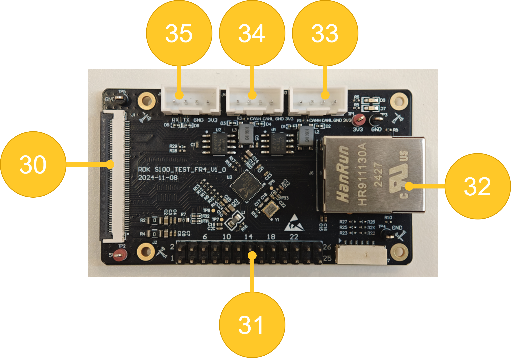
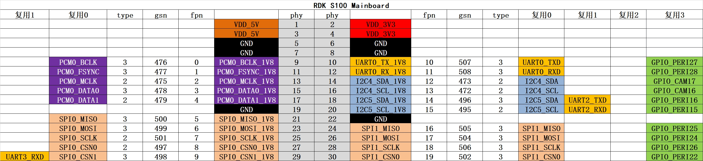
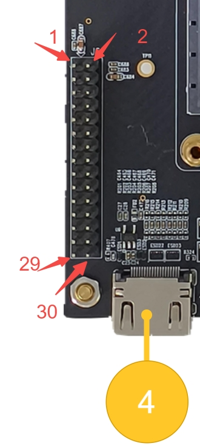

# 1.1.4 RDK S100

RDK S100开发套件由SOM核心模组、Mainboard底板，CAM扩展板、MCU扩展板四部分组成。提供了以太网口、USB、HDMI、MIPI CSI、40PIN等多种外围接口，方便用户对RDK S100开发套件进行功能体验、开发测试等工作。

- Mainboard 底板

| 序号 | 接口功能                 | 序号 | 接口功能                   | 序号 | 接口功能                 |
| ---- | ----------------------- | ---- | ------------------------- | ---- | ----------------------- |
| 1    | 电源接口                 | 2    | Debug & Flash(Type-C x2) | 3    | 30PIN接口                |
| 4    | HDMI                    | 5    | display port              | 6    | USB 3.0 X4              |
| 7    | RJ45 X2                 | 8    | power Button              | 9    | reset Button            |
| 10   | Mode (DFU/Normal) Switch| 11   | MCU串口                   | 12   |  串口                    |
| 13   | Jtag                    | 14   | Mode (Function/Burn) Switch | 15   | Acore Jtag            |
| 16   | 风扇接口                 | 17   | Automatic Header          |  18  | NA                      |
| 19   | Module Connector        |  20  | RTC Battery               |  21  | MCU Expansion Header    |
| 22   | Camera Expansion Header |  23  | M.2 Key E(PCIe 3.0 x1)     |  24  | M.2 Key M(NVME,PCIe 3.0 x4) |

- CAM扩展板

| 序号 | 接口功能                 | 序号 | 接口功能                   | 序号 | 接口功能                 |
| ---- | ----------------------- | ---- | ------------------------- | ---- | ----------------------- |
| 25   | MIPI CSI   22 Pin       | 26   | MIPI CSI   22 Pin         | 27   | GMSL2/FAKRA             |
| 28   | GMSL2/FAKRA             | 29   | Board Connector           |      |                          |

- MCU扩展板

| 序号 | 接口功能                 | 序号 | 接口功能                   | 序号 | 接口功能                 |
| ---- | ----------------------- | ---- | ------------------------- | ---- | ----------------------- |
| 30   | Board Connector         | 31   | 26PIN接口                 | 32   | RJ45                    |
| 33   | CAN接口                 | 34   | CAN接口                    | 35   |    UART                |

## 电源接口

RDK S100开发板通过DC接口供电，推荐使用套件中自带的电源适配器，或者使用至少**24V/4A**的电源适配器供电。接入电源后，如红色电源指示灯点亮（D22），说明设备供电正常。

:::caution

请不要使用电脑USB接口为开发板供电，否则会因供电不足造成开发板**异常断电、反复重启**等情况。

:::

## 调试串口{#debug_uart}

RDK S100开发板提供的一路调试接口（接口2中远离PCB板的type-c口），硬件上通过`CH340`芯片将核心模组调试串口转换为USB接口，用户可使用该接口进行各种调试工作。电脑串口工具的参数需按如下方式配置：

- 波特率（Baud rate）：921600
- 数据位（Data bits）：8
- 奇偶校验（Parity）：None
- 停止位（Stop bits）：1
- 流控（Flow Control）：无

通常情况下，用户第一次使用该接口时需要在电脑上安装CH340驱动，用户可搜索`CH340串口驱动`关键字进行下载、安装。

## USB下载接口

RDK S100开发板提供的一路下载接口（接口2中靠近PCB板的type-c口），用于固件下载。

:::tip dfu启动说明

DFU 启动指的是芯片以设备固件升级（Device Firmware Upgrade，DFU）模式来启动

:::

## Mode (DFU/Normal) Switch
Mode Switch Key对应接口10，用于切换RDK S100的启动模式，启动模式和按键需要拨动的位置如下：

- 正常ufs启动：Key1拨到靠近按键Key2的一端。
- 进入dfu启动：Key1拨到远离按键Key2的一端。

## 有线网口

开发板提供两路千兆以太网接口(接口7)，支持1000BASE-T、100BASE-T标准，默认采用静态IP模式，IP地址`192.168.127.10`。如需确认开发板IP地址，可通过串口登录设备，并用`ifconfig`命令进行查看 `eth0`网口的配置。

## Display传输接口

RDK S100开发板提供一路HDMI显示接口（接口4）和一路DisplayPort接口(接口5)，最高支持2k 60帧的显示模式。开发板上电后会通过HDMI/DP接口输出Ubuntu图形界面，配合特定的示例程序，同时还支持摄像头、视频流画面的预览显示功能。

## USB接口

RDK S100开发板提供了四路USB3.0标准接口（接口6），可以满足4路USB外设同时接入使用。需要注意的是，RDK S100的USB接口只支持Host模式。    

## USB摄像头

Video: https://www.bilibili.com/video/BV1rm4y1E73q/?p=6

开发板的USB Type A接口支持USB摄像头功能，可自动检测USB摄像头接入并创建设备节点`/dev/video0`。

## PCIe接口

- M.2 Key E：对应接口23，接口规格为 PCIe 3.0 x1，用于接入无线 WiFi 蓝牙模块。
- M.2 Key M：对应接口24，接口规格为 PCIe 3.0 x4，用于用于接入 UFS（通用闪存存储）设备。

## PIN Header接口

RDK S100开发板提供两组pin header接口，分别位于Mainboard底板的接口3和MCU扩展板的接口26，支持GPIO、UART、I2C、SPI等多种接口，详细管脚定义、复用关系如下：
- Mainboard 底板30PIN接口

- MCU 扩展板

:::tip
持续更新中....
:::

## CAM扩展板

CAM扩展板提供MIPI CSI接口（接口25、26）和MINI Fakra接口（接口27、28）四组摄像头接口，通过接口29与底板的接口22连接。

Camera模组的购买方式可参考社区配件页:

:::tip
持续更新中....
:::

:::caution
重要提示：严禁在开发板未断电的情况下插拔摄像头，否则非常容易烧坏摄像头模组。
:::

## MCU扩展板

MCU扩展板提供一组26Pin接口，RJ45网口，两组CAN接口和一组UART接口，通过接口30与底板的接口21连接。

