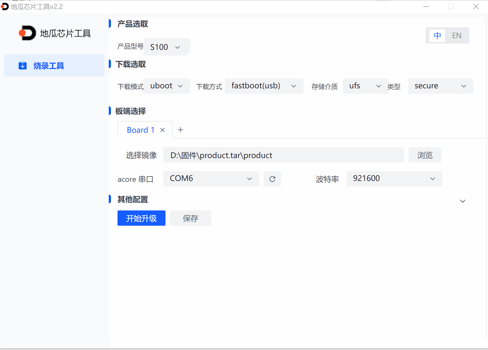
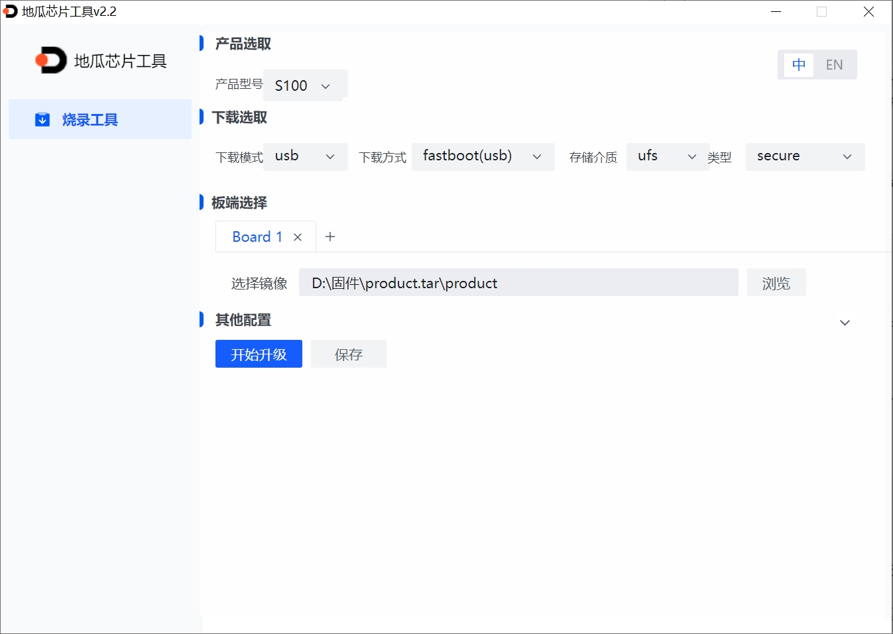
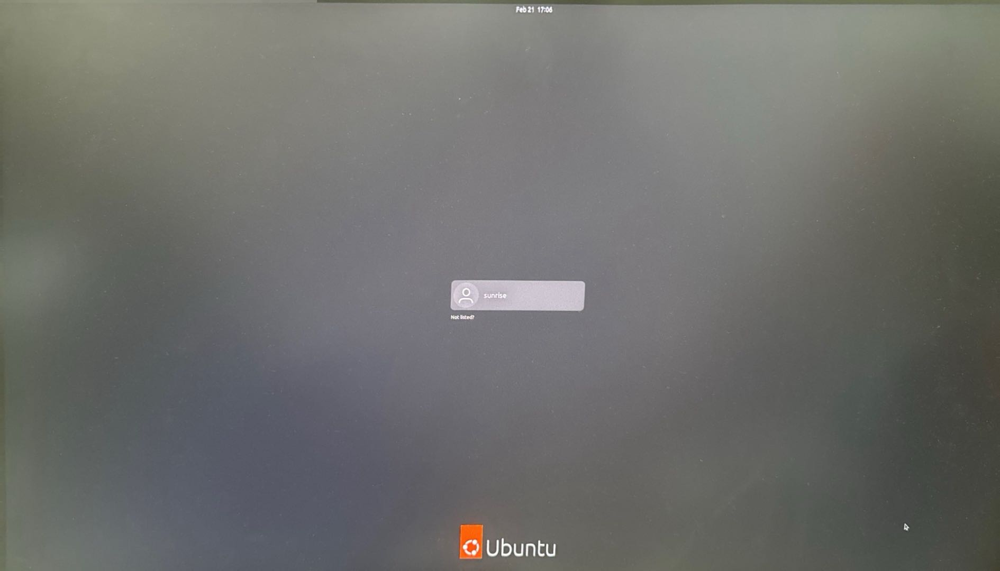

# 1.2.2 RDK S100

## 烧录准备

### **供电**

RDK S100开发板通过DC接口供电，推荐使用套件中自带的电源适配器，或者使用至少**24V/4A**的电源适配器供电。

:::caution

请不要使用电脑USB接口为开发板供电，否则会因供电不足造成开发板**异常断电、反复重启**等异常情况。

更多问题的处理，可以查阅 [常见问题](../../08_FAQ/01_hardware_and_system.md) 章节。

:::

### **存储**

RDK S100采用PCIe接口接入ufs作为系统启动介质。

### **显示**

RDKS100 开发板支持 HDMI 和 Display Port 显示接口。通过对应的线缆将开发板与显示器相连接，可实现图形化桌面显示。

### **网络连接**

RDK S100开发板支持以太网、Wi-Fi两种网络接口，用户可通过任意接口实现网络连接功能。

## 系统烧录

RDK套件目前提供Ubuntu 22.04系统镜像，可支持Desktop桌面图形化交互。

:::info 注意

**RDK S100**出厂已经烧写测试版本系统镜像，为确保使用最新版本的系统，建议参考本文档完成最新版本系统镜像的烧写。
:::

### 镜像下载 {#img_download}

点击 [**下载镜像**](https://archive.d-robotics.cc/downloads/os_images)，进入版本选择页面，选择对应版本目录，进入3.0.0版本系统下载页。

下载完成后，解压出Ubuntu系统镜像文件，如`ubuntu-preinstalled-desktop-arm64.img`

:::tip

- desktop：带有桌面的Ubuntu系统，可以外接屏幕、鼠标操作
- server：无桌面的Ubuntu系统，可以通过串口、网络远程连接操作
:::

### 系统烧录

RDK S100 开发套件可借助 PC 端工具 D-Navigation 来完成 Ubuntu 系统的烧录工作。当前，该烧录过程支持两种 USB 下载模式，用户可在烧录工具的 “下载选取” 界面里的 “下载模式” 选项处进行选择。这两种模式的具体区别如下：

- **U-Boot 烧录方式：** 此模式依赖 RDK S100 进入 U-Boot 的烧录模式（即 fastboot 模式），在日常的烧录场景中使用较为频繁，能满足大多数常规的系统烧录需求。
- **USB 烧录方式：** 该模式基于 DFU 协议，当RDK S100遇到无法进入 U-Boot 模式，或者系统损坏导致设备变砖等特殊情况时，使用此模式帮助恢复系统。

uboot

下面给出使用PC工具D-Navigation烧录的具体烧录步骤。

:::tip

在烧录Ubuntu系统镜像前，需要做如下准备：
- 准备两根Type-C数据线，其中一根数据线的一端与板子的debug串口相连接，另一端与PC相连接；另一根数据线的一端与板子的USB下载口相连接，另一端与PC相连接。
- 下载镜像烧录工具D-Navigation（可[点击此处下载](https://archive.d-robotics.cc/downloads/hbupdate/)）。
:::

#### uboot烧录

1. Key1拨到靠近按键Key2的一端(UFS启动模式)，

2. 开发板上电在串口中输入s，进入uboot串口命令行。

3. 在出现 **"Hobot$"** 后输入`fastboot 0`，然后将串口终端关闭。

:::tip

U-Boot方式需要占用串口，在输入fastboot命令后须保证串口没有被其它设备占用。
:::

4. 根据系统不同，启动地瓜芯片工具D-Navigation方式分为两种：
* Windows版本 启动：

        双击打开D-Navigation.exe
* Ubuntu版本 启动：

        xhost +
        sudo ./D-Navigation --no-sandbox
5. 打开地瓜芯片工具D-Navigation，完成如下操作：
* 选择产品型号：S100
* 下载模式：uboot；介质存储ufs；类型：secure
* 点击浏览选择固件所在product文件夹
* 选择与RDK S连接的串口，波特率921600
* 点击开始升级

4. 待升级完成后重启。

#### USB烧录

1. Key1拨到远离按键Key2的一端(DFU启动模式)。

2. 打开地瓜芯片工具D-Navigation，完成如下操作
* 选择产品型号：S100
* 下载模式：usb；介质存储ufs；类型：secure
* 点击浏览选择固件所在product文件夹
* 点击开始升级，等待升级完成

3. 关机，将Key1拨到靠近按键Key2的一端(UFS启动模式)后开机。

### 启动系统

首先保持开发板断电，并通过 HDMI/Display Prot 线缆连接开发板与显示器，最后给开发板上电。

系统首次启动时会进行默认环境配置，整个过程持续45秒左右，配置结束后会在显示器输出Ubuntu系统桌面。

:::tip 开发板指示灯说明

* **红色** 指示灯D22：点亮代表硬件上电正常

如果开发板上电后长时间没有显示输出（2分钟以上），说明开发板启动异常。需要通过串口线进行调试，查看开发板是否正常。

:::

Ubuntu Desktop 版本系统启动完成后，会通过Display传输接口在显示器上输出系统桌面，如下图：

## **常见问题**

### **注意事项**

- 禁止带电时拔插除 USB、HDMI、Display Port、网线之外的任何设备
- 选用正规品牌的电源适配器，否则会出现供电异常，导致系统异常断电的问题
- 不要直接拔插电源，建议拔插适配器，直接拔插板端电源 **可能打坏芯片** 。

:::tip

更多问题的处理，可以查阅 [常见问题](../../08_FAQ/01_hardware_and_system.md) 章节，同时可以访问 [D-Robotics 开发者官方论坛](https://developer.d-robotics.cc/forum) 获得帮助。

:::
