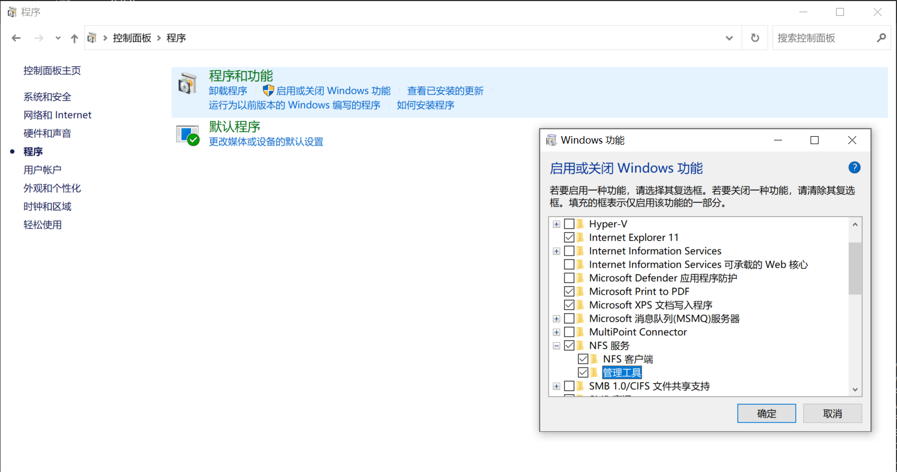
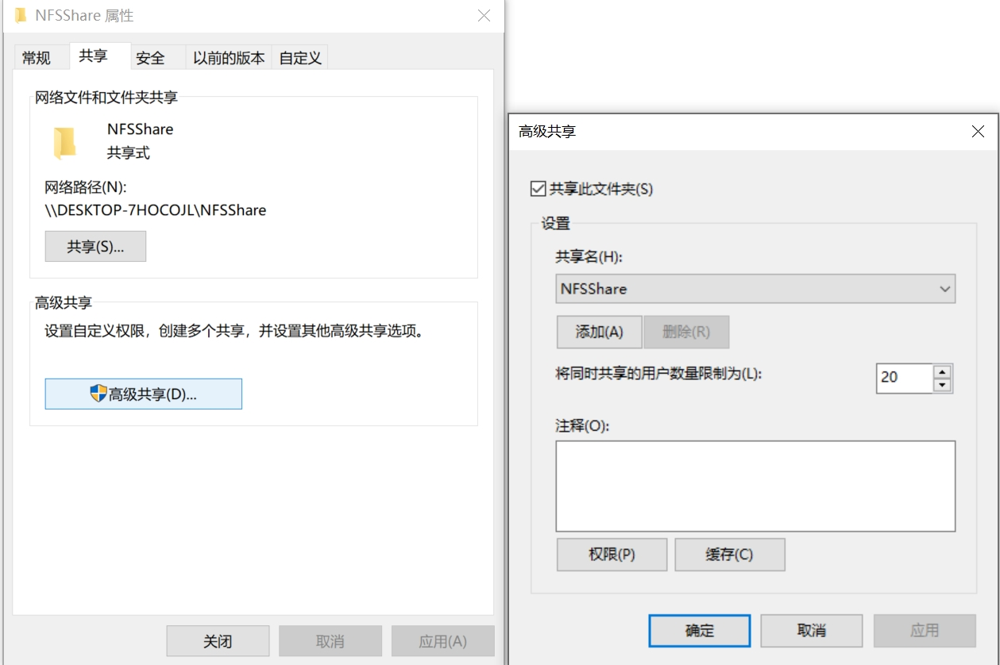
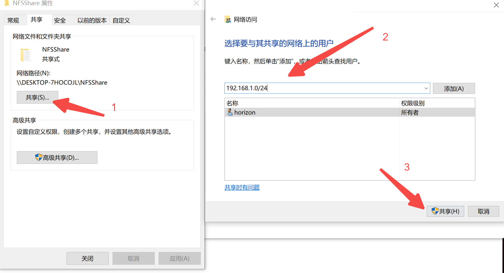

# 2.7 共享文件配置

本章节介绍在Ubuntu系统内共享工具的使用说明。


## samba 

### 安装命令

```bash
sudo apt install samba
```

### 配置 Samba

1. 创建共享目录,在用户主目录下创建一个名为 shared 的目录作为共享目录，执行以下命令：

```bash
mkdir ~/shared
```

2. 配置 Samba 共享, 打开 Samba 的主配置文件 /etc/samba/smb.conf, 在文件末尾添加以下内容来定义共享目录的配置：

```bash
[shared]
   comment = Shared Directory for Ubuntu 22.04
   path = /home/your_username/shared
   read only = no
   browsable = yes
   guest ok = no
   create mask = 0775
   directory mask = 0775
```

语法说明：

```bash
[shared]：这是共享的名称，客户端在访问共享资源时会看到这个名称，可以根据需要修改。
comment：对共享目录的描述信息，方便用户了解共享目录的用途。
path：指定共享目录的实际路径，请将 your_username 替换为你自己的用户名。
read only：设置为 no 表示允许客户端对共享目录进行读写操作。
browsable：设置为 yes 表示该共享目录可以在网络中被浏览到。
guest ok：设置为 no 表示需要用户名和密码才能访问共享目录，保证了共享资源的安全性。
create mask 和 directory mask：分别设置在共享目录中创建文件和目录时的默认权限。
```

3. 设置 Samba 用户和密码

为了能够访问共享目录，需要创建一个 Samba 用户并设置密码。我们可以使用系统已有的用户作为 Samba 用户，执行以下命令将系统用户添加到 Samba 用户列表中：
```bash
sudo smbpasswd -a your_username
```

4. 重启 Samba 服务

```bash
sudo systemctl restart smbd
```

可以使用以下命令检查 Samba 服务的运行状态：

```bash
sudo systemctl status smbd
```

5. 配置防火墙

如果系统启用了防火墙（如 ufw），需要开放 Samba 相关的端口，以便其他设备能够访问共享目录。执行以下命令开放 Samba 端口：

```bash
sudo ufw allow samba
```


## NFS

本章节介绍Windows 搭建 NFS 服务及 Ubuntu 22.04 使用 NFS 教程

### 安装命令

```bash
sudo apt install nfs-kernel-server
```

### 搭建 Windows PC 服务器

1. 开启 NFS 服务功能

打开 “控制面板”，选择 “程序”，然后点击 “启用或关闭 Windows 功能”

在弹出的窗口中，找到 “NFS 服务”，展开它并勾选 “NFS 客户端 和 “关联工具”，点击 “确定”。系统会自动安装所需组件，安装完成后可能需要重启计算机。




2. 配置 NFS 共享权限

- 在 Windows 系统中创建一个打算用于 NFS 共享的目录，例如 D:\NFSShare.

- 配置共享权限,右键点击该目录，选择 “属性”，在弹出的属性窗口中，切换到 “共享” 选项卡，点击 “高级共享”

- 勾选 “共享此文件夹”，并可设置共享名，点击 “权限”。在这里可以设置不同用户或用户组的访问权限，如读取、更改等。




3. 点击确定后返回属性设置，点击共享

在 “允许的客户端” 输入框中，可以指定允许访问该共享目录的客户端 IP 地址或网段，例如 192.168.127.0/24，完成后点击 “确定” 保存设置。




### Ubuntu 22.04 作为 NFS 客户端使用

1. 安装 NFS 客户端软件
```bash
sudo apt install nfs-common
```


2. 创建挂载点

在 Ubuntu 系统中创建一个本地目录作为挂载点，用于挂载 Windows 的 NFS 共享目录，例如：

```bash
sudo mkdir -p /userdata/windows_nfs_share
```

3. 挂载 NFS 共享目录

使用以下命令将 Windows 的 NFS 共享目录挂载到 Ubuntu 的挂载点，假设 Windows 服务器的 IP 地址是 192.168.1.100，共享目录是 D:\NFSShare：

```bash
sudo mount 192.168.127.100:/D:/NFSShare /mnt/windows_nfs_share
```

4. 验证挂载

执行以下命令查看是否成功挂载：
```bash
df -h
```

如果在输出中看到 192.168.1.100:/D:/NFSShare 被挂载到 /mnt/windows_nfs_share，则表示挂载成功。

5. 设置开机自动挂载(可选)

为了使 Ubuntu 在每次开机时自动挂载 NFS 共享目录，可以编辑 /etc/fstab 文件：

```
sudo vi /etc/fstab
```

在文件末尾添加以下内容：

```bash
192.168.1.100:/D:/NFSShare /userdata/windows_nfs_share nfs defaults 0 0
```
保存并退出编辑器。

