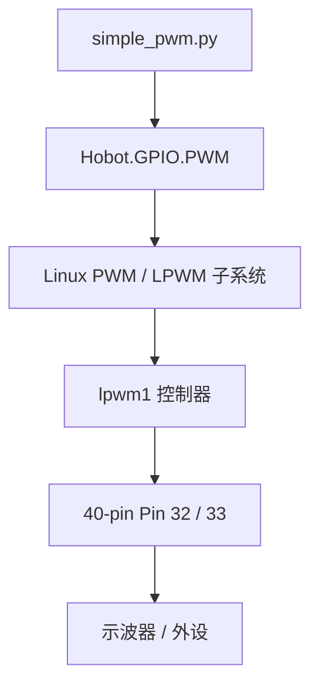

# PWM 应用

## 功能概述

本示例通过板端脚本 `/app/40pin_samples/simple_pwm.py`，在 40-pin **硬件 LPWM** 引脚上输出方波，并以占空比自动扫变方式验证 PWM 功能。

RDK S100 40-pin 扩展口仅 **物理管脚 `32`、`33`** 支持硬件 PWM（底层为 **LPWM1** 两路输出）；`Hobot.GPIO` **不提供**软件模拟 PWM。脚本默认在 **Pin 33**（`LPWM1_DOUT0`）上以 **48 kHz** 输出，占空比从 **25%** 起每 **0.25 s** 增减 **5%**，在 0%～100% 之间往复变化。可用示波器或逻辑分析仪在 Pin 33 对 GND 测量波形（终端不打印占空比数值）。

在板端运行测试程序示例：

```shell
root@ubuntu:/app/40pin_samples# python3 simple_pwm.py
PWM running. Press CTRL+C to exit.
```

:::tip
以下所提及的管脚仅作示例说明，不同平台的端口值存在差异，实际情况应以实际为准。亦可直接使用 `/app/40pin_samples/` 目录下的代码，该代码已在板子上经过实际验证。
:::

## 环境准备

### 硬件清单

| 物品 | 说明 |
|------|------|
| RDK S100 开发板（40-pin 形态） | 已烧录 RDK OS；**30-pin 硬件形态不支持 PWM**，脚本会提示并退出 |
| 示波器或逻辑分析仪（推荐） | 探头接 **Pin 33**（或 Pin 32）与 **GND**，观察方波与占空比变化 |
| 杜邦线（可选） | 将 PWM 引脚外接 LED+限流电阻，可粗测有无输出（频率较高时肉眼可能仅见亮度变化） |

### PWM 引脚与 LPWM 通道

40-pin 排针上仅以下两路支持 `Hobot.GPIO` 硬件 PWM（BOARD 编号）：

| 物理管脚（BOARD） | 信号名 | LPWM 通道 | 脚本默认值 |
|-------------------|--------|-----------|------------|
| **33** | `LPWM1_DOUT0` | `lpwm1` 通道 0 | **是**（`output_pin = 33`） |
| **32** | `LPWM1_DOUT1` | `lpwm1` 通道 1 | 可改 `output_pin = 32` 测试 |

管脚位置见 [管脚定义](./01_40pin_define.md#40pin_define) 示意图。

### 上电前检查

1. 确认开发板为 **40-pin** 形态（非 30-pin）。
2. 确认 Pin `32`/`33` **未被其他功能占用**（勿与相机、扩展模块等复用冲突）。
3. 若使用示波器，探头地线夹 **GND**，信号线接 Pin `33` 或 `32`。

### 系统与软件

- **系统**：已烧录 RDK OS，可登录 `root@ubuntu`
- **依赖**：Python3、`Hobot.GPIO`（板端预装，见 [GPIO 应用](./02_gpio.md)）

## 代码位置

- 板端路径：`/app/40pin_samples/simple_pwm.py`
- SDK 路径：`hobot-io-samples/debian/app/40pin_samples/simple_pwm.py`
- 目录结构：

```text
/app/40pin_samples/
└── simple_pwm.py    # LPWM 占空比扫变示例
```

## 使用方法

### 导入 Hobot.GPIO 库

板端 PWM 通过 Python `Hobot.GPIO` 库配置硬件 LPWM 通道。本文使用板端脚本 `/app/40pin_samples/simple_pwm.py`：

注意：`Hobot.GPIO` 经内核 PWM/LPWM 子系统输出波形，不实现软件 PWM；仅 Pin `32`、`33` 可调用 `GPIO.PWM()`。

```python
import Hobot.GPIO as GPIO

GPIO.setmode(GPIO.BOARD)
p = GPIO.PWM(output_pin, 48000)
```

### 运行 PWM 演示

在板端预置目录下执行：

```shell
root@ubuntu:/app/40pin_samples# python3 simple_pwm.py
```

注意：须为 **40-pin** 硬件；运行后终端打印 `PWM running. Press CTRL+C to exit.` 即表示 PWM 已启动，占空比在后台上自动扫变，按 `Ctrl+C` 退出并释放引脚。

### 配置 PWM 参数

脚本内可修改以下关键参数（修改后保存再运行）：

| 参数 | 说明 | 脚本默认值 |
|------|------|------------|
| `output_pin` | BOARD 物理管脚号，仅 `32` 或 `33` | `33` |
| `GPIO.PWM(..., freq)` | 输出频率（Hz）；注释标明支持约 **48 kHz～192 MHz** | `48000` |
| 初始占空比 `val` | `p.start(val)` 与首次 `ChangeDutyCycle` | `25`（%） |
| 扫变步进 `incr` | 每 `0.25 s` 变化量 | `5`（%） |

占空比在 0%～100% 之间往复变化的核心逻辑如下：

```python
p = GPIO.PWM(output_pin, 48000)
val = 25
incr = 5
p.ChangeDutyCycle(val)
p.start(val)

while True:
    time.sleep(0.25)
    if val >= 100:
        incr = -incr
    if val <= 0:
        incr = -incr
    val += incr
    p.ChangeDutyCycle(val)
```

### 测试代码

板端完整脚本如下：

```python
#!/usr/bin/env python3
import sys
import signal
import Hobot.GPIO as GPIO
import time


def signal_handler(signal, frame):
    sys.exit(0)


# 40pin支持PWM的管脚: 32 and 33, 在使用PWM时，必须确保该管脚没有被其他功能占用
# 30pin硬件规格不支持pwm

def format_get():
    board_id = GPIO.gpio_pin_data.parse_boardid()
    if GPIO.gpio_pin_data.if_s100_40pin(board_id):
        return 40
    else:
        return 30


def main():
    format = format_get()
    if format == 30:
        print("Current hardware pin does not support PWM")
        sys.exit(0)
    output_pin = 33
    # Pin Setup:
    # Board pin-numbering scheme
    GPIO.setmode(GPIO.BOARD)
    # 支持的频率范围： 48KHz ~ 192MHz
    p = GPIO.PWM(output_pin, 48000)
    # 初始占空比 25%， 先每0.25秒增加5%占空比，达到100%之后再每0.25秒减少5%占空比
    val = 25
    incr = 5
    p.ChangeDutyCycle(val)
    p.start(val)

    print("PWM running. Press CTRL+C to exit.")
    try:
        while True:
            time.sleep(0.25)
            if val >= 100:
                incr = -incr
            if val <= 0:
                incr = -incr
            val += incr
            p.ChangeDutyCycle(val)
    finally:
        p.stop()
        GPIO.cleanup(output_pin)  # cleanup output_pin GPIO


if __name__ == '__main__':
    signal.signal(signal.SIGINT, signal_handler)
    main()
```

## 运行效果

- **运行命令**：`python3 /app/40pin_samples/simple_pwm.py`
- **成功标志**：终端出现 `PWM running. Press CTRL+C to exit.` 且无异常退出；在 Pin `33`（默认）可测得稳定方波，频率约 **48 kHz**（本板实测约 **47.6 kHz**，偏差约 1%，属正常）；占空比每 **0.25 s** 变化约 **5%**，首轮由 25% 升至 100% 再降至 0%，此后在约 5%～100% 间往复
- **失败排查**：提示 `Current hardware pin does not support PWM` → 非 40-pin 形态；无波形 → 检查 Pin `32`/`33` 是否被占用、探头是否接 GND、是否选对管脚；初始化失败 → 确认未使用其他不支持 PWM 的 BOARD 编号
- **结果预览**：使用逻辑分析仪在 Pin 33 观测可见稳定方波（见下图）。本板单次采样约 **47.6 kHz**、占空比约 **33%**（脉宽约 7 µs、周期约 21 µs）；频率与设定 48 kHz 接近，单次截图中的占空比随脚本扫变而变化，不必与某一时刻的软件设定值逐点一致


```text
root@ubuntu:/app/40pin_samples# python3 simple_pwm.py
PWM running. Press CTRL+C to exit.
```

### 软件架构说明

`simple_pwm.py` 经 `Hobot.GPIO.PWM` 配置 LPWM 频率与占空比，由内核 **LPWM/PWM 子系统**驱动 `lpwm1` 控制器，最终在 40-pin 的 Pin `32`/`33` 输出方波。



底层驱动与 sysfs 调试方法见 [PWM 驱动调试指南](../../../../07_Advanced_development/04_driver_development/07_driver_pwm.md)。

## 常见问题

### 提示 `Current hardware pin does not support PWM`

**原因**：当前为 **30-pin** 硬件形态，无 40-pin LPWM 引脚。

**解决**：在 RDK S100 **40-pin** 开发板上运行；40-pin 上仅 Pin `32`、`33` 支持本示例。

### 无波形输出

**原因**：Pin `32`/`33` 被其他功能占用，或测量点/地线接错，或使用了不支持的 BOARD 管脚号。

**解决**：确认引脚未被复用占用；示波器探头接 Pin `33`（默认）与 GND；可改 `output_pin = 32` 对比两路输出。

### 提示 PWM 通道初始化失败

**原因**：所选管脚不支持硬件 PWM，或频率参数超出支持范围。

**解决**：仅使用 Pin `32`、`33`；频率保持在脚本注释范围（48 kHz～192 MHz）内，默认 `48000` 已在本板验证可运行。

### 终端看不到占空比变化

**说明**：脚本仅在启动时打印一行提示，占空比扫变在后台进行，**不会**逐行打印百分比；请用示波器或逻辑分析仪观察波形变化。

## 相关文档

- 用到的接口：[PWM 驱动调试指南](../../../../07_Advanced_development/04_driver_development/07_driver_pwm.md)
- 同类示例：[GPIO 应用](./02_gpio.md)（`Hobot.GPIO` 库）
- 管脚示意：[管脚定义](./01_40pin_define.md#40pin_define)
- 板端代码：`/app/40pin_samples/simple_pwm.py`
