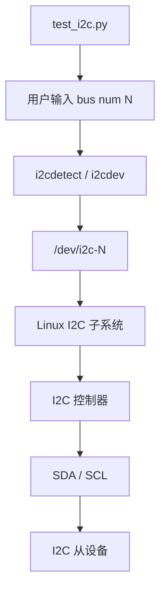

# I2C 应用

## 功能概述

本示例通过板端脚本 `/app/40pin_samples/test_i2c.py`，在 40-pin **I2C5** 总线上对外接 I2C 设备做地址扫描与 1 字节读取验证。

**为何须外接设备**：40-pin 上的 **I2C4** 已用于主板 RTC、风扇等器件，扫描为 `UU` 且被内核驱动占用，无法用本脚本裸读；**I2C5** 仅从 40-pin 引出，未接扩展设备时总线为空（扫描全 `--`）。因此须通过 40-pin 接入外设。本示例使用 **Audio Driver HAT REV2** 音频子板（叠插在 40-pin 上即可，无需单独飞线），其上 Codec 经 I2C5 暴露地址 `0x08`、`0x40`、`0x42`。接线与拨码见 [环境准备](#环境准备)。

在板端接入音频子板后，执行 `python3 test_i2c.py`，输入 bus `5` 扫描并读取地址 `08`/`40`/`42` 即可完成验证。完整交互日志见 [运行效果](#运行效果)。

:::tip
以下所提及的管脚仅作示例说明，不同平台的端口值存在差异，实际情况应以实际为准。亦可直接使用 `/app/40pin_samples/` 目录下的代码，该代码已在板子上经过实际验证。
:::

## 环境准备

### 硬件清单

| 物品 | 说明 |
|------|------|
| RDK S100 开发板 | 已烧录 RDK OS |
| Audio Driver HAT REV2 | 微雪音频子板，经 40-pin 与开发板叠接；I2C 器件与地址见下表 |
| — | 本示例仅验证 I2C 扫描/读取，**不要求**加载音频驱动或播放录音 |

音频子板在 I2C5 上的器件（与 [音频调试指南](../../../../07_Advanced_development/04_driver_development/09_driver_audio.md#音频子板介绍) 一致）：

| I2C 地址 | 芯片 | 功能 |
|----------|------|------|
| `0x08` | ES8156 | 播放 Codec（本示例推荐用于读取演示） |
| `0x40` | ES7210 | 录音 Codec（MicArray_0） |
| `0x42` | ES7210 | 录音 Codec（MicArray_2） |

### 外设连接

将 Audio Driver HAT REV2 **对准扣合** 在开发板 40-pin 排针上，保证引脚一一导通、无歪斜：


### 拨码开关

须完成以下两项拨码，否则 I2C5 或子板无法正常工作：

**1. 40-pin I2C5 与 UART2 复用** — 拨至 **I2C** 侧（Pin 3、5 作为 I2C5_SCL / I2C5_SDA 输出）：


**2. PCM 与 Wi-Fi 复用（音频子板使用 PCM/I2S 时）** — 若后续做音频功能，须将 **40 PIN 拨码左拨、PCM 拨码右拨**（见 [音频子板使用说明](../../../../07_Advanced_development/04_driver_development/09_driver_audio.md#音频子板与开发板连接)）。**仅做本 I2C 扫描示例时，以 I2C5 拨码正确、子板扣合到位即可。**

### 上电前检查

1. 子板已完全扣入 40-pin，无浮空引脚。
2. I2C5 拨码已切至 I2C 模式（非 UART2）。
3. 开发板已上电启动至 shell。

### 系统与软件

- **系统**：已烧录 RDK OS，可登录 `root@ubuntu`
- **依赖**：Python3、`i2cdev`、`i2c-tools`（`i2cdetect`），系统已预装

上电后可用以下命令确认 I2C5 已识别子板（**本板实测**）：

```shell
root@ubuntu:~# i2cdetect -y -r 5
     0  1  2  3  4  5  6  7  8  9  a  b  c  d  e  f
00:                         08 -- -- -- -- -- -- --
10: -- -- -- -- -- -- -- -- -- -- -- -- -- -- -- --
20: -- -- -- -- -- -- -- -- -- -- -- -- -- -- -- --
30: -- -- -- -- -- -- -- -- -- -- -- -- -- -- -- --
40: 40 -- 42 -- -- -- -- -- -- -- -- -- -- -- -- --
50: -- -- -- -- -- -- -- -- -- -- -- -- -- -- -- --
60: -- -- -- -- -- -- -- -- -- -- -- -- -- -- -- --
70: -- -- -- -- -- -- -- --
```

若矩阵全为 `--`，请回到本节检查扣合与拨码；勿与 I2C4（bus `4`，Pin 27/28，主板 RTC/风扇）混淆。

## 代码位置

- 板端路径：`/app/40pin_samples/test_i2c.py`
- SDK 路径：`hobot-io-samples/debian/app/40pin_samples/test_i2c.py`
- 目录结构：

```text
/app/40pin_samples/
└── test_i2c.py    # I2C 总线扫描与读写示例
```

## 使用方法

### 导入 i2cdev 库

板端通过 Python `i2cdev` 访问 `/dev/i2c-*` 字符设备。本文使用板端脚本 `/app/40pin_samples/test_i2c.py`：

注意：`i2cdev` 经字符设备与内核 I2C 子系统交互，不直接操作寄存器。

```python
from i2cdev import I2C
```

### 运行 I2C 扫描测试

```shell
root@ubuntu:/app/40pin_samples# python3 test_i2c.py
```

注意：须已完成 [环境准备](#环境准备) 中子板扣合与 I2C5 拨码；未扣合子板时 bus `5` 扫描全为 `--`。

### 在 I2C5 上扫描外设地址

列出 `/dev/i2c-*` 后，在提示 `Please input I2C BUS num (default 0):` 处输入总线号 **`5`**（直接回车则默认 bus `0`），脚本执行 `i2cdetect -y -r 5`。

接入 Audio Driver HAT REV2 后，应看到 **`08`、`40`、`42`** 三个地址（见 [环境准备](#系统与软件) 实测矩阵）。读取演示推荐先试 **`08`**（ES8156）。

注意：勿使用 bus `4`（I2C4 板载器件为 `UU`）；`UU` 单元格表示驱动已占用，不可裸读。

```python
os.system('i2cdetect -y -r ' + bus)
```

### 读取外设数据

在提示 `Please input I2C device num(Hex, e.g. 51):` 处输入十六进制地址（如 `08`、`42`，亦支持 `0x08`、`0x42`），脚本读取 1 字节并打印。本板实测 `42` 可读回 `b'2'`，`08` 可读回 `b'\x1c'`（读回值随芯片内部状态变化，以实测为准）。

注意：交互输入地址，非命令行参数；非法 bus 号或地址格式会提示错误并重新等待输入；`Ctrl+C` 退出。脚本进入循环，可多次输入 bus 号与地址；不带寄存器偏移，读回值仅作连通性验证。

```python
i2c = I2C(device_addr, int(bus))
value = i2c.read(1)
print("read value=", value)
```

### 测试代码

板端完整脚本如下：

```python
#!/usr/bin/env python3

import sys
import signal
import os

# 导入i2cdev
from i2cdev import I2C

def signal_handler(signal, frame):
    sys.exit(0)

def i2cdevTest():
    bus = input("Please input I2C BUS num (default 0):").strip() or "0"
    if not bus.isdigit():
        print("Invalid I2C BUS num: %s" % bus)
        return

    os.system('i2cdetect -y -r ' + bus)
    prompt = "Please input I2C device num(Hex, e.g. 51):"
    device = input(prompt).strip().lower()
    if device.startswith("0x"):
        device = device[2:]
    try:
        device_addr = int(device, 16)
    except ValueError:
        print("Invalid I2C device hex: %s" % device)
        return

    print("Read data from device 0x%x on I2C bus %s" % (device_addr, bus))
    i2c = I2C(device_addr, int(bus))
    value = i2c.read(1)
    i2c.write(value)
    print("read value=", value)
    i2c.close()

if __name__ == '__main__':
    signal.signal(signal.SIGINT, signal_handler)
    print("Starting demo now! Press CTRL+C to exit")
    print("List of enabled I2C controllers:")
    os.system('ls /dev/i2c*')
    while True:
        i2cdevTest()
```

## 运行效果

- **运行命令**：`python3 /app/40pin_samples/test_i2c.py`
- **成功标志**：列出 `/dev/i2c-0`～`/dev/i2c-5`；bus `5` 扫描矩阵出现 `08`、`40`、`42`；输入地址后能打印 `read value= b'...'` 且无 `OSError`；程序循环等待下一次输入，按 `Ctrl+C` 退出
- **失败排查**：矩阵全为 `--` → 子板未扣合或 I2C5 拨码错误；误用 bus `4` 或 `UU` 地址 → 失败；`Remote I/O error` → 地址输错或总线异常
- **结果预览**：扣合 Audio Driver HAT REV2 后，本板完整实测会话如下（含两轮扫描与 `42`、`08` 读取）；接线见 [环境准备](#环境准备)

```text
root@ubuntu:/app/40pin_samples# python3 test_i2c.py
Starting demo now! Press CTRL+C to exit
List of enabled I2C controllers:
/dev/i2c-0  /dev/i2c-1  /dev/i2c-2  /dev/i2c-3  /dev/i2c-4  /dev/i2c-5
Please input I2C BUS num (default 0):5
     0  1  2  3  4  5  6  7  8  9  a  b  c  d  e  f
00:                         08 -- -- -- -- -- -- --
10: -- -- -- -- -- -- -- -- -- -- -- -- -- -- -- --
20: -- -- -- -- -- -- -- -- -- -- -- -- -- -- -- --
30: -- -- -- -- -- -- -- -- -- -- -- -- -- -- -- --
40: 40 -- 42 -- -- -- -- -- -- -- -- -- -- -- -- --
50: -- -- -- -- -- -- -- -- -- -- -- -- -- -- -- --
60: -- -- -- -- -- -- -- -- -- -- -- -- -- -- -- --
70: -- -- -- -- -- -- -- --
Please input I2C device num(Hex, e.g. 51):42
Read data from device 0x42 on I2C bus 5
read value= b'2'
Please input I2C BUS num (default 0):5
     0  1  2  3  4  5  6  7  8  9  a  b  c  d  e  f
00:                         08 -- -- -- -- -- -- --
10: -- -- -- -- -- -- -- -- -- -- -- -- -- -- -- --
20: -- -- -- -- -- -- -- -- -- -- -- -- -- -- -- --
30: -- -- -- -- -- -- -- -- -- -- -- -- -- -- -- --
40: 40 -- 42 -- -- -- -- -- -- -- -- -- -- -- -- --
50: -- -- -- -- -- -- -- -- -- -- -- -- -- -- -- --
60: -- -- -- -- -- -- -- -- -- -- -- -- -- -- -- --
70: -- -- -- -- -- -- -- --
Please input I2C device num(Hex, e.g. 51):08
Read data from device 0x8 on I2C bus 5
read value= b'\x1c'
Please input I2C BUS num (default 0):
```

未扣合子板时，bus `5` 扫描典型输出为（全 `--`，略）。

## 软件架构说明

`test_i2c.py` 在运行时由用户**交互输入总线号** `N`，经 `i2cdetect` 扫描总线、经 `i2cdev` 读写从设备，访问字符设备 `/dev/i2c-N`；再由 Linux I2C 子系统驱动对应的 I2C 控制器，经 SDA/SCL 与总线上的 I2C 从设备通信。脚本**不绑定**某一固定总线，本文选用 bus `5`（40-pin I2C5 + Audio Driver HAT）仅为当前硬件示例。



## 常见问题

### 扫描结果全为 `--`

**原因**：Audio Driver HAT 未扣合、接触不良，或 I2C5 拨码仍在 UART2 模式；也可能误扫 bus `4`。

**解决**：按 [环境准备](#环境准备) 检查扣合与拨码；执行 `i2cdetect -y -r 5`，成功时应见 `08`、`40`、`42`。

### 扫描到 `UU` 或误用 I2C4

**原因**：bus `4`（I2C4，Pin 27/28）为主板 RTC（`0x32`）、风扇（`0x2f`）等，驱动占用显示 `UU`。

**解决**：本示例固定使用 bus `5`；板载 I2C4 器件调试见 [I2C 调试指南](../../../../07_Advanced_development/04_driver_development/03_driver_i2c_dev.md)。

### 提示 `OSError: Remote I/O error`

**原因**：地址输入错误或总线未就绪；部分寄存器需带偏移访问，而 `test_i2c.py` 仅裸读 1 字节。

**解决**：以扫描到的 `08`/`40`/`42` 为准；优先试 `08`；确认子板扣合与 I2C5 拨码。

### 与音频功能的关系

**说明**：本示例只验证 I2C 总线扫描与用户态读取，**不要求** `modprobe` 声卡或 `aplay`/`arecord`。若需录音播放，请参阅 [音频应用](../../../../03_Demos/01_peripheral/03_audio.md) 与 [音频调试指南](../../../../07_Advanced_development/04_driver_development/09_driver_audio.md)。

## 相关文档

- 用到的接口：[I2C 调试指南](../../../../07_Advanced_development/04_driver_development/03_driver_i2c_dev.md)
- 外设说明：[音频调试指南 — 音频子板](../../../../07_Advanced_development/04_driver_development/09_driver_audio.md#音频子板介绍)
- 同类示例：[串口应用](./04_uart.md)（UART2 与 I2C5 引脚复用）
- 板端代码：`/app/40pin_samples/test_i2c.py`
- [管脚定义](./01_40pin_define.md)
