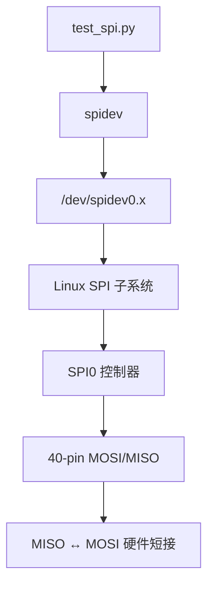

# SPI 应用

## 功能概述

本示例演示 RDK S100 40-pin **SPI0** 回环测试：将 MISO 与 MOSI 短接后，通过板端脚本 `/app/40pin_samples/test_spi.py` 经 `spidev` 发送 `[0x55, 0xAA]`，验证读回数据是否与发送值一致。

物理管脚 `19、21、23、24、26` 分别对应 MOSI、MISO、SCLK、CS0、CS1，支持 2 路片选，IO 电平 3.3V。

在板端运行测试程序示例：

```shell
root@ubuntu:/app/40pin_samples# python3 test_spi.py
List of enabled spi controllers:
/dev/spidev0.0
/dev/spidev0.1
Please input SPI bus num (default 0):0
Please input SPI cs num (default 0):0
Starting demo now! Press CTRL+C to exit
0x55 0xAA
0x55 0xAA
```

:::tip
以下所提及的管脚仅作示例说明，不同平台的端口值存在差异，实际情况应以实际为准。亦可直接使用 `/app/40pin_samples/` 目录下的代码，该代码已在板子上经过实际验证。
:::

## 环境准备

- **硬件**：RDK S100 开发板；40-pin 杜邦线或跳线帽，用于将 MISO（Pin 21）与 MOSI（Pin 19）短接

  

- **系统**：已烧录 RDK OS 并启动
- **依赖**：系统预装 Python3 与 `spidev` 库，无需额外安装

## 代码位置

- 板端路径：`/app/40pin_samples/test_spi.py`
- SDK 路径：`hobot-io-samples/debian/app/40pin_samples/test_spi.py`
- 目录结构：

```text
/app/40pin_samples/
└── test_spi.py    # SPI 回环测试脚本
```

## 使用方法

### 导入 spidev 库

板端 SPI 回环测试通过 Python `spidev` 库访问 `/dev/spidev*` 字符设备，脚本中需先导入库并创建 `SpiDev` 对象。

本文推荐直接使用板端预置脚本 `/app/40pin_samples/test_spi.py`，其中导入方式如下：

注意：`spidev` 通过字符设备节点与内核 SPI 子系统交互，不直接操作寄存器。

```python
import spidev

spi = spidev.SpiDev()
```

### 运行回环测试

在板端预置目录下执行测试脚本：

```shell
root@ubuntu:/app/40pin_samples# python3 test_spi.py
```

注意：运行前须已完成 [环境准备](#环境准备) 中的 MISO/MOSI 短接；未短接时程序仍可运行，但读回数据不能作为回环成功依据。

### 选择 SPI 设备节点

程序启动后会列出当前可用的 SPI 控制器，并交互式询问总线号与片选号。SPI0 提供两路片选，对应关系如下：

- `spidev0.0`：`bus num = 0`，`cs num = 0`
- `spidev0.1`：`bus num = 0`，`cs num = 1`

按照硬件布局，我们测试 `spidev0.0`，即 `bus num` 和 `cs num` 均直接回车使用默认值 `0`。

注意：上述参数为运行时交互输入，不是命令行选项；按 `Ctrl+C` 可退出测试。脚本将 SPI 速率设为 12 MHz，并通过 `xfer2` 发送 `[0x55, 0xAA]` 后读回数据。

```python
spi.open(int(spi_bus), int(spi_device))
spi.max_speed_hz = 12000000
resp = spi.xfer2([0x55, 0xAA])
```

## 运行效果

- **运行命令**：`python3 /app/40pin_samples/test_spi.py`
- **成功标志**：终端持续出现 `0x55 0xAA`，读回数据与发送的 `[0x55, 0xAA]` 一致
- **失败排查**：若出现 `0xFF 0xFF`，检查 MISO/MOSI 是否短接；若出现 `open spi failed`，检查 SPI 是否使能及 `bus num` / `cs num` 是否与设备节点匹配
- **结果预览**：回环成功时的终端输出如下；硬件短接方式见 [环境准备](#环境准备) 中的连接示意图

```text
List of enabled spi controllers:
/dev/spidev0.0
/dev/spidev0.1
Please input SPI bus num (default 0):0
Please input SPI cs num (default 0):0
Starting demo now! Press CTRL+C to exit
0x55 0xAA
0x55 0xAA
```

未短接 MISO/MOSI 时，典型输出为（本板实测）：

```text
Starting demo now! Press CTRL+C to exit
0xFF 0xFF
0xFF 0xFF
```

## 软件架构说明

SPI 回环测试数据流如下：`test_spi.py` 经 `spidev` 访问 `/dev/spidev0.x`，由内核 SPI 子系统驱动 SPI0 控制器，经 40-pin 完成 MOSI → MISO 硬件回环。



## 常见问题

### 提示 `open spi failed`

**原因**：SPI 控制器未使能，或总线号/片选号输入错误。

**解决**：确认 SPI0 已使能；SPI0 的两个片选对应 `bus num = 0`、`cs num = 0` 或 `1`。

### 读回数据与写入值不一致

**原因**：MISO 与 MOSI 未短接，MISO 处于默认电平。

**解决**：按 [环境准备](#环境准备) 将 MISO 与 MOSI 短接后重试，成功时应打印 `0x55 0xAA`。

## 相关文档

- 用到的接口：[SPI 调试指南](../../../../07_Advanced_development/04_driver_development/07_driver_spi_dev.md)
- 同类示例：[串口应用](./04_uart.md)（回环测试）
- 板端代码：`/app/40pin_samples/test_spi.py`
- [管脚定义](./01_40pin_define.md)
