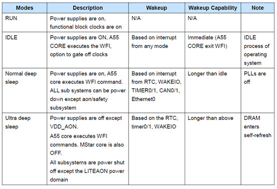
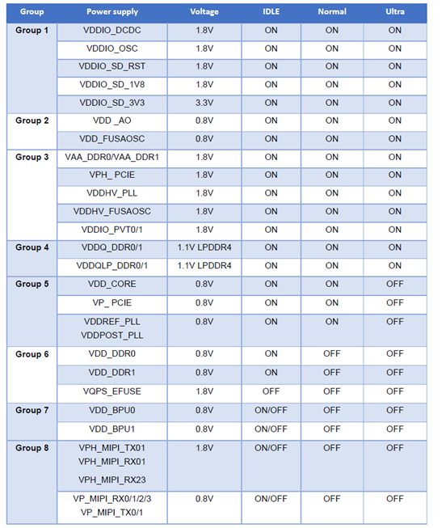
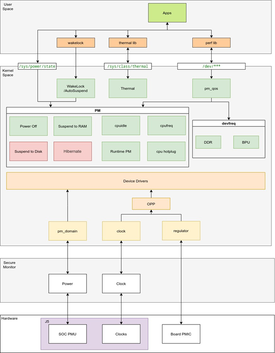
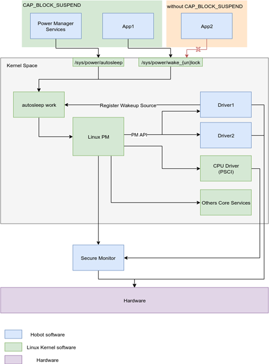
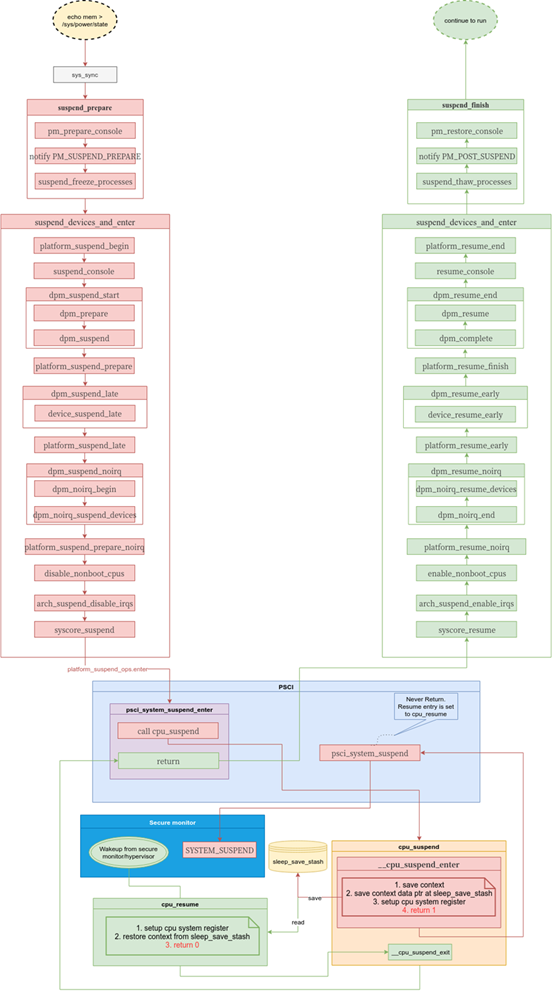
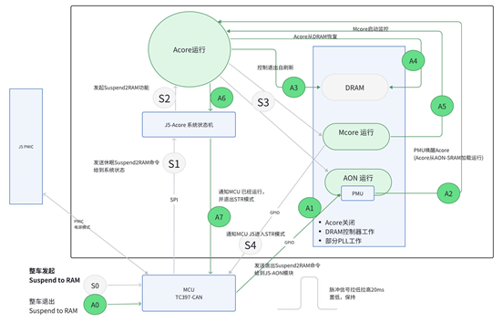

# 低功耗模式调试指南

## overview

S100芯片支持四种power模式：RUN mode, IDLE mode, Normal Deep Sleep mode 和 Ultra Deep Sleep mode. 




不同状态下的供电状态：



目前不支持Ultra Deep sleep。如果进入STR模式，
需外部VDD-CORE供电保持，由内部PMU关闭A核供电。除了内存需要进入自刷新状态外，整体系统进入低功耗状态。

Normal Sleep模式下：除了AON/safty子系统外，其余的子系统的都是power
off的。未掉电的主要是AON+MCORE, 功耗为140mW。


## Linux Power 软件框架



系统休眠的流程涉及到用户空间程序，内核空间，Secure Monitor三个部分，三者之间相互配合完成休眠操作。




-   系统通过注册Wakeup
    Source来控制何时可以进入休眠状态。当系统中存在活跃状态的wakeup
    Source时，系统将不会进入休眠状态。
-   当关键的上层服务需要运行时，应用通过wakelock接口来注册wakeup
    source，从而阻止系统自动休眠。
-   当驱动程序需要阻止系统休眠时，可以通过API函数来注册对应的wakeup
    Source，从而达到一样的效果。
-   内核空间中有一个autosleep的任务，开启autosleep后，在没有活跃的wakeup
    Source的情况下，系统将不断尝试进入休眠状态。
-   系统休眠时，系统会暂停所有应用程序的执行（freeze task）
-   系统休眠时，系统会通过PM的接口，使系统中的所有驱动程序调用休眠函数，由驱动程序完成对应外设的休眠，关闭。

## 休眠流程



-   系统在休眠时会暂停所有应用程序
-   系统在休眠时会休眠所有外部设备
-   关闭所有non-boot CPU
-   最后会关闭中断，并调用平台相关的休眠函数
-   在PSCI的实现中，系统将CPU上下文存储起来，并且最终通过SMC进入Secure
    Monitor中，通过PSCI使系统进入休眠状态


## 各个子系统的休眠

**Perisys Suspend**

1.  在系统休眠时，操作系统会调用各个驱动程序的休眠函数，由各个外设驱动去管理每个外设的休眠。
2.  系统在所有的外设休眠之后设置perisys\_all\_mst\_idle寄存器（通过bus
    driver或简略的device driver间接提供控制）
3.  在Subsystem进入休眠之后，做硬件需要做的设置。

**Bpu sys**

BPU sys的Power控制由BPU驱动完成，BPU在不使用时，关闭PE，再关闭bputop
domain

**camera subsystem**

camera subsystem的休眠由camea ISP等driver来完成。

**video subsystem**

video subsystem的休眠由video的driver完成。

**DDR subsystem**

-   DDR 控制器关闭VDD
-   DDR PHY关闭core VDD,VDDQLP, 以及VA,VDDQ仍然使能。
-   RAM进入自刷新模式

## S2RAM切换逻辑




## 测试方法

### rtc唤醒

注意rtc设备不要被其他进程占用，否则可能导致唤醒失败。


```bash
rtc-alarm-test -s 10 & sleep 1 && echo mem > /sys/power/state && cat /proc/meminfo
```

代码位置：unittest/testapp/rtc/rtc-alarm-test.c。

sleep 1是为了保证rtc定时成功。

默认的log等级会屏蔽所有的log，建议测试时在uboot设置loglevel等级来便于调试。

使用默认log等级
```text
# rtc-alarm-test -s 10 & sleep 1 && echo mem > /sys/power/state

                           RTC Driver Test Example.


   Current RTC date/time is 1-1-2000, 00:46:19.
   Alarm time now set to 00:46:29.
   Waiting 10 seconds for alarm...ddrsys nttp enter lp
   ddr save params
   ddr suspend
   ddr suspend done
   is on status: 0x20000600
   whole system suspend done
   system_resume_early
   ddr resume
   system_resume_early done

   .
   memory_test done
   ddr test done
    okay. Alarm rang.


                            *** Test complete ***
   root@s100:~#
   [1]+  Done                       rtc-alarm-test -s 10

```

配置loglevel为14:

```text
# rtc-alarm-test -s 10 & sleep 1 && echo mem > /sys/power/state

                           RTC Driver Test Example.


   Current RTC date/time is 1-1-2000, 00:00:16.
   Alarm time now set to 00:00:26.
   Waiting 10 seconds for alarm...[   17.993504] PM: suspend entry (deep)
   [   17.994932] Filesystems sync: 0.001 seconds
   [   17.996803] Freezing user space processes ... (elapsed 0.001 seconds) done.
   [   17.998539] OOM killer disabled.
   [   17.998542] Freezing remaining freezable tasks ... (elapsed 0.001 seconds) done.
   [   18.000075] printk: Suspending console(s) (use no_console_suspend to debug)
   [   18.001563] hobot-idu 47080000.idu: hobot_idu_suspend enter suspend...
   [   18.001675] hobot-idu 47070000.idu: hobot_idu_suspend enter suspend...
   [   18.001791] videostitch: videostitch_suspend enter
   [   18.001837] hb_vpu 49020000.vpu: [VPUDRV]vpu_suspend:5349: [+]vpu_suspend enter
   [   18.001857] hb_vpu 49020000.vpu: [VPUDRV]vpu_suspend:5428: [-]vpu_suspend leave
   [   18.001871] lkof 4a020000.lkof: lkof_suspend we do not wait suspend sem!!!
   [   18.001877] lkof 4a020000.lkof: lkof_suspend enter
   [   18.001886] hb_jpu 49030000.jpu: [JPUDRV]jpu_suspend:3120: [+]jpu_suspend enter
   [   18.001892] hb_jpu 49030000.jpu: [JPUDRV]jpu_suspend:3121: [-]jpu_suspend leave
   [   18.002003] S100 PYM 47190000.pym: s100_pym_suspend
   [   18.002043] S100 PYM 47130000.pym: s100_pym_suspend
   [   18.002085] S100 PYM 470e0000.pym: s100_pym_suspend
   [   18.002094] S100 CIM DMA 47180000.cim_dma: s100_cimdma_suspend
   [   18.002106] HOBOT GDC 471a0000.gdc: hobot_gdc_suspend
   ddrsys nttp enter lp
   ddr save params
   ddr suspend
   ddr suspend done
   is on status: 0x20000600
   whole system suspend done
   system_resume_early
   ddr resume
   system_resume_early done

   .
   memory_test done
   ddr test done
   [   18.411506] --->diag_resume
   [   18.411759] s100-pinctrl 43900000.pinctrl: pinctrl_resume
   [   18.412971] hobot_gmac 59110000.ethernet eth0: mac_config_rx_queues_routing, not support packet mode :
   [   18.413020] hobot_gmac 59110000.ethernet eth0: Enabling safety features: type=0x2
   [   18.413030] hobot_gmac 59110000.ethernet eth0: configuring for phy/rgmii-id link mode
   [   18.413463] hobot_gmac 59120000.ethernet eth1: mac_config_rx_queues_routing, not support packet mode :
    okay. Alarm rang.
   [   18.413511] hobot_gmac 59120000.ethernet eth1: Enabling safety features: type=0x2


                            *** Test complete ***
   r[   18.413521] hobot_gmac 59120000.ethernet eth1: configuring for phy/rgmii-id link mode
   oot@s100:~# [   18.413541] S100 CAMSYS 47010000.cam_sys: s100_camsys_resume
   [   18.413550] platform 47020000.mipi_host: drivers/media/platform/hobot/mipi/hobot_mipi_host.c:hobot_mipi_host_resume enter resume...
   [   18.413559] platform 47030000.mipi_host: drivers/media/platform/hobot/mipi/hobot_mipi_host.c:hobot_mipi_host_resume enter resume...
   [   18.413567] platform 47040000.mipi_host: drivers/media/platform/hobot/mipi/hobot_mipi_host.c:hobot_mipi_host_resume enter resume...
   [   18.413575] platform 47050000.mipi_host: drivers/media/platform/hobot/mipi/hobot_mipi_host.c:hobot_mipi_host_resume enter resume...
   [   18.413584] platform 47150000.mipi_dev: drivers/media/platform/hobot/mipi/hobot_mipi_dev.c:hobot_mipi_dev_resume enter resume...
   [   18.413592] platform 47160000.mipi_dev: drivers/media/platform/hobot/mipi/hobot_mipi_dev.c:hobot_mipi_dev_resume enter resume...
   [   18.413602] S100 CIM 47060000.cim: s100_cim_resume
   [   18.413824] cvsubsys: cvsys_resume enter
   [   18.413840] video subsys 49010000.video_sys: videosys_resume
   [   18.413861] i2c_designware 43b40000.i2c: Set SDA hold time: 65613
   [   18.413881] i2c_designware 43b50000.i2c: Set SDA hold time: 65613
   [   18.413899] i2c_designware 480b0000.i2c: Set SDA hold time: 65613
   [   18.413917] i2c_designware 480c0000.i2c: Set SDA hold time: 65613
   [   18.413935] i2c_designware 480d0000.i2c: Set SDA hold time: 65613
   [   18.413952] i2c_designware 480e0000.i2c: Set SDA hold time: 65613
   [   18.413969] i2c_designware 480f0000.i2c: Set SDA hold time: 65613
   [   18.413986] i2c_designware 48100000.i2c: Set SDA hold time: 65613
   [   18.417285] HOBOT GDC 471a0000.gdc: hobot_gdc_resume
   [   18.417295] S100 CIM DMA 47180000.cim_dma: s100_cimdma_resume
   [   18.417303] S100 PYM 470e0000.pym: s100_pym_resume
   [   18.417323] S100 PYM 47130000.pym: s100_pym_resume
   [   18.417342] S100 PYM 47190000.pym: s100_pym_resume
   [   18.417392] hb_jpu 49030000.jpu: [JPUDRV]jpu_resume:3147: [+]jpu_resume enter
   [   18.417398] hb_jpu 49030000.jpu: [JPUDRV]jpu_resume:3148: [-]jpu_resume leave
   [   18.417433] lkof 4a020000.lkof: lkof_resume enter
   [   18.417442] hb_vpu 49020000.vpu: [VPUDRV]vpu_resume:5468: [+]vpu_resume enter
   [   18.417484] hb_vpu 49020000.vpu: [VPUDRV]vpu_resume:5594: [-]vpu_resume leave
   [   18.417495] videostitch: videostitch_resume enter resume
   [   18.417530] hobot-idu 47070000.idu: hobot_idu_resume enter resume...
   [   18.417609] hobot-idu 47080000.idu: hobot_idu_resume enter resume...
   [   18.419544] OOM killer enabled.
   [   18.419549] Restarting tasks ... done.
   [   18.420806] PM: suspend exit
   [   18.533095] mmc0: sdhci hs200 tuning succeed
   [   18.636431] hobot-log: ERR: timesync failed, change the file time for keep the latest log
   [   19.122112] s100:unkown: processing action 0xaaaad01abe00 (property:syslog.start=1)
   [   19.122153] s100:unkown: Starting service 'syslog'...
   [   19.122505] s100:unkown: Starting service 'klog'...
   [   19.122878] s100:unkown: Starting service 'logcat'...
   [   19.123363] s100:unkown: Starting service 'mcore'...
   [   19.123848] s100:unkown: Starting service 'dsp0'...
   [   19.124196] s100:unkown: Starting service 'dsp1'...
   [   19.125290] s100:unkown: Starting service 'bl31'...
   [   19.125675] s100:unkown: Command 'class_start syslog_class' action=property:syslog.start=1 (/init.normal.rc:168) returned 0 took 0.00s
   [   19.229380] new: 1602, 0   0
   [   19.229719] new: 1606, 0   0
   [   19.230161] new: 1607, 0   0

   [1]+  Done                       rtc-alarm-test -s 10

```


