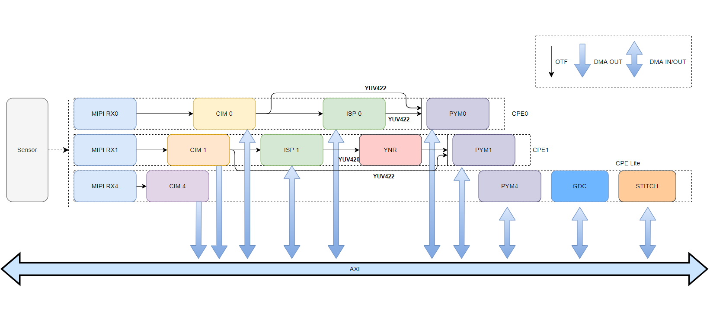
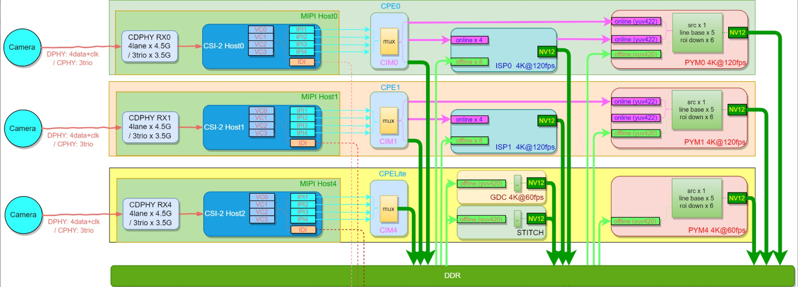
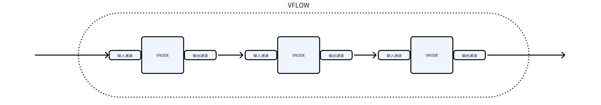
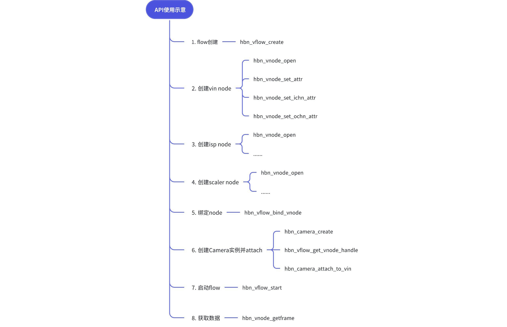

# Camsys子系统

## 系统概述

S100 camsys子系统包含Camera sensor (包括 SerDes)、VIN（包括
MIPI、CIM）、ISP、PYM、GDC、YNR、STITCH模块。

| 简称   | 全称                                   | 说明                                        |
|--------|----------------------------------------|---------------------------------------------|
| MIPI   | Mobile Industry Processor Interface    | 移动产业处理器接口，MIPI联盟制定的标准      |
| CSI    | Camera Serial Interface                | Camera串行接口                              |
| IPI    | Image Pixel Interface                  | MIPI与CIM之间的图像传输接口                 |
| FOV    | Field of View                          | 视场角                                      |
| SER    | Serializer                             | 加串器                                      |
| SerDes | Serializer and Deserializer            | 加串与解串器                                |
| DES    | Deserializer                           | 解串器                                      |
| CIM    | Camera Interface Manger                | Camera接入管理模块，支持online或offline工作 |
| VIN    | Video In(CIM+MIPI+LPWM+VCON)           | 视频输入模块                                |
| ISP    | Image Signal Processor                 | 图像信号处理器                              |
| PYM    | Pyramid                                | 金字塔处理模块: 图像缩小及ROI               |
| GDC    | Geometric Distortion Correction        | 几何畸变校正模块                            |
| VPF    | Video Process Framework(VIN+ISP+PYM..) | 视频处理管理模块                            |
| VIO    | Video In/Out (VIN+VPM)                 | 视频输入/输出模块                           |
| STITCH | Stitch hardware Module                 | 图像拼接处理模块                            |
| CAMSYS | Camera System (Camera+VPF)             | 相机图像系统                                |

### camsys硬件框图



### 子模块

**CIM**

CIM（Camera Interface Manager）是一种专门用来接收MIPI-RX
IPI图像数据的硬件。CIM负责同时接入多路图像数据，并改变MIPI
IPI接口的时序以匹配后级硬件或DDR的输入时序要求，将图像通过硬件直连或DDR形式提供给ISP和PYM。

**ISP**

ISP (Image Signal Processor)图像信号处理器，是一种专门用于图像信号处理的引擎。
ISP的功能包括对原始图像进行各类算法处理、图像特性统计、色彩空间转换、多路通道分时复用控制等，最终输出更清晰、更准确、高质量的图像。

**PYM**

PYM（Pyramid）作为一个硬件加速模块，对输入的图像按照金字塔图层的方式处理，并输出到DDR。

**GDC**

GDC作为一个硬件模块，可将输入的图像进行视角变换、畸变校正和指定角度（0,90,180,270）旋转。

**STITCH**

stitch是一个可配置的图像拼接计算单元，可以完成多幅图像之间的融合拼接。

### 数据流和性能指标

RDK-S100 接入camera 后，进入后级模块处理，其数据流通路如下图所示：



-   MIPI RX: 3路 CDPHY，每路为 DPHY 最大 4.5Gbps/lane x 4lane 或 CPHY 最大
    3.5Gbps/trio x 3trio，每路支持4VC，理论最多支持 12 路接入 。

| RDK-S100 软件预计最大支持 6路 camera，RX4 通过 serdes 最多可接入 4 路 camera，RX0 和 RX1 各接入 1路 camera，如果不是这种常规接法，请联系 FAE 进行确认。 |
|---------------------------------------------------------------------------------------------------------------------------------------------------------|


-   CIM: RX 接入，可 online 输出到 ISP0/ISP1(RAW) 与 PYM0/PYM1(YUV)，也可
    offline 下 DDR，之后各模块通过 DDR 读取使用数据流。

-   ISP: 2 个 ISP 设备，各支持 4 路 online + 8 路 offline 输入，每个 ISP
    最大支持 2x4K\@60fps 处理。

-   PYM: 3 个 PYM 设备，其中 PYM0/PYM1 为全功能模块支持 online/offline，PYM4
    只支持 offline，4K\@60fps处理。

-   GDC: 1 个 GDC 设备，只支持 offline 方式，4K\@60fps 处理。

## Camera API 

| 注意，本章节是基于 HBN 架构进行描述和列举内容，非 V4L2 架构。 |
|---------------------------------------------------------------|

### 模块描述

RDK-S100 HBN Camera 包含三个组件：Camera
sensor、解串器(Deserial)、串行器(Serializer)。串行器是对 mipi tx 的封装。
每个组件都有 attach、detach 接口和 vin 绑定或解绑。如 camera 和 vin
绑定，就是确定 camera 使用 SoC 上的哪个 mipi rx、i2c controller 然后初始化
sensor 的过程。

### API参考

1. **hbn_camera_create**

【函数声明】

int32_t hbn_camera_create(camera_config_t \*cam_config, camera_handle_t
\*cam_fd)

【参数描述】

[IN] camera_config_t \*cam_config：要配置的camera对应的参数结构体指针；

[OUT] camera_handle_t \*cam_fd：根据配置参数返回的fd，作为camera的操作handle；

【返回值】

成功：RET_OK 0

失败：异常为负值错误码

【功能描述】

根据camera_config_t传入的配置创建camera handle。

【注意事项】

API里面会对sensor lib 进行检查，如果sensor 驱动代码不符合 HBN
框架规范，则会检查报错。

API里面会对cam_config 进行检查，如果配置不符合IP 硬件能力，则会检查报错。

2. **hbn_camera_destroy**

【函数声明】

int32_t hbn_camera_destroy(camera_handle_t cam_fd)

【参数描述】

[IN] camera_handle_t cam_fd：camera的操作handle，由hbn_camera_create所创建；

【返回值】

成功：RET_OK 0

失败：异常为负值错误码

【功能描述】

根据camera handle销毁对应的软件资源。

【注意事项】

hbn_camera_destroy 需要和hbn_camera_create 成对使用。

hbn_camera_destroy 会释放sensor lib, 执行完成后，sensor 将无法正常访问。

hbn_camera_destroy
内部会调用hbn_camera_detach_from_vin，会触发sensor停流操作，所以hbn_camera_destroy需要在hbn_vflow_destroy之前调用。

3. **hbn_camera_attach_to_vin**

【函数声明】

int32_t hbn_camera_attach_to_vin(camera_handle_t cam_fd, vpf_handle_t vin_fd)

【参数描述】

[IN] camera_handle_t cam_fd：camera handle，由hbn_camera_create创建；

[IN] vpf_handle_t vin_fd：由hbn_vnode_open接口创建的vin node handle。

【返回值】

成功：RET_OK 0

失败：异常为负值错误码

【功能描述】

通过camera和vin node的handle，将两者在vpf框架中绑定，并对camera的硬件初始化。

【注意事项】

同一个camera,不能重复执行hbn_camera_attach_to_vin，否则会报attach error错误。

4. **hbn_camera_detach_from_vin**

【函数声明】

int32_t hbn_camera_detach_from_vin(camera_handle_t cam_fd)

【参数描述】

[IN] camera_handle_t cam_fd：camera handle，由hbn_camera_create创建；

【返回值】

成功：RET_OK 0

失败：异常为负值错误码

【功能描述】

将camera与vin node解绑，并做去初始化操作。

【注意事项】

hbn_camera_detach_from_vin需要和hbn_camera_attach_to_vin成对使用。

hbn_camera_destroy内部调用了hbn_camera_detach_from_vin，所以调用了hbn_camera_destroy接口，hbn_camera_detach_from_vin可以不再调用。

5. **hbn_camera_attach_to_deserial**

【函数声明】

int32_t hbn_camera_attach_to_deserial(camera_handle_t cam_fd, deserial_handle_t
des_fd, camera_des_link_t link)

【参数描述】

[IN] camera_handle_t cam_fd：camera handle，由hbn_camera_create创建；

[IN] deserial_handle_t des_fd：deserial handle，由hbn_deserial_create创建；

[IN] camera_des_link_t
link：camera与deserial的link方式，根据camera接到哪个link决定。

【返回值】

成功：RET_OK 0

失败：异常为负值错误码

【功能描述】

通过camera和deserial的handle，将两者绑定，并对deserial和camera硬件初始化。

【注意事项】

硬件上有解串器时才需要调用该接口。

执行hbn_camera_attach_to_deserial后，就不需要再执行hbn_camera_attach_to_vin，而是由deserial绑定到vin
node。

6. **hbn_camera_detach_from_deserial**

【函数声明】

int32_t hbn_camera_detach_from_deserial(camera_handle_t cam_fd)

【参数描述】

[IN] camera_handle_t cam_fd：camera handle，由hbn_camera_create创建；

【返回值】

成功：RET_OK 0

失败：异常为负值错误码

【功能描述】

将camera与deserial解绑，并做去初始化操作。

【注意事项】

hbn_camera_detach_from_deserial需要和hbn_camera_attach_to_deserial成对使用。

调用该api前需要先调用 hbn_deserial_detach_from_vin

7. **hbn_camera_start**

【函数声明】

int32_t hbn_camera_start(camera_handle_t cam_fd)

【参数描述】

[IN] camera_handle_t cam_fd：camera handle，由hbn_camera_create创建；

【返回值】

成功：RET_OK 0

失败：异常为负值错误码

【功能描述】

配置camera寄存器，开始出流。

【注意事项】

camera handle attach 到 vflow
后，该接口可以不调用。如果要调用必须先调用hbn_vflow_start，再调用hbn_camera_start。

8. **hbn_camera_stop**

【函数声明】

int32_t hbn_camera_stop(camera_handle_t cam_fd)

【参数描述】

[IN] camera_handle_t cam_fd：camera handle，由hbn_camera_create创建；

【返回值】

成功：RET_OK 0

失败：异常为负值错误码

【功能描述】

camera关流。

【注意事项】

需要和hbn_camera_start成对使用。

9. **hbn_camera_reset**

【函数声明】

int32_t hbn_camera_reset(camera_handle_t cam_fd)

【参数描述】

[IN] camera_handle_t cam_fd：camera handle，由hbn_camera_create创建；

【返回值】

成功：RET_OK 0

失败：异常为负值错误码

【功能描述】

通过重新初始化sensor来做reset。

【注意事项】

如果在camera attach
vin之前调用该接口，则会通过camera_attach_to_vin接口来给sensor初始化，达到reset效果。如果是在camera
attach vin之后调用该接口，则会调用sensor stop,sensor
deinit，然后初始化再重新init sensor,start sensor。

10. **hbn_camera_change_fps**

【函数声明】

int32_t hbn_camera_change_fps(camera_handle_t cam_fd, int32_t fps)

【参数描述】

[IN] camera_handle_t cam_fd：camera handle，由hbn_camera_create创建；

[IN] int32_t fps：sensor出图帧率；

【返回值】

成功：RET_OK 0

失败：异常为负值错误码

【功能描述】

动态切换sensor帧率。

【注意事项】

该功能需要在sensor lib库中实现相应的回调函数 dynamic_switch_fps。

11. **hbn_camera_read_register**

【函数声明】

int32_t hbn_camera_read_register(camera_handle_t cam_fd, camera_reg_type_t type,
uint32_t reg_addr)

【参数描述】

[IN] camera_handle_t cam_fd：camera handle，由hbn_camera_create创建；

[IN] camera_reg_type_t type：读取sensor寄存器的类型；

[IN] uint32_t reg_addr：寄存器地址；

【返回值】

成功：RET_OK 0

失败：异常为负值错误码

【功能描述】

读取camera寄存器的值。

【注意事项】

无

12. **hbn_camera_get_handle**

【函数声明】

camera_handle_t hbn_camera_get_handle(vpf_handle_t vin_fd, int32_t camera_index)

【参数描述】

[IN] vpf_handle_t vin_fd：vin node的fd；

[IN] int32_t camera_index：camera的port index；

【返回值】

成功：RET_OK 0

失败：异常为负值错误码

【功能描述】

通过vin node handle或者camera port index，获取对应的camera handle。

【注意事项】

无

13. **hbn_camera_init_cfg**

【函数声明】

int32_t hbn_camera_init_cfg(const char \*cfg_file)

【参数描述】

[IN] const char \*cfg_file：camera配置文件路径（json）；

【返回值】

成功：RET_OK 0

失败：异常为负值错误码

【功能描述】

通过传入的配置，创建camera handle和deserial handle并绑定。

【注意事项】

该API是通过解析json方式来创建camera,与sample中非json方式接口不同，详情请咨询FAE。

14. **hbn_deserial_create**

【函数声明】

int32_t hbn_deserial_create(deserial_config_t \*des_config, deserial_handle_t
\*des_fd)

【参数描述】

[IN] deserial_config_t \*des_config：deserial配置参数结构体指针；

[OUT] deserial_handle_t \*des_fd：根据配置创建的deserial handle；

【返回值】

成功：RET_OK 0

失败：异常为负值错误码

【功能描述】

根据传入的配置，创建deserial handle。

【注意事项】

硬件上有解串器时才需要调用该接口。

该接口会对deserial的配置进行检查，如果配置超出一定范围，则会报错。

该接口会对deserial lib进行检查，如果不符合HBN架构规范，则会报错。

15. **hbn_deserial_destroy**

【函数声明】

int32_t hbn_deserial_destroy(deserial_handle_t des_fd)

【参数描述】

[IN] deserial_handle_t des_fd：deserial handle，由hbn_deserial_create创建；

【返回值】

成功：RET_OK 0

失败：异常为负值错误码

【功能描述】

根据deserial handle销毁对应的软件资源。

【注意事项】

hbn_deserial_destroy需要和hbn_deserial_create成对使用。

16. **hbn_deserial_attach_to_vin**

【函数声明】

int32_t hbn_deserial_attach_to_vin(deserial_handle_t des_fd, camera_des_link_t
link, vpf_handle_t vin_fd)

【参数描述】

[IN] deserial_handle_t des_fd：deserial handle，由hbn_deserial_create创建；

[IN] camera_des_link_t link：deserial的link编号；

[IN] vpf_handle_t vin_fd：要绑定到的vin node handle；

【返回值】

成功：RET_OK 0

失败：异常为负值错误码

【功能描述】

将deserial与vin node绑定。

【注意事项】

硬件上带有解串器，则 camera与deserial进行绑定,deserial与vin node 绑定。

17. **hbn_deserial_detach_from_vin**

【函数声明】

int32_t hbn_deserial_detach_from_vin(deserial_handle_t des_fd, camera_des_link_t
link)

【参数描述】

[IN] deserial_handle_t des_fd：deserial handle，由hbn_deserial_create创建；

[IN] camera_des_link_t link：deserial的link编号；

【返回值】

成功：RET_OK 0

失败：异常为负值错误码

【功能描述】

将deserial与vin node解绑。

【注意事项】

hbn_deserial_detach_from_vin与hbn_deserial_attach_to_vin需要成对使用。

18. **hbn_txser_create**

【函数声明】

int32_t hbn_txser_create(txser_config_t \*txs_config, txser_handle_t \*txs_fd)

【参数描述】

[IN] txser_config_t \*txs_config：tx serial配置参数结构体指针；

[OUT] txser_handle_t \*txs_fd：根据配置创建的tx serial handle；

【返回值】

成功：RET_OK 0

失败：异常为负值错误码

【功能描述】

根据传入的配置，创建串行器句柄 tx serial handle。

【注意事项】

硬件上有串行器时才需要调用该接口。

该接口会对txser的配置进行检查，如果配置超出一定范围，则会报错。

该接口会对txser lib进行检查，如果不符合HBN架构规范，则会报错。

19. **hbn_txser_destroy**

【函数声明】

int32_t hbn_txser_destroy(txser_handle_t txs_fd)

【参数描述】

[IN] txser_handle_t txs_fd：tx serial handle，由hbn_txser_create创建；

【返回值】

成功：RET_OK 0

失败：异常为负值错误码

【功能描述】

根据tx serial handle销毁对应的软件资源。

【注意事项】

硬件上有串行器时才需要调用该接口。

hbn_txser_destroy与hbn_txser_create需要成对使用。

20. **hbn_txser_attach_to_vin**

【函数声明】

int32_t hbn_txser_attach_to_vin(txser_handle_t txs_fd, camera_txs_csi_t csi,
vpf_handle_t vin_fd)

【参数描述】

[IN] txser_handle_t txs_fd：tx serialhandle，由hbn_txser_create创建；

[IN] camera_txs_csi_t csi：tx csi index；

[IN] vpf_handle_t vin_fd：要绑定到的vin node handle；

【返回值】

成功：RET_OK 0

失败：异常为负值错误码

【功能描述】

将tx serial与vin node绑定。

【注意事项】

硬件上有串行器时才需要调用该接口。

该接口会对txser硬件进行初始化。

硬件上带有串行器，则camera与txser进行绑定,txser与vin node 绑定。

21. **hbn_txser_detach_from_vin**

【函数声明】

int32_t hbn_txser_detach_from_vin(txser_handle_t txs_fd, camera_txs_csi_t csi)

【参数描述】

[IN] txser_handle_t txs_fd：tx serial handle，由hbn_txser_create创建；

[IN] camera_txs_csi_t csi：tx csi index；

【返回值】

成功：RET_OK 0

失败：异常为负值错误码

【功能描述】

将tx serial与vin node解绑。

【注意事项】

hbn_txser_detach_from_vin需要与hbn_txser_attach_to_vin成对使用。

### 参数说明

**typedef struct camera_config_s**

| **名称**                     | **类型**      | **最小值** | **最大值**                  | **默认值** | **含义**                                                                                                                                                                                                                                                                                                                                                                                                  | **必选** |
|------------------------------|---------------|------------|-----------------------------|------------|-----------------------------------------------------------------------------------------------------------------------------------------------------------------------------------------------------------------------------------------------------------------------------------------------------------------------------------------------------------------------------------------------------------|----------|
| name[CAMERA_MODULE_NAME_LEN] | char          | \-         | CAMERA_MODULE_NAME_LEN(108) | \-         | camera 模组名称，需要和 sensor lib 名称对应，如：sensor 驱动名称为：libimx219.so，那么 name 为 imx219                                                                                                                                                                                                                                                                                                     | 是       |
| addr                         | uint32_t      | 0x00       | 0x7f                        | 0x00       | sensor 设备地址，一般是 i2c 7位地址                                                                                                                                                                                                                                                                                                                                                                       | 是       |
| isp_addr                     | uint32_t      | 0x00       | 0x7f                        | 0x00       | isp 设备地址(如有)，默认无                                                                                                                                                                                                                                                                                                                                                                                | 否       |
| eeprom_addr                  | uint32_t      | 0x00       | 0x7f                        | 0x00       | eeprom 设备地址(如有)，默认无                                                                                                                                                                                                                                                                                                                                                                             | 否       |
| serial_addr                  | uint32_t      | 0x00       | 0x7f                        | 0x00       | serdes 设备地址(如有)，默认无                                                                                                                                                                                                                                                                                                                                                                             | 否       |
| sensor_mode                  | uint32_t      | 1          | 5                           | 1          | sensor 工作模式，可以使用 enum sensor_mode_e 枚举，定义如下：                                                                                                                                                                                                                                                                                                                                             | 是       |
|                              |               |            |                             |            | 1：NORMAL_M，linear 模式；                                                                                                                                                                                                                                                                                                                                                                                |          |
|                              |               |            |                             |            | 2：DOL2_M，hdr2帧合成1帧；                                                                                                                                                                                                                                                                                                                                                                                |          |
|                              |               |            |                             |            | 3：DOL3_M，hdr3帧合成1帧；                                                                                                                                                                                                                                                                                                                                                                                |          |
|                              |               |            |                             |            | 4：DOL4_M，hdr4帧合成1帧；                                                                                                                                                                                                                                                                                                                                                                                |          |
|                              |               |            |                             |            | 5：PWL_M，hdr 模式 sensor 内部合成                                                                                                                                                                                                                                                                                                                                                                        |          |
| sensor_clk                   | uint32_t      | \-         | \-                          | 0x00       | sensor 一些 clk 时钟配置，目前未生效，备用                                                                                                                                                                                                                                                                                                                                                                | 否       |
| gpio_enable                  | uint32_t      | 0          | 0xFFFFFFFF                  | 0          | 是否使用 X5 gpio 控制 camera sensor 的引脚，以满足 sensor 上下电的时序要求。                                                                                                                                                                                                                                                                                                                              | 是       |
|                              |               |            |                             |            | 如：使用 gpio 来控制 sensor XSHUTDN 引脚。                                                                                                                                                                                                                                                                                                                                                                |          |
|                              |               |            |                             |            | 注意：需要在 dts 中配置对应的 gpio number。                                                                                                                                                                                                                                                                                                                                                               |          |
|                              |               |            |                             |            | 0：不使用 gpio 来控制；                                                                                                                                                                                                                                                                                                                                                                                   |          |
|                              |               |            |                             |            | 非0：使用 gpio 来控制 sensor，按照 bit 来使能 gpio。比如: 0x07 则代表使能 [gpio_a, gpio_b, gpio_c] 3 个 gpio。                                                                                                                                                                                                                                                                                            |          |
| gpio_level                   | uint32_t      | 0          | 1                           | 0          | 如果选择 gpio_enablet，则可以配置 gpio_level bit 来控制 sensor 引脚高低电平。某个 gpio bit 与 sensor 管脚高低电平关系如下：                                                                                                                                                                                                                                                                               | 是       |
|                              |               |            |                             |            | 0: 先输出低电平， sleep 1s，再输出高电平；                                                                                                                                                                                                                                                                                                                                                                |          |
|                              |               |            |                             |            | 1: 先输出高电平，sleep 1s，再输出低电平。                                                                                                                                                                                                                                                                                                                                                                 |          |
|                              |               |            |                             |            | 比如：0x05 = 101，从 bit0 到 bit2 分别代表 gpio_a 先输出高电平，再输出低电平，gpio_b 先输出低电平，再输出高电平，gpio_c 先输出高电平，再输出低电平。                                                                                                                                                                                                                                                      |          |
|                              |               |            |                             |            | 需要根据 sensor spec 上电时序来自定义。                                                                                                                                                                                                                                                                                                                                                                   |          |
| bus_select                   | uint32_t      | 0          | 6                           | 0          | sensor i2c number 选择，一般硬件固定后，对应的 i2c 也是固定的，所以建议在 dts 中配置，这里可以省去。                                                                                                                                                                                                                                                                                                      | 否       |
|                              |               |            |                             |            | dts 中绑定 sensor i2c，详情见：camera 点亮说明文档。                                                                                                                                                                                                                                                                                                                                                      |          |
| bus_timeout                  | uint32_t      | 0          | \-                          | 0          | I2C 的 timeout 时间配置。配置了 bus_select，才需要配置。                                                                                                                                                                                                                                                                                                                                                  | 否       |
| fps                          | uint32_t      | 0          | 120                         | 0          | sensor 帧率配置。                                                                                                                                                                                                                                                                                                                                                                                         | 是       |
| width                        | uint32_t      | 0          | 8192                        | 0          | sensor 出图宽度（pixel）                                                                                                                                                                                                                                                                                                                                                                                  | 是       |
| height                       | uint32_t      | 0          | 4096                        | 0          | sensor 出图高度（pixel）                                                                                                                                                                                                                                                                                                                                                                                  | 是       |
| format                       | uint32_t      | \-         | \-                          | \-         | sensor 数据类型，常见的如下：                                                                                                                                                                                                                                                                                                                                                                             | 是       |
|                              |               |            |                             |            | RAW8: 0x2A；                                                                                                                                                                                                                                                                                                                                                                                              |          |
|                              |               |            |                             |            | RAW10: 0x2B；                                                                                                                                                                                                                                                                                                                                                                                             |          |
|                              |               |            |                             |            | RAW12: 0x2C；                                                                                                                                                                                                                                                                                                                                                                                             |          |
|                              |               |            |                             |            | YUV422 8-bit: 0x1E                                                                                                                                                                                                                                                                                                                                                                                        |          |
| flags                        | uint32_t      | 0          | \-                          | 0          | 可选功能:诊断，恢复，debug 等                                                                                                                                                                                                                                                                                                                                                                             | 否       |
| extra_mode                   | uint32_t      | 0          | \-                          | 0          | 各 sensor 库内部定制配置: 多用于区分模组与功能开关                                                                                                                                                                                                                                                                                                                                                        | 是       |
| config_index                 | uint32_t      | 0          | \-                          | 0          | 各 sensor 库内部定制配置: 多用于区分模组与功能开关                                                                                                                                                                                                                                                                                                                                                        | 是       |
| ts_compensate                | uint32_t      | 0          | \-                          | 0          | 预留参数，备用                                                                                                                                                                                                                                                                                                                                                                                            | 否       |
| mipi_cfg                     | mipi_config_t | \-         | \-                          | \-         | MIPI 配置， 置为 NULL 自动从 sensor 驱动中获取配置（get_csi_attr）。                                                                                                                                                                                                                                                                                                                                      | 是       |
| calib_lname                  | char          | \-         | \-                          | \-         | sensor 效果库路径，默认路径为 /usr/hobot/lib/sensor                                                                                                                                                                                                                                                                                                                                                       | 是       |
| sensor_param                 | char          | \-         | \-                          | \-         | sensor 自定义数据                                                                                                                                                                                                                                                                                                                                                                                         | 否       |
| iparam_mode                  | uint32_t      | \-         | \-                          | \-         | 预留参数，备用                                                                                                                                                                                                                                                                                                                                                                                            | 否       |
| end_flag                     | uint32_t      | \-         | \-                          | \-         | 结构体配置的结束标志，默认为 CAMERA_CONFIG_END_FLAG                                                                                                                                                                                                                                                                                                                                                       | 是       |

**typedef struct deserial_config_s**

| **名称**       | **类型**                                          | **最小值** | **最大值**          | **默认值** | **含义**                                              | **必选** |
|----------------|---------------------------------------------------|------------|---------------------|------------|-------------------------------------------------------|----------|
| name           | char[CAMERA_MODULE_NAME_LEN]                      | \-         | \-                  | \-         | Deserial 的名称，例如 max9296。                       | 是       |
| addr           | uint32_t                                          | 0          | \-                  | \-         | Deserial 设备的地址。                                 | 是       |
| gpio_enable    | uint32_t                                          | 0          | \-                  | \-         | GPIO 操作使能位，索引自 VCON。                        | 是       |
| gpio_level     | uint32_t                                          | 0          | \-                  | \-         | GPIO 工作状态位，表示当前 GPIO 状态。                 | 是       |
| gpio_mfp       | uint8_t[CAMERA_DES_GPIO_MAX]                      | 0          | CAMERA_DES_GPIO_MAX | 0x0        | MFP 的 GPIO 功能选择，用于指定 GPIO 的多功能配置。    | 是       |
| bus_select     | uint32_t                                          | 0          | \-                  | \-         | I2C 总线选择，索引自 VCON。                           | 是       |
| bus_timeout    | uint32_t                                          | 0          | \-                  | \-         | I2C 超时时间设置，单位为毫秒。                        | 是       |
| lane_mode      | uint32_t                                          | 0          | \-                  | \-         | PHY 配置的 lane 模式选择。                            | 是       |
| lane_speed     | uint32_t                                          | 0          | \-                  | \-         | PHY 配置的 lane 速率。                                | 是       |
| link_map       | uint32_t                                          | 0          | \-                  | \-         | Link 和 CSI/VC 的映射关系配置。                       | 是       |
| link_desp      | char[CAMERA_DES_LINKMAX][CAMERA_DES_PORTDESP_LEN] | \-         | \-                  | \-         | 各 Link 连接模组的配置描述，用于多进程使用。          | 是       |
| reset_delay    | uint32_t                                          | 0          | \-                  | \-         | Reset 操作的延迟时间，单位为毫秒。                    | 是       |
| flags          | uint32_t                                          | 0          | \-                  | \-         | 可选功能标志，例如诊断、调试等。                      | 否       |
| poc_cfg        | poc_config_t\*                                    | \-         | \-                  | NULL       | POC 配置指针，若为 NULL 则无 POC 功能。               | 否       |
| mipi_cfg       | mipi_config_t\*                                   | \-         | \-                  | NULL       | MIPI 配置指针，若为 NULL 则自动获取配置。             | 否       |
| deserial_param | char\*                                            | \-         | \-                  | NULL       | Deserial 自定义数据指针。                             | 否       |
| end_flag       | uint32_t                                          | 0          | 0xFFFFFFFF          | \-         | 结构体配置的结束标志，默认为 DESERIAL_CONFIG_END_FLAG | 是       |

**typedef struct poc_config_s**

| **名称**    | **类型**                     | **最小值** | **最大值** | **默认值** | **含义**                                                        | **必选** |
|-------------|------------------------------|------------|------------|------------|-----------------------------------------------------------------|----------|
| name        | char[CAMERA_MODULE_NAME_LEN] | \-         | \-         | \-         | POC 的名称，例如 max20087。                                     | 是       |
| addr        | uint32_t                     | 0          | \-         | \-         | POC 设备的地址。                                                | 是       |
| gpio_enable | uint32_t                     | 0          | \-         | \-         | GPIO 操作使能位，索引自 VCON。                                  | 是       |
| gpio_level  | uint32_t                     | 0          | \-         | \-         | GPIO 工作状态位，表示当前 GPIO 状态。                           | 是       |
| poc_map     | uint32_t                     | 0          | \-         | \-         | POC 与 Link 的映射关系。                                        | 是       |
| power_delay | uint32_t                     | 0          | \-         | \-         | POC 开关操作的延迟时间，单位为毫秒。                            | 是       |
| end_flag    | uint32_t                     | 0          | 0xFFFFFFFF | \-         | 结构体配置的结束标志,用于校验完整性，默认为 POC_CONFIG_END_FLAG | 是       |

**返回值说明**

| **错误码** | **宏定义**                    | **描述**                                      | **常见原因及解决方法**                      |
|------------|-------------------------------|-----------------------------------------------|---------------------------------------------|
| 0          | HBN_STATUS_SUCESS             | 成功                                          |                                             |
| 1          | HBN_STATUS_INVALID_NODE       | vnode 无效，找不到对应的 vnode                |                                             |
| 2          | HBN_STATUS_INVALID_NODETYPE   | vnode 类型无效，找不到对应的 vnode            | 对于 VIN，vnode 类型为 HB_VIN               |
| 3          | HBN_STATUS_INVALID_HWID       | 无效的硬件模块 id                             | 对于 VIN，hw_id 取值为 0                    |
| 4          | HBN_STATUS_INVALID_CTXID      | 无效的 context id                             | 可设置为 AUTO_ALLOC_ID，由 HBN 框架自动分配 |
| 8          | HBN_STATUS_INVALID_NULL_PTR   | 空指针                                        |                                             |
| 9          | HBN_STATUS_INVALID_PARAMETER  | 无效的参数，版本检查失败                      |                                             |
| 10         | HBN_STATUS_ILLEGAL_ATTR       | 无效的参数                                    |                                             |
| 11         | HBN_STATUS_INVALID_FLOW       | 无效的 flow，找不到对应的 flow                |                                             |
| 12         | HBN_STATUS_FLOW_EXIST         | flow 已经存在                                 |                                             |
| 13         | HBN_STATUS_FLOW_UNEXIST       | flow 不存在                                   |                                             |
| 14         | HBN_STATUS_NODE_EXIST         | node 已经存在                                 |                                             |
| 15         | HBN_STATUS_NODE_UNEXIST       | node 不存在                                   |                                             |
| 16         | HBN_STATUS_NOT_CONFIG         | 预留                                          |                                             |
| 19         | HBN_STATUS_ALREADY_BINDED     | node 已经绑定                                 |                                             |
| 20         | HBN_STATUS_NOT_BINDED         | node 未绑定                                   |                                             |
| 21         | HBN_STATUS_TIMEOUT            | 超时                                          |                                             |
| 22         | HBN_STATUS_NOT_INITIALIZED    | 未初始化                                      |                                             |
| 23         | HBN_STATUS_NOT_SUPPORT        | 通道不支持或未激活                            |                                             |
| 24         | HBN_STATUS_NOT_PERM           | 操作不允许                                    |                                             |
| 25         | HBN_STATUS_NOMEM              | 内存不足                                      |                                             |
| 31         | HBN_STATUS_JSON_PARSE_FAIL    | json 解析失败                                 |                                             |
| 34         | HBN_STATUS_SET_CONTROL_FAIL   | 模块控制、调节参数（如 ISP 效果参数）设置失败 |                                             |
| 35         | HBN_STATUS_GET_CONTROL_FAIL   | 模块控制、调节参数（如 ISP 效果参数）获取失败 |                                             |
| 36         | HBN_STATUS_NODE_START_FAIL    | node 开启失败                                 |                                             |
| 37         | HBN_STATUS_NODE_STOP_FAIL     | node 停止失败                                 |                                             |
| 42         | HBN_STATUS_NODE_ILLEGAL_EVENT | node 通道 poll 时事件非法                     |                                             |
| 43         | HBN_STATUS_NODE_DEQUE_ERROR   | node 通道 dequeue buffer 错误                 |                                             |
| 51         | HBN_STATUS_INVALID_VERSION    | 底层驱动模块和上层库版本号不匹配错误          |                                             |
| 52         | HBN_STATUS_GET_VERSION_ERROR  | 获取底层驱动模块版本号错误                    |                                             |
| 128        | HBN_STATUS_ERR_UNKNOW         | 未知错误                                      |                                             |

**Camera 点亮**


## HBN API

### 描述

在软件上，Camera是单独一套API，Camera之后的模块用vnode来抽象，vnode抽象的模块包括VIN、ISP、PYM、GDC。
多个vnode组成一条vflow（类似于一条pipeline）。Camera和VIN通过attach接口绑定起来。
用户只需要调用HBN接口完成模块的初始化和绑定，vflow建立并启动后，用户无须关心数据帧的传递，SDK内部会将数据帧由上游传递到下游。



一个vflow由一个或多个vnode组成，一个vnode有一个输入通道，一个或多个输出通道。

接口调用示例：



### API参考

1. **hbn_vnode_open**

【函数声明】

hobot_status hbn_vnode_open(hb_vnode_type vnode_type, uint32_t hw_id, int32_t
ctx_id, hbn_vnode_handle_t \*vnode_fd)

【参数描述】

[IN] hb_vnode_type
vnode_type：vnode类型，每个硬件模块对应一个vnode类型。取值为HB_VIN、HB_ISP、HB_PYM等；

[IN] uint32_t hw_id：模块的硬件id。

[IN] uint32_t ctx_id：模块的context id，软件上的概念，可指定context
id值，也可设置为AUTO_ALLOC_ID，由SDK自动分配context id；

[OUT] hbn_vnode_handle_t \*vnode_fd：返回模块的vnode handle；

【返回值】

成功：HBN_STATUS_SUCESS 0

失败：异常为负值错误码，参考返回值说明。

【功能描述】

初始化某个模块，打开该模块设备节点，返回该模块的vnode handle。

【注意事项】

无

2. **hbn_vnode_close**

【函数声明】

void hbn_vnode_close(hbn_vnode_handle_t vnode_fd)

【参数描述】

[IN] hbn_vnode_handle_t vnode_fd：模块的vnode handle；

【返回值】

无

【功能描述】

关闭模块的设备节点。

【注意事项】

调用了hbn_vflow_destroy就无须再调用hbn_vnode_close。

模块单独使用时（例如只是GDC回灌）可调用hbn_vnode_close，模块串在vflow中，调用hbn_vflow_destroy即可，无须调用hbn_vnode_close。

3. **hbn_vnode_set_attr**

【函数声明】

hobot_status hbn_vnode_set_attr(hbn_vnode_handle_t vnode_fd, void \*attr)

【参数描述】

[IN] hbn_vnode_handle_t vnode_fd：模块的vnode handle；

[IN] void
\*attr：模块的基本属性结构体指针。基本属性结构体可以是vin_attr_t、isp_attr_t、pym_attr_t等，以模块名+_attr_t结尾的属性；

【返回值】

成功：HBN_STATUS_SUCESS 0

失败：异常为负值错误码，参考返回值说明

【功能描述】

设置模块的基本属性。

【注意事项】

无

4. **hbn_vnode_get_attr**

【函数声明】

hobot_status hbn_vnode_get_attr(hbn_vnode_handle_t vnode_fd, void \*attr)

【参数描述】

[IN] hbn_vnode_handle_t vnode_fd：模块的vnode handle；

[OUT] void
\*attr：模块的基本属性结构体指针。基本属性结构体可以是vin_attr_t、isp_attr_t、pym_attr_t等，以模块名+_attr_t结尾的属性；

【返回值】

成功：HBN_STATUS_SUCESS 0

失败：异常为负值错误码，参考返回值说明

【功能描述】

获取模块的基本属性。

【注意事项】

无

5. **hbn_vnode_set_attr_ex**

【函数声明】

hobot_status hbn_vnode_set_attr_ex(hbn_vnode_handle_t vnode_fd, void \*attr)

【参数描述】

[IN] hbn_vnode_handle_t vnode_fd：模块的vnode handle；

[IN] void
\*attr：模块的扩展属性结构体指针。扩展属性结构体可以是vin_attr_ex_t等，以模块名+_attr_ex_t结尾的属性；

【返回值】

成功：HBN_STATUS_SUCESS 0

失败：异常为负值错误码，参考返回值说明

【功能描述】

设置模块的扩展属性，可在应用运行中动态设置。

【注意事项】

无

6. **hbn_vnode_get_attr_ex**

【函数声明】

hobot_status hbn_vnode_get_attr_ex(hbn_vnode_handle_t vnode_fd, void \*attr)

【参数描述】

[IN] hbn_vnode_handle_t vnode_fd：模块的vnode handle；

[OUT] void
\*attr：模块的扩展属性结构体指针。扩展属性结构体可以是vin_attr_ex_t等，以模块名+_attr_ex_t结尾的属性；

【返回值】

成功：HBN_STATUS_SUCESS 0

失败：异常为负值错误码，参考返回值说明

【功能描述】

获取模块的扩展属性。

【注意事项】

无

7. **hbn_vnode_set_ochn_attr**

【函数声明】

hobot_status hbn_vnode_set_ochn_attr(hbn_vnode_handle_t vnode_fd, uint32_t
ochn_id, void \*attr)

【参数描述】

[IN] hbn_vnode_handle_t vnode_fd：模块的vnode handle；

[IN] uint32_t ochn_id：模块的输出通道id，通道id见模块通道说明；；

[IN] void
\*attr：模块的输出通道属性结构体指针。输出通道属性可以是vin_ochn_attr_t、isp_ochn_attr_t等，以模块名+_ochn_attr_t结尾的属性；

【返回值】

成功：HBN_STATUS_SUCESS 0

失败：异常为负值错误码，参考返回值说明

【功能描述】

设置模块的输出通道属性。

【注意事项】

无

8. **hbn_vnode_get_ochn_attr**

【函数声明】

hobot_status hbn_vnode_get_ochn_attr(hbn_vnode_handle_t vnode_fd, uint32_t
ochn_id, void \*attr)

【参数描述】

[IN] hbn_vnode_handle_t vnode_fd：模块的vnode handle；

[IN] uint32_t ochn_id：模块的输出通道id，通道id见模块通道说明；

[OUT] void
\*attr：模块输出通道属性结构体指针。输出通道属性可以是vin_ochn_attr_t、isp_ochn_attr_t等，以模块名+_ochn_attr_t结尾的属性；

【返回值】

成功：HBN_STATUS_SUCESS 0

失败：异常为负值错误码，参考返回值说明

【功能描述】

获取模块的输出通道属性。

【注意事项】

无

9. **hbn_vnode_set_ochn_attr_ex**

【函数声明】

hobot_status hbn_vnode_set_ochn_attr_ex(hbn_vnode_handle_t vnode_fd, uint32_t
ochn_id, void \*attr)

【参数描述】

[IN] hbn_vnode_handle_t vnode_fd：模块的vnode handle；

[IN] uint32_t ochn_id：模块的输出通道id，通道id见模块通道说明；

[IN] void
\*attr：模块的输出通道扩展属性结构体指针。输出通道扩展属性可以是pym_ochn_attr_ex_t等，以模块名+_ochn_attr_ex_t结尾的属性；

【返回值】

成功：HBN_STATUS_SUCESS 0

失败：异常为负值错误码，参考返回值说明

【功能描述】

设置模块的输出通道扩展属性，可在应用运行中动态设置。

【注意事项】

无

10. **hbn_vnode_set_ichn_attr**

【函数声明】

hobot_status hbn_vnode_set_ichn_attr(hbn_vnode_handle_t vnode_fd, uint32_t
ichn_id, void \*attr)

【参数描述】

[IN] hbn_vnode_handle_t vnode_fd：模块的vnode handle；

[IN] uint32_t ichn_id：模块的输入通道id，通道id见模块通道说明；

[IN] void
\*attr：模块的输入通道属性结构体指针。输入通道属性可以是vin_ichn_attr_t、isp_ichn_attr_t等，以模块名+_ichn_attr_t结尾的属性；

【返回值】

成功：HBN_STATUS_SUCESS 0

失败：异常为负值错误码，参考返回值说明

【功能描述】

设置模块的输入通道属性。

【注意事项】

无

11. **hbn_vnode_get_ichn_attr**

【函数声明】

hobot_status hbn_vnode_get_ichn_attr(hbn_vnode_handle_t vnode_fd, uint32_t
ichn_id, void \*attr)

【参数描述】

[IN] hbn_vnode_handle_t vnode_fd：模块的vnode handle；

[IN] uint32_t ichn_id：模块的输入通道id，通道id见模块通道说明；

[OUT] void
\*attr：模块的输入通道属性结构体指针。输入通道属性可以是vin_ichn_attr_t、isp_ichn_attr_t等，以模块名+_ichn_attr_t结尾的属性；

【返回值】

成功：HBN_STATUS_SUCESS 0

失败：异常为负值错误码，参考返回值说明

【功能描述】

获取模块的输入通道属性。

【注意事项】

无

12. **hbn_vnode_set_ochn_buf_attr**

【函数声明】

hobot_status hbn_vnode_set_ochn_buf_attr(hbn_vnode_handle_t vnode_fd, uint32_t
ochn_id, hbn_buf_alloc_attr_t \*alloc_attr)

【参数描述】

[IN] hbn_vnode_handle_t vnode_fd：模块的vnode handle；

[IN] uint32_t ochn_id：模块的输出通道id，通道id见模块通道说明；

[IN] hbn_buf_alloc_attr_t \*alloc_attr：buffer分配属性；

【返回值】

成功：HBN_STATUS_SUCESS 0

失败：异常为负值错误码，参考返回值说明

【功能描述】

设置输出通道buffer属性。

【注意事项】

无

13. **hbn_vnode_start**

【函数声明】

hobot_status hbn_vnode_start(hbn_vnode_handle_t vnode_fd)

【参数描述】

[IN] hbn_vnode_handle_t vnode_fd：模块的vnode handle；

【返回值】

成功：HBN_STATUS_SUCESS 0

失败：异常为负值错误码，参考返回值说明

【功能描述】

模块启动。

【注意事项】

启动前需要先打开模块。

14. **hbn_vnode_stop**

【函数声明】

hobot_status hbn_vnode_stop(hbn_vnode_handle_t vnode_fd)

【参数描述】

[IN] hbn_vnode_handle_t vnode_fd：模块的vnode handle；

【返回值】

成功：HBN_STATUS_SUCESS 0

失败：异常为负值错误码，参考返回值说明

【功能描述】

模块停止。

【注意事项】

无

15. **hbn_vnode_getframe**

【函数声明】

hobot_status hbn_vnode_getframe(hbn_vnode_handle_t vnode_fd, uint32_t ochn_id,
uint32_t millisecondTimeout, hbn_vnode_image_t \*out_img)

【参数描述】

[IN] hbn_vnode_handle_t vnode_fd：模块的vnode handle；

[IN] uint32_t ochn_id：模块的输出通道id，通道id见模块通道说明；

[IN] uint32_t millisecondTimeout：超时等待时间；

[OUT] hbn_vnode_image_t \*out_img：输出图像buffer结构体地址；

【返回值】

成功：HBN_STATUS_SUCESS 0

失败：异常为负值错误码，参考返回值说明

【功能描述】

获取模块输出通道的图像，阻塞型接口。

【注意事项】

无

16. **hbn_vnode_releaseframe**

【函数声明】

hobot_status hbn_vnode_releaseframe(hbn_vnode_handle_t vnode_fd, uint32_t
ochn_id, hbn_vnode_image_t \*img)

【参数描述】

[IN] hbn_vnode_handle_t vnode_fd：模块的vnode handle；

[IN] uint32_t ochn_id：模块的输出通道id，通道id见模块通道说明；

[IN] hbn_vnode_image_t \*img：图像buffer结构体地址；

【返回值】

成功：HBN_STATUS_SUCESS 0

失败：异常为负值错误码，参考返回值说明

【功能描述】

释放图像buffer，buffer会归还到指定的输出通道。

【注意事项】

无

17. **hbn_vnode_getframe_group**

【函数声明】

hobot_status hbn_vnode_getframe_group(hbn_vnode_handle_t vnode_fd, uint32_t
ochn_id, uint32_t millisecondTimeout,hbn_vnode_image_group_t \*out_img);

【参数描述】

[IN] hbn_vnode_handle_t vnode_fd：模块的vnode handle；

[IN] uint32_t ochn_id：模块的输出通道id，通道id见模块通道说明；

[IN] uint32_t millisecondTimeout：超时等待时间；

[OUT] hbn_vnode_image_group_t \*out_img：输出图像buffer结构体地址；

【返回值】

成功：HBN_STATUS_SUCESS 0

失败：异常为负值错误码，参考返回值说明

【功能描述】

获取模块输出通道的多层聚合图像，阻塞型接口。

【注意事项】

ISP和PYM输出图像需要调用该接口获取

18. **hbn_vnode_releaseframe_group**

【函数声明】

hobot_status hbn_vnode_releaseframe_group(hbn_vnode_handle_t vnode_fd, uint32_t
ochn_id, hbn_vnode_image_group_t\*img)

【参数描述】

[IN] hbn_vnode_handle_t vnode_fd：模块的vnode handle；

[IN] uint32_t ochn_id：模块的输出通道id，通道id见模块通道说明；

[IN] hbn_vnode_image_t \*img：图像buffer结构体地址；

【返回值】

成功：HBN_STATUS_SUCESS 0

失败：异常为负值错误码，参考返回值说明

【功能描述】

释放多层聚合图像buffer，buffer会归还到指定的输出通道。

【注意事项】

无

19. **hbn_vnode_sendframe**

【函数声明】

hobot_status hbn_vnode_sendframe(hbn_vnode_handle_t vnode_fd, uint32_t ichn_id,
hbn_vnode_image_t \*img)

【参数描述】

[IN] hbn_vnode_handle_t vnode_fd：模块的vnode handle；

[IN] uint32_t ichn_id：模块的输入通道id，通道id见模块通道说明；

[IN] hbn_vnode_image_t \*img：输入图像buffer地址；

【返回值】

成功：HBN_STATUS_SUCESS 0

失败：异常为负值错误码，参考返回值说明

【功能描述】

发送图像到模块的输入通道，会触发模块进行处理。阻塞型接口，等待硬件处理完再返回，默认超时时间为1秒。

【注意事项】

无

20. **hbn_vflow_create**

【函数声明】

hobot_status hbn_vflow_create(hbn_vflow_handle_t \*vflow_fd)

【参数描述】

[OUT] hbn_vflow_handle_t \*vflow_fd：vflow handle；

【返回值】

成功：HBN_STATUS_SUCESS 0

失败：异常为负值错误码，参考返回值说明

【功能描述】

创建一个vflow，返回vflow handle。

【注意事项】

无

21. **hbn_vflow_destroy**

【函数声明】

void hbn_vflow_destroy(hbn_vflow_handle_t vflow_fd)

【参数描述】

[IN] hbn_vflow_handle_t \*vflow_fd：vflow handle；

【返回值】

无

【功能描述】

根据vflow handle，销毁一个vflow。

【注意事项】

无

22. **hbn_vflow_add_vnode**

【函数声明】

hobot_status hbn_vflow_add_vnode(hbn_vflow_handle_t vflow_fd, hbn_vnode_handle_t
vnode_fd)

【参数描述】

[IN] hbn_vflow_handle_t \*vflow_fd：vflow handle；

[IN] hbn_vnode_handle_t vnode_fd：模块的vnode handle；

【返回值】

成功：HBN_STATUS_SUCESS 0

失败：异常为负值错误码，参考返回值说明

【功能描述】

把模块添加到vflow里面，用vflow管理起来。

【注意事项】

无

23. **hbn_vflow_bind_vnode**

【函数声明】

hobot_status hbn_vflow_bind_vnode(hbn_vflow_handle_t vflow_fd,
hbn_vnode_handle_t src_vnode_fd, uint32_t out_chn, hbn_vnode_handle_t
dst_vnode_fd, uint32_t in_chn)

【参数描述】

[IN] hbn_vflow_handle_t \*vflow_fd：vflow handle；

[IN] hbn_vnode_handle_t src_vnode_fd：源模块的vnode handle；

[IN] uint32_t out_chn：源模块的输出通道id，通道id见模块通道说明；

[IN] hbn_vnode_handle_t dst_vnode_fd：目的模块的vnode handle；

[IN] uint32_t in_chn：目的模块的输入通道id，通道id见模块通道说明；

【返回值】

成功：HBN_STATUS_SUCESS 0

失败：异常为负值错误码，参考返回值说明

【功能描述】

把两个模块绑定到一起。绑定后src_vnode_fd模块的数据帧会自动流向dst_vnode_fd模块。

【注意事项】

flow需要创建，模块需要open。

24. **hbn_vflow_unbind_vnode**

【函数声明】

hobot_status hbn_vflow_unbind_vnode(hbn_vflow_handle_t vflow_fd,
hbn_vnode_handle_t src_vnode_fd, uint32_t out_chn, hbn_vnode_handle_t
dst_vnode_fd, uint32_t in_chn)

【参数描述】

[IN] hbn_vflow_handle_t \*vflow_fd：vflow handle；

[IN] hbn_vnode_handle_t src_vnode_fd：源模块的vnode handle；

[IN] uint32_t out_chn：源模块的输出通道id，通道id见模块通道说明；

[IN] hbn_vnode_handle_t dst_vnode_fd：目的模块的vnode handle；

[IN] uint32_t in_chn：目的模块的输入通道id，通道id见模块通道说明；

【返回值】

成功：HBN_STATUS_SUCESS 0

失败：异常为负值错误码，参考返回值说明

【功能描述】

解绑src_vnode_fd和dst_vnode_fd模块。

【注意事项】

暂不支持。

25. **hbn_vflow_start**

【函数声明】

hobot_status hbn_vflow_start(hbn_vflow_handle_t vflow_fd)

【参数描述】

[IN] hbn_vflow_handle_t vflow_fd：vflow handle；

【返回值】

成功：HBN_STATUS_SUCESS 0

失败：异常为负值错误码，参考返回值说明

【功能描述】

启动一条vflow。vflow里包含的vnode都会启动。

【注意事项】

模块vnode需要事先添加到vflow中。

26. **hbn_vflow_stop**

【函数声明】

hobot_status hbn_vflow_stop(hbn_vflow_handle_t vflow_fd)

【参数描述】

[IN] hbn_vflow_handle_t vflow_fd：vflow handle；

【返回值】

成功：HBN_STATUS_SUCESS 0

失败：异常为负值错误码，参考返回值说明

【功能描述】

停止一条vflow。vflow里包含的vnode都会停止。

【注意事项】

和hbn_vflow_start成对使用。

27. **hbn_vflow_get_vnode_handle**

【函数声明】

hbn_vnode_handle_t hbn_vflow_get_vnode_handle(hbn_vflow_handle_t vflow_fd,
hb_vnode_type vnode_type, uint32_t index)

【参数描述】

[IN] hbn_vflow_handle_t vflow_fd：vflow handle；

[IN] hb_vnode_type vnode_type：模块id；

[IN] uint32_t index：context id，范围为[0, 7]

【返回值】

成功：HBN_STATUS_SUCESS 0

失败：异常为负值错误码，参考返回值说明

【功能描述】

通过模块id和context id获取vnode handle。

【注意事项】

模块需要事先open。

### 参数说明

**公共**

hbn_vnode_image_t

| 名称     | 类型                 | 含义         | 最大值 | 最小值 | 默认值 | 是否必选 |
|----------|----------------------|--------------|--------|--------|--------|----------|
| info     | hbn_frame_info_t     | 图像信息结构 | \-     | \-     | \-     | \-       |
| buffer   | hb_mem_graphic_buf_t | 图像内存信息 | \-     | \-     | \-     | \-       |
| metadata | void \*              | meta数据     | \-     | \-     | \-     | \-       |

hbn_frame_info_t

| 名称        | 类型           | 含义                 | 最大值 | 最小值 | 默认值 | 是否必选 |
|-------------|----------------|----------------------|--------|--------|--------|----------|
| frame_id    | uint32_t       | 帧号                 | \-     | \-     | \-     | \-       |
| timestamps  | uint64_t       | 系统时间             | \-     | \-     | \-     | \-       |
| tv          | struct timeval | 硬件时间戳           | \-     | \-     | \-     | \-       |
| trig_tv     | struct timeval | 外部触发的硬件时间戳 | \-     | \-     | \-     | \-       |
| bufferindex | int32_t        | buffer索引           | \-     | \-     | \-     | \-       |

hb_mem_graphic_buf_t

| 名称                            | 类型       | 含义                   | 最大值 | 最小值 | 默认值 | 是否必选 |
|---------------------------------|------------|------------------------|--------|--------|--------|----------|
| fd[MAX_GRAPHIC_BUF_COMP]        | int32_t    | 文件描述符             | \-     | \-     | \-     | \-       |
| plane_cnt                       | int32_t    | plane个数              | \-     | \-     | \-     | \-       |
| format                          | int32_t    | 图像格式               | \-     | \-     | \-     | \-       |
| width                           | int32_t    | 宽度                   | \-     | \-     | \-     | \-       |
| height                          | int32_t    | 高度                   | \-     | \-     | \-     | \-       |
| stride                          | int32_t    | 宽度stride             | \-     | \-     | \-     | \-       |
| vstride                         | int32_t    | 高度stride             | \-     | \-     | \-     | \-       |
| is_contig                       | int32_t    | buffer物理地址是否连续 | \-     | \-     | \-     | \-       |
| share_id[MAX_GRAPHIC_BUF_COMP]  | int32_t    | 共享id                 | \-     | \-     | \-     | \-       |
| flags                           | int64_t    | 标识                   | \-     | \-     | \-     | \-       |
| size[MAX_GRAPHIC_BUF_COMP]      | uint64_t   | buffer size            | \-     | \-     | \-     | \-       |
| virt_addr[MAX_GRAPHIC_BUF_COMP] | uint8_t \* | 虚拟地址               | \-     | \-     | \-     | \-       |
| phys_addr[MAX_GRAPHIC_BUF_COMP] | uint64_t   | 物理地址               | \-     | \-     | \-     | \-       |
| offset[MAX_GRAPHIC_BUF_COMP]    | uint64_t   | 内存偏移               | \-     | \-     | \-     | \-       |

hbn_vnode_image_group_t

| 名称      | 类型                       | 含义              | 最大值 | 最小值 | 默认值 | 是否必选 |
|-----------|----------------------------|-------------------|--------|--------|--------|----------|
| info      | hbn_frame_info_t           | 图像信息结构      | \-     | \-     | \-     | \-       |
| buf_group | hb_mem_graphic_buf_group_t | group图像内存信息 | \-     | \-     | \-     | \-       |
| metadata  | void \*                    | meta数据          | \-     | \-     | \-     | \-       |

hb_mem_graphic_buf_group_t

| 名称                                   | 类型                 | 含义                           | 最大值 | 最小值 | 默认值 | 是否必选 |
|----------------------------------------|----------------------|--------------------------------|--------|--------|--------|----------|
| graph_group[HB_MEM_MAXIMUM_GRAPH_BUF]; | hb_mem_graphic_buf_t | 图像内存信息                   | \-     | \-     | \-     | \-       |
| group_id                               | int32_t              | group id号                     | \-     | \-     | \-     | \-       |
| bit_map                                | uint32_t             | 用bit标识graph_group中可用的层 | \-     | \-     | \-     | \-       |

**VIN**

vin_attr_t

| 名称          | 类型            | 含义                                  | 最大值 | 最小值 | 默认值 | 是否必选 |
|---------------|-----------------|---------------------------------------|--------|--------|--------|----------|
| vin_node_attr | vin_node_attr_t | vin node节点属性结构                  | \-     | \-     | \-     | 是       |
| magicNumber   | uint32_t        | 属性结构体校验值，需要填写为MAGIC_NUM | \-     | \-     | \-     | 是       |

vin_node_attr_t

| 名称        | 类型        | 含义                                  | 最大值 | 最小值 | 默认值 | 是否必选 |
|-------------|-------------|---------------------------------------|--------|--------|--------|----------|
| cim_attr    | cim_attr_t  | cim参数                               | \-     | \-     | \-     | 是       |
| lpwm_attr   | lpwm_attr_t | lpwm参数                              | \-     | \-     | \-     | 否       |
| vcon_attr   | vcon_attr_t | vcon参数                              | \-     | \-     | \-     | 否       |
| magicNumber | uint32_t    | 属性结构体校验值，需要填写为MAGIC_NUM | \-     | \-     | \-     | 是       |

cim_attr_t

| 名称          | 类型     | 含义                       | 最大值 | 最小值 | 默认值 | 是否必选 |
|---------------|----------|----------------------------|--------|--------|--------|----------|
| mipi_en       | uint32_t | 是否使能mipi输入           | 1      | 0      | \-     | 是       |
| mipi_rx       | uint32_t | mipi rx索引，可选值为0,1,4 | 4      | 0      | \-     | 是       |
| vc_index      | uint32_t | cim ipi索引                | 3      | 0      | \-     | 是       |
| cim_pym_flyby | uint32_t | 是否使能cim pym硬件直连    | 1      | 0      | \-     | 是       |
| cim_isp_flyby | uint32_t | 是否使能cim isp硬件直连    | 1      | 0      | \-     | 是       |

vin_ichn_attr_t

| 名称   | 类型     | 含义                              | 最大值 | 最小值 | 默认值 | 是否必选 |
|--------|----------|-----------------------------------|--------|--------|--------|----------|
| format | uint32_t | mipi输入图像格式，例raw12对应0x2c | 0x27   | 0x1E   | \-     | 是       |
| width  | uint32_t | mipi输入图像宽                    | 4096   | 32     | \-     | 是       |
| height | uint32_t | mipi输入图像高                    | 2160   | 32     | \-     | 是       |

vin_ochn_attr_t

| 名称           | 类型                  | 含义                                                                                                           | 最大值 | 最小值 | 默认值 | 是否必选 |
|----------------|-----------------------|----------------------------------------------------------------------------------------------------------------|--------|--------|--------|----------|
| ddr_en         | uint32_t              | 是否使能cim ddr输出                                                                                            | 1      | 0      | \-     | 否       |
| roi_en         | uint32_t              | 是否使能cim roi通道输出                                                                                        | 1      | 0      | \-     | 否       |
| emb_en         | uint32_t              | 是否使能cim emb通道输出                                                                                        | 1      | 0      | \-     | 否       |
| rawds_en       | uint32_t              | 是否使能raw scaler                                                                                             | 1      | 0      | \-     | 否       |
| pingpong_ring  | uint32_t              | 是否使能乒乓buffer                                                                                             | 1      | 0      | \-     | 否       |
| ochn_attr_type | vin_ochn_attr_type_e  | 输出通道类型： VIN_MAIN_FRAME 主数据通路 VIN_ONLINE online输出通路 VIN_EMB embeded数据通路 VIN_ROI roi数据通路 | \-     | \-     | \-     | 是       |
| vin_basic_attr | vin_basic_attr_t      | vin基础属性                                                                                                    | \-     | \-     | \-     | 是       |
| rawds_attr     | vin_rawds_attr_t      | vin raw scaler属性                                                                                             | \-     | \-     | \-     | 否       |
| roi_attr       | struct vin_roi_attr_s | vin roi 属性                                                                                                   | \-     | \-     | \-     | 否       |
| emb_attr       | vin_emb_attr_t        | vin embeded属性                                                                                                | \-     | \-     | \-     | 否       |
| magicNumber    | uint32_t              | 属性结构体校验值，需要填写为固定值MAGIC_NUM                                                                    | \-     | \-     | \-     | 是       |

vin_basic_attr_t

| 名称      | 类型     | 含义                          | 最大值 | 最小值 | 默认值 | 是否必选 |
|-----------|----------|-------------------------------|--------|--------|--------|----------|
| pack_mode | uint32_t | pack使能，不配置默认pack      | 1      | 0      | 1      | 否       |
| wstride   | uint32_t | 输出宽stride，置0内部自动计算 | 1      | 0      | 1      | 否       |
| vstride   | uint32_t | 输出高stride，置0内部自动计算 | 1      | 0      | 1      | 否       |
| format    | uint32_t | 输出图像格式，例raw12对应0x2c | 0x27   | 0x1E   | \-     | 是       |

**ISP**

isp_attr_t

| 名称        | 类型            | 含义                                                                                                                                 | 最大值 | 最小值 | 默认值 | 是否必选 |
|-------------|-----------------|--------------------------------------------------------------------------------------------------------------------------------------|--------|--------|--------|----------|
| channel     | isp_channel_t   | isp通道属性                                                                                                                          | \-     | \-     | \-     | 是       |
| sched_mode  | sched_mode_e    | isp调度模式 0 SCHED_MODE_TDMF 硬件直连 1 SCHED_MODE_MANUAL manual模式 2 SCHED_MODE_PASS_THRU 全online模式                            | 2      | 0      | \-     | 是       |
| work_mode   | isp_work_mode_e | isp工作模式 0 ISP_WORK_MODE_NOMAL 普通模式 1 ISP_WORK_MODE_TPG isp输出testpattern模式 2 ISP_WORK_MODE_CIM_TPG cim输出testpattern模式 | 2      | 0      | \-     | 否       |
| hdr_mode    | hdr_mode_e      | isp hdr模式使能                                                                                                                      | 1      | 0      | \-     | 否       |
| size        | image_size_t    | isp处理尺寸                                                                                                                          | \-     | \-     | \-     | 否       |
| frame_rate  | uint32_t        | isp帧率                                                                                                                              | 120    | 1      | \-     | 否       |
| isp_combine | isp_combine_t   | isp主从模式                                                                                                                          | \-     | \-     | \-     | 否       |
| algo_state  | uint32_t        | 2A算法使能                                                                                                                           | 1      | 0      | \-     | 否       |

isp_channel_t

| 名称    | 类型     | 含义                                                         | 最大值 | 最小值 | 默认值 | 是否必选 |
|---------|----------|--------------------------------------------------------------|--------|--------|--------|----------|
| hw_id   | uint32_t | isp硬件id                                                    | 1      | 0      | \-     | 是       |
| slot_id | uint32_t | isp内部硬件通道 online输入时配置0\~3，offline输入时配置4\~11 | 11     | 0      | 0      | 是       |

image_size_t

| 名称   | 类型     | 含义        | 最大值 | 最小值 | 默认值 | 是否必选 |
|--------|----------|-------------|--------|--------|--------|----------|
| width  | uint32_t | isp处理宽度 | 4096   | 32     | \-     | 是       |
| height | uint32_t | isp处理高度 | 2160   | 32     | \-     | 是       |

**PYM**

roi_box_t

| 名称          | 类型     | 含义                          | 最大值                                                                                                   | 最小值                                                                     | 默认值                                                   | 是否必选 |
|---------------|----------|-------------------------------|----------------------------------------------------------------------------------------------------------|----------------------------------------------------------------------------|----------------------------------------------------------|----------|
| start_top     | uint32_t | 从原始图像中截取图像的Y轴位置 | ds 层：\<= region_height bl 层：\<= bl_base_height bl_base_height = region_width \>\> (ds_roi_layer + 1) | ds层：\>= region_height - out_height bl层：\>= bl_base_height - out_height | \-                                                       | 是       |
| start_left    | uint32_t | 从原始图像中截取图像的X轴位置 | ds层：\<= region_width bl层：\<= bl_base_width bl_base_width = region_width \>\> (ds_roi_layer + 1)      | ds层：\>= region_width - out_width bl层：\>= bl_base_width - out_width     | \-                                                       | 是       |
| region_width  | uint32_t | 截取图像的宽度                | \-                                                                                                       | \-                                                                         | \-                                                       | 是       |
| region_height | uint32_t | 截取图像的高度                | \-                                                                                                       | \-                                                                         | \-                                                       | 是       |
| wstride_uv    | uint32_t | 输出的uv层stride              |                                                                                                          |                                                                            | \-                                                       | 是       |
| wstride_y     | uint32_t | 输出的y层stride               | \-                                                                                                       | \-                                                                         | \-                                                       | 是       |
| vstride       | uint32_t | y层高度stried                 | \-                                                                                                       | \-                                                                         | out_height                                               | 是       |
| step_v        | uint32_t |                               | \-                                                                                                       | \-                                                                         | (1 \<\< 16) \* (out_height - region_height) / out_height | 否       |
| step_h        | uint32_t |                               | \-                                                                                                       | \-                                                                         | (1 \<\< 16) \* (out_width - region_width) / out_width    | 否·      |
| out_width     | uint32_t | 输出图像的宽度                | \-                                                                                                       | \-                                                                         | \-                                                       | 是       |
| out_height    | uint32_t | 输出图像的高度                | \-                                                                                                       | \-                                                                         | \-                                                       | 是       |
| phase_y_v     | uint32_t |                               |                                                                                                          |                                                                            | 0                                                        | 否       |
| phase_y_h     | uint32_t |                               |                                                                                                          |                                                                            | 0                                                        | 否       |

chn_ctrl_t

| 名称                     | 类型      | 含义                                    | 最大值                    | 最小值                | 默认值 | 是否必选 |
|--------------------------|-----------|-----------------------------------------|---------------------------|-----------------------|--------|----------|
| pixel_num_before_sol     | uint32_t  |                                         | \-                        | \-                    | 2      | 是       |
| invalid_head_lines       | uint32_t  |                                         | \-                        | \-                    | \-     | 否       |
| src_in_width             | uint32_t  | 输入宽度，且2对齐                       | \< 4096                   | \> 32                 | \-     | 是       |
| src_in_height            | uint32_t  | 输入高度，且2对齐                       | \< 4096                   | \> 32                 | \-     | 是       |
| src_in_stride_y          | uint32_t  | 输入y plane stride, 且16对齐            | \< 4096                   | \> src_in_width       | \-     | 是       |
| src_in_stride_uv         | uint32_t  | 输入uv stride，且16对齐                 | \< 4096                   | \> src_in_width       | \-     | 是       |
| suffix_hb_val            | uint32_t  |                                         | \<= 152                   | \>= 16                | 100    | 是       |
| prefix_hb_val            | uint32_t  |                                         | \<= 2                     | \>= 0                 | 2      | 是       |
| suffix_vb_val            | uint32_t  |                                         | \<= 20                    | \>= 0                 | 10     | 是       |
| prefix_vb_val            | uint32_t  |                                         | \<= 2                     | \>= 0                 | 0      | 是       |
| bl_max_layer_en          | uint8_t   | 选择bl层时，使能bl层数                  |                           | \> ds_roi_layer[chn]  | 5      | 是       |
| ds_roi_en                | uint8_t   | ds层输出使能，总共6层，按bit位使能      | \< (1 \<\< 6)             | \-                    | \-     | 是       |
| ds_roi_uv_bypass         | uint8_t   | ds层uv plane输出bypass使能，按bit位使能 | \< (1 \<\< 6)             | \-                    | \-     | 否       |
| ds_roi_sel[MAX_DS_NUM]   | uint8_t   | 图层选择，0 src层；1 bl层               | \< 3                      | \-                    | \-     | 是       |
| ds_roi_layer[MAX_DS_NUM] | uint8_t   |                                         | ds_roi_sel = 0时, 只能为0 | \-                    | \-     | 是       |
| ds_roi_info[MAX_DS_NUM]  | roi_box_t | ds层配置                                | \-                        | \-                    | \-     | 是       |

pym_cfg_t

| 名称                 | 类型       | 含义                                                                                                                                                 | 最大值    | 最小值 | 默认值 | 是否必选 |
|----------------------|------------|------------------------------------------------------------------------------------------------------------------------------------------------------|-----------|--------|--------|----------|
| hw_id                | uint8_t    | pym 硬件模块id (0, 1 , 4)                                                                                                                            | \-        | \-     | \-     | 是       |
| pym_mode             | uint8_t    | pym 工作模式 *1*：Manual模式，online链接，前级模块是sw trigger； 2：单路Online（前级-PYM硬件直连）模式； 3：离线模式（输入:YUV420SP，输出:YUV420SP） | \<= 3     | \>= 1  | \-     | 是       |
| slot_id              | uint8_t    | pym 硬件通道id                                                                                                                                       | 7         | 0      | \-     | 否       |
| out_buf_noinvalid    | uint8_t    | 模块输出buf内部是否会执行invaild cache操作                                                                                                           | 1         | 0      | 1      | 是       |
| out_buf_noncached    | uint8_t    | 模块输出buf是否使能non-cache内存分配                                                                                                                 | 1         | 0      | \-     | 否       |
| in_buf_noclean       | uint8_t    | 输入buf是否做cache clean                                                                                                                             | 1         | 0      | 1      | 是       |
| in_buf_noncached     | uint8_t    | 模块输入buf（一般回灌buf）是否使能non-cache内存分配                                                                                                  | 1         | 0      | \-     | 否       |
| buf_consecutive      | uint8_t    | 内存是否连续                                                                                                                                         | 1         | 0      | \-     | 否       |
| pingpong_ring        | uint8_t    | 是否开启乒乓buffer                                                                                                                                   |           |        | \-     | 否       |
| output_buf_num       | uint32_t   | 输出buf数目，当PYM离线模式时，回灌buf数目按照该数目默认分配                                                                                          | \<= 64    | 0      | \-     | 是       |
| timeout              | uint32_t   | 超时时间                                                                                                                                             | \<= 10000 |        | \-     | 否       |
| threshold_time       | uint32_t   |                                                                                                                                                      |           |        | \-     | 否       |
| layer_num_trans_next | int32_t    | 传输到后级模块的层数                                                                                                                                 | \< 6      | \-     | \-1    | 是       |
| layer_num_share_prev | int32_t    |                                                                                                                                                      | \< 6      | \-     | \-1    | 是       |
| chn_ctrl             | chn_ctrl_t | 设置输入输出格式大小                                                                                                                                 |           |        |        |          |
| fb_buf_num           | uint32_t   | 回灌buffer个数                                                                                                                                       | \<= 16    | \-     | 2      | 是       |
| reserved[6]          | uint32_t   | 保留位置                                                                                                                                             | \-        | \-     | \-     | 否       |
| magicNumber          | uint32_t   | 属性结构体校验值，需要填写为固定值MAGIC_NUM                                                                                                          | \-        | \-     | \-     | 是       |

**GDC**

gdc_cfg_t

| 名称              | 类型     | 含义                                                | 最大值   | 最小值 | 默认值 | 是否必选 |
|-------------------|----------|-----------------------------------------------------|----------|--------|--------|----------|
| input_width       | uint32_t | 输入图像宽度, 且2对齐                               | \<= 3840 | \>= 96 | \-     | 是       |
| input_height      | uint32_t | 输入图像高度，且2对齐                               | \<= 2160 | \>= 96 | \-     | 是       |
| output_width      | uint32_t | 输出图像宽度                                        | \<= 3840 | \>= 96 | \-     | 是       |
| output_height     | uint32_t | 输出图像高度                                        | \<= 2160 | \>= 96 | \-     | 是       |
| buf_num           | uint32_t | 正常输入buf数量                                     | \<= 32   | 0      | 6      | 是       |
| fb_buf_num        | uint32_t | 回灌buf数量                                         | \<= 32   | 0      | 2      | 是       |
| in_buf_noclean    | uint32_t | 输入buf是否做cache clean                            | 1        | 0      | 1      | 否       |
| in_buf_noncached  | uint32_t | 模块输入buf（一般回灌buf）是否使能non-cache内存分配 | \-       | \-     | \-     | 否       |
| out_buf_noinvalid | uint32_t | 模块输出buf内部是否会执行invaild cache操作          | \-       | \-     | 1      | 否       |
| out_buf_noncached | uint32_t | 模块输出buf是否使能non-cache内存分配                | \-       | \-     | \-     | 否       |
| gdc_pipeline      | uint32_t |                                                     | \-       | \-     | \-     | 否       |

### 通道绑定说明

| 模块 | 输出通道编号 | 通道功能                            |
|------|--------------|-------------------------------------|
| VIN  | 0            | offline通道，输出camera帧到ddr      |
|      | 1            | online通道，连接到isp或pym          |
| ISP  | 0            | offline通道，输出isp处理后的帧到ddr |
|      | 1            | online通道，连接到pym               |
| PYM  | 0            | offline通道，输出pym图像至ddr       |
| GDC  | 0            | offline通道，输出gdc处理后的帧到ddr |

online表示硬件直连，offline表示输出至ddr缓存

### 返回值说明

| 错误码 | 宏定义                           | 描述                                         |
|--------|----------------------------------|----------------------------------------------|
| 0      | HBN_STATUS_SUCESS                | 成功                                         |
| 1      | HBN_STATUS_INVALID_NODE          | vnode无效，找不到对应的vnode                 |
| 2      | HBN_STATUS_INVALID_NODETYPE      | vnode类型无效，找不到对应的vnode             |
| 3      | HBN_STATUS_INVALID_HWID          | 无效的硬件模块id                             |
| 4      | HBN_STATUS_INVALID_CTXID         | 无效的context id                             |
| 5      | HBN_STATUS_INVALID_OCHNID        | 无效的输出通道id                             |
| 6      | HBN_STATUS_INVALID_ICHNID        | 无效的输入通道id                             |
| 7      | HBN_STATUS_INVALID_FORMAT        | 无效的格式                                   |
| 8      | HBN_STATUS_INVALID_NULL_PTR      | 空指针                                       |
| 9      | HBN_STATUS_INVALID_PARAMETER     | 无效的参数，版本检查失败                     |
| 10     | HBN_STATUS_ILLEGAL_ATTR          | 无效的参数                                   |
| 11     | HBN_STATUS_INVALID_FLOW          | 无效的flow，找不到对应的flow                 |
| 12     | HBN_STATUS_FLOW_EXIST            | flow已经存在                                 |
| 13     | HBN_STATUS_FLOW_UNEXIST          | flow不存在                                   |
| 14     | HBN_STATUS_NODE_EXIST            | node已经存在                                 |
| 15     | HBN_STATUS_NODE_UNEXIST          | node不存在                                   |
| 16     | HBN_STATUS_NOT_CONFIG            | 预留                                         |
| 17     | HBN_STATUS_CHN_NOT_ENABLED       | 通道未使能                                   |
| 18     | HBN_STATUS_CHN_ALREADY_ENABLED   | 通道已使能                                   |
| 19     | HBN_STATUS_ALREADY_BINDED        | node已经绑定                                 |
| 20     | HBN_STATUS_NOT_BINDED            | node未绑定                                   |
| 21     | HBN_STATUS_TIMEOUT               | 超时                                         |
| 22     | HBN_STATUS_NOT_INITIALIZED       | 未初始化                                     |
| 23     | HBN_STATUS_NOT_SUPPORT           | 通道不支持或未激活                           |
| 24     | HBN_STATUS_NOT_PERM              | 操作不允许                                   |
| 25     | HBN_STATUS_NOMEM                 | 内存不足                                     |
| 26     | HBN_STATUS_INVALID_VNODE_FD      | 无效的node文件描述符                         |
| 27     | HBN_STATUS_INVALID_ICHNID_FD     | 无效的输入通道文件描述符                     |
| 28     | HBN_STATUS_INVALID_OCHNID_FD     | 无效的输出通道文件描述符                     |
| 29     | HBN_STATUS_OPEN_OCHN_FAIL        | 打开输出通道失败                             |
| 30     | HBN_STATUS_OPEN_ICHN_FAIL        | 打开输入通道失败                             |
| 31     | HBN_STATUS_JSON_PARSE_FAIL       | json解析失败                                 |
| 32     | HBN_STATUS_REQ_BUF_FAIL          | 请求buffer失败                               |
| 33     | HBN_STATUS_QUERY_BUF_FAIL        | 查询buffer信息失败                           |
| 34     | HBN_STATUS_SET_CONTROL_FAIL      | 模块控制、调节 参数（如ISP效果参数）设置失败 |
| 35     | HBN_STATUS_GET_CONTROL_FAIL      | 模块控制、调节 参数（如ISP效果参数）获取失败 |
| 36     | HBN_STATUS_NODE_START_FAIL       | node开启失败                                 |
| 37     | HBN_STATUS_NODE_STOP_FAIL        | node停止失败                                 |
| 38     | HBN_STATUS_NODE_POLL_ERROR       | node通道poll错误                             |
| 39     | HBN_STATUS_NODE_POLL_TIMEOUT     | node通道poll超时                             |
| 40     | HBN_STATUS_NODE_POLL_FRAME_DROP  | node通道poll时发生丢帧                       |
| 41     | HBN_STATUS_NODE_POLL_HUP         | node通道poll时描述符挂起                     |
| 42     | HBN_STATUS_NODE_ILLEGAL_EVENT    | node通道poll时事件非法                       |
| 43     | HBN_STATUS_NODE_DEQUE_ERROR      | node通道dequeue buffer错误                   |
| 44     | HBN_STATUS_ILLEGAL_BUF_INDEX     | 无效的buffer索引                             |
| 45     | HBN_STATUS_NODE_QUE_ERROR        | node通道queue buffer错误                     |
| 46     | HBN_STATUS_FLUSH_FRAME_ERROR     | node通道帧flush错误                          |
| 47     | HBN_STATUS_INIT_BIND_ERROR       | 用json解析并绑定时发生错误                   |
| 48     | HBN_STATUS_ADD_NODE_FAIL         | 向flow中添加node失败                         |
| 49     | HBN_STATUS_WRONG_CONFIG_ID       | 系统不支持的node id                          |
| 50     | HBN_STATUS_BIND_NODE_FAIL        | flow绑定node时发生错误                       |
| 51     | HBN_STATUS_INVALID_VERSION       | 底层驱动模块和上层 库版本号不匹配错误        |
| 52     | HBN_STATUS_GET_VERSION_ERROR     | 获取底层驱动模块版本号错误                   |
| 53     | HBN_STATUS_MEM_INIT_FAIL         | hbmem内存初始化失败                          |
| 54     | HBN_STATUS_MEM_IMPORT_FAIL       | hbmem内存引入失败                            |
| 55     | HBN_STATUS_MEM_FREE_FAIL         | hbmem内存释放失败                            |
| 56     | HBN_STATUS_SYSFS_OPEN_FAIL       | 系统文件打开失败                             |
| 57     | HBN_STATUS_STRUCT_SIZE_NOT_MATCH | hal层结构体大小与kernel层不匹配              |
| 58     | HBN_STATUS_RGN_UNEXIST           | 获取不到对应的rgn数据                        |
| 59     | HBN_STATUS_RGN_INVALID_OPERATION | rgn操作无效                                  |
| 60     | HBN_STATUS_RGN_OPEN_FILE_FAIL    | rgn模块打开文件失败                          |
| 128    | HBN_STATUS_ERR_UNKNOW            | 未知错误                                     |

## camsys sample

### imx219 + MIPI + CIM + ISP + PYM：

```c
         // imx219 的sample配置
static mipi_config_t imx219_mipi_config = {
    .rx_enable = 1,
    .rx_attr = {
        .phy = 0,
        .lane = 2,
        .datatype = 0x12b,
        .fps = 30,
        .mclk = 24,
        .mipiclk = 1728,
        .width = 0,
        .height = 0,
        .linelenth = 0,
        .framelenth = 0,
        .settle = 0,
        .channel_num = 0,
        .channel_sel = {0},
    },

    .rx_ex_mask = 0x40,
    .rx_attr_ex = {
        .stop_check_instart = 1,
    },

    .end_flag = MIPI_CONFIG_END_FLAG,
};

static camera_config_t imx219_camera_config = {
        /* 0 */
        .name = "imx219",
        .addr = 0x10,
        .eeprom_addr = 0x51,
        .serial_addr = 0x40,
        .sensor_mode = 1,
        .fps = 30,
        .width = 1920,
        .height = 1080,
        .extra_mode = 0,
        .config_index = 0,
        .mipi_cfg = &imx219_mipi_config, // MIPI配置,NULL自动获取
        .end_flag = CAMERA_CONFIG_END_FLAG,
        .calib_lname = "disable",
};

static isp_cfg_t imx219_isp_config = {
    .isp_attr = {
        .channel = {
            .hw_id = 0,
            .slot_id = 4,
            .ctx_id = -1, //#define AUTO_ALLOC_ID -1
        },
        .work_mode = 0,
        .hdr_mode = 1,
        .size = {
            .width = 1920,
            .height = 1080,
        },
        .frame_rate = 30,
        .sched_mode = 1,
        .algo_state = 1,
        .isp_combine = {
            .isp_channel_mode = 0, //ISP_CHANNEL_MODE_NORMAL
            .bind_channel = {
                .bind_hw_id = 0,
                .bind_slot_id = 0,
            },
        },
        .clear_record = 0, //json和代码中未拿到，设置为0
        .isp_sw_ctrl = {
            .ae_stat_buf_en = 1,
            .awb_stat_buf_en = 1,
            .ae5bin_stat_buf_en = 1,
            .ctx_buf_en = 0,
            .pixel_consistency_en = 0,
        },
    },
    .ichn_attr = {
        .input_crop_cfg = {
            .enable = 0,
            .rect = {
                .x = 0,
                .y = 0,
                .width = 0,
                .height = 0,
            },
        },
        .in_buf_noclean = 1,
        .in_buf_noncached = 0,
    },
    .ochn_attr = {
        .output_crop_cfg = {
            .enable = 0,
            .rect = {
                .x = 0,
                .y = 0,
                .width = 0,
                .height = 0,
            },
        },
        .out_buf_noinvalid = 1,
        .out_buf_noncached = 0,
        .output_raw_level = 0, //ISP_OUTPUT_RAW_LEVEL_SENSOR_DATA
        .stream_output_mode = 0, //convert_isp_stream_output(1),
        .axi_output_mode = 9, //convert_isp_axi_output(0),
        .buf_num = 3,
    }
};

static vin_attr_t imx219_vin_attr = {
    .vin_node_attr = {
        .vcon_attr = {
            .bus_main = 2,
            .bus_second = 2,
        },

        .cim_attr = {
            .mipi_en = 1,
            .cim_isp_flyby = 0,
            .cim_pym_flyby = 0,
            .mipi_rx = 0,
            .vc_index = 0,
            .ipi_channels = 1,
            .y_uv_swap = 0, //(uint32_t)vpf_get_json_value(p_node_mipi, "y_uv_swap");
            .func = {
                .enable_frame_id = 1,
                .set_init_frame_id = 1,
                .enable_pattern = 0,
            },
            .rdma_input = {
                .rdma_en = 0,
                .stride = 0,
                .pack_mode = 1,
                .buff_num = 6,
            },
        },
    },

    .vin_ichn_attr = {
        .width =  1920,
        .height = 1080,
        .format = 43,
    },

    .vin_attr_ex = {
        .cim_static_attr = {
            .water_level_mark = 0,
        },
    },

    .vin_ochn_attr = {
        [VIN_MAIN_FRAME] = { //vin_ochn0_attr
            .ddr_en = 1,
            .vin_basic_attr = {
                .format = 43,
                .wstride = 0,
                .pack_mode = 1,
            },
            .pingpong_ring = 1,
            .roi_en = 0,
            .roi_attr = {
                .roi_x = 1280,
                .roi_y = 720,
                .roi_width = 64,
                .roi_height = 64,
            },
            .rawds_en = 0,
            .rawds_attr = {
                .rawds_mode = 0,
            },
        },
    },
    .vin_ochn_buff_attr = {
        [VIN_MAIN_FRAME] = { //vin_ochn0_buff_attr
            .buffers_num = 6,
        },
        [VIN_EMB] = { //vin_ochn3_buff_attr
            .buffers_num = 6,
        },
        [VIN_ROI] = { //vin_ochn4_buff_attr
            .buffers_num = 6,
        },
    },
    .magicNumber = MAGIC_NUMBER,
};

pym_cfg_t pym_common_config = {
        .hw_id = 1,
        .pym_mode = 3,
        .slot_id = 0,
        .pingpong_ring = 0,
        .output_buf_num = 6,
        .fb_buf_num = 2,
        .timeout = 0,
        .threshold_time = 0,
        .layer_num_trans_next = 0,
        .layer_num_share_prev = -1,
        .out_buf_noinvalid = 1,
        .out_buf_noncached = 0,
        .in_buf_noclean = 1,
        .in_buf_noncached = 0,
        .chn_ctrl = {
            .pixel_num_before_sol = DEF_PIX_NUM_BF_SOL,
            .invalid_head_lines = 0,
            .src_in_width = 1920,
            .src_in_height = 1080,
            .src_in_stride_y = 1920,
            .src_in_stride_uv = 1920,
            .suffix_hb_val = DEF_SUFFIX_HB,
            .prefix_hb_val = DEF_PREFIX_HB,
            .suffix_vb_val = DEF_SUFFIX_VB,
            .prefix_vb_val = DEF_PREFIX_VB,
            .ds_roi_en = 1,
            .bl_max_layer_en = DEF_BL_MAX_EN,
            .ds_roi_uv_bypass = 0,
            .ds_roi_sel = {
                [0] = 0,
            },
            .ds_roi_layer = {
                [0] = 0,
            },
            .ds_roi_info = {
                [0] = {
                    .start_left = 0,
                    .start_top = 0,
                    .region_width = 1920,
                    .region_height = 1080,
                    .wstride_uv = 1920,
                    .wstride_y = 1920,
                    .out_width = 1920,
                    .out_height = 1080,
                    .vstride = 1080, //.out_height,
                },
            },
        },
    .magicNumber = MAGIC_NUMBER,
};

         // imx219初始化
hbn_camera_create(camera_config, &cam_fd);

// cim 初始化
hbn_vnode_open(HB_VIN, hw_id, AUTO_ALLOC_ID, &vin_node_handle);
hbn_vnode_set_attr(vin_node_handle, vin_attr);
hbn_vnode_set_ichn_attr(vin_node_handle, 0, vin_ichn_attr);
hbn_vnode_set_ochn_attr(vin_node_handle, (uint32_t)VIN_MAIN_FRAME, vin_ochn_attr);
if (vin_ochn_attr->ddr_en) {
    memset(&alloc_attr, 0, sizeof(hbn_buf_alloc_attr_t));
    alloc_attr.buffers_num = vin_attr->vin_ochn_buff_attr[VIN_MAIN_FRAME].buffers_num;
    alloc_attr.is_contig = 1;
    alloc_attr.flags = (int64_t)((uint64_t)HB_MEM_USAGE_CPU_READ_OFTEN |         (uint64_t)HB_MEM_USAGE_CPU_WRITE_OFTEN | (uint64_t)HB_MEM_USAGE_CACHED);
    hbn_vnode_set_ochn_buf_attr(vin_node_handle, (uint32_t)VIN_MAIN_FRAME, &alloc_attr);
}

// isp 初始化
hbn_vnode_open(HB_ISP, hw_id, ctx_id, &isp_node_handle);
hbn_vnode_set_attr(isp_node_handle, &isp_config->isp_attr);
hbn_vnode_set_ichn_attr(isp_node_handle, 0, &isp_config->ichn_attr);
hbn_vnode_set_ochn_attr(isp_node_handled, 0, &isp_config->ochn_attr);

// pym 初始化
hbn_vnode_open(HB_PYM, pym_cfg->hw_id, AUTO_ALLOC_ID, &pym_node_handle);
hbn_vnode_set_attr(pym_node_handle, pym_cfg);
hbn_vnode_set_ichn_attr(pym_node_handle, 0, pym_cfg);
hbn_vnode_set_ochn_attr(pym_node_handle, 0, pym_cfg);
if (pym_cfg->output_buf_num > 0u) {
    memset(&alloc_attr, 0, sizeof(hbn_buf_alloc_attr_t));
    alloc_attr.buffers_num = pym_cfg->output_buf_num;
    alloc_attr.is_contig = 1;
    alloc_attr.flags = (int64_t)((uint64_t)HB_MEM_USAGE_CPU_READ_OFTEN | (uint64_t)HB_MEM_USAGE_CPU_WRITE_OFTEN);
    if (pym_cfg->out_buf_noncached == 0u) {
        alloc_attr.flags |= (uint64_t)HB_MEM_USAGE_CACHED;
    }
        ret = hbn_vnode_set_ochn_buf_attr(pym_node_handle, 0, &alloc_attr);
}

// vflow 初始化
hbn_vflow_create(&vflow_fd);
hbn_vflow_add_vnode(vflow_fd, vin_node_handle);
hbn_vflow_add_vnode(vflow_fd, isp_node_handle);
hbn_vflow_add_vnode(vflow_fd, pym_node_handle);
hbn_camera_attach_to_vin(cam_fd, vin_node_handle);
hbn_vflow_bind_vnode(vflow_fd, vin_node_handle, 0, isp_node_handle, 0);
hbn_vflow_bind_vnode(vflow_fd, isp_node_handle, 0, pym_node_handle, 0);
hbn_vflow_start(vflow_fd);

// 从pym获取图像并返还buffer
hbn_vnode_getframe_group(pym_node_handle, 0, VP_GET_FRAME_TIMEOUT, out_image_group);
fill_image_frame_from_vnode_image_group(frame, ochn_id);
memcpy(frame_buffer, frame.data[0], frame.data_size[0]); //frame_buffer 即为获取到的完成图像
if (frame.plane_count > 1)
    memcpy(frame_buffer + frame.data_size[0], frame.data[1], frame.data_size[1]);
hbn_vnode_releaseframe_group(pym_node_handle, 0, out_image_group);                                                                                                                                                                                                                                                                                                                                                                                                                                                                                                                                                                                                                                                                                                                                                                                                                                                                                                                                                                                                                                                                                                                                                                                                                                                                                                                                                                                                                                                                                                                                                                                                                                                                                                                                                                                                                                                                                                                                                                                                                                                                                                                                                                                                                                                                                                                                                                                                                                                                                                                                                                                                                                                                                                                                                                                                                                                                                                                                                                                                                                                                                                                                                                                                                                                                                                                                                                                                                                                                                                                                                                                                                                                                                                                                                                                                                                                                                                                                                                                                                                                                                                                                                                                                                                                                                                                                                                                                                                                                                                                                                                                                                                                                                                                                                                                                                                                                                                                                                   |
```

### 0820c + 96712解串 + MIPI + CIM + PYM:

```c
// 0820c 的sample 配置
static mipi_config_t ar0820std_mipi_config = {
    .rx_enable = 1,
    .rx_attr = {
        .phy = 0,
        .lane = 1,
        .datatype = 30,
        .fps = 30,
        .mclk = 24,
        .mipiclk = 810,
        .width = 3840,
        .height = 2160,
        .linelenth = 2149,
        .framelenth = 1125 * 2,
        .settle = 22,
        .channel_num = 1,
        .channel_sel = {0},
    },
};

static camera_config_t ar0820std_camera_config = {
        /* 0 */
        .name = "ar0820std",
        .addr = 0x10,
        .eeprom_addr = 0x51,
        .serial_addr = 0x40,
        .sensor_mode = 0x5,
        .fps = 30,
        .width = 3840,
        .height = 2160,
        .extra_mode = 5,
        .config_index = 512,
        .end_flag = CAMERA_CONFIG_END_FLAG,
        .calib_lname = "disable",
};

static poc_config_t g_poc_cfg[] = {
    {
        .addr = 0x28,
        .poc_map = 0x2013,
        .end_flag = POC_CONFIG_END_FLAG,
    },
};

static deserial_config_t ar0820std_deserial_config = {
    .name = "max96712",
    .addr = 0x29,
    .poc_cfg = &g_poc_cfg[0],
    .end_flag = DESERIAL_CONFIG_END_FLAG,
};

static vin_attr_t ar0820std_vin_attr = {
    .vin_node_attr = {
        .cim_attr = {
            .cim_isp_flyby = 0,
            .cim_pym_flyby = 0,
            .mipi_en = 1,
            .mipi_rx = 4,
            .vc_index = 0,
            .ipi_channels = 1,
            .y_uv_swap = 0, //(uint32_t)vpf_get_json_value(p_node_mipi, "y_uv_swap");
            .func = {
                .enable_frame_id = 1,
                .set_init_frame_id = 1,
                .enable_pattern = 0,
                .skip_frame = 0,
                .input_fps = 0,
                .output_fps = 0,
                .skip_nums = 0,
                .hw_extract_m = 0,
                .hw_extract_n = 0,
                .lpwm_trig_sel = (int32_t)LPWM_CHN_INVALID,
            },
            .rdma_input = {
                .rdma_en = 0,
                .stride = 0,
                .pack_mode = 1,
                .buff_num = 6,
            },
        },
    },

    .vin_ichn_attr = {
        .width =  3840,
        .height = 2160,
        .format = 30,
    },

    .vin_attr_ex = {
        .cim_static_attr = {
            .water_level_mark = 0,
        },
    },

    .vin_ochn_attr = {
        [VIN_MAIN_FRAME] = { //vin_ochn0_attr
            .ddr_en = 1,
            .vin_basic_attr = {
                .format = 30,
                .wstride = 0,
                .vstride = 0,
                .pack_mode = 1,
            },
            .pingpong_ring = 1,
            .roi_en = 0,
            .roi_attr = {
                .roi_x = 1280,
                .roi_y = 720,
                .roi_width = 64,
                .roi_height = 64,
            },
            .rawds_en = 0,
            .rawds_attr = {
                .rawds_mode = 0,
            },
        },
    },

    .vin_ochn_buff_attr = {
        [VIN_MAIN_FRAME] = { //vin_ochn0_buff_attr
            .buffers_num = 6,
        },
        [VIN_EMB] = { //vin_ochn3_buff_attr
            .buffers_num = 6,
        },
        [VIN_ROI] = { //vin_ochn4_buff_attr
            .buffers_num = 6,
        },
    },
    .magicNumber = MAGIC_NUMBER,
};

pym_cfg_t pym_common_config = {
        .hw_id = 1,
        .pym_mode = 3,
        .slot_id = 0,
        .pingpong_ring = 0,
        .output_buf_num = 6,
        .fb_buf_num = 2,
        .timeout = 0,
        .threshold_time = 0,
        .layer_num_trans_next = 0,
        .layer_num_share_prev = -1,
        .out_buf_noinvalid = 1,
        .out_buf_noncached = 0,
        .in_buf_noclean = 1,
        .in_buf_noncached = 0,
        .chn_ctrl = {
            .pixel_num_before_sol = DEF_PIX_NUM_BF_SOL,
            .invalid_head_lines = 0,
            .src_in_width = 1920,
            .src_in_height = 1080,
            .src_in_stride_y = 1920,
            .src_in_stride_uv = 1920,
            .suffix_hb_val = DEF_SUFFIX_HB,
            .prefix_hb_val = DEF_PREFIX_HB,
            .suffix_vb_val = DEF_SUFFIX_VB,
            .prefix_vb_val = DEF_PREFIX_VB,
            .ds_roi_en = 1,
            .bl_max_layer_en = DEF_BL_MAX_EN,
            .ds_roi_uv_bypass = 0,
            .ds_roi_sel = {
                [0] = 0,
            },
            .ds_roi_layer = {
                [0] = 0,
            },
            .ds_roi_info = {
                [0] = {
                    .start_left = 0,
                    .start_top = 0,
                    .region_width = 1920,
                    .region_height = 1080,
                    .wstride_uv = 1920,
                    .wstride_y = 1920,
                    .out_width = 1920,
                    .out_height = 1080,
                    .vstride = 1080, //.out_height,
                },
            },
        },
    .magicNumber = MAGIC_NUMBER,
};

 // 0820c初始化
hbn_camera_create(camera_config, &cam_fd);

// 96712 解串初始化
hbn_deserial_create(deserial_config, &des_fd);

// cim 初始化
hbn_vnode_open(HB_VIN, hw_id, AUTO_ALLOC_ID, &vin_node_handle);
hbn_vnode_set_attr(vin_node_handle, vin_attr);
hbn_vnode_set_ichn_attr(vin_node_handle, 0, vin_ichn_attr);
hbn_vnode_set_ochn_attr(vin_node_handle, (uint32_t)VIN_MAIN_FRAME, vin_ochn_attr);
if (vin_ochn_attr->ddr_en) {
    memset(&alloc_attr, 0, sizeof(hbn_buf_alloc_attr_t));
    alloc_attr.buffers_num = vin_attr->vin_ochn_buff_attr[VIN_MAIN_FRAME].buffers_num;
    alloc_attr.is_contig = 1;
    alloc_attr.flags = (int64_t)((uint64_t)HB_MEM_USAGE_CPU_READ_OFTEN |         (uint64_t)HB_MEM_USAGE_CPU_WRITE_OFTEN | (uint64_t)HB_MEM_USAGE_CACHED);
    hbn_vnode_set_ochn_buf_attr(vin_node_handle, (uint32_t)VIN_MAIN_FRAME, &alloc_attr);
}

// pym 初始化
hbn_vnode_open(HB_PYM, pym_cfg->hw_id, AUTO_ALLOC_ID, &pym_node_handle);
hbn_vnode_set_attr(pym_node_handle, pym_cfg);
hbn_vnode_set_ichn_attr(pym_node_handle, 0, pym_cfg);
hbn_vnode_set_ochn_attr(pym_node_handle, 0, pym_cfg);
if (pym_cfg->output_buf_num > 0u) {
    memset(&alloc_attr, 0, sizeof(hbn_buf_alloc_attr_t));
    alloc_attr.buffers_num = pym_cfg->output_buf_num;
    alloc_attr.is_contig = 1;
    alloc_attr.flags = (int64_t)((uint64_t)HB_MEM_USAGE_CPU_READ_OFTEN | (uint64_t)HB_MEM_USAGE_CPU_WRITE_OFTEN);
    if (pym_cfg->out_buf_noncached == 0u) {
        alloc_attr.flags |= (uint64_t)HB_MEM_USAGE_CACHED;
    }
        ret = hbn_vnode_set_ochn_buf_attr(pym_node_handle, 0, &alloc_attr);
}

// vflow 初始化
hbn_vflow_create(&vflow_fd);
hbn_vflow_add_vnode(vflow_fd, vin_node_handle);
hbn_vflow_add_vnode(vflow_fd, pym_node_handle);
hbn_camera_attach_to_deserial(cam_fd, des_fd, 0);
hbn_deserial_attach_to_vin(des_fd, 0, vin_node_handle);
hbn_vflow_bind_vnode(vflow_fd, vin_node_handle, 0, pym_node_handle, 0);
hbn_vflow_start(vp_vflow_contex->vflow_fd);

// 从pym获取图像并返还buffer
hbn_vnode_getframe_group(pym_node_handle, 0, VP_GET_FRAME_TIMEOUT, out_image_group);
fill_image_frame_from_vnode_image_group(frame, ochn_id);
memcpy(frame_buffer, frame.data[0], frame.data_size[0]); //frame_buffer 即为获取到的完成图像
if (frame.plane_count > 1)
    memcpy(frame_buffer + frame.data_size[0], frame.data[1], frame.data_size[1]);
hbn_vnode_releaseframe_group(pym_node_handle, 0, out_image_group); 
```
