# 编解码

## 概述

Codec（Coder-Decoder）是指编解码器，用于压缩或解压缩视频、图像、音频等媒体数据；S100
Soc中存在两种硬件编解码单元，分别是VPU（Video process unit）和JPU（Jpeg process
unit），可提供4K\@90fps的视频编解码能力和4K\@90fps的图像编解码能力。

### JPU硬件特性

| **HW Feature**      | **Feature Indicator**                              |
|---------------------|----------------------------------------------------|
| HW number           | 1                                                  |
| maximum input       | 8192x8192                                          |
| minimum input       | 32x32                                              |
| performance         | 4K\@90fps                                          |
| max instance        | 64                                                 |
| input image format  | 4:0:0, 4:2:0, 4:2:2, 4:4:0, and 4:4:4 color format |
| output image format | 4:0:0, 4:2:0, 4:2:2, 4:4:0, and 4:4:4 color format |
| input crop          | Supports                                           |
| bitrate control     | FIXQP(MJPEG)                                       |
| rotation            | 90, 180, 270                                       |
| mirror              | Vertical, Horizontal, Vertical+Horizontal          |
| quantization table  | Supports Custom Settings                           |
| huffman table       | Supports Custom Settings                           |

### VPU硬件特性

| **HW Feature**                 | **Feature Indicator**                                                                                                                                                                                                                                                                                                                                                                                                   |
|--------------------------------|-------------------------------------------------------------------------------------------------------------------------------------------------------------------------------------------------------------------------------------------------------------------------------------------------------------------------------------------------------------------------------------------------------------------------|
| HW number                      | 1                                                                                                                                                                                                                                                                                                                                                                                                                       |
| maximum input                  | 8192x4096                                                                                                                                                                                                                                                                                                                                                                                                               |
| minimum input                  | 256x128                                                                                                                                                                                                                                                                                                                                                                                                                 |
| input alignment required       | width 32, height 8                                                                                                                                                                                                                                                                                                                                                                                                      |
| performance                    | 4K\@90fps                                                                                                                                                                                                                                                                                                                                                                                                               |
| max instance                   | 32                                                                                                                                                                                                                                                                                                                                                                                                                      |
| input image format             | 4:2:0, 4:2:2 color format                                                                                                                                                                                                                                                                                                                                                                                               |
| output image format            | 4:2:0, 4:2:2 color format                                                                                                                                                                                                                                                                                                                                                                                               |
| input crop                     | Supports                                                                                                                                                                                                                                                                                                                                                                                                                |
| bitrate control                | CBR, VBR, AVBR, FIXQP, QPMAP                                                                                                                                                                                                                                                                                                                                                                                            |
| rotation                       | 90, 180, 270                                                                                                                                                                                                                                                                                                                                                                                                            |
| mirror                         | Vertical, Horizontal, Vertical+Horizontal                                                                                                                                                                                                                                                                                                                                                                               |
| long-term reference prediction | Supports Custom Settings                                                                                                                                                                                                                                                                                                                                                                                                |
| intra refresh                  | Supports                                                                                                                                                                                                                                                                                                                                                                                                                |
| deblocking filter              | Supports                                                                                                                                                                                                                                                                                                                                                                                                                |
| request IDR                    | Supports                                                                                                                                                                                                                                                                                                                                                                                                                |
| ROI mode                       | mode1: Users can set multiple zones’(up to 64) qp value(0-51), should not work with CBR or AVBR mode mode2: Users can set multiple zones’(up to 64) important level(0-8), should work with CBR or AVBR mode                                                                                                                                                                                                             |
| GOP mode                       | 0: Custom GOP 1 : I-I-I-I,..I (all intra, gop_size=1) 2 : I-P-P-P,… P (consecutive P, gop_size=1) 3 : I-B-B-B,…B (consecutive B, gop_size=1) 4 : I-B-P-B-P,… (gop_size=2) 5 : I-B-B-B-P,… (gop_size=4) 6 : I-P-P-P-P,… (consecutive P, gop_size=4) 7 : I-B-B-B-B,… (consecutive B, gop_size=4) 8 : I-B-B-B-B-B-B-B-B,… (random access, gop_size=8) 9 : I-P-P-P,… P (consecutive P, gop_size = 1, with single reference) |

## 软件功能

### 整体框架

MediaCodec子系统会提供音视频和图像的编解码组件，原始流封装和视频录像等功能。该系统主要会封装底层codec硬件资源和软件编解码库，为上层提供编解码能力。开发者可以基于提供的编解码接口实现H265和H264视频的编解码功能，也可以使用JPEG编码功能将摄像头数据存成JPEG图片，还可以使用视频录像功能实现摄像头数据的录制。

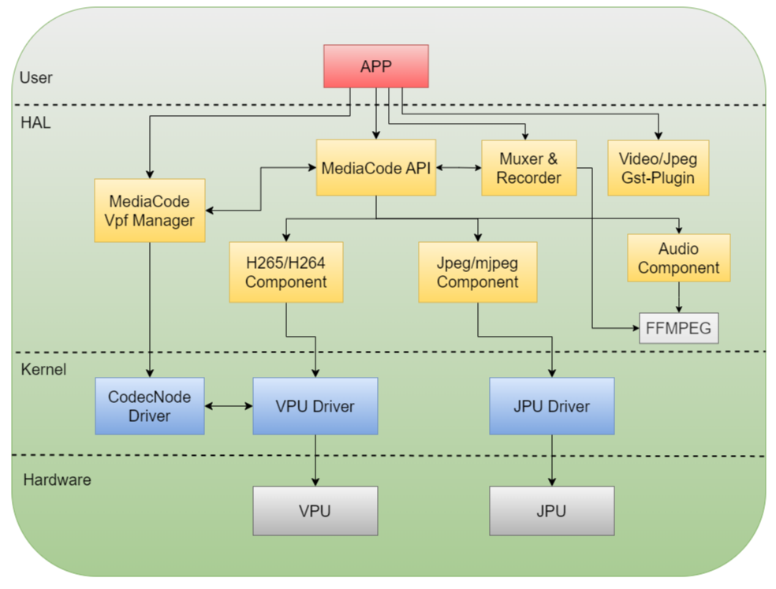

### API手册

### 码率控制模式

MediaCodec支持对H264/H265和MJPEG协议的码率控制，分别支持H264/H265编码通道的CBR、VBR、AVBR、FixQp和QpMap五种码率控制方式，以及支持MJPGE编码通道的FixQp码率控制方式。

#### CBR说明

CBR表示恒定码率，能够保证整体的编码码率稳定。下面是CBR模式下各个参数含义：

| **数据项**          | **描述**                                                                                                                                                                                                                                                       | **取值范围** | **默认值** |
|---------------------|----------------------------------------------------------------------------------------------------------------------------------------------------------------------------------------------------------------------------------------------------------------|--------------|------------|
| intra_period        | I帧间隔                                                                                                                                                                                                                                                        | [0,2047]     | 28         |
| intra_qp            | I帧的QP值                                                                                                                                                                                                                                                      | [0,51]       | 0          |
| bit_rate            | 目标平均比特率，单位是kbps                                                                                                                                                                                                                                     | [0,700000]   | 0          |
| frame_rate          | 目标帧率，单位是fps                                                                                                                                                                                                                                            | [1,240]      | 30         |
| initial_rc_qp       | 指定码率控制时的初始QP值，当该值不在[0,51]范围内,编码器内部会决定初始值                                                                                                                                                                                        | [0,63]       | 63         |
| vbv_buffer_size     | 指定VBV Buffer的大小，单位是ms；实际的VBV buffer的空间大小为bit_rate\*vbv_buffer_size/1000(kb)，该buffer的大小会影响编码图像质量和码率控制精度。当该buffer比较小时，码率控制精确度高，但图像编码质量较差；当该buffer比较大时，图像编码质量高，但是码率波动大。 | [10,3000]    | 10         |
| ctu_level_rc_enalbe | H264/H265的码率控制可以工作在CTU级别的控制，该模式可以达到更高精度的码率控制，但是会损失编码图像质量，该模式不可以和ROI编码一起工作，当使能ROI编码时，该功能自动失效。                                                                                         | [0,1]        | 0          |
| min_qp_I            | I帧的最小QP值                                                                                                                                                                                                                                                  | [0,51]       | 8          |
| max_qp_I            | I帧的最大QP值                                                                                                                                                                                                                                                  | [0,51]       | 51         |
| min_qp_P            | P帧的最小QP值                                                                                                                                                                                                                                                  | [0,51]       | 8          |
| max_qp_P            | P帧的最大QP值                                                                                                                                                                                                                                                  | [0,51]       | 51         |
| min_qp_B            | B帧的最小QP值                                                                                                                                                                                                                                                  | [0,51]       | 8          |
| max_qp_B            | B帧的最大QP值                                                                                                                                                                                                                                                  | [0,51]       | 51         |
| hvs_qp_enable       | H264/H265的码率控制可以工作在subCTU级别的控制，该模式会调整子宏块的QP值，进而提高主观图像质量。                                                                                                                                                                | [0,1]        | 1          |
| hvs_qp_scale        | 当hvs_qp_enable使能后有效，该值表示QP缩放因子。                                                                                                                                                                                                                | [0,4]        | 2          |
| max_delta_qp        | 当hvs_qp_enable使能后有效，指定HVS qp值的最大偏差范围。                                                                                                                                                                                                        | [0,51]       | 10         |
| qp_map_enable       | 使能ROI编码时的QP map                                                                                                                                                                                                                                          | [0,1]        | 0          |

#### VBR说明

VBR表示可变码率，简单场景分配比较大的qp，压缩率小，质量高。复杂场景分配较小qp，可以保证编码图像的质量稳定。下面是VBR模式下各个参数含义：

| **数据项**    | **描述**              | **取值范围** | **默认值** |
|---------------|-----------------------|--------------|------------|
| intra_period  | I帧间隔               | [0,2047]     | 28         |
| intra_qp      | I帧的QP值             | [0,51]       | 0          |
| frame_rate    | 目标帧率，单位是fps   | [1,240]      | 0          |
| qp_map_enable | 使能ROI编码时的QP map | 0,1          | 0          |

#### AVBR说明

ABR表示恒定平均目标码率，简单场景分配较低码率，复杂场景分配足够码率，使得有限的码率能够在不同场景下合理分配，这类似VBR。同时一定时间内，平均码率又接近设置的目标码率，这样可以控制输出文件的大小，这又类似CBR。可以认为是CBR和VBR的折中方案，产生码率和图像质量相对稳定的码流。下面是AVBR模式下各个参数含义：

| **数据项**          | **描述**                                                                                                                                                                                                                                                       | **取值范围** | **默认值** |
|---------------------|----------------------------------------------------------------------------------------------------------------------------------------------------------------------------------------------------------------------------------------------------------------|--------------|------------|
| intra_period        | I帧间隔                                                                                                                                                                                                                                                        | [0,2047]     | 28         |
| intra_qp            | I帧的QP值                                                                                                                                                                                                                                                      | [0,51]       | 0          |
| bit_rate            | 目标平均比特率，单位是kbps                                                                                                                                                                                                                                     | [0,700000]   | 0          |
| frame_rate          | 目标帧率，单位是fps                                                                                                                                                                                                                                            | [1,240]      | 30         |
| initial_rc_qp       | 指定码率控制时的初始QP值，当该值不在[0,51]范围内,编码器内部会决定初始值                                                                                                                                                                                        | [0,63]       | 63         |
| vbv_buffer_size     | 指定VBVBuffer的大小，单位是ms；实际的VBVbuffer的空间大小为bit_rate\*vbv_buffer_size/1000（kb），该buffer的大小会影响编码图像质量和码率控制精度。当该buffer比较小时，码率控制精确度高，但图像编码质量较差；当该buffer比较大时，图像编码质量高，但是码率波动大。 | [10,3000]    | 3000       |
| ctu_level_rc_enalbe | H264/H265的码率控制可以工作在CTU级别的控制，该模式可以达到更高精度的码率控制，但是会损失编码图像质量，该模式不可以和ROI编码一起工作，当使能ROI编码时，该功能自动失效。                                                                                         | [0,1]        | 0          |
| min_qp_I            | I帧的最小QP值                                                                                                                                                                                                                                                  | [0,51]       | 8          |
| max_qp_I            | I帧的最大QP值                                                                                                                                                                                                                                                  | [0,51]       | 51         |
| min_qp_P            | P帧的最小QP值                                                                                                                                                                                                                                                  | [0,51]       | 8          |
| max_qp_P            | P帧的最大QP值                                                                                                                                                                                                                                                  | [0,51]       | 51         |
| min_qp_B            | B帧的最小QP值                                                                                                                                                                                                                                                  | [0,51]       | 8          |
| max_qp_B            | B帧的最大QP值                                                                                                                                                                                                                                                  | [0,51]       | 51         |
| hvs_qp_enable       | H264/H265的码率控制可以工作在subCTU级别的控制，该模式会调整子宏块的QP值，进而提高主观图像质量。                                                                                                                                                                | [0,1]        | 1          |
| hvs_qp_scale        | 当hvs_qp_enable使能后有效，该值表示QP缩放因子。                                                                                                                                                                                                                | [0,4]        | 2          |
| max_delta_qp        | 当hvs_qp_enable使能后有效，指定HVSqp值的最大偏差范围。                                                                                                                                                                                                         | [0,51]       | 10         |
| qp_map_enable       | 使能ROI编码时的QPmap                                                                                                                                                                                                                                           | [0,1]        | 0          |

#### FixQp说明

FixQp表示固定每一个I帧、P帧的QP值，对于I/P帧可以分别设值。下面是FixQp模式下各个参数含义：

| **数据项**   | **描述**            | **取值范围** | **默认值** |
|--------------|---------------------|--------------|------------|
| intra_period | I帧间隔             | [0,2047]     | 28         |
| frame_rate   | 目标帧率，单位是fps | [1,240]      | 30         |
| force_qp_I   | 强制I帧的QP值       | [0,51]       | 0          |
| force_qp_P   | 强制P帧的QP值       | [0,51]       | 0          |
| force_qp_B   | 强制B帧的QP值       | [0,51]       | 0          |

#### QPMAP说明

QPMAP表示为一帧图像中的每一个块指定QP值，其中H265块大小为32x32,H264块大小为16x16。下面是QPMAP模式下各个参数含义：

| **数据项**         | **描述**                                                                                                             | **取值范围**                                                                       | **默认值** |
|--------------------|----------------------------------------------------------------------------------------------------------------------|------------------------------------------------------------------------------------|------------|
| intra_period       | I帧间隔                                                                                                              | [0,2047]                                                                           | 28         |
| frame_rate         | 目标帧率，单位是fps                                                                                                  | [1,240]                                                                            | 30         |
| qp_map_array       | 指定QPmap表，H265的subCTU大小为32x32，需要为每一个subCTU指定一个QP值，每个QP值占一个字节，并且按照光栅扫描方向排序。 | 指针地址                                                                           | NULL       |
| qp_map_array_count | 指定QPmap表的大小。                                                                                                  | [0, MC_VIDEO_MAX_SUB_CTU_NUM]&&(ALIGN64(picWidth)\>\>5)\*(ALIGN64(picHeight)\>\>5) | 0          |

## 调试方法

### 编码效果调优

根据当前客户使用codec进行视频编码的场景，多将码率模式设置为CBR，当编码的场景较为复杂时，为了保证视频质量，硬件会自动提高码率值，导致输出的视频较预期更大。因此为了兼顾视频质量和实际码率，需要统筹bit_rate和max_qp_I/P值的设置。下面给出了全I帧模式下，不同复杂场景下，码率设置为15000kbps时，不同max_qp_I下实际码率和qp的情况（不同场景复杂程度不同，下列数据仅供参考）：

-   只有I帧和B帧；

-   B帧参考1个前向参考帧，一个后向参考帧；

GOP Preset 9

-   只有I帧和P帧；

-   P帧参考1个前向参考帧；

-   低延时；

| 场景&参数                              | 室外白天复杂场景 bitrate(15000) max_qp_I(35) | 室外白天复杂场景 bitrate(15000) max_qp_I(38) | 室外白天复杂场景 bitrate(15000) max_qp_I(39) |
|----------------------------------------|----------------------------------------------|----------------------------------------------|----------------------------------------------|
| Bit alloction(bps)（越大图像质量越高） | 60300045                                     | 42186920                                     | 35898230                                     |
| Qp avg（越小图像质量越高）             | 35                                           | 38                                           | 39                                           |

### GOP结构说明

H264/H265编码支持GOP结构的设置，用户可从预置的3种GOP结构种选择，也可自定义GOP结构。

GOP结构表可定义一组周期性的GOP结构，该GOP结构将用于整个编码过程。单个结构表中的元素如下表所示，其中可以指定该图像的参考帧，如果IDR帧后的其他帧指定的参考帧为IDR帧前的数据帧，编码器内部会自动处理这种情况使其不参考其他帧，用户无需关心这种情况。用户在自定义GOP结构时需要指明结构表的数量，最多可定义3个结构表，结构表的顺序需要按照解码顺序排列。
下面表示了结构表中各个元素的含义：

| 元素           | 描述                                                                                                                                                                                                 |
|----------------|------------------------------------------------------------------------------------------------------------------------------------------------------------------------------------------------------|
| Type           | 帧类型(I、P、B)                                                                                                                                                                                      |
| POC            | GOP内帧的显示顺序，取值范围为[1,gop_size]。                                                                                                                                                          |
| QPoffset       | 自定义GOP中图片的量化参数                                                                                                                                                                            |
| NUM_REF_PIC_L0 | 标记为P帧使用多参考图片，仅在PIC_TYPE为P时有效。                                                                                                                                                     |
| temporal_id    | 帧的时间层，帧无法从具有较高时间 id（0\~6）的帧进行预测。                                                                                                                                            |
| 1st_ref_POC    | L0的第一张参考图片的POC                                                                                                                                                                              |
| 2nd_ref_POC    | Type为B时，第一张参考图片的POC是L1的； Type为P时，第二张参考图片的POC是L0的； 可以使reference_L1和B slice中的参考图片具有相同的POC， 但出于压缩效率的考虑，建议reference_L1和reference_L0的POC不同。 |

#### GOP预置结构

一共支持设置九种GOP预置结构

| 序号 | GOP结构   | 低延迟（编码顺序和显示顺序相同） | GOP大小 | 编码顺序                   | 最小源帧buffer数量 | 最小解码图片buffer数量 | 周期内（I 帧间隔）要求 |
|------|-----------|----------------------------------|---------|----------------------------|--------------------|------------------------|------------------------|
| 1    | I         | Yes                              | 1       | I0-I1-I2…                  | 1                  | 1                      |                        |
| 2    | P         | Yes                              | 1       | P0-P1-P2…                  | 1                  | 2                      |                        |
| 3    | B         | Yes                              | 1       | B0-B1-B2…                  | 1                  | 3                      |                        |
| 4    | BP        | NO                               | 2       | B1-P0-B3-P2…               | 1                  | 3                      |                        |
| 5    | BBBP      | Yes                              | 1       | B2-B1-B3-P0…               | 7                  | 4                      |                        |
| 6    | PPPP      | Yes                              | 4       | P0-P1-P2-P3…               | 1                  | 2                      |                        |
| 7    | BBBB      | Yes                              | 4       | B0-B1-B2-B3…               | 1                  | 3                      |                        |
| 8    | BBBB BBBB | Yes                              | 1       | B3-B2-B4- B1-B6-B5- B7-B0… | 12                 | 5                      |                        |
| 9    | P         | Yes                              | 1       | P0                         | 1                  | 2                      |                        |

GOP Preset 1

-   只有I帧，没有相互参考；

-   低延时；

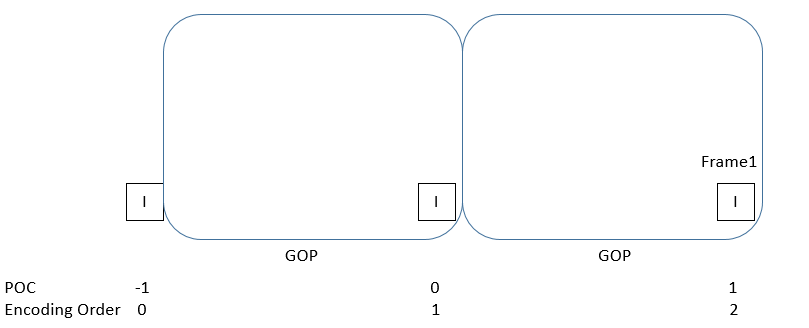

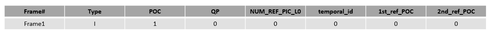

GOP Preset 2

-   只有I帧和P帧；

-   P帧参考2个前向参考帧；

-   低延时；

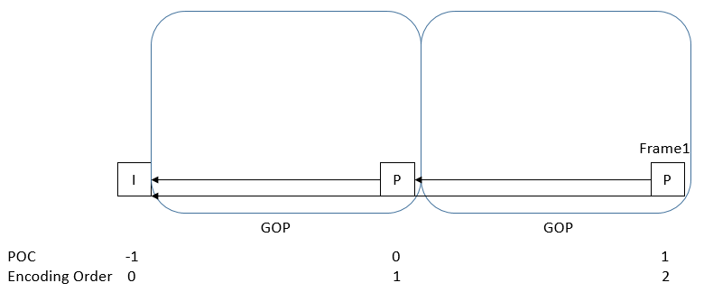


GOP Preset 3

-   只有I帧和B帧；

-   B帧参考2个前向参考帧；

-   低延时；

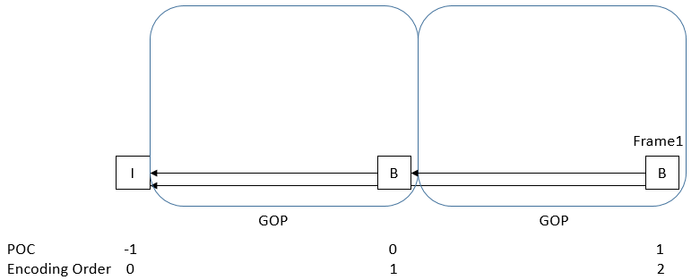


GOP Preset 4

-   只有I帧、P帧和B帧；

-   P帧参考2个前向参考帧；

-   B帧参考1个前向参考帧和一个后向参考帧；

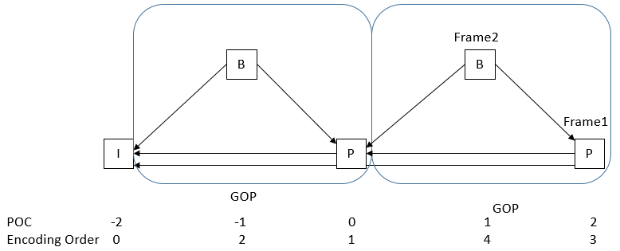

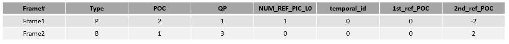

GOP Preset 5

-   只有I帧、P帧和B帧；

-   P帧参考2个前向参考帧；

-   B帧参考1个前向参考帧和一个后向参考帧，后向参考帧可为P帧或B帧；

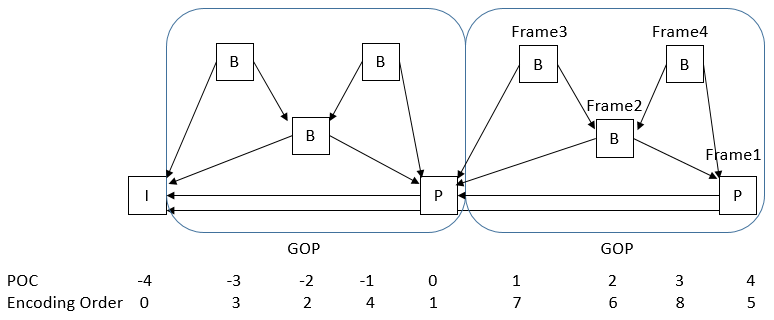

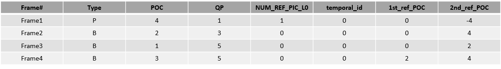

GOP Preset 6

-   只有I帧和P帧；

-   P帧参考2个前向参考帧；

-   低延时；

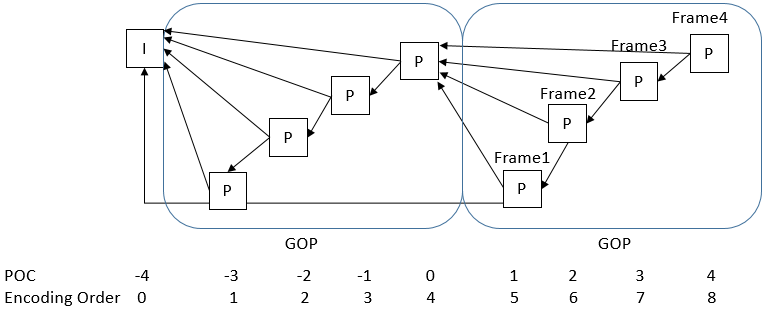

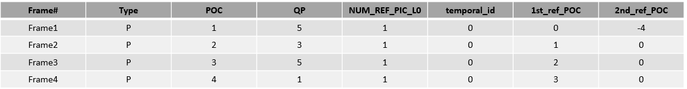

GOP Preset 7

-   只有I帧和B帧；

-   B帧参考2个前向参考帧；

-   低延时；

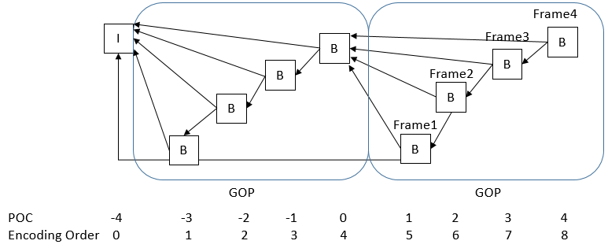

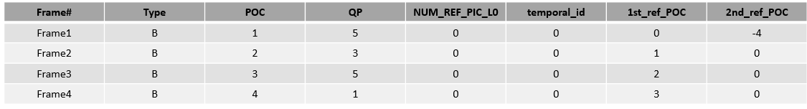

GOP Preset 8

-   只有I帧和B帧；

-   B帧参考1个前向参考帧，一个后向参考帧；

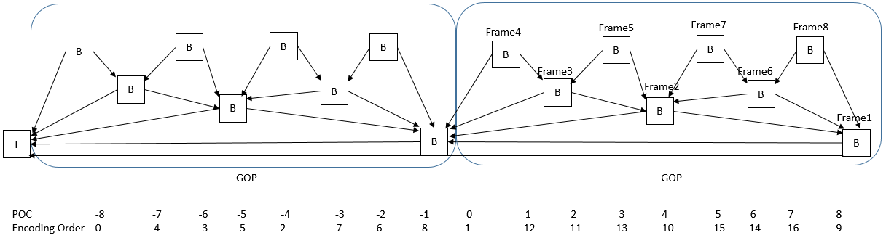

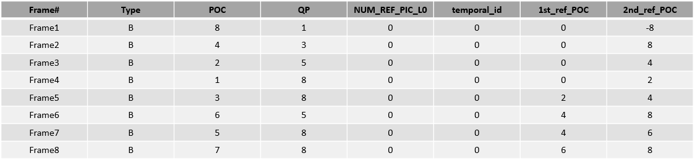

GOP Preset 9

-   只有I帧和P帧；

-   P帧参考1个前向参考帧；

-   低延时；

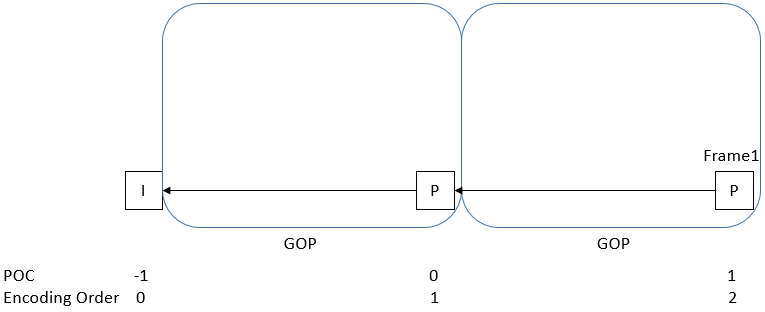


### VPU调试方式

VPU（视频处理单元）是一种专用的视觉处理单元，可以高效处理视频内容。VPU可以实现H265视频格式的编解码处理。用户通过Codec提供的接口即可获得输入的编码/解码流。

#### 编码状态

编码调试信息

```c
cat /sys/kernel/debug/vpu/venc
root@j6dvb:~# cat /sys/kernel/debug/vpu/venc
----encode enc param----
enc_idx  enc_id     profile       level width height pix_fmt fbuf_count extern_buf_flag bsbuf_count bsbuf_size mirror rotate
      0    h265        Main unspecified  4096   2160       0          5               1           5   13271040      0      0

----encode h265cbr param----
enc_idx rc_mode intra_period intra_qp bit_rate frame_rate initial_rc_qp vbv_buffer_size ctu_level_rc_enalbe min_qp_I max_qp_I min_qp_P max_qp_P min_qp_B max_qp_B hvs_qp_enable hvs_qp_scale qp_map_enable max_delta_qp
      0 h265cbr           20       30     5000         30            30            3000                   1        8       50        8       50        8       50             1            2             0           10
----encode gop param----
enc_idx  enc_id gop_preset_idx custom_gop_size decoding_refresh_type
      0    h265              2               0                     2
----encode intra refresh----
enc_idx  enc_id intra_refresh_mode intra_refresh_arg
      0    h265                  0                 0

----encode longterm ref----
enc_idx  enc_id use_longterm longterm_pic_period longterm_pic_using_period
      0    h265            0                   0                         0
----encode roi_params----
enc_idx  enc_id roi_enable roi_map_array_count
      0    h265          0                   0
----encode mode_decision 1----
enc_idx  enc_id mode_decision_enable pu04_delta_rate pu08_delta_rate pu16_delta_rate pu32_delta_rate pu04_intra_planar_delta_rate pu04_intra_dc_delta_rate pu04_intra_angle_delta_rate pu08_intra_planar_delta_rate pu08_intra_dc_delta_rate pu08_intra_angle_delta_rate pu16_intra_planar_delta_rate pu16_intra_dc_delta_rate pu16_intra_angle_delta_rate
      0    h265                    0               0               0               0               0                            0                        0                           0                            0                        0                           0                            0                        0                           0

----encode mode_decision 2----
enc_idx  enc_id pu32_intra_planar_delta_rate pu32_intra_dc_delta_rate pu32_intra_angle_delta_rate cu08_intra_delta_rate cu08_inter_delta_rate cu08_merge_delta_rate cu16_intra_delta_rate cu16_inter_delta_rate cu16_merge_delta_rate cu32_intra_delta_rate cu32_inter_delta_rate cu32_merge_delta_rate
      0    h265                            0                        0                           0                     0                     0                     0                     0                     0                     0                     0                     0                     0
----encode h265_transform----
enc_idx  enc_id chroma_cb_qp_offset chroma_cr_qp_offset user_scaling_list_enable
      0    h265                   0                   0                        0
----encode h265_pred_unit----
enc_idx  enc_id intra_nxn_enable constrained_intra_pred_flag strong_intra_smoothing_enabled_flag max_num_merge
      0    h265                1                           0                                   1             2
----encode h265 timing----
enc_idx  enc_id vui_num_units_in_tick vui_time_scale vui_num_ticks_poc_diff_one_minus1
      0    h265                  1000          30000                                 0
----encode h265 slice params----
enc_idx  enc_id h265_independent_slice_mode h265_independent_slice_arg h265_dependent_slice_mode h265_dependent_slice_arg
      0    h265                           0                          0                         0                        0
----encode h265 deblk filter----
enc_idx  enc_id slice_deblocking_filter_disabled_flag slice_beta_offset_div2 slice_tc_offset_div2 slice_loop_filter_across_slices_enabled_flag
      0    h265                                     0                      0                    0                                            1

----encode h265 sao param----
enc_idx  enc_id sample_adaptive_offset_enabled_flag

      0    h265                              1
----encode status----
enc_idx  enc_id cur_input_buf_cnt cur_output_buf_cnt left_recv_frame left_enc_frame total_input_buf_cnt total_output_buf_cnt     fps
      0    h265                 4                  1               0              0                1093                 1089      35
``` 

参数解释

| 调试信息分组             | 状态参数            | 说明                                                                                                                                                                                                                                                                                                                                                                                                                                                                                                                |
|--------------------------|---------------------|---------------------------------------------------------------------------------------------------------------------------------------------------------------------------------------------------------------------------------------------------------------------------------------------------------------------------------------------------------------------------------------------------------------------------------------------------------------------------------------------------------------------|
| encode enc param         | 基础编码参数        | enc_idx：编码实例值 enc_id：编码类型 profile：profile类型 level：h265 level类型 width：编码宽度 height：编码高度 pix_fmt：输入帧像素类型 fbuf_count：输入的rameBuffer数 extern_buf_flag：是否使用外部输入buffer bsbuf_count：bitstreamBuffer数 bsbuf_size：bitstreamBuffer大小 mirror：是否设置镜像 rotate：是否设置旋转                                                                                                                                                                                            |
| encode h265cbr param     | CBR码率控制参数     | enc_idx：编码实例值 rc_mode：码率控制类型 intra_period：I帧间隔 intra_qp：I帧qp值 bit_rate：码率值 frame_rate：帧率 initial_rc_qp：初始QP值 vbv_buffer_size：VBV buffer的大小 ctu_level_rc_enalbe：码率控制是否工作在ctu级别 min_qp_I：I帧最小QP值 max_qp_I：I帧最大QP值 min_qp_P：P帧最小QP值 max_qp_P：P帧最大QP值 min_qp_B：B帧最小QP值 max_qp_B：B帧最大QP值 hvs_qp_enable：码率控制是否工作在subCTU级别 hvs_qp_scale：QP缩放因子 qp_map_enable：使能ROI编码时的QP map max_delta_qp：指定HVS QP值的最大偏差范围 |
| encode gop param         | GOP参数             | enc_idx：编码实例值 enc_id：编码类型 gop_preset_idx：选择预置的GOP结构 custom_gop_size：自定义时GOP的大小 decoding_refresh_type：设置IDR帧的具体类型                                                                                                                                                                                                                                                                                                                                                                |
| encode intra refresh     | 帧内刷新参数        | enc_idx：编码实例值 enc_id：编码类型 intra_refresh_mode：帧内刷新模式 intra_refresh_arg：帧内刷新参数                                                                                                                                                                                                                                                                                                                                                                                                               |
| encode longterm ref      | 长期参考帧参数      | enc_idx：编码实例值 enc_id：编码类型 use_longterm：使能长期参考帧 longterm_pic_period：长期参考帧周期 longterm_pic_using_period：参考长期参考帧的周期                                                                                                                                                                                                                                                                                                                                                               |
| encode roi_params        | ROI参数             | enc_idx：编码实例值 enc_id：编码类型 roi_enable：使能ROI编码 roi_map_array_count：ROI map中元素的个数                                                                                                                                                                                                                                                                                                                                                                                                               |
| encode mode_decision 1   | 块编码模式决策参数1 | 各种模式选择参数值，包括pu04_delta_rate，pu08_delta_rate等                                                                                                                                                                                                                                                                                                                                                                                                                                                          |
| encode mode_decision 2   | 块编码模式决策参数2 | 各种模式选择参数值，包括pu32_intra_planar_delta_rate， pu32_intra_dc_delta_rate等                                                                                                                                                                                                                                                                                                                                                                                                                                   |
| encode h265_transform    | Transform参数       | enc_idx：编码实例值 enc_id：编码类型 chroma_cb_qp_offset：指定cb分量的QP偏差 chroma_cr_qp_offset：指定cr分量的QP偏差 user_scaling_list_enable：使能用户指定的scaling list                                                                                                                                                                                                                                                                                                                                           |
| encode h265_pred_unit    | 预测单元参数        | enc_idx：编码实例值 enc_id：编码类型 intra_nxn_enable：使能intra NXN PUs constrained_intra_pred_flag：帧内预测是否受限 strong_intra_smoothing_enabled_flag：滤波过程是否使用双向线性插值 max_num_merge：指定merge候选的数量                                                                                                                                                                                                                                                                                         |
| encode h265 timing       | Timing参数          | enc_idx：编码实例值 enc_id：编码类型 vui_num_units_in_tick：指定时间单位数 vui_time_scale：一秒内的时间单位数 vui_num_ticks_poc_diff_one_minus1：指定与等于1的图片顺序计数值之差对应的时钟滴答数                                                                                                                                                                                                                                                                                                                    |
| encode h265 slice params | Slice参数           | enc_idx：编码实例值 enc_id：编码类型 h265_independent_slice_mode：独立slice编码模式 h265_independent_slice_arg：独立slice的大小 h265_dependent_slice_mode：非独立slice编码模式 h265_dependent_slice_arg：非独立slice的大小                                                                                                                                                                                                                                                                                          |
| encode h265 deblk filter | 去块滤波参数        | enc_idx：编码实例值 enc_id：编码类型 slice_deblocking_filter_disabled_flag：是否进行slice内部滤波 slice_beta_offset_div2：指定当前切片的β去块参数偏移量 slice_tc_offset_div2：指定当前切片的tC去块参数偏移量 slice_loop_filter_across_slices_enabled_flag：是否进行边界滤波                                                                                                                                                                                                                                         |
| encode h265 sao param    | SAO参数             | enc_idx：编码实例值 enc_id：编码类型 sample_adaptive_offset_enabled_flag：是否对经过去块滤波处理后的重构图像进行采样自适应偏移处理                                                                                                                                                                                                                                                                                                                                                                                  |
| encode status            | 当前编码状态参数    | enc_idx：编码实例值 enc_id：编码类型 cur_input_buf_cnt：当前使用的inputbuffer数量 cur_output_buf_cnt：当前使用的outputbuffer数量 left_recv_frame：剩余需要接收的帧数（设置receive_frame_number后有效） left_enc_frame：剩余需要编码的帧数（设置receive_frame_number后有效） total_input_buf_cnt：表示当前总使用的inputbuffer数 total_output_buf_cnt：表示当前总使用的outputbuffer数 fps：表示当前的帧率                                                                                                             |

#### 解码状态

解码调试信息

```c
cat /sys/kernel/debug/vpu/vdec
root@j6dvb:~# cat /sys/kernel/debug/vpu/vdec
----decode param----
dec_idx dec_id feed_mode pix_fmt bitstream_buf_size bitstream_buf_count frame_buf_count
   0   h265     1      0     13271040          6   6
----h265 decode param----
dec_idx dec_id reorder_enable skip_mode bandwidth_Opt cra_as_bla dec_temporal_id_mode target_dec_temporal_id_plus1
   0   h265        1          0          1            0        0                      0
----decode frameinfo----
dec_idx dec_id display_width display_height
    0   h265       4096       2160
----decode status----
dec_idx dec_id cur_input_buf_cnt cur_output_buf_cnt total_input_buf_cnt total_output_buf_cnt fps
   0   h265          5                1              458       453         53
```

参数解释

| 调试信息分组      | 状态参数         | 说明                                                                                                                                                                                                                                                                             |
|-------------------|------------------|----------------------------------------------------------------------------------------------------------------------------------------------------------------------------------------------------------------------------------------------------------------------------------|
| decode param      | 基础解码参数     | dec_idx：解码实例值 dec_id：解码类型 feed_mode：数据填充类型 pix_fmt：输出像素类型 bitstream_buf_size：输入的bitstream缓存区大小 bitstream_buf_count：输入的bitstream缓存区个数 frame_buf_count：输出的Framebuffer缓存的个数                                                     |
| h265 decode param | H265解码基础参数 | dec_idx：解码实例值 dec_id：解码类型 reorder_enable：使能解码器按显示顺序输出帧序列 skip_mode：使能帧解码忽略模式 bandwidth_Opt：使能节省带宽模式 cra_as_bla：使能CRA作为BLA处理 dec_temporal_id_mode：指定temporal id的选择模式 target_dec_temporal_id_plus1：指定temporal id值 |
| decode frameinfo  | 解码输出帧信息   | dec_idx：解码实例值 dec_id：解码类型 display_width：显示的宽度 display_height：显示的高度                                                                                                                                                                                        |
| decode status     | 当前解码状态参数 | dec_idx：解码实例值 dec_id：解码类型 cur_input_buf_cnt：当前使用的inputbuffer数量 cur_output_buf_cnt：当前使用的outputbuffer数量 total_input_buf_cnt：当前总使用的inputbuffer数 total_output_buf_cnt：当前总使用的outputbuffer数 fps：当前帧率                                   |

### JPU 调试方式

JPU（图片处理单元）主要用以完成JPEG/MJPEG的编解码功能。用户可以通过CODEC接口输入待编码的YUV数据或待解码的JPEG图片，通过JPU处理后获取编码完的JPEG图片或解码完的YUV数据。

#### 编码状态

编码调试信息

```c
cat /sys/kernel/debug/jpu/jenc
root@j6dvb:~# cat /sys/kernel/debug/jpu/jenc
----encode param----
enc_idx  enc_id width height pix_fmt fbuf_count extern_buf_flag bsbuf_count bsbuf_size mirror rotate
      0    jpeg  1920   1088       1          5               0           5    3137536      0      0

----encode rc param----
enc_idx   rc_mode frame_rate quality_factor
      0 noratecontrol          0              0
----encode status----
enc_idx  enc_id cur_input_buf_cnt cur_output_buf_cnt left_recv_frame left_enc_frame total_input_buf_cnt total_output_buf_cnt     fps
      0    jpeg                 4                  1               0              0                4344                 4340     287
``` 

参数解释

| 调试信息分组    | 状态参数          | 说明                                                                                                                                                                                                                                                                                                                                                                                                    |
|-----------------|-------------------|---------------------------------------------------------------------------------------------------------------------------------------------------------------------------------------------------------------------------------------------------------------------------------------------------------------------------------------------------------------------------------------------------------|
| encode param    | 基础编码参数      | enc_idx：编码实例 enc_id：编码类型 width：图像宽度 height：图像高度 pix_fmt：像素类型 fbuf_count：输入的Framebuffer缓存的个数 extern_buf_flag：是否使用用户分配的输入buffer bsbuf_count：输出的bitstream缓存区个数 bsbuf_size：输出的bitstream的大小 mirror：是否设置镜像 rotate：是否设置旋转                                                                                                          |
| encode rc param | mjpeg码率控制参数 | enc_idx：编码实例 rc_mode：码率控制模式 frame_rate：目标帧率 quality_factor：量化因子                                                                                                                                                                                                                                                                                                                   |
| encode status   | 当前编码状态参数  | enc_idx：编码实例值 enc_id：编码类型 cur_input_buf_cnt：当前使用的inputbuffer数量 cur_output_buf_cnt：当前使用的outputbuffer数量 left_recv_frame：剩余需要接收的帧数（设置receive_frame_number后有效） left_enc_frame：剩余需要编码的帧数（设置receive_frame_number后有效） total_input_buf_cnt：表示当前总使用的inputbuffer数 total_output_buf_cnt：表示当前总使用的outputbuffer数 fps：表示当前的帧率 |

#### 解码状态

解码调试信息

```c 
cat /sys/kernel/debug/jpu/jdec
root@j6dvb:~# cat /sys/kernel/debug/jpu/jdec

----decode param----
dec_idx  dec_id feed_mode pix_fmt bitstream_buf_size bitstream_buf_count frame_buf_count mirror rotate
      0    jpeg         1       1            3133440                   5               5      0      0

----decode frameinfo----
dec_idx  dec_id display_width display_height
      0    jpeg          1920           1088

----decode status----
dec_idx  dec_id cur_input_buf_cnt cur_output_buf_cnt total_input_buf_cnt total_output_buf_cnt     fps
      0    jpeg                 0                  1                3779                 3779     264
```

参数解释

| 调试信息分组     | 状态参数         | 说明                                                                                                                                                                                                                                                 |
|------------------|------------------|------------------------------------------------------------------------------------------------------------------------------------------------------------------------------------------------------------------------------------------------------|
| decode param     | 解码基础参数     | dec_idx：解码实例 dec_id：解码类型 feed_mode： pix_fmt：图像像素 bitstream_buf_size：输入的bitstream缓存区大小 bitstream_buf_count：输入的bitstream缓存区个数 frame_buf_count：输出的Framebuffer缓存的个数 mirror：是否设置镜像 rotate：是否设置旋转 |
| decode frameinfo | 解码输出帧信息   | dec_idx：解码实例值 dec_id：解码类型 display_width：显示的宽度 display_height：显示的高度                                                                                                                                                            |
| decode status    | 当前编码状态参数 | dec_idx：解码实例值 dec_id：解码类型 cur_input_buf_cnt：当前使用的inputbuffer数量 cur_output_buf_cnt：当前使用的outputbuffer数量 total_input_buf_cnt：当前总使用的inputbuffer数 total_output_buf_cnt：当前总使用的outputbuffer数 fps：当前帧率       |

## 典型场景

### 单路编码

单路编码场景如下图所示。Scenario0是简单场景，从EMMC中读取YUV视频/图像文件，经过VPU硬件编码输出的H26x码流或JPU硬件编码输出的Jpeg图像，最后保存为文件存储到EMMC。Scenario1是串联前后级模块的复杂场景，将摄像头采集的数据编码压缩后进行保存或通过网络和PCIE传输。

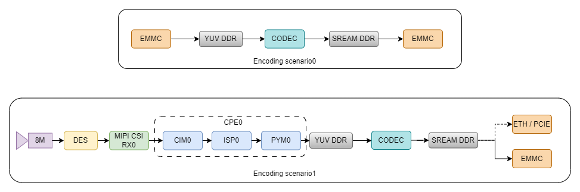

### 单路解码

单路解码场景如下图所示。Scenario0是简单场景，从EMMC中读取H26x码流/Jpeg图像文件，经过VPU或JPU硬件解码输出的YUV数据，最后保存为文件存储到EMMC。Scenario1是串联前后级模块的复杂场景，通过网络或PCIE接收已编码的视频或图像数据，经过VPU或JPU硬件解码后使用IDE显示播放。

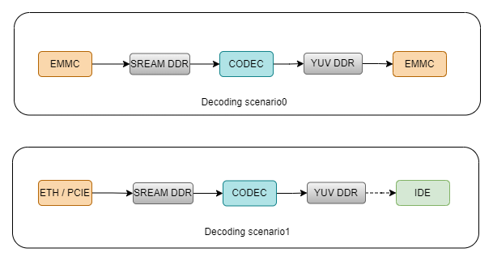

### 多路编码

多路编码场景如下图所示，Scenario0是文件输入的简单场景，Scenario1是串联前后级模块的复杂场景，需要注意的是在Scenario1场景要综合考虑链路中各个模块的能力限制。

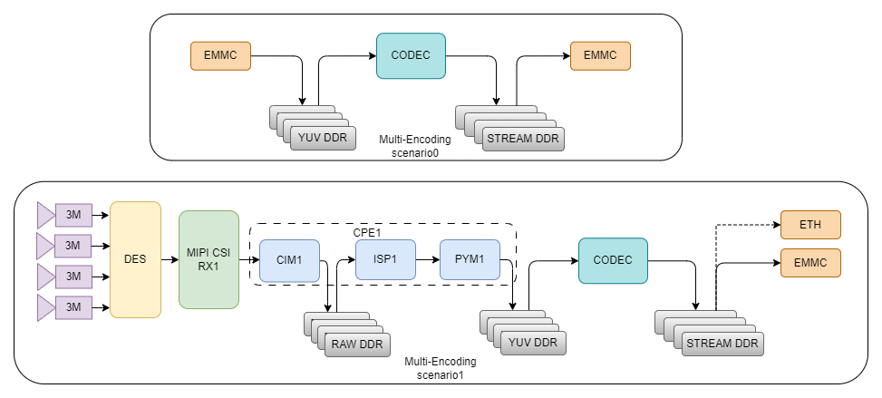

### 多路解码

多路解码场景如下图所示，Scenario0是文件输入的简单场景，Scenario1是串联前后级模块的复杂场景，需要注意的是在Scenario1场景要综合考虑链路中各个模块的能力限制。

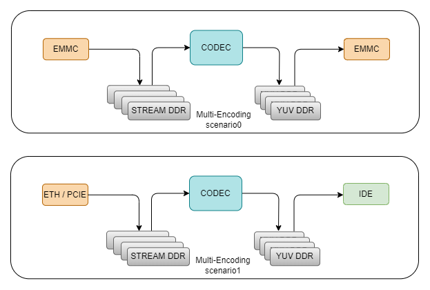
