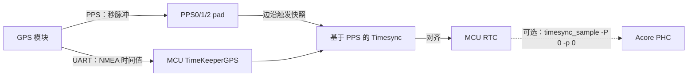

# 时间同步方案

```mdx-code-block
import DocScope from '@site/src/components/DocScope';
```

## 概述

时间同步方案用于把外部时间源（通常是 UTC 时间）引入 RDK S100/S600，并统一 Acore 侧与 MCU 侧各时钟的时间基准。系统中存在多个时间域（timeline），需要对齐的时钟主要有：

- **Acore 侧**：Linux 系统时间（systime）、网卡 PHC（PTP hardware clock）；
- **MCU 侧**：RTC（实时时钟）；
- 各模块打印日志时所用的**全局时间基准（timeline）**：`systime` / `phc` / `rtc`。

本页介绍两种时间同步方案，二者时间源接入位置不同、彼此并列，可按需选择：

- **「时间源接入 Acore 的单时间域方案」**：外部 gPTP 时间先由 Acore 侧 `ptp4l` 同步到网卡 PHC，再逐级同步到 Linux 系统时间与 MCU RTC；
- **「GPS 时间源接入 MCU 的单时间域方案」**：外部 GPS 模块通过 UART（时间值）与 PPS（秒脉冲）接入 MCU，把 MCU RTC 对齐到 GPS 时间。

**适用读者**：模式 3 深度定制开发者——需要集成时间同步（机器人控制、多传感器时间戳对齐等场景）的软件、系统工程师。

**前置条件**：已烧录 RDK OS 并可登录板端；了解 PTP/gPTP、PPS 与 RTC 等基本概念。

**与其他模块关系**：本方案是 Acore 与 MCU 时间对齐的基础；核间通信细节见 [IPC 模块介绍](/Advanced_development/system_software/driver_ipc)，用户态的时钟配置见 [时钟与 RTC 同步](/System_configuration/rtc_ntp)。

## 名词缩写及解释

| 缩写 | 解释 |
|---|---|
| GPS | Global Positioning System |
| RTC | Real-Time Clock |
| PHC | PTP hardware clock |
| PTP | Precision Time Protocol |
| gPTP | generalized Precision Time Protocol |
| MCU | Microcontroller Unit |
| CAN | Controller Area Network |
| PPS | Pulse Per Second |
| NTP | Network Time Protocol |
| NIC | Network Interface Card |

## 默认系统行为

主线默认**未启动时间同步**，各时钟各自独立运行：

- MCU 侧时间同步服务默认关闭，由 `PRODUCT_IMAGE` 宏控制（默认 ptp→RTC 只同步一次，详见 [MCU 时间同步说明](#mcu-时间同步说明)）；
- 全局时间基准默认使用 RTC 时间（`globaltime = <2>`，详见 [全局时间源配置](#全局时间源配置)）；
- 网卡 PHC 在未运行 `ptp4l` 之前只是网卡内部的计数器，没有权威时间基准；
- 默认已有 PPS 输出：MCU RTC PPS、MCU ETH PPS（周期 1 秒）；PPS0 / PPS1 默认配置为接收外部 GPS PPS 输入；PPS2 默认配置为输出（详见 [PPS 说明](#pps-说明)）。

如需开始时间同步，按 [快速上手](#快速上手) 的步骤配置即可。

## 时间同步方案概览

RDK S100/S600 支持以下两种时间同步方案，时间源分别接入 Acore 侧与 MCU 侧：

### 时间源接入 Acore 的单时间域方案

外部 gPTP master 设备作为整个系统的时间源，时间流如下：

1. `ptp4l` 把 gPTP master 的时间同步到 **Acore 侧网卡 PHC**；
2. `phc2sys` 把网卡 PHC 时间同步到 **Linux 系统时间**；
3. `timesync_sample` 通过 PPS 在秒脉冲边沿抓取网卡、RTC 各时钟的快照，计算 offset 后，把网卡时间经 IPC 同步给 **MCU 侧 RTC**。


各组件在本方案中的分工：

| 组件 | 作用 |
|---|---|
| `ptp4l` | 应用端工具，把外部 gPTP master 时间同步到网卡 PHC |
| `phc2sys` | 把网卡 PHC 时间同步到 Linux 系统时间 |
| `timesync_sample` | Acore 侧时间同步程序，把网卡时间经 IPC 同步给 MCU RTC |
| PPS | 在同一个秒脉冲边沿给各时钟打快照，用于计算 offset |
| `hb_systime`（全局时间源） | 决定各模块日志时间戳统一用哪个时钟，本身不改变任何时钟 |

特性说明：

- RTC 支持给 CIM 和 CAN 打硬件时间戳；
- Acore 网卡可以发出 PPS，触发 LPWM 进行曝光同步。

<DocScope products="RDK S600">
S600 的 MCU 侧新增 `TimeKeeperXgmacShadow`：MCU 通过影子寄存器**只读**访问 Acore 侧 xgmac（万兆网卡）的 PHC 时间，用于给 RTC 打快照、对齐；MCU 不能反向更新该时间（`UpdateTime` 为空操作）。
</DocScope>

### GPS 时间源接入 MCU 的单时间域方案

外部 GPS 模块作为时间源，时间直接接入 MCU 侧，时间流如下：

1. GPS 模块通过 **UART** 输出 NMEA 报文（`GNRMC`，含 UTC 时间与日期），由 MCU 的 `TimeKeeperGPS` 解析出**时间值**；
2. GPS 模块输出 **PPS 秒脉冲**，经 PPS0 / PPS1 / PPS2 外部 pad 接入 MCU，作为快照触发源，提供精确的**秒边界**；
3. MCU 的「基于 PPS 的 Timesync」在 PPS 边沿把 **MCU RTC** 与 GPS 时间对齐；
4. 需要时，可再通过 `timesync_sample -P 0 -p 0` 把 MCU RTC 时间反同步给 **Acore PHC**。



该方案依赖 GPS 模块的 **UART（时间数据）+ PPS（秒脉冲）** 两根线接入 MCU，二者缺一不可：UART 提供「现在是哪一秒」，PPS 提供「这一秒精确从哪个边沿开始」。MCU 侧 NMEA 默认走 `NMEA_UART_CH = 2`，S100 对应 UART6、S600 对应 UART10，波特率 921600。

配置要点：RTC 的时间源设为 `TIMEKEEPER_GPS_INDEX`，打开 RTC 与 GPS 两个 TimeKeeper，`TimeSync_PPS_Index` 设为 GPS PPS 对应的源（如 `TIMESYNC_PPS1`），完整配置见 [基于 PPS 的 Timesync](#基于-pps-的-timesync)。

### 代码位置

- Acore 侧 timesync sample：`{sdk_dir}/source/hobot-sp-samples/debian/app/timesync_demo`
- MCU 侧 timesync：`{mcu_dir}/mcu/Service/TimeSync`

## 快速上手

时间同步支持两种方案，二者的硬件连接、MCU 配置、示例指令均不同，请按所选方案操作：

| 方案 | 时间源接入位置 | 硬件连接 | 时间流向 |
|---|---|---|---|
| 方案一：Acore 时间同步 | Acore 侧 | 网线接 Acore 网卡 | gPTP master → 网卡 PHC → 系统时间 → MCU RTC |
| 方案二：MCU 时间同步（GPS） | MCU 侧 | GPS 模块 UART + PPS 两根线 | GPS → MCU RTC（可反同步 Acore PHC） |

前提：已烧录支持 MCU 时间同步服务的 MCU 固件。

### 方案一：Acore 时间同步（时间源接入 Acore）

#### 1. 硬件连接

gPTP master（或 PC）通过网线连接开发板的 Acore 网卡（`eth0`）。

#### 2. 关闭 Linux 自带时间同步服务

```bash
systemctl stop systemd-timesyncd
```

#### 3. 配置 MCU 侧

在 MCU 代码 `Service/TimeSync/src/Hobot_TimeSync.c` 中，把 RTC 的时间源设为 IPC（即从 Acore 经 IPC 获取时间），并打开 RTC 与 IPC 两个 TimeKeeper：

```c
/* Timesync Config Begin */
uint8_t ConfigSource[] = {
    TIMEKEEPER_IPC_INDEX,   // TimeKeeperRTC Source
    TIMEKEEPER_NONE,        // TimeKeeperGPS Source
    TIMEKEEPER_IPC_INDEX,   // TimeKeeperStbmPhc Source
    TIMEKEEPER_NONE,        // TimeKeeperSpi Source
    TIMEKEEPER_NONE,        // TimeKeeperIPC Source
    TIMEKEEPER_NONE,        // TimeKeeperPHC Source
    TIMEKEEPER_NONE         // TimeKeeperGpt Source
};

_Bool EnableTimeKeeper[] = {
    TRUE,
    FALSE,
    FALSE,
    FALSE,
    TRUE,
    FALSE,
    FALSE
};

_Bool Enable_TimeSync_RTC_Once = FALSE;

_Bool Enable_HobotTimesync_Debug = TRUE;
```

注意 `PRODUCT_IMAGE` 宏的影响，详见 [MCU 时间同步说明](#mcu-时间同步说明)。

刷写启动后，在 MCU 侧执行：

```bash
TimeSyncCtrl 4 10
TimeSyncCtrl 6
```

`TimeSyncCtrl 4 10` 指定 PPS 触发源为 MCU ETH PPS，`TimeSyncCtrl 6` 启动 PHC→RTC 时间同步（命令详解见 [MCU 时间同步说明](#mcu-时间同步说明)）。

#### 4. 启动 Acore 侧时间同步

```bash
export LOGLEVEL=15
ptp4l -i eth0 -f /usr/hobot/lib/pkgconfig/automotive-slave.cfg -m -l 7 > ptp4l.log &
phc2sys -s eth0 -c CLOCK_REALTIME --transportSpecific=1 -m --step_threshold=1000 -w > phc2sys.log &
cd /app/timesync_demo/sample_timesync
./timesync_sample -p 0 -P 4 -r
```

关键参数：

- `-p 0`：同步网卡 0 的时间（默认）；
- `-P 4`：Acore 侧监听哪个 PPS 源。`4` 对应 `mcu_eth_sync`（即 MCU ETH PPS，与 MCU 侧 `TimeSyncCtrl 4 10` 配置的源一致）；
- `-r`：把 Acore 网卡时间同步给 MCU RTC。

#### 5. 确认同步成功

- Acore 侧 log 出现 `timesync ipc send data succeed`，表示网卡时间戳已成功发给 MCU；
- MCU 侧 log 出现 `Get Time From Acore success`，表示 MCU 从 Acore 拿时间成功。

各字段含义见 [调试](#调试) 与下文各章节的 log 说明。

### 方案二：MCU 时间同步（GPS 时间源接入 MCU）

#### 1. 硬件连接

- GPS 模块的 **UART**（NMEA 报文，含 UTC 时间）接开发板 MCU 侧 UART：S100 为 UART6、S600 为 UART10，波特率 921600、8N1；
- GPS 模块的 **PPS**（秒脉冲）接开发板 MCU 侧 PPS1 pad（默认；也可接 PPS0 / PPS2，需同步改 `TimeSync_PPS_Index`）。

#### 2. 配置 MCU 侧

在 MCU 代码 `Service/TimeSync/src/Hobot_TimeSync.c` 中，把 RTC 的时间源设为 GPS，打开 RTC 与 GPS 两个 TimeKeeper，并把 PPS 触发源设为 GPS PPS 接入的 pad：

```c
uint8_t ConfigSource[] = {
    TIMEKEEPER_GPS_INDEX,   // TimeKeeperRTC Source
    TIMEKEEPER_NONE,        // TimeKeeperGPS Source
    TIMEKEEPER_NONE,        // TimeKeeperStbmPhc Source
    TIMEKEEPER_NONE,        // TimeKeeperSpi Source
    TIMEKEEPER_NONE,        // TimeKeeperIPC Source
    TIMEKEEPER_NONE,        // TimeKeeperPHC Source
    TIMEKEEPER_NONE         // TimeKeeperGpt Source
};

_Bool EnableTimeKeeper[] = {
    TRUE,                   // TimeKeeperRTC
    TRUE,                   // TimeKeeperGPS
    FALSE,
    FALSE,
    FALSE,
    FALSE,
    FALSE
};

uint8_t TimeSync_PPS_Index = TIMESYNC_PPS1;
```

<DocScope products="RDK S600">
S600 的 `ConfigSource[]` / `EnableTimeKeeper[]` 需在上述基础上多加一项 XgmacShadow（保持 `TIMEKEEPER_NONE` / `FALSE`）补齐，见 [基于 PPS 的 Timesync](#基于-pps-的-timesync)。
</DocScope>

使用外部 GPS PPS（PPS0 / PPS1 / PPS2）时，还需在 `*/target/FreeRtosOsHal/Isr_Hal.c` 中使能对应 PPS 的中断，见 [TimeSyncCtrl 命令](#timesyncctrl-命令)。

#### 3. 启动时间同步服务

GPS 方案**不使用 `TimeSyncCtrl 6`**（该命令强制把 RTC 时间源切回 IPC，仅适用于方案一）。刷写启动后，MCU 侧时间同步服务通过 [上电自启动](#上电自启动) 中的 `Timesync_Init()` 自动运行（免手动命令）；也可运行时执行 `TimeSyncCtrl 4 3` 重新指定 PPS 触发源为 PPS1 并重新初始化时间同步。

#### 4. 确认同步成功

- MCU 侧 log 出现 `GPS time:`（`TimeKeeperGPS` 解析出的 GPS 时间值），表示 GPS 时间读取成功；
- 打开 `Enable_HobotTimesync_Debug`（= `TRUE`）后，MCU 侧 log 出现 `TimeKeeperRTC and TimeKeeperGPS Success.`，表示 MCU RTC 已对齐到 GPS 时间；
- 需要把时间同步给 Acore 时，在 Acore 侧执行 `./timesync_sample -P 0 -p 0`，把 MCU RTC 反同步给 Acore PHC。

### 上电自启动

两种方案如需 MCU 侧时间同步服务上电自动运行（免手动执行 `TimeSyncCtrl`），在 MCU 初始化 task 中加入 `Timesync_Init()`：

```c
TASK(OsTask_SysCore_Startup)
{
  ......
  Timesync_Init();
  ......
}
```

加载 MCU 固件后时间同步服务即自动启动，详见 [PRODUCT_IMAGE 宏](#product_image-宏)。

## 编译

### Acore 编译

板端在安装 `hobot-sp-samples_*.deb` 包后，会包含 `timesync_demo` 源码内容。本 sample 主要依赖 `ipcfhal` 和 `timesync` 提供的 API 头文件：

```c
#include "hb_ipcf_hal.h"
#include "hobot_clock_hal.h"
```

编译依赖的库：

```text
  LIBS := -lhbipcfhal -lhbtimesynchal -lpthread -lalog
```

板端进入 `/app/timesync_demo/sample_timesync` 目录，执行 `make` 即可。

### MCU 编译

MCU 侧编译环境使用 MCU 代码中的 build 工具，详见 [MCU 编译](/Advanced_development/mcu_development/basic_information#开发环境)。编译 FreeRTOS 镜像：

```bash
  # 进入 Build/FreeRtos 目录
  python build_freertos.py lite matrix B s100 gcc debug # 硬件板或者项目名
  python build_freertos.py lite matrix B s600 gcc debug # 硬件板或者项目名
```

## ptp 时间同步

### 功能

`ptp4l` 与 `phc2sys` 是应用端开源时间同步工具（linuxptp 项目）。在本方案中它们只承担同步链的前两步：`ptp4l` 把 gPTP master 的时间同步到网卡 PHC；`phc2sys` 把网卡 PHC 时间同步到 Linux 系统时间。之后由 `timesync_sample` 继续把时间下推到 MCU RTC。

`ptp4l` 支持 gPTP 功能，可以作为 master，也可以作为 slave；作为 slave 时，从 master 获取时间，同步网卡 PHC 时间。

### 综合示例

下面示范如何通过 ptp4l 和 phc2sys，将 master 的网卡时间同步到 slave 的网卡时间和系统时间。用户需要保证 master 设备和 slave 设备之间网络连通。

其中 `automotive-master.cfg` / `automotive-slave.cfg` 是标准 linuxptp automotive profile 配置，已随 hobot 包安装到板端 `/usr/hobot/lib/pkgconfig/` 目录，可用 `cat` 查看。

Master 端执行如下命令:

```text
  ptp4l -i eth0 -f /usr/hobot/lib/pkgconfig/automotive-master.cfg -m -l 7
```

Slave 端执行如下命令:

```text
  ptp4l -i eth0 -f /usr/hobot/lib/pkgconfig/automotive-slave.cfg -m -l 7 > ptp4l.log &
  phc2sys -s eth0 -c CLOCK_REALTIME --transportSpecific=1 -m --step_threshold=1000 -w > phc2sys.log &
```

Slave 端 log:

```text
  ptp4l[8330.884]: PI servo: sync interval 1.000 kp 0.700 ki 0.300000
  ptp4l[8330.885]: master offset 21 s3 freq -391 path delay 690
  ptp4l[8330.998]: port 1: delay timeout
  ptp4l[8330.999]: delay filtered 689 raw 687
  ptp4l[8331.884]: master offset 35 s3 freq -371 path delay 689
  ptp4l[8332.885]: master offset 47 s3 freq -349 path delay 689
  ptp4l[8333.885]: master offset 50 s3 freq -332 path delay 689
  ptp4l[8334.885]: master offset 22 s3 freq -345 path delay 689
```

Master 端 log:

```text
  ptp4l[3469.136]: config item /var/run/ptp4l.inhibit_delay_req is 1
  ptp4l[3469.136]: config item (null).uds_address is '/var/run/ptp4l'
  ptp4l[3469.136]: port 0: INITIALIZING to LISTENING on INIT_COMPLETE
  ptp4l[3469.136]: config item (null).slaveOnly is 0
  ptp4l[3469.136]: port 1: received link status notification
  ptp4l[3469.136]: interface index 2 is up
  ptp4l[3469.261]: port 1: master sync timeout
  ptp4l[3469.386]: port 1: master sync timeout
  ptp4l[3469.511]: port 1: master sync timeout
  ptp4l[3469.636]: port 1: master sync timeout
  ptp4l[3469.761]: port 1: master sync timeout
  ptp4l[3469.886]: port 1: master sync timeout
```

### ptp 时间同步方案

默认支持 P2P 延迟测量机制。E2E 延迟测量机制的版本支持情况如下：

<DocScope products="RDK S100" versions=">= 4.1.0">
S100 4.1.0 及以后版本支持 E2E 延迟测量机制，无需额外操作。
</DocScope>
<DocScope products="RDK S600" versions=">= 5.1.0">
S600 5.1.0 及以后版本支持 E2E 延迟测量机制，无需额外操作。
</DocScope>

<DocScope products="RDK S100" versions="< 4.1.0">
S100 较早版本使用 E2E 延迟测量机制时，ptp4l 报 `received DELAY_REQ without timestamp`。需修改内核驱动 `source/hobot-drivers/ethernet/hobot/hobot_eth_super_ptp.c`，取消强制置位 `PTP_TCR_TSEVNTENA`（只保留 `PTP_TCR_CSC`）：

```diff
diff --git a/ethernet/hobot/hobot_eth_super_ptp.c b/ethernet/hobot/hobot_eth_super_ptp.c
--- a/ethernet/hobot/hobot_eth_super_ptp.c
+++ b/ethernet/hobot/hobot_eth_super_ptp.c
@@ -355,7 +355,7 @@ s32 ptp_set_ts_config(struct net_device *ndev, struct ifreq *ifr)
   } else {
     value = (u32)(PTP_TCR_TSENA|PTP_TCR_TSCFUPDT|PTP_TCR_TSCTRLSSR|(ctr_config.tstamp_all)|(ctr_config.ptp_v2)|(ctr_config.ptp_over_ethernet)| \
       (ctr_config.ptp_over_ipv6_udp)|(ctr_config.ptp_over_ipv4_udp)|(ctr_config.ts_event_en)|(ctr_config.ts_master_en)|(ctr_config.snap_type_sel));
-    value |= (u32)(PTP_TCR_CSC | PTP_TCR_TSEVNTENA);
+    value |= (u32)PTP_TCR_CSC;
     value &= (u32)~PTP_TCR_SNAPTYPSEL_2;
```

修改完成后重新编译内核。
</DocScope>

<DocScope products="RDK S600" versions="< 5.1.1">
S600 较早版本使用 E2E 延迟测量机制时，ptp4l 报 `received DELAY_REQ without timestamp`。需修改内核驱动 `source/hobot-drivers/ethernet/hobot/hobot_eth_super_ptp.c`，取消强制置位 `PTP_TCR_TSEVNTENA`（只保留 `PTP_TCR_CSC`）：

```diff
diff --git a/ethernet/hobot/hobot_eth_super_ptp.c b/ethernet/hobot/hobot_eth_super_ptp.c
--- a/ethernet/hobot/hobot_eth_super_ptp.c
+++ b/ethernet/hobot/hobot_eth_super_ptp.c
@@ -355,7 +355,7 @@ s32 ptp_set_ts_config(struct net_device *ndev, struct ifreq *ifr)
   } else {
     value = (u32)(PTP_TCR_TSENA|PTP_TCR_TSCFUPDT|PTP_TCR_TSCTRLSSR|(ctr_config.tstamp_all)|(ctr_config.ptp_v2)|(ctr_config.ptp_over_ethernet)| \
       (ctr_config.ptp_over_ipv6_udp)|(ctr_config.ptp_over_ipv4_udp)|(ctr_config.ts_event_en)|(ctr_config.ts_master_en)|(ctr_config.snap_type_sel));
-    value |= (u32)(PTP_TCR_CSC | PTP_TCR_TSEVNTENA);
+    value |= (u32)PTP_TCR_CSC;
     value &= (u32)~PTP_TCR_SNAPTYPSEL_2;
```

修改完成后重新编译内核。
</DocScope>

## 全局时间源配置

由于当前系统中存在多个 timeline（systime、phc、rtc 等），而各模块支持选择不同的 timeline 来打印各自的时间戳。为了统一各模块日志中时间戳的 timeline，添加了 `hb_systime` 模块来统一系统各模块 timeline 的选择。

注意：全局时间源配置**只选择基准、不改变任何时钟**。真正改动时钟的是 [ptp 时间同步](#ptp-时间同步) 里的 `ptp4l`/`phc2sys` 和 `timesync_sample`。例如把 timeline 选为 `phc` 时，`phc` 的时间本身由 `ptp4l` 同步而来，否则它没有一个权威时间基准。

该模块解析 dts 里默认的 timeline 配置，如下：

```text
  globaltime: globaltime {
    compatible = "hobot,globaltime";
    globaltime = <2>; /* 0-systime, 1-phc, 2-rtc */
    phc-index = <0>; /* phc index */
    status = "okay";
  };
```

其中 dts 中 globaltime 属性表示系统默认用的全局 timeline，默认使用 RTC 时间。对应关系如下：

```text
  0:systime
  1:phc
  2:rtc
```

如果 timeline 选中网卡 phc 时间，则通过 phc-index 属性进一步判断当前使用哪个网卡 phc 的时间。对应关系如下：

```text
  0:phc0
  1:phc1
```

向应用层提供 /sys 接口用来设置或者获取当前系统全局的 timeline 的选择，命令如下：

查看当前系统全局的 timeline 的配置：

```bash
  cat /sys/devices/platform/soc/soc:globaltime/globaltime
```

设置系统全局 timeline 的选项：

```bash
  echo 0 >/sys/devices/platform/soc/soc:globaltime/globaltime
  或
  echo 1 >/sys/devices/platform/soc/soc:globaltime/globaltime
  或
  echo 2 >/sys/devices/platform/soc/soc:globaltime/globaltime
```

向应用层提供 /sys 接口用来设置或者获取当前选中的 phc 编号：

```bash
  cat /sys/devices/platform/soc/soc:globaltime/phcindex
```

设置 phc 编号：

```bash
  echo 0 >/sys/devices/platform/soc/soc:globaltime/phcindex
  或
  echo 1 >/sys/devices/platform/soc/soc:globaltime/phcindex
```

:::note 注意
phcindex 设置不要超过网卡实际数量。
:::

向内核其他模块提供接口，查看当前系统用的哪个 timeline，以及使用的是哪个 phc，如下：

```c
  int32_t hobot_get_global_time_type(uint32_t *global_time_type);
  int32_t hobot_get_phc_index(uint32_t *phc_index);
```

## PPS 说明{#PPS}

### PPS 在时间同步中的作用

PPS（秒脉冲）在时间同步中的唯一作用是：**在同一个脉冲边沿给各时钟打快照，用来计算各时钟之间的 offset**。完整链路如下：

```text
PPS Source（硬件产生脉冲）
  → Trigger Bus（硬件路由）
  → PPS Target（GIC 中断 / Acore ETH / LPWM / PPS OUT pad）
  → GIC 中断 → hobot-pps 驱动抓系统时间戳 → PPS 子系统
  → /dev/pps*（用户态）/ pps_register_client（内核态）
  → timesync_sample 通过 pps_fetch 阻塞等待 PPS 中断唤醒；以时钟源为基准，取到上升沿到来的 GPS 时间戳、PHC/RTC 的 snapshot 时间，计算误差（offset）后再更新时间
```

`timesync_sample` 的 `-P` 参数就是选择「Acore 侧监听哪个 PPS 源」，其取值与 DTS 里 `hobot-pps` 节点的对应关系为：`0=rtc_sync`、`1=pps_sync0`、`2=pps_sync1`、`3=pps_sync2`、`4=mcu_eth_sync`。所以 [快速上手](#快速上手) 里的 `-P 4` 即监听 MCU ETH PPS，与 MCU 侧 `TimeSyncCtrl 4 10` 配置的源一致。

:::warning
`timesync_sample` 的 `-P` 与 MCU 侧 `TimeSyncCtrl 4` 配置的 PPS 触发源必须一致，否则计算出的 offset 误差会偏大。
:::

### PPS Target

PPS Target 表示被 PPS 触发的对象，用于产生 snapshot 或者 LPWM 波形，目前使用 PPS 触发的对象主要有以下几个：

PPS OUT：PPS2 的管脚复用在当前软件版本上默认是设置为 PPS OUT 的，即可以通过这个 pad 脚将芯片内的 PPS 向外输出到片外；

GIC：当前软件版本默认将 MCU RTC，PPS0，PPS1，PPS2 和 MCU ETH PPS 的中断给到了 GIC。即这些 PPS 源的脉冲边沿会触发 Acore 侧的 GIC 中断，由 `hobot-pps` 驱动抓取系统时间戳；

Acore ETH：Acore ETH 可以接受 PPS 源，并通过 PPS 打自身硬件的 snapshot 时间；

LPWM：LPWM 可以接受 PPS 源输入，并通过 PPS 产生对应的 LPWM 波形；

### PPS Source

<DocScope products="RDK S100">

PPS source 有多个源可选，其中常用的源有以下几个，其它是 reserve 的：

编号0：MCU RTC PPS，是 MCU 侧 RTC 输出的 PPS，当前软件版本默认已有输出，周期1秒1次；

编号2：PPS0，PPS 的 pad，可用于 GPS PPS 等外部 PPS 源输入到芯片内部；

编号3：PPS1，PPS 的 pad，可用于 GPS PPS 等外部 PPS 源输入到芯片内部；

编号4：PPS2，PPS 的 pad，可用于 GPS PPS 等外部 PPS 源输入到芯片内部，也可以用于将内部的 PPS 输出到外部；

编号8：Acore Eth0 PPS， 是 Acore Eth0 产生的 PPS，可以设置灵活的时间周期，比如1秒1次，400毫秒1次等；

编号9：Acore Eth1 PPS， 是 Acore Eth1 产生的 PPS；可以设置灵活的时间周期，比如1秒1次，400毫秒1次等；

编号10：MCU Eth PPS，是 MCU 侧 Eth 输出的 PPS，当前软件版本默认已有输出，周期1秒1次;

</DocScope>
<DocScope products="RDK S600">

PPS source 有多个源可选，其中常用的源有以下几个，其它是 reserve 的：

编号0：MCU RTC PPS，是 MCU 侧 RTC 输出的 PPS，当前软件版本默认已有输出，周期1秒1次；

编号2：PPS0，PPS 的 pad，可用于 GPS PPS 等外部 PPS 源输入到芯片内部；

编号3：PPS1，PPS 的 pad，可用于 GPS PPS 等外部 PPS 源输入到芯片内部；

编号4：PPS2，PPS 的 pad，可用于 GPS PPS 等外部 PPS 源输入到芯片内部，也可以用于将内部的 PPS 输出到外部；

编号8：Acore gmac PPS， 是 Acore gmac（千兆网卡）产生的 PPS，可以设置灵活源为 gmac0、 gmac1 或 gmac2，周期1秒1次。

编号9：Acore xgmac PPS， 是 Acore xgmac（万兆网卡）产生的 PPS；可以设置灵活源为 xgmac0、 xgmac1 或 xgmac2，周期1秒1次。

</DocScope>

### PPS 的 PAD 配置

当前软件版本默认将 PPS0 和 PPS1 设置为了 PPS 的 IN，即用于接收 GPS PPS 等外部 PPS 的输入；把 PPS2 设置为了 PPS 的 OUT，即将芯片的 PPS 输出到外部；
它们的配置均由 MCU 侧的 Port 模块进行了配置，如需要修改，则在 Port 模块中进行修改。

以将 PPS2 pin 脚配置为输出，将芯片 ETH PPS 输出到外部为例说明修改方法：

<DocScope products="RDK S100">
1. 修改 Port 配置的默认 pps_source 为 ETH PPS
```diff
 static const Port_Lld_PpsConfigType PpsConfig =
 {
     (boolean)TRUE,
-    PPS_SOURCE_AON_RTC,
+    PPS_SOURCE_ETH0_PTP,
 };
```
2. 将 pin 脚配置成 PPS_OUT func
```diff
-    {(uint8)2, "PPS_OUT", (boolean)TRUE, {(boolean)TRUE, (boolean)FALSE, (boolean)TRUE, (boolean)TRUE, (boolean)TRUE, GPIO, PORT_PIN_CONFIG_TYPE0, PORT_PULL_NONE, PORT_DRIVE_DEFAULT, PORT_PIN_DIR_OUT, PORT_PIN_LEVEL_HIGH}},
+    {(uint8)2, "PPS_OUT", (boolean)TRUE, {(boolean)TRUE, (boolean)FALSE, (boolean)TRUE, (boolean)TRUE, (boolean)TRUE, PPS_OUT, PORT_PIN_CONFIG_TYPE0, PORT_PULL_NONE, PORT_DRIVE_DEFAULT, PORT_PIN_DIR_OUT, PORT_PIN_LEVEL_HIGH}},
```
以上通过修改`McalCdd/gen_s100_sip_B/Port/src/Port_PBcfg.c`实现，修改完成后更新 MCU 固件即可。
</DocScope>
<DocScope products="RDK S600">
1. 修改 Port 配置的默认 pps_source 为 ETH PPS
```diff
 static const Port_Lld_PpsConfigType PpsConfig =
 {
     (boolean)TRUE,
-    PPS_SOURCE_AON_RTC,
+    PPS_SOURCE_ETH0_PTP,
 };
```
2. S600 上 PIN 脚默认功能即为 PPS OUT FUNC，因此不需要修改。

以上通过修改`McalCdd/gen_s600_md/Port/src/Port_PBcfg.c`实现，修改完成后更新 MCU 固件即可。
</DocScope>

### Acore Eth PPS 介绍{#Acore\_Eth\_PPS}

<DocScope products="RDK S100">
Acore Eth PPS 有两种输出方法，flex mode 和 fix mode 两种。上电默认是 fix mode。可以通过下文中 ethtool 命令设置为 flex mode。若要重置为 fix mode，可以通过重启网卡或者重启系统完成恢复。

flex mode: 灵活的 pps 模式，它的开始/结束时间、周期、占空比均可以灵活配置，其上升沿是整秒时刻，PPS 输出不会随着 PHC 时间的变化而变化；当前软件版本下，其占空比是百分之一，周期可以根据下方配置方法灵活配置，常用的有1s，400ms。

fixed mode: 固定的 pps 模式，它的周期固定，且占空比也固定为46.3129%。PPS 输出会随着 PHC 时间的变化而变化。当前软件版本下，其支持1s 周期，波形的整秒时刻是下降沿，经过536.871ms 的低电平后，再输出463.129ms 的高电平。

整秒输出需求配置方法：

若在 flex mode 下有整秒时刻输出 PPS 的需求，需要在 gptp 时间同步完成后，再配置 PPS 输出；

若在 fixed mode 下有整秒时刻输出 PPS 的需求，需要注意 ETH 的整秒时刻在下降沿出现，而 LPWM 被 ETH 上升沿同步。因此需要参考下图，调整 LPWM 的 offset。以 camera 一秒30帧举例，PPS 上升沿在536.871ms，下降沿在1s 整秒处，要求在整秒位置出图的话，offset=463.129对33.333取余数=29.8ms。


</DocScope>
<DocScope products="RDK S600">

Acore Eth PPS 有两种输出方法，flex mode 和 fix mode 两种。上电默认是 fix mode。可以通过下文中 ethtool 命令设置为 flex mode。若要重置为 fix mode，可以通过重启网卡或者重启系统完成恢复。

flex mode: 灵活的 pps 模式，它的开始/结束时间、周期、占空比均可以灵活配置，其上升沿是整秒时刻，PPS 输出不会随着 PHC 时间的变化而变化；当前软件版本下，其占空比是百分之一，周期可以根据下方配置方法灵活配置，常用的有1s，400ms。

fixed mode: 固定的 pps 模式，它的周期固定，**S600 加入极性反转**，因此占空比固定为53.6871%。PPS 输出会随着 PHC 时间的变化而变化。当前软件版本下，其支持1s 周期，波形的整秒时刻是上升沿，经过536.871ms 的高电平后，再输出463.129ms 的低电平。

整秒输出需求配置方法：

若在 flex mode 下有整秒时刻输出 PPS 的需求，需要在 gptp 时间同步完成后，再配置 PPS 输出；

:::warning
S600 平台具备多个网卡资源。底板对外引出的网卡接口规格为1xGMAC/3xXGMAC，但当前硬件实际支持3xGMAC。目前系统使用的网卡为基地址 0x33110000 的 GMAC；而上电默认 fix mode 输出的 PPS 信号由基地址 0x330f0000 的 GMAC 输出（该 GMAC 已复用于其他功能）。

当业务需要由当前使用的 GMAC 输出 PPS 信号时，请执行以下命令进行配置：

1. timesync_sample 示例代码中新增 timesyncClockGeneratePPS 接口调用，用于根据用户选择的网卡配置产生 ETH PPS 的信号源

2. 不需要启动 timesync_sample 时，用户可执行以下命令进行配置：
``ts2phc -c /dev/ptp[x] -s eth[y] generic --ts2phc.channel 0``

参数说明如下：

eth[y]：根据 ifconfig 输出，确定目标网卡对应的接口编号。

/dev/ptp[x]：根据``ethtool -T eth[y]``输出中的 PTP Hardware Clock: *，选择对应的 PTP 设备编号。

**完成网卡与 PTP 设备的对应关系确认**，再执行 ts2phc，以避免将 PPS 配置到错误的网卡实例。

**以上配置需在时间同步前执行**。
:::

</DocScope>

### Acore Eth PPS 的输出配置方法

<DocScope products="RDK S100">

Acore Eth PPS 的输出，可以借助 ethtool 工具，命令格式如下 :

配置 Eth0 的 PPS 输出1秒的周期：ethtool hobot\_gmac \--set-flex-pps eth0 index 0 fpps on interval 1000000000;

配置 Eth1 的 PPS 输出1秒的周期：ethtool hobot\_gmac \--set-flex-pps eth1 index 0 fpps on interval 1000000000;

如果需要修改输出周期的话，修改最后一个参数\<1000000000\>，该参数的单位是 ns，如果要修改为400ms 的话，则改为\<400000000\>。

</DocScope>
<DocScope products="RDK S600">

Acore Eth PPS 配置为 flex 输出，可以借助 ethtool 工具，命令格式如下：

```bash
ethtool hobot_gmac --set-flex-pps ethX index 0 fpps on interval 1000000000;
```
需要注意的是 ethX 是和硬件 IP 实例对应的，与 ifconfig 命令看到的 ethX 并不一定完全对应，对应关系取决于 dts 对于网卡的配置。

用户可根据``ethtool -T ethX``输出中的 PTP Hardware Clock: *确定当前 X 对应的编号是多少。

当前软件版本默认配置为 fixed mode，固定输出周期为1s。如果需要修改输出周期的话，需要先在内核 dts 中配置选择`hobot,pps = <0>;`切换成 flex mode。然后修改最后一个参数\<1000000000\>，该参数的单位是 ns，如果要修改为400ms 的话，则改为\<400000000\>。

不论是 gmac 还是 xgmac，ethtool 配置的命令格式都是：ethtool hobot_gmac –set-flex-pps eth0 index 0 fpps on interval 1000000000，只有 ethX 和最后一个参数配置有差异。

</DocScope>

### MCU Eth PPS 的配置方法

<DocScope products="RDK S100">

MCU Eth PPS 的信号周期和脉冲宽度在`Config/McalCdd/gen_s100_sip_B_mcu1/Ethernet/src/Mac_Ip_PBcfg.c`配置文件中设置默认值，其中 PpsInterval 的默认值为1000(ms)，参数 PpsWidth 的默认值为10(ms)。

</DocScope>
<DocScope products="RDK S600">

MCU Eth PPS 的信号周期和脉冲宽度在`Config/McalCdd/gen_s600_md_mcu1/Ethernet/src/Mac_Ip_PBcfg.c`配置文件中设置默认值，其中 PpsInterval 的默认值为1000(ms)，参数 PpsWidth 的默认值为10(ms)。

</DocScope>

限制条件：

- 配置项 EthGlobalTimeSupport 需要被使能，默认使能；
- 参数 PpsWidth 的值必须小于 PpsInterval；

配置使能后通过查看 sys 节点 assert 变化确认 PPS 配置是否生效。

```bash
cat /sys/class/pps/pps[4]/assert
```

/sys/class/pps 下包含多个 pps，通过 name 确认哪个 PPS 对应 MCU PPS。

```bash
cat /sys/class/pps/pps[*]/name
```

## MCU 时间同步说明

### MCU 支持的时间类型

- PHC 时间：MCU 网卡内部的一个计时器。

<DocScope products="RDK S600">
- XgmacShadow 时间：S600 特有。MCU 通过影子寄存器**只读**访问 Acore 侧 xgmac（万兆网卡）的 PHC 时间，用于给 RTC 打快照、对齐；MCU 不能反向更新该时间。
</DocScope>

- RTC 时间：MCU 侧带的一个实时时钟，不支持通过纽扣电池供电。

### MCU 支持的时间同步方式

MCU 支持「基于 PPS 的 Timesync」：在秒脉冲上升沿捕捉两个时间的 snapshot，根据 snapshot 计算误差，再根据误差进行时间同步。

### 基于 PPS 的 Timesync

代码目录：`mcu/Service/TimeSync/src/`。

通过修改 `./Service/TimeSync/src/Hobot_TimeSync.c` 中的配置决定使用哪种时间同步方式。配置项含义：

- `ConfigSource[]`：配置每个 TimeKeeper 的时间源。一个时间不需要与其他时间同步时，其时间源配成 `TIMEKEEPER_NONE`；
- `EnableTimeKeeper[]`：配置该时间是否打开；
- `Enable_HobotTimesync_Debug`：是否开启调试打印；
- `TimeSync_PPS_Index`：使用哪个 PPS 进行时间同步。

可用的 TimeKeeper 枚举：

```c
  typedef enum TimeKeeperIndexEnum {
    TIMEKEEPER_RTC_INDEX,
    TIMEKEEPER_GPS_INDEX,
    TIMEKEEPER_STBMPHC_INDEX, //Not Used in S100
    TIMEKEEPER_SPI_INDEX,
    TIMEKEEPER_IPC_INDEX,
    TIMEKEEPER_PHC_INDEX,
    TIMEKEEPER_STBMGPT_INDEX, //Not Used in S100
    TIMEKEEPER_NONE,
    TIMEKEEPER_NUM_MAX,
  } TimeKeeperIndex;
```

<DocScope products="RDK S600">
S600 在此枚举基础上多一个 `TIMEKEEPER_XGMACSHADOW_INDEX`，对应 `TimeKeeperXgmacShadow`（只读影子寄存器访问 Acore xgmac PHC，见上文）。S600 的 `ConfigSource[]` / `EnableTimeKeeper[]` 因此比 S100 多一项。
</DocScope>

可用的 PPS 如下：

```c
  #define TIMESYNC_AON_RTC_PPS 0
  #define TIMESYNC_PPS0 2
  #define TIMESYNC_PPS1 3
  #define TIMESYNC_PPS2 4
  #define TIMESYNC_PCIE0_PTM_PPS 6
  #define TIMESYNC_PCIE1_PTM_PPS 7
  #define TIMESYNC_ACORE_ETH0_PPS 8
  #define TIMESYNC_ACORE_ETH1_PPS 9
  #define TIMESYNC_MCU_ETH0_PPS 10
  #define TIMESYNC_PPS_DISABLE 11
```

两种方案的配置如下：

- 「时间源接入 Acore 的单时间域方案」：见 [快速上手](#快速上手)；
- 「GPS 时间源接入 MCU 的单时间域方案」：S100 配置如下：

```c
uint8_t ConfigSource[] = {
    TIMEKEEPER_GPS_INDEX,   // TimeKeeperRTC Source
    TIMEKEEPER_NONE,        // TimeKeeperGPS Source
    TIMEKEEPER_NONE,        // TimeKeeperStbmPhc Source
    TIMEKEEPER_NONE,        // TimeKeeperSpi Source
    TIMEKEEPER_NONE,        // TimeKeeperIPC Source
    TIMEKEEPER_NONE,        // TimeKeeperPHC Source
    TIMEKEEPER_NONE         // TimeKeeperGpt Source
};

_Bool EnableTimeKeeper[] = {
    TRUE,                   // TimeKeeperRTC
    TRUE,                   // TimeKeeperGPS
    FALSE,
    FALSE,
    FALSE,
    FALSE,
    FALSE
};

uint8_t TimeSync_PPS_Index = TIMESYNC_PPS1;
```

其中 `TimeSync_PPS_Index` 设为 `TIMESYNC_PPS1`（=3），即用 PPS1 pad 接收的外部 GPS PPS 作为触发源；若 GPS PPS 接的是 PPS0 / PPS2，则相应改为 `TIMESYNC_PPS0`（=2）/ `TIMESYNC_PPS2`（=4）。GPS NMEA 默认走 UART Channel 2（S100 为 UART6、S600 为 UART10），如需换通道，修改 `TimeKeeper_GPS.c` 里的 `NMEA_UART_CH`。

<DocScope products="RDK S600">
S600 的 `ConfigSource[]` / `EnableTimeKeeper[]` 需在上述基础上多加一项 XgmacShadow（保持 `TIMEKEEPER_NONE` / `FALSE`）补齐，同 [快速上手](#快速上手) 的说明。
</DocScope>

### TimeSyncCtrl 命令

MCU 侧提供 `TimeSyncCtrl` 命令对时间同步进行运行时配置，命令格式为 `TimeSyncCtrl <cmd> [param]`：

| 命令 | 说明 |
|---|---|
| `TimeSyncCtrl 1` | 打开 MCU 侧时间同步日志打印 |
| `TimeSyncCtrl 2 <目标> <源>` | 配置某个 TimeKeeper 的时间源 |
| `TimeSyncCtrl 3 <目标>` | 关闭某个 TimeKeeper |
| `TimeSyncCtrl 4 <PPS号>` | 设置 PPS 触发源（例如 `4 10` 表示 MCU ETH PPS） |
| `TimeSyncCtrl 5 <0/1>` | 设置 EthTsync_Master_Use_Phc |
| `TimeSyncCtrl 6` | 启动时间同步服务 |

其中 `TimeSyncCtrl 4` 的 `<PPS号>` 与上文 `#define TIMESYNC_*` 列表一致：`0`=MCU RTC、`2`=PPS0、`3`=PPS1、`4`=PPS2、`6`=PCIE0、`7`=PCIE1、`8`=Acore ETH0、`9`=Acore ETH1、`10`=MCU ETH、`11`=关闭。

当 PPS 触发源选择 MCU ETH / MCU RTC 之外的外部源（如 PPS0 / PPS1 / PPS2，对应外部 GPS PPS 输入）时，还需在 MCU 侧使能对应 PPS 的中断：修改 `*/target/FreeRtosOsHal/Isr_Hal.c`，把对应 PPS 的 ISR 项改为 `ENABLE`。

```c
  {Os_IntChannel_Pps_Icu0Isr, Os_Isr_Pps_Icu0Isr, OS_IMASK_FOR_Pps_Icu0Isr/8, ENABLE}, //PPS_IN0
  {Os_IntChannel_Pps_Icu1Isr, Os_Isr_Pps_Icu1Isr, OS_IMASK_FOR_Pps_Icu1Isr/8, ENABLE}, //PPS_IN1
  {Os_IntChannel_Pps_Icu2Isr, Os_Isr_Pps_Icu2Isr, OS_IMASK_FOR_Pps_Icu2Isr/8, ENABLE}, //PPS_IN2
```

放在 mcu0 还是 mcu1 使能，取决于时间同步服务实际跑在哪个核上。

### PRODUCT_IMAGE 宏

MCU 镜像默认定义了 `PRODUCT_IMAGE` 宏，此时 ptp→RTC 默认**只同步一次**（`Enable_TimeSync_RTC_Once = TRUE`）。如果需要 ptp 至 RTC **连续同步**，在 `Hobot_TimeSync.c` 文件开头 `undef PRODUCT_IMAGE` 即可（此时 `Enable_TimeSync_RTC_Once = FALSE`）。

MCU 默认不启动时间同步服务。若需默认启动，除修改上述配置外，还需在初始化流程中增加 `Timesync_Init()` 调用：

```c
TASK(OsTask_SysCore_Startup)
{
  ......
  Timesync_Init();
  ......
}
```

完成以上配置后，加载 MCU 固件即可默认启动时间同步服务，无需再执行 `TimeSyncCtrl` 命令。

## 内核获取时间接口

内核其他模块获取 PHC / RTC / 系统时间的接口如下（以 S100 为例）：

- PHC 时间：`s32 hobot_eth_get_phc_time(osal_time_t *ts);`
- RTC 时间：`void hobot_get_rtc_bintime(struct timespec64 *rtc_bin_time);`
- 系统时间（受时间同步影响）：`void ktime_get_real_ts64(struct timespec64 *tv);`
- MONOTONIC RAW 时间（单调递增，不受时间同步影响）：`void ktime_get_raw_ts64(struct timespec64 *ts);`

注意：RTC 支持给 CIM 和 CAN 打硬件时间戳，CIM 模块获取 RTC 时间建议直接读寄存器。

## 调试

- 查看全局时间基准（timeline）：`cat /sys/devices/platform/soc/soc:globaltime/globaltime`（0=systime、1=phc、2=rtc）。
- 确认 PPS 生效：使能后查看 `/sys/class/pps/pps[*]/assert` 是否变化，并用 `cat /sys/class/pps/pps[*]/name` 确认哪个 pps 对应 MCU PPS。
- MCU 同步成功标志：MCU log 出现 `Get Time From Acore success`。
- Acore 侧 log 关键字段：
  - `snapshot`：MCU 网卡发出 PPS 秒脉冲时各 clock 对应的硬件时间戳；
  - `PPS fetch infobuf time`：Acore 侧 `pps_fetch` 在 PPS 中断里获取的系统时间戳；
  - `timesync ipc send data succeed`：网卡时间戳已成功发给 MCU，时间同步质量在 MCU 侧查看。

MCU 侧 log 示例：

```text
[0162.799758 0]*
[0162.802970 0]RTC snapshot time:1745925071.455114934
[0163.000408 0]Timesync_RecvCallback.
[0163.000661 0]Get Time From Acore success 1745925071 455188935
[0163.001958 0]TimeKeeperRTC and TimeKeeperIPC Offset : - 0s.74001ns
[0163.789774 0]*
```

其中 `TimeKeeperRTC and TimeKeeperIPC Offset` 表示 RTC 使用 IPC 时间同步时的 offset。

## 常见问题

### 执行 ethtool 配置 PPS 输出时报 `bad command line argument(s)`

**原因**：系统自带的 ethtool 版本过旧，不支持 `hobot_gmac` 网卡的 `--set-flex-pps` 参数。

**解决**：升级 ethtool 到新版本后再执行：`sudo apt update && sudo apt install ethtool`。

### ptp4l 同步时报 `received DELAY_REQ without timestamp` 或 `send sync failed`

**原因**：以 E2E 延迟测量机制运行时，较早版本网卡驱动强制置位 `PTP_TCR_TSEVNTENA`，导致 Delay_Req 报文丢失硬件接收时间戳，master 无法回复 delay_resp。

**解决**：升级到 S600 5.1.0 / S100 4.1.0 及以后版本（已修复）。更早版本可自行修改内核驱动后重新编译，见 [ptp 时间同步方案](#ptp-时间同步方案)。临时规避可改用 P2P 延迟测量机制，或使用软件时间戳（ptp4l 加 `-S`）。

### 停止 Acore 时间同步程序后 MCU RTC 时间不再递增

**原因**：符合当前设计。这里「时间不再递增」指的是 **snapshot 时间**（Acore 经 IPC 传给 MCU 的 PHC 快照）：MCU RTC 以该快照为时钟源更新自身时间，Acore 同步程序退出后 IPC 停止，快照冻结在最后一次值。

**解决**：属预期行为。需保持 Acore 侧 `timesync_sample` 持续运行，MCU RTC 才会持续更新。

### 连接外网后 RTC 时间自动与系统时间同步

**原因**：内核使能了 `CONFIG_RTC_SYSTOHC=y`。当系统时间被 NTP 同步更新后，内核会自动把系统时间写回 RTC（约每 11 分钟一次）。

**解决**：属内核预期行为。若需关闭，去掉内核配置里的 `CONFIG_RTC_SYSTOHC` 后重新编译内核。

### 上电启动读到的系统时间是被纠正过的时间

**原因**：systemd 的 init 进程启动时会检查系统时间是否早于镜像构建时间（`/usr/lib/clock-epoch`），若早于则用该时间纠正系统时间。

**解决**：属系统预期行为，无需处理。

### 选择外部 PPS 触发源后时间同步误差偏大

**原因**：`timesync_sample` 的 `-P` 与 MCU 侧 `TimeSyncCtrl 4` 配置的 PPS 触发源不一致；或选了 MCU ETH / RTC 之外的外部源，但未在 MCU 侧使能对应 PPS 中断。

**解决**：确认两侧 PPS 触发源一致；使用 PPS0 / PPS1 / PPS2 等外部源时，在 `*/target/FreeRtosOsHal/Isr_Hal.c` 中使能对应中断（放在哪个核使能，取决于时间同步服务跑在哪个核）。

### ptp4l 报 `timed out while polling for tx timestamp`

**原因**：CPU 负载较高时，`poll` 等待发送报文时间戳的耗时增大，超过默认超时（1ms），导致取发送时间戳超时。

**解决**：适当增大 `tx_timestamp_timeout` 参数（单位 ms，默认 1）。

### ts2phc 报 `PTP_PIN_SETFUNC2 failed: Invalid argument`

**原因**：该报错仅为 warning，不影响运行。PHC 内部引脚编号在驱动里写死为 0，不需要用户空间指定。

**解决**：无需处理，忽略该 warning 即可。

## 相关文档

- [时钟与 RTC 同步](/System_configuration/rtc_ntp)
- [IPC 模块介绍](/Advanced_development/system_software/driver_ipc)
