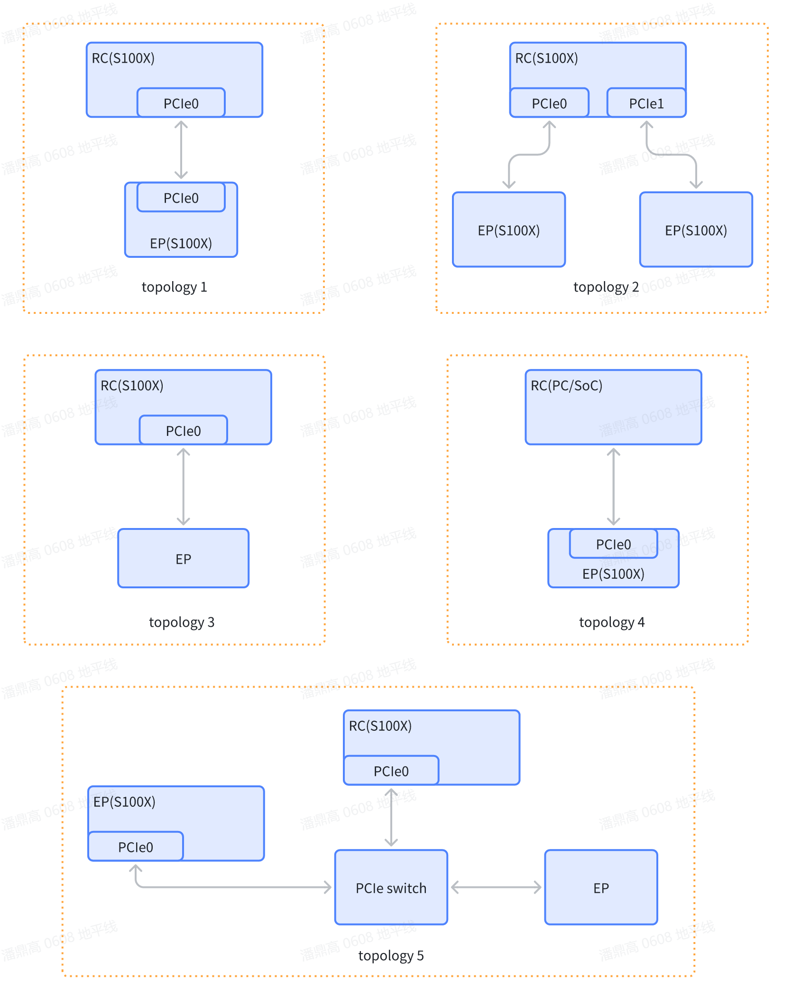

# PCIe 硬件规格以及参考拓扑结构

```mdx-code-block
import DocScope from '@site/src/components/DocScope';
```

## 概述

PCI Express（PCIe）是一种多通道 I/O 互连，提供低引脚数、高可靠性和高速数据传输，用作多个细分市场的通用串行 I/O 互连。

本文介绍 PCIe 控制器的硬件规格与参考拓扑结构，供板级设计与互联方案选型参考。

- **定位**：说明 PCIe 控制器的硬件能力、RC/EP 模式与参考拓扑。
- **适用读者**：需要在 RDK 上规划 PCIe 互联方案的深度定制开发者。
- **前置条件**：了解 RDK 硬件接口分布，参见 [S100 硬件介绍](../../../01_Quick_start/01_hardware_introduction/01_rdk_s100.md)、[S600 硬件介绍](../../../01_Quick_start/01_hardware_introduction/02_rdk_s600.md)。
- **与其他模块关系**：PCIe 与 GMAC 复用 HSI 端口，链路模式决定二者取舍，参见 [PCIe kernel 配置](./03_s100x_pcie_sw_setup.md)。

## PCIe 硬件规格

以下为控制器层面的硬件规格。实际可用的速率与 lane 数受产品链路模式与设备树配置约束，各产品的差异见 [链路配置](./03_s100x_pcie_sw_setup.md#pcie-链路配置)。

- PCIe Gen 4.0 控制器：两个，单 lane 速率最高 16.0Gbps
- 每个控制器都支持配置为 RC 或者 EP 模式，角色选择方式见 [PCIe kernel 配置](./03_s100x_pcie_sw_setup.md)
- 支持 Gen1~Gen4 速率（2.5 / 5.0 / 8.0 / 16.0 GT/s），实际速率由链路训练决定
- EP 模式支持 SR-IOV：1 个 PF + 最多 2 个 VF（驱动支持的 VF 上限）
- 支持 MSI-X（64-entry MSI-X table）
- 支持 SMMU（设备树经 `iommu-map` 绑定 `hsi_smmu`）
- DMA：HDMA 8 读通道 + 8 写通道（`CONFIG_PCIE_ULTRA_EMULATE` 下为 4 + 4）
- 地址转换：32 个 inbound iATU + 48 个 outbound iATU
- 支持 PTM 时间同步
- 支持 AER、FLR、ASPM、Resizable BAR（REBAR）等 PCIe 特性

## 参考 PCIe 总线拓扑

1. **拓扑1**：双开发板直连，一个开发板作为 RC，另一个开发板作为 EP

2. **拓扑2**：三开发板直连，一个开发板作为 RC 同时连接两个开发板 EP

3. **拓扑3**：一个开发板直连另一个第三方的标准 PCIe EP 设备，例如 NVMe SSD 设备

4. **拓扑4**：一个开发板作为 PCIe EP 设备连接到第三方的 RC 设备上，典型的场景是开发板作为 PCIe 加速卡

5. **拓扑5**：多个开发板以及第三方标准 PCIe EP 设备通过 PCIe Switch 连接，其中一个开发板作为 RC，其他设备均为 EP

<DocScope products="RDK S100">

<div style={{ width: '70%', margin: '0 auto' }}>



</div>

各拓扑在本产品上的适用情况：

| 拓扑 | 依据 | 可用性 |
|---|---|---|
| 拓扑1 双板 RC↔EP | 控制器支持 RC/EP 双角色 | 可搭建，链路需自行验证 |
| 拓扑2 一 RC 连双 EP | — | 未验证，设计前请自行确认 |
| 拓扑3 直连第三方 EP | 载板已引出 M.2 Key M 槽（J18） | 可直接接入 NVMe SSD |
| 拓扑4 板作 EP 卡 | 同拓扑1 | 可搭建，链路需自行验证 |
| 拓扑5 外接 Switch 挂多 EP | — | 未验证，设计前请自行确认 |

</DocScope>

<DocScope products="RDK S600">

<div style={{ width: '70%', margin: '0 auto' }}>


</div>

各拓扑在本产品上的适用情况：

| 拓扑 | 依据 | 可用性 |
|---|---|---|
| 拓扑1 双板 RC↔EP | 控制器支持 RC/EP 双角色 | 可搭建，链路需自行验证 |
| 拓扑2 一 RC 连双 EP | — | 未验证，设计前请自行确认 |
| 拓扑3 直连第三方 EP | 载板已引出 M.2 Key M 槽（J6） | 可直接接入 NVMe SSD |
| 拓扑4 板作 EP 卡 | 同拓扑1 | 可搭建，链路需自行验证 |
| 拓扑5 外接 Switch 挂多 EP | — | 未验证，设计前请自行确认 |

</DocScope>

:::warning 注意
本节拓扑为互联方案的参考场景，不代表已在产品上完成端到端验证；据其进行板级设计前请先自行确认。
:::

## 相关文档

- [PCIe 软件架构](./02_s100x_pcie_sw_arch.md)
- [PCIe kernel 配置](./03_s100x_pcie_sw_setup.md)
- [PCIe 用户态 API](./04_s100x_pcie_libhbpciehal.md)
- [Wi-Fi 驱动调试指南](../11_driver_wifi.md)（模组的驱动、内核配置与设备树）
- [S100 硬件介绍](../../../01_Quick_start/01_hardware_introduction/01_rdk_s100.md)
- [S600 硬件介绍](../../../01_Quick_start/01_hardware_introduction/02_rdk_s600.md)
