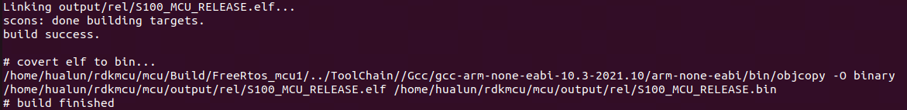

# MCU快速入门指南

## 范围

本章节概述了 RDK-S100 mcu 系统，用于帮助读者快速了解并掌握，以便进行mcu相关开发

## 基础信息

1. MCU编译工具链为GCC工具链，版本为gcc-arm-none-eabi-10.3-2021.10；
2. MCU核为ARM R52+，可以用ARM R52 technical reference manual文档作为参考，请至ARM官网查询；
3. MCU运行的操作系统均为FreeRTOS，版本为FreeRTOS Kernel V10.0.1
4. MCU主要分为两部分：MCU0和MCU1。MCU0主要负责启动Acore以及电源管理等功能，目前不开源；MCU1主要负责跑业务等功能，开源，客户可根据自己需求进行修改。

## 开发环境
交叉编译是指在主机上开发和构建软件，然后把构建的软件部署到开发板上运行。主机一般拥有比开发板更高的性能和更多的内存，可以高效完成代码的构建，可以安装更多的开发工具。

### 主机编译环境要求

推荐使用 Ubuntu 22.04 操作系统，保持和RDK S100相同的系统版本，减少因版本差异产生的依赖问题。

Ubuntu 22.04 系统安装以下软件包：

```c
sudo apt-get install -y build-essential make cmake libpcre3 libpcre3-dev bc bison \
                        flex python3-numpy mtd-utils zlib1g-dev debootstrap \
                        libdata-hexdumper-perl libncurses5-dev zip qemu-user-static \
                        curl repo git liblz4-tool apt-cacher-ng libssl-dev checkpolicy autoconf \
                        android-sdk-libsparse-utils mtools parted dosfstools udev rsync python3-pip scons

pip install scons>=4.0.0
pip install ecdsa
pip install tqdm
```

## 编译MCU系统

1. 编译会使用python3，python3的版本>=3.8；
2. mcu1的镜像分为debug和release两个版本。debug版本的镜像会有调试信息，而release版本不含调试信息。

```c
/* 编译mcu1 */
cd mcu/Build/FreeRtos_mcu1
python build_freertos.py s100_sip_B debug/release

/*
1.首次编译会从arm官网下载一份工具链然后解压缩（10min左右），网速不好可能会存在工具链下载不成功或者工具链下载不完整的问题，可删除已下载的工具链，再多尝试下载几次。
2.如果已有相关工具链，可以将其移至/Build/ToolChain/Gcc/内，当检测到有工具链，就不会从官网下载。
mv 工具链地址/gcc-arm-none-eabi-10.3-2021.10/ 新代码/Build/ToolChain/Gcc/gcc-arm-none-eabi-10.3-2021.10
*/
```

## 编译成功标志



### 编译输出目录

```c
output/
├── dbg                                 # 该文件夹下包含debug版本的编译生成文件
     ├── objs                           # 编译生成的i/s/o文件
     ├── S100_MCU_SIP_V2.0              # 编译生成的bin/map/elf等文件
├── objs                                # 编译生成的i/s/o文件，根据编译的版本变化
├── rel                                 # 该文件夹下包含release版本的编译生成文件
     ├── objs                           # 编译生成的i/s/o文件
     ├── S100_MCU_SIP_V2.0              # 编译生成的bin/map/elf等文件
```
