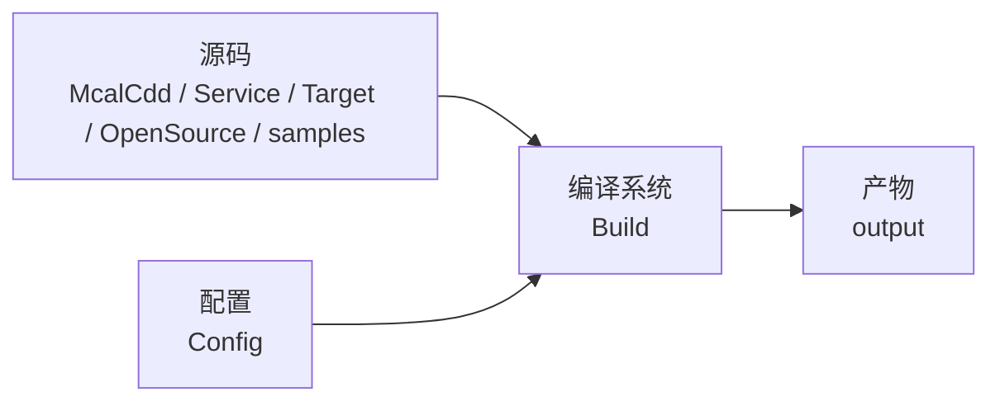

# MCU 代码包结构介绍

## 概述

本文介绍 MCU 代码包（社区版/企业版）的目录结构，帮助用户了解各子目录的作用。

- **定位**：说明 MCU 代码包的目录划分与各子目录作用。
- **适用读者**：需要了解或使用 MCU SDK 的深度定制开发者。
- **前置条件**：了解 MCU 基本框架，参见 [MCU 快速入门指南](01_basic_information.md)。
- **与其他模块关系**：代码包是 [MCU 系统说明](02_MCU_build_system.md) 与 [MCU1 开发指南](03_FreeRTOS_development.md) 的代码载体。

MCU 代码包主要子目录及作用如下：

| 目录 | 作用 |
|---|---|
| Build | 编译系统，包含编译/链接脚本、工具链 |
| Config | 各 board 的 McalCdd 模块配置 |
| McalCdd | 各模块驱动代码（企业版） |
| OpenSource | FreeRTOS 开源代码 |
| samples | 使用样例（Can、IPC、Eth 等） |
| Target | 系统基础代码（启动、任务、中断） |
| Service | 中间服务（电源管理、OTA、Log/Shell 等，企业版） |
| Platform | 平台配置（企业版，可替换） |

## 软件架构



:::info
MCU0固件编译/McalCdd/Service/Platform 等代码为企业版专有，如有需要，请联系[D-Robotics](mailto:developer@d-robotics.cc)获取支持。
:::

:::tip 商业支持
商业版提供更完整的功能支持、更深入的硬件能力开放和专属的定制内容。为确保内容合规、安全交付，我们将通过以下方式开放商业版访问权限。

商业版本获取流程：
1. 填写问卷：提交您的机构信息、使用场景等基本情况
2. 签署保密协议（NDA）：我们将根据提交信息与您联系，双方确认后签署保密协议
3. 内容释放：完成协议签署后，我们将通过私有渠道为您开放商业版本资料
  
如您希望获取商业版内容，请点击下方链接填写问卷，我们将在 3~5 个工作日内与您联系：
[填写问卷](https://horizonrobotics.feishu.cn/share/base/form/shrcnpBby71Y8LlixYF2N3ENbre)
:::

## MCU 社区版

```text
MCU
├── Build                # Build系统，包含编译/链接脚本
├── Config               # 针对各种不同board的McalCdd模块配置
├── Include              # 主要为驱动和Service文件夹内的头文件
├── Library              # 主要为驱动和Service静态库文件
├── log                  # 编译log
├── OpenSource           # FreeRTOS 开源代码仓库
├── output               # 编译/链接生成文件的所在目录
├── samples              # 包含使用样例，包括Can，IPC，Eth等驱动
└── Target               # 系统基础代码，比如启动相关，任务定义相关，中断相关等
```


## MCU 企业版
```text
MCU
├── Build                # Build系统，包含编译/链接脚本
|   ├── FreeRtos         # 用于编译MCU0的固件
|   ├── FreeRtos_mcu1    # 用于编译MCU1的固件
|   ├── ToolChain        # gcc工具链
|   └── Tools            # 编译过程中使用的通用工具
├── Common               # 包含所有MCAL模块所需的通用文件和定义
├── Config               # 针对各种不同board的McalCdd模块配置
├── log                  # 编译log
├── McalCdd              # 各种模块驱动代码
├── OpenSource           # FreeRTOS 开源代码仓库
├── output               # 编译/链接生成文件的所在目录
├── Platform             # 平台配置相关，比如基础数据定义，各个模块的Memmap配置，此部分可以由客户自己替换
|   ├── Compiler         # 平台配置和编译器相关的定义
|   ├── Memmap           # 模块的memmap配置
|   └── Schm             # 模块驱动中可能涉及到exclusive区域定义，可能需要客户选择填充
├── samples              # 包含使用样例，包括Can，IPC，Eth等驱动
├── Service              # 包含 D-Robotics 自研的中间服务代码，比如电源管理，OTA管理，Log/Shell等
└── Target               # 系统基础代码，比如启动相关，任务定义相关，中断相关等
```

## 开发使用

1. **环境搭建**：按 [MCU 快速入门指南](01_basic_information.md) 准备主机编译环境。
2. **编译**：按 [MCU 系统说明](02_MCU_build_system.md) 编译 MCU1 固件。
3. **运行**：将编译产物加载到 MCU 运行，细节见 [MCU1 开发指南](03_FreeRTOS_development.md)。

## 调试

<!-- TODO(Sx): 待收集 -->

## 常见问题

<!-- TODO(Sx): 待收集 -->

## 相关文档

- [MCU 快速入门指南](/Advanced_development/mcu_development/basic_information)
- [MCU1 开发指南](/Advanced_development/mcu_development/FreeRTOS_development)
