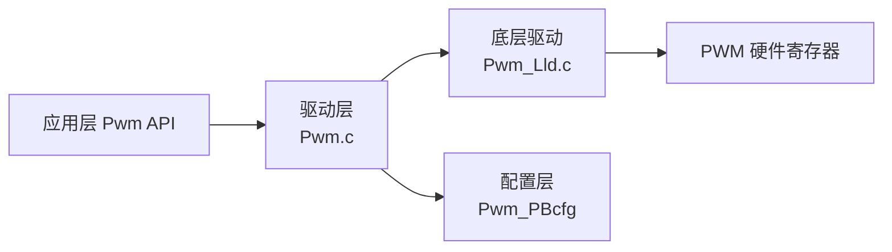

# PWM 使用指南


```mdx-code-block
import DocScope from '@site/src/components/DocScope';
```

## 概述

本文介绍 MCU 侧 PWM 驱动的使用，包括硬件支持、软件架构、重要配置与使用示例。

- **定位**：帮助用户在 MCU 上输出 PWM 或进行输入捕获。
- **适用读者**：需要开发 PWM 输出/输入捕获的深度定制开发者。
- **前置条件**：了解 MCU 基本框架，参见 [MCU 快速入门指南](01_basic_information.md)。
- **与其他模块关系**：部分 PWM 通道与 I2C 等外设存在 PIN 复用，使用前需通过 Port 配置 PIN 功能。

<DocScope products="RDK S100">
S100 SIP MCU 域集成 12 个 PWM 信号（PWM0～PWM11）。MCU 侧 PWM 驱动管理其中 1 个 PWM IP（12 通道，对应 PWM0～PWM11），出厂默认参数基于 `Pwm_PBCfg.c`，默认配置如下：

| 配置项 | 默认值 |
|---|---|
| MCU 域 PWM 信号数 | 12 个（PWM0～PWM11） |
| PWM IP 数量 | 1 个 |
| 每 IP 通道数 | 12 个 |
| 总通道数 | 12 个 |
</DocScope>
<DocScope products="RDK S600">
S600 模组 MCU 域集成 32 个 PWM 信号（PWM0～PWM11、USS_PWM0～USS_PWM18、USS_PWM22），由 3 个 PWM IP 提供。MCU 侧 PWM 驱动管理这 3 个 PWM IP，出厂默认参数基于 `Pwm_PBCfg.c`，默认配置如下：

| 配置项 | 默认值 |
|---|---|
| MCU 域 PWM 信号数 | 32 个（PWM0～PWM11、USS_PWM0～USS_PWM18、USS_PWM22） |
| PWM IP 数量 | 3 个 |
| 每 IP 通道数 | 12 个 |
| 总通道数 | 36 个 |
</DocScope>

## 硬件支持


- 每个通道都是独立的，支持 irq request 和 dma request
- 支持配置两种工作模式，通用工作模式（PWM 脉冲输出），输入捕获模式。
- 每个通道有自己独立的时钟分频寄存器
- 每个 IP 所有通道共享一个中断
- 当目标边沿或者脉冲类型到来的时候，会触发中断或者 dma request
- 支持 DMA 更新 period 和 duty
- 支持周期边沿对齐方式设置，可以设置为边沿对齐或者中心对齐
- 支持针对每个 PWM 通道配置其周期和占空比，需要满足如下限制：
    - 周期配置粒度为 clk_PWM，即 PWM 外设时钟，最大时钟计数值为：4294967295。

各平台的 PWM IP 配置如下（PWM IP 指 MCU 侧 PWM 驱动实际管理的 PWM 控制器实例，总通道数为该 IP 提供的可用通道）：

<DocScope products="RDK S100">

| PWM IP 数量 | 每个 IP 的通道数 | 总通道数 |
|------|------------|----------|
| 1个        | 12个 Channel    | 12个 Channel |

S100 MCU 域的 12 个 PWM 信号（PWM0～PWM11）全部由该 PWM IP 提供，总通道数与物理 PWM 信号数一致。

</DocScope>

<DocScope products="RDK S600">

| PWM IP 数量 | 每个 IP 的通道数 | 总通道数 |
|------|------------|----------|
| 3个        | 12个 Channel    | 36个 Channel |

S600 MCU 域共有 3 个 PWM IP（S600_PWM0/1/2），每个 IP 12 通道，共 36 通道；datasheet 列出的 32 个 PWM 信号（PWM0～PWM11、USS_PWM0～USS_PWM18、USS_PWM22）为引脚级可用信号。

</DocScope>

## 软件架构

PWM 驱动采用分层设计，应用层通过 Pwm API 调用驱动，底层 LLD 直接操作硬件寄存器，配置由 PBCfg 提供。



- 支持 CPU 更新 PWM 通道的周期和占空比
- 支持 DMA 更新 PWM 通道的周期和占空比
- 支持设置开启和关闭 PWM 中断，设置 PWM 通道的中断函数，支持中断类型：上升沿，下降沿，双边沿
- 读取 PWM 输出信号的内部状态并将其返回
- 支持多通道同步输出


## 代码路径

- `Config/McalCdd/gen_xxx/Pwm/src/Pwm_PBCfg.c`：PWM 预编译配置源文件，包含通道和实例的具体配置参数（如周期、占空比、极性等）
- `Config/McalCdd/gen_xxx/Pwm/inc`：预编译配置头文件，定义宏开关
- `McalCdd/Pwm/src/Pwm_Lld.c`：底层驱动实现文件，直接操作硬件寄存器，提供底层接口
- `McalCdd/Pwm/src/Pwm.c`：上层驱动逻辑实现，封装 API 接口，并处理错误检测、状态管理等控制逻辑
- `McalCdd/Pwm/inc/Pwm_Lld.h`：底层驱动头文件，声明底层函数原型、结构体和枚举类型
- `McalCdd/Pwm/inc/Pwm_Types.h`：定义通用数据类型、结构体和回调函数指针类型，供上下层共享使用
- `McalCdd/Pwm/inc/Pwm.h`：主头文件，声明高层 API 和核心结构体
- `samples/Pwm/inc/Pwm_PBCfg.h`：PWM 测试 sample 头文件
- `samples/Pwm/src/Pwm_test.c`：PWM 测试 sample 源文件

## 开发与使用方法

### 重要配置说明

PWM 驱动中的配置源文件是 `Pwm_PBCfg.c`（位于 `Config/McalCdd/gen_<平台>/Pwm/src/`，按平台选择对应目录），支持对每个 channel 单独配置。

<DocScope products="RDK S600">

以下以 S600 的配置为例（出厂配置启用 2 个逻辑通道，对应 PWM0 的 ch4/ch5）。

1. `Pwm_HwChannelConfig_PB` 包含 PWM 的具体硬件配置，部分配置在 pwm 初始化时就会立即生效
```c
static Pwm_Lld_ChannelConfigType Pwm_HwChannelConfig_PB[PWM_HW_CONF_MODS_PB][12] = {
    {
        {
            /**< pwm hardware channel PwmHwChId4 */
            .HwChannelId = PwmHwChId4,
            /**< pwm hardware ip id 0 */
            .HwIpId = 0,
            /**< pwm clear mode */
            .ClearMode = FALSE,
            /**< pwm channel clock ratio*/
            .ClockRatio = 0,
            /**< pwm period*/
            .Period = 9900000,
            /**< pwm polarity*/
            .Polarity = PWM_HIGH,
            /**< pwm duty cycle*/
            .DutyCycle = 4950000,
            /**< pwm edge align mode */
            .EdgeAlign = PWM_LLD_GEN_ALIGN_EDGE,
            /**< pwm edge mode */
            .EdgeMode = PWM_LLD_EDGEMODE_RISING,
            /**< hardware triger mask */
            .HwTrigMask = TRUE,
            /**< pwm hardware triger width*/
            .HwTrigWidth = 0,
            /**< the switch of isr notification*/
            .NotificationEnable = FALSE,
            /**< the callback of isr notification */
            .Notification = NULL_PTR,
            /**< the switch of dma complete notification*/
            .DmaCpltCallbackEnable = FALSE,
            /**< the callback of dma complete notification */
            .DmaCpltCallback = NULL_PTR,
        },
        /* ... */
```

2. `Pwm_Channels_PB` 结构体数组定义了逻辑 PWM 通道与底层硬件通道之间的映射关系; `Pwm_HwChannelConfig_PB`结构体数组定义了每个 PWM 通道的默认硬件参数，如周期、占空比、极性、中断使能等。
```c
#define PWM_CONF_CHANNELS_PB 2


/** @brief Array of configured Pwm channels */
static Pwm_ChannelConfigType Pwm_Channels_PB[PWM_CONF_CHANNELS_PB] = {
    {
        /* @brief Pwm Channel id */
        .ChannelId = 0,
        /* @brief Pwm Channel Class */
        .PwmChannelClass = PWM_VARIABLE_PERIOD,
        /** @brief Pointer to channel pwm hw channel: pwm 0 - ch 4 */
        .LldChannelCfg = &Pwm_HwChannelConfig_PB[0][0],
    },
    {
        /* @brief Pwm Channel id */
        .ChannelId = 1,
        /* @brief Pwm Channel Class */
        .PwmChannelClass = PWM_VARIABLE_PERIOD,
        /** @brief Pointer to channel pwm hw channel: pwm 0 - ch 5 */
        .LldChannelCfg = &Pwm_HwChannelConfig_PB[0][1],
    },
};

/** @brief Array of configured Pwm channels */
const Pwm_ConfigType Pwm_Config = {
    /** @brief Number of configured Pwm ips */
    .NumInstances = PWM_HW_CONF_MODS_PB,
    /** @brief Number of configured Pwm channels */
    .NumChannels = PWM_CONF_CHANNELS_PB,
    /** @brief Pointer to array of Pwm channels */
    .PwmChannelsConfig = Pwm_Channels_PB,
    /** @brief Pointer to array of Pwm LLD IP configurations */
    .PwmLldIpConfig = Pwm_Lld_IpConfig_PB,
};

```

</DocScope>

<DocScope products="RDK S100">

S100 的配置结构体与上例一致，位于 `Config/McalCdd/gen_s100_sip_B_mcu1/Pwm/src/Pwm_PBCfg.c`。出厂配置启用 12 个逻辑通道（`PWM_CONF_CHANNELS_PB` 为 12），对应 PWM0 的 ch0～ch11，默认配置的 `HwChannelId` 从 `PwmHwChId0` 开始。新增或裁剪通道时，修改 `Pwm_Channels_PB` 数组与 `PWM_CONF_CHANNELS_PB` 宏即可。

</DocScope>

### 应用示例


<DocScope products="RDK S100">

#### 使用示例
S100 开发板将 PWM 引出供用户开发学习使用，已引出 PWM Channel 的 PIN 脚位置以及状态如下：

| PWM 通道 | 所属板子                  | 引脚状态/复用              |
|--------|---------------------------|---------------------------|
| pwm0   | MCU 扩展板                 |  与 I2C9 SCL 复用            |
| pwm1   | MCU 扩展板                 |  NONE                     |
| pwm6   | Mainboard 板的 MCU expansion Header | NONE               |
| pwm7   | Mainboard 板的 MCU expansion Header | NONE              |
| pwm10  | MCU 扩展板                 | 与 I2C8 SCL 复用            |
| pwm11  | MCU 扩展板                 | 与 I2C8 SDA 复用            |


`pwmtest`命令用于配置和控制 PWM（脉冲宽度调制）通道。下面是`pwmtest`命令的使用说明和示例。

- 使用方法

设置 PWM 占空比：
```sh
pwmtest <pwm_id> <pwm通道> <周期> <占空比>
```

停止 PWM 输出：
```sh
pwmtest <pwm_id> stop <pwm通道>
```

例如设置 PWM 通道0的周期为1000us，占空比为50%：
```
pwmtest 0 0 0x30d40 0x4000
```

- 参数说明

```sh
<pwm_id>: PWM 硬件 IP 实例 ID。
<pwm通道>: 要配置或停止的PWM通道号。
<周期>: PWM信号的周期。
<占空比>: PWM信号的占空比，必须在0x0000（0%）到0x8000（100%）的范围内。
```

- 周期计算

PWM 周期 = 周期寄存器值 / 时钟源频率

例：输出周期为1000us 的波，pwm 时钟源默认为200MHz，则需要在寄存器中写入 200000000/1000=200000(0x30d40)。


#### Debug Sample

- 使用方法

```bash
pwmdumpregs <pwm_id> <pwm通道>
```

例如 dump pwm channel0的寄存器
```bash
D-Robotics:/$ pwmdumpregs 0 0
[06915.231597 0]INFO: Pwm_RegDump pwm channel:0
[06915.231967 0]INFO: Pwm_RegDump channel 0
ch[0]                              PERIOD 22370000 60000 # 周期
ch[0]                              PERIOD 22370000 48000 # 占空比
ch[0]                            CAP_TIME 22370004 0
ch[0]                            CAP_TIME 22370004 0
ch[0]               PWM_CTRL_REG.MODE_SEL          0
ch[0]          PWM_CTRL_REG.GEN_ALIGN_SEL          0
ch[0]           PWM_CTRL_REG.GEN_POLARITY          0
ch[0]               PWM_CTRL_REG.INT_MASK          1
ch[0]               PWM_CTRL_REG.DMA_MASK          0
ch[0]           PWM_CTRL_REG.HW_TRIG_MASK          1
ch[0]       PWM_CTRL_REG.GLITCH_FILTER_EN          0
ch[0]       PWM_CTRL_REG.GLITCH_THRESHOLD          0
ch[0]          PWM_CTRL_REG.HW_TRIG_WIDTH          0
ch[0]          PWM_CTRL_REG.CLK_DIV_RATIO          0
ch[0]               PWM_CTRL_REG.EDGE_SEL          0
ch[0]        PWM_CTRL_REG.CPU_HALT_ENABLE          0
ch[0]       PWM_CTRL_REG.TIMER_CLEAR_MODE          0
ch[0]           PWM_CTRL_REG.RESERVED_BIT          0
ch[0]                                  EN 2237000c 1
ch[0]                       COMPARE_STATE 22370010 0
ch[0]                           PIN_STATE 22370014 3
ch[0]                   CAP_CNT_THRESHOLD 22370018 1
ch[0]                             CAP_CNT 2237001c 1539
ch[0]                                 EOI 22370024 0
ch[0]                              INT_ST 22370028 0
ch[0]                                 CNT 2237002c 28991
pwm                                  EOIS 22370300 0
pwm                                INT_ST 22370304 0
pwm                            RAW_INT_ST 22370308 1
pwm                              RESERVED 2237030c 0
pwm                              CAP_MISS 22370310 0
pwm                            CLEAR_MODE 22370314 33c
pwm                             SYNC_MODE 22370318 0
pwm                         CFG_LOCK_MODE 2237031c 0
[06915.263883 0]INFO: Pwm_RegDump end

```


</DocScope>
<DocScope products="RDK S600">
S600 开发板将 PWM0 channel4和 PWM0 channel5引出供用户开发学习使用，接口位于 MCU 子板。

#### 使用示例

`pwmtest`命令用于配置和控制 PWM（脉冲宽度调制）通道。下面是`pwmtest`命令的使用说明和示例。

- 使用方法

设置 PWM 占空比：
```sh
pwmtest <pwm_hwipid> <pwm_hwchid> <period> <duty_cycle>
```

停止 PWM 输出：
```sh
pwmtest stop <pwm_hwipid> <pwm_hwchid>
```

**参数说明**  
**pwm_hwipid:** PWM 硬件 IP 实例 ID (0 ~ 2)  
**pwm_hwchid:** PWM 硬件通道 ID (0 ~ 11)  
**period:** PWM 信号周期值，32位数值  
**duty_cycle:** PWM 信号占空比，必须在0x0000（0%）到0x8000（100%）范围内  


例如设置 PWM0通道4，周期为0x600000，占空比为0x4000(50%)：
```shell
D-Robotics:/$ pwmtest 0x0 0x4 0x600000 0x4000
PWM0-CH4 pwm_period = 0x00600000 pwm_dutycycle = 0x4000
Set PWM pin function to PWM0-CH4
```
停止 PWM0通道4的输出
```shell
D-Robotics:/$ pwmtest stop 0x0 0x4
INFO: Stopping PWM0-Ch0004
```


#### Debug Sample

- 使用方法

```bash
pwmdumpregs <pwm_hwipid> <pwm_hwchid>
```

查看 PWM0通道4的寄存器配置
```shell
D-Robotics:/$ pwmdumpregs 0 4
[064961.196947 0]INFO: #####Get Version for Pwm
[064961.197466 0]INFO: Pwm moduleID 121
[064961.197926 0]INFO: Pwm vendorID 196
[064961.198371 0]INFO: Pwm sw_major_version 1
[064961.198885 0]INFO: Pwm sw_minor_version 0
[064961.199395 0]INFO: Pwm sw_patch_version 0
[064961.199906 0]INFO: Pwm_RegDump instance 0 channel 4
[064961.200524 0]ch[4]                              PERIOD 234a00c0 0
[064961.201300 0]ch[4]                              PERIOD 234a00c0 0
[064961.202070 0]ch[4]                            CAP_TIME 234a00c4 0
[064961.202841 0]ch[4]                            CAP_TIME 234a00c4 0
[064961.203632 0]ch[4]               PWM_CTRL_REG.MODE_SEL          0
[064961.204402 0]ch[4]          PWM_CTRL_REG.GEN_ALIGN_SEL          0
[064961.205174 0]ch[4]           PWM_CTRL_REG.GEN_POLARITY          0
[064961.205948 0]ch[4]               PWM_CTRL_REG.INT_MASK          0
[064961.206718 0]ch[4]               PWM_CTRL_REG.DMA_MASK          0
[064961.207491 0]ch[4]           PWM_CTRL_REG.HW_TRIG_MASK          0
[064961.208274 0]ch[4]       PWM_CTRL_REG.GLITCH_FILTER_EN          0
[064961.209049 0]ch[4]       PWM_CTRL_REG.GLITCH_THRESHOLD          0
[064961.209819 0]ch[4]          PWM_CTRL_REG.HW_TRIG_WIDTH          0
[064961.210589 0]ch[4]          PWM_CTRL_REG.CLK_DIV_RATIO          0
[064961.211366 0]ch[4]               PWM_CTRL_REG.EDGE_SEL          0
[064961.212136 0]ch[4]        PWM_CTRL_REG.CPU_HALT_ENABLE          0
[064961.212927 0]ch[4]       PWM_CTRL_REG.TIMER_CLEAR_MODE          0
[064961.213698 0]ch[4]           PWM_CTRL_REG.RESERVED_BIT          0
[064961.214468 0]ch[4]                                  EN 234a00cc 0
[064961.215240 0]ch[4]                       COMPARE_STATE 234a00d0 0
[064961.216014 0]ch[4]                           PIN_STATE 234a00d4 0
[064961.216784 0]ch[4]                   CAP_CNT_THRESHOLD 234a00d8 1
[064961.217557 0]ch[4]                             CAP_CNT 234a00dc 0
[064961.218340 0]ch[4]                                 EOI 234a00e4 0
[064961.219114 0]ch[4]                              INT_ST 234a00e8 0
[064961.219885 0]ch[4]                                 CNT 234a00ec 0
[064961.220659 0]pwm                                  EOIS 234a0300 0
[064961.221432 0]pwm                                INT_ST 234a0304 0
[064961.222202 0]pwm                            RAW_INT_ST 234a0308 0
[064961.222993 0]pwm                              RESERVED 234a030c 0
[064961.223763 0]pwm                              CAP_MISS 234a0310 0
[064961.224534 0]pwm                            CLEAR_MODE 234a0314 fff
[064961.225328 0]pwm                             SYNC_MODE 234a0318 0
[064961.226101 0]pwm                         CFG_LOCK_MODE 234a031c 0
[064961.226872 0]INFO: Pwm_RegDump end

```


</DocScope>


### 应用程序接口

#### Pwm_Init

**【函数原型】**

```c
void Pwm_Init(const Pwm_ConfigType *ConfigPtr);
```

**【功能描述】**

初始化 PWM 驱动。根据 `ConfigPtr` 指向的顶层配置结构体，初始化所有内部变量及微控制器使用的 PWM 硬件结构。应用层调用其它 PWM API 前必须先调用本函数完成初始化。

**【参数】**

| 参数 | 类型 | 必选 | 默认 | 说明 |
|---|---|---|---|---|
| ConfigPtr | `const Pwm_ConfigType *` | 是 | — | 指向 PWM 顶层配置结构体的指针，由 `Pwm_PBCfg.c` 中的 `Pwm_Config` 提供 |

**【返回值】**

无。

#### Pwm_DeInit

**【函数原型】**

```c
void Pwm_DeInit(void);
```

**【功能描述】**

反初始化 PWM 驱动。将 PWM 输出信号置为空闲状态，禁用 PWM 中断和边沿通知。由预编译开关 `PWM_DE_INIT_API` 控制是否编译。

**【参数】**

无。

**【返回值】**

无。

#### Pwm_SetDutyCycle

**【函数原型】**

```c
void Pwm_SetDutyCycle(Pwm_ChannelType ChannelNumber, uint16 DutyCycle);
```

**【功能描述】**

设置指定 PWM 通道的占空比。当占空比为 0% 或 100% 时，按配置的极性设置输出状态；当占空比在 0%~100% 之间时，按周期、占空比和极性调制输出信号。由预编译开关 `PWM_SET_DUTY_CYCLE_API` 控制。

**【参数】**

| 参数 | 类型 | 必选 | 默认 | 说明 |
|---|---|---|---|---|
| ChannelNumber | `Pwm_ChannelType` (uint8) | 是 | — | PWM 逻辑通道 ID，对应 `Pwm_Channels_PB` 中的 `ChannelId` |
| DutyCycle | `uint16` | 是 | — | 占空比值，范围 `0x0000`(0%) ~ `0x8000`(100%) |

**【返回值】**

无。

#### Pwm_SetPeriodAndDuty

**【函数原型】**

```c
void Pwm_SetPeriodAndDuty(Pwm_ChannelType ChannelNumber, Pwm_PeriodType Period, uint16 DutyCycle);
```

**【功能描述】**

同时设置指定 PWM 通道的周期和占空比。适用于 `PWM_VARIABLE_PERIOD` 类型的通道。由预编译开关 `PWM_SET_PERIOD_AND_DUTY_API` 控制。

**【参数】**

| 参数 | 类型 | 必选 | 默认 | 说明 |
|---|---|---|---|---|
| ChannelNumber | `Pwm_ChannelType` (uint8) | 是 | — | PWM 逻辑通道 ID |
| Period | `Pwm_PeriodType` (uint32) | 是 | — | PWM 信号周期值，粒度为 PWM 外设时钟周期 |
| DutyCycle | `uint16` | 是 | — | 占空比值，范围 `0x0000`(0%) ~ `0x8000`(100%) |

**【返回值】**

无。

#### Pwm_SetOutputToIdle

**【函数原型】**

```c
void Pwm_SetOutputToIdle(Pwm_ChannelType ChannelNumber);
```

**【功能描述】**

立即将指定 PWM 通道的输出置为配置的空闲（Idle）状态。由预编译开关 `PWM_SET_OUTPUT_TO_IDLE_API` 控制。

**【参数】**

| 参数 | 类型 | 必选 | 默认 | 说明 |
|---|---|---|---|---|
| ChannelNumber | `Pwm_ChannelType` (uint8) | 是 | — | PWM 逻辑通道 ID |

**【返回值】**

无。

#### Pwm_GetOutputState

**【函数原型】**

```c
Pwm_OutputStateType Pwm_GetOutputState(Pwm_ChannelType ChannelNumber);
```

**【功能描述】**

读取指定 PWM 通道输出信号的内部状态并返回。由预编译开关 `PWM_GET_OUTPUT_STATE_API` 控制。

**【参数】**

| 参数 | 类型 | 必选 | 默认 | 说明 |
|---|---|---|---|---|
| ChannelNumber | `Pwm_ChannelType` (uint8) | 是 | — | PWM 逻辑通道 ID |

**【返回值】**

返回 `Pwm_OutputStateType` 枚举值：
- `PWM_HIGH`(0x00)：PWM 输出为高电平
- `PWM_LOW`(0x01)：PWM 输出为低电平

#### Pwm_DisableNotification

**【函数原型】**

```c
void Pwm_DisableNotification(Pwm_ChannelType ChannelNumber);
```

**【功能描述】**

禁用指定 PWM 通道的边沿通知。由预编译开关 `PWM_NOTIFICATION_SUPPORTED` 控制。

**【参数】**

| 参数 | 类型 | 必选 | 默认 | 说明 |
|---|---|---|---|---|
| ChannelNumber | `Pwm_ChannelType` (uint8) | 是 | — | PWM 逻辑通道 ID |

**【返回值】**

无。

#### Pwm_EnableNotification

**【函数原型】**

```c
void Pwm_EnableNotification(Pwm_ChannelType ChannelNumber, Pwm_EdgeNotificationType Notification);
```

**【功能描述】**

按指定的边沿类型使能指定 PWM 通道的边沿通知。当目标边沿到来时触发已注册的通知回调。由预编译开关 `PWM_NOTIFICATION_SUPPORTED` 控制。

**【参数】**

| 参数 | 类型 | 必选 | 默认 | 说明 |
|---|---|---|---|---|
| ChannelNumber | `Pwm_ChannelType` (uint8) | 是 | — | PWM 逻辑通道 ID |
| Notification | `Pwm_EdgeNotificationType` | 是 | — | 通知边沿类型：`PWM_FALLING_EDGE`(0x0) 下降沿、`PWM_RISING_EDGE`(0x1) 上升沿、`PWM_BOTH_EDGES`(0x2) 双边沿 |

**【返回值】**

无。

#### Pwm_GetVersionInfo

**【函数原型】**

```c
void Pwm_GetVersionInfo(Std_VersionInfoType *versioninfo);
```

**【功能描述】**

返回 PWM 驱动模块的版本信息，包括模块 ID、厂商 ID 及版本号。由预编译开关 `PWM_VERSION_INFO_API` 控制。

**【参数】**

| 参数 | 类型 | 必选 | 默认 | 说明 |
|---|---|---|---|---|
| versioninfo | `Std_VersionInfoType *` | 是 | — | 输出参数，指向存储版本信息的变量 |

**【返回值】**

无（版本信息通过 `versioninfo` 输出参数返回）。

#### Pwm_StartUpdateWithDma

**【函数原型】**

```c
void Pwm_StartUpdateWithDma(Pwm_ChannelType ChannelNumber, Pwm_PeriodDutyCycleType *BufferPtr, uint32 Len);
```

**【功能描述】**

启动指定 PWM 通道的 DMA 方式周期/占空比更新。驱动通过 DMA 将 `BufferPtr` 中的周期与占空比序列依次写入硬件，无需 CPU 逐次干预，适用于需要高频连续更新波形的场景。

**【参数】**

| 参数 | 类型 | 必选 | 默认 | 说明 |
|---|---|---|---|---|
| ChannelNumber | `Pwm_ChannelType` (uint8) | 是 | — | PWM 逻辑通道 ID |
| BufferPtr | `Pwm_PeriodDutyCycleType *` | 是 | — | 指向周期/占空比序列缓冲区的指针，结构体含 `Period`(uint32) 和 `DutyCycle`(uint32) 两个字段 |
| Len | `uint32` | 是 | — | 缓冲区中元素个数 |

**【返回值】**

无。

#### Pwm_StopUpdateWithDma

**【函数原型】**

```c
void Pwm_StopUpdateWithDma(Pwm_ChannelType ChannelNumber);
```

**【功能描述】**

停止指定 PWM 通道的 DMA 方式周期/占空比更新。与 `Pwm_StartUpdateWithDma` 配对使用。

**【参数】**

| 参数 | 类型 | 必选 | 默认 | 说明 |
|---|---|---|---|---|
| ChannelNumber | `Pwm_ChannelType` (uint8) | 是 | — | PWM 逻辑通道 ID |

**【返回值】**

无。

#### Pwm_SetSyncModePeriod

**【函数原型】**

```c
void Pwm_SetSyncModePeriod(uint8 ModuleId, uint32 Period);
```

**【功能描述】**

设置指定 PWM IP（实例）的同步模式周期。同步模式下同一 IP 的所有通道共享该周期，用于多通道同步输出场景。仅 S100/S100P/S300/S600 支持。

**【参数】**

| 参数 | 类型 | 必选 | 默认 | 说明 |
|---|---|---|---|---|
| ModuleId | `uint8` | 是 | — | PWM 硬件 IP 实例 ID（S100: 0；S600: 0~2） |
| Period | `uint32` | 是 | — | 同步模式周期值，粒度为 PWM 外设时钟周期 |

**【返回值】**

无。

#### Pwm_SetSyncModeDutyCycle

**【函数原型】**

```c
void Pwm_SetSyncModeDutyCycle(uint8 ModuleId, uint32 DutyCycles[12]);
```

**【功能描述】**

设置指定 PWM IP 各通道的同步模式占空比。数组每个元素对应一个通道（共 12 个），用于多通道同步输出时单独配置各通道占空比。

**【参数】**

| 参数 | 类型 | 必选 | 默认 | 说明 |
|---|---|---|---|---|
| ModuleId | `uint8` | 是 | — | PWM 硬件 IP 实例 ID |
| DutyCycles | `uint32[12]` | 是 | — | 12 个通道的占空比值数组，每个元素范围 `0x0000`(0%) ~ `0x8000`(100%) |

**【返回值】**

无。

#### Pwm_SetSyncModePeriodAndDuty

**【函数原型】**

```c
void Pwm_SetSyncModePeriodAndDuty(uint8 ModuleId, Pwm_Lld_PeriodType Period, uint32 DutyCycles[12]);
```

**【功能描述】**

同时设置指定 PWM IP 的同步模式周期和各通道占空比。等效于依次调用 `Pwm_SetSyncModePeriod` 和 `Pwm_SetSyncModeDutyCycle`，但保证周期与占空比的原子性更新。

**【参数】**

| 参数 | 类型 | 必选 | 默认 | 说明 |
|---|---|---|---|---|
| ModuleId | `uint8` | 是 | — | PWM 硬件 IP 实例 ID |
| Period | `Pwm_Lld_PeriodType` (uint32) | 是 | — | 同步模式周期值 |
| DutyCycles | `uint32[12]` | 是 | — | 12 个通道的占空比值数组 |

**【返回值】**

无。

#### Pwm_SetSyncModeToIdle

**【函数原型】**

```c
void Pwm_SetSyncModeToIdle(uint8 ModuleId);
```

**【功能描述】**

将指定 PWM IP 的同步模式输出置为空闲状态。用于停止同步输出时统一将所有通道恢复到 Idle。

**【参数】**

| 参数 | 类型 | 必选 | 默认 | 说明 |
|---|---|---|---|---|
| ModuleId | `uint8` | 是 | — | PWM 硬件 IP 实例 ID |

**【返回值】**

无。

## 调试

- **输出验证**：使用 `pwmtest <pwm_id> <通道> <周期> <占空比>` 输出波形，用示波器或逻辑分析仪核对周期与占空比。
- **寄存器核对**：使用 `pwmdumpregs <pwm_id> <通道>` dump 通道寄存器，核对周期、占空比、中断/DMA 掩码等配置。
- **周期换算核对**：核对周期寄存器值与时钟频率的换算关系（周期 = 寄存器值 / 时钟源频率）。

## 常见问题

<!-- TODO(Sx): 待收集 -->

## 相关文档

- [MCU 快速入门指南](01_basic_information.md)
- [MCU Port 配置](12_mcu_port/development_manual.md)
- [PWM 驱动调试指南](/Advanced_development/driver_development/driver_pwm)
- [40pin PWM 示例](/Demos/peripheral/01_40pin/s100/pwm)
- [扩展引脚应用](/Demos/peripheral/40pin)
