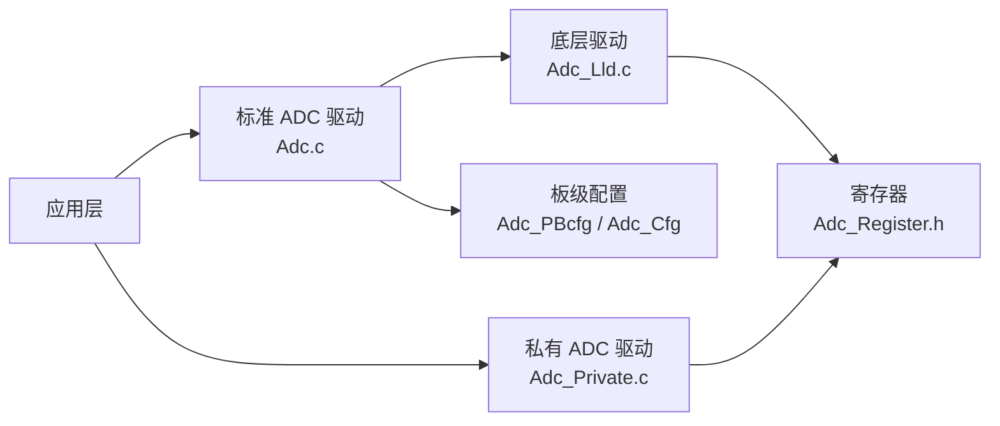

# ADC 使用指南

```mdx-code-block
import DocScope from '@site/src/components/DocScope';
```

## 概述

本文介绍 MCU 侧 ADC 驱动的使用，包括硬件能力、标准/私有两套驱动的差异、软件架构、代码路径与使用示例。

- **定位**：帮助用户在 MCU 上进行 ADC 采样开发。
- **适用读者**：需要开发 ADC 采样功能的深度定制开发者。
- **前置条件**：了解 MCU 基本框架，参见 [MCU 快速入门指南](01_basic_information.md)。
- **与其他模块关系**：ADC 采样值与板卡识别相关，Sample 通过 ADC 通道读取 Board ID 与 DDR 类型；采样前需完成校准，见 [常见问题](#常见问题)。

## 硬件支持

<DocScope products="RDK S100">

| 特性项 | 取值 |
|---|---|
| ADC 硬件数量 | 1 个 |
| 可用外部通道 | 13 路 |
| 引脚名 | `ADC_IO[0]`、`ADC_IO[1]`、`ADC_IO[3]`~`ADC_IO[13]`（无 `ADC_IO[2]`） |
| 分辨率 | 12 bit |
| 电压测量范围 | 100 mV – 1700 mV |

</DocScope>
<DocScope products="RDK S600">

| 特性项 | 取值 |
|---|---|
| ADC 硬件数量 | 2 个（ADC0 / ADC1） |
| 可用外部通道 | 9 路 |
| 引脚名 | `ADC0_IO7`、`ADC1_IO0`~`ADC1_IO7` |
| 分辨率 | 12 bit |
| 电压测量范围 | 100 mV – 1700 mV |

:::note 注意
除上述 9 路外部通道外，另有 3 路板卡 ID 通道（`BOARD_ID4`~`BOARD_ID6`），用于识别底板类型与版本，不作为用户采样通道。
:::

</DocScope>

## 软件驱动

ADC 驱动采用分层设计：应用层可选择标准 ADC 驱动或私有 ADC 驱动，标准驱动经底层 LLD 或板级配置访问寄存器，私有驱动直接操作硬件寄存器。



代码中实际上存在着两套 ADC 驱动，区别如下

- 标准 ADC 驱动（Main ADC Driver）
    - 位于 McalCdd/Adc 目录下, 包含完整的 ADC 模块实现，文件包括 Adc.h、Adc.c、Adc_Lld.h、Adc_Lld.c 等
    - 提供完整的 ADC 功能

- 私有 ADC 驱动（Private ADC Driver）
    - 位于 McalCdd/Adc 目录下，包含 Adc_Private.h 和 Adc_Private.c
    - 提供特定于内部使用的简化接口

### 使用流程

- 标准 ADC 驱动的一般使用流程：
    ```c
    // 1. 初始化 ADC 模块
    Adc_Init(NULL_PTR);
    // 2. 设置结果缓冲区
    Adc_SetupResultBuffer(AdcGroup_0, dataBuffer);
    // 3. 启动转换
    Adc_StartGroupConversion(AdcGroup_0);
    // 4. 读取结果
    Adc_ReadGroup(AdcGroup_0, dataBuffer);
    // 5. 停止转换
    Adc_StopGroupConversion(AdcGroup_0);
    // 6. 反初始化
    Adc_DeInit();
    ```

- 私有 ADC 驱动使用流程：
    ```c
    // 1. 初始化ADC硬件
    Adc_Private_Init(0);
    // 2. 读取特定通道结果
    Adc_Private_ReadChannelResult(0, channel, &result);
    // 3. 反初始化
    Adc_Private_DeInit(0);
    ```

### 主要区别

| 特性         | 标准 ADC 驱动                              | 私有 ADC 驱动                          |
|--------------|----------------------------------------|-------------------------------------|
| 复杂度       | 完整的 ADC 驱动实现，功能丰富              | 简化的接口，功能有限         |
| 配置方式     | 使用完整的配置结构体（包括 Adc_GroupsCfg） | 直接操作硬件寄存器         |
| API 丰富度    | 提供完整的 ADC 功能 API                     | 只提供最基本的初始化和读取功能   |
| 中断支持     | 完整的中断和回调机制                     | 不使用中断                 |
| 转换模式     | 单次转换和多次转换                  | 仅支持单次转换                  |
| 触发模式     | 硬件触发和软件触发                  | 仅支持软件触发                  |
| 阈值检查     | 软件阈值检查和硬件阈值检查                    |  不支持阈值检查                   |
| 是否支持注入转换      | 支持注入转换和正常转换                 |  仅支持正常转换                  |
| 错误处理     | 完整的错误检测和报告机制                  | 简单的错误处理                  |


## 代码路径

```bash
# Driver source code:
McalCdd/Adc/inc/Adc.h                        # 公共 API 接口
McalCdd/Adc/inc/Adc_Lld.h                    # 底层硬件操作函数声明
McalCdd/Adc/inc/Adc_Private.h                # 私有结构、宏和函数声明
McalCdd/Adc/src/Adc.c                        # 公共 API 实现
McalCdd/Adc/src/Adc_Lld.c                    # 底层硬件操作实现，直接配置寄存器
McalCdd/Adc/src/Adc_Private.c                # 私有函数实现
McalCdd/Common/Register/inc/Adc_Register.h   # 寄存器地址与位域定义
Platform/Schm/SchM_Adc.h                     # 访问权限与资源保护

# Board configuration source code (gen_xxxx 见下方说明):
Config/McalCdd/gen_xxxx/Adc/inc/Adc_Cfg.h
Config/McalCdd/gen_xxxx/Adc/inc/Adc_PBcfg.h
Config/McalCdd/gen_xxxx/Adc/src/Adc_PBcfg.c
```

<DocScope products="RDK S100">
上述 `gen_xxxx` 为 `gen_s100_sip_B_mcu1`（MCU1 侧）或 `gen_s100_sip_B`（MCU0 侧）。

Sample 代码：

```bash
samples/Adc/S100/src/Adc_Cmd.c                    # 单次采样，基于 Adc_Private 实现
samples/Adc/S100/src/Adc_SoftTrigerContinuous.c  # 连续采样，基于标准驱动实现
```
</DocScope>
<DocScope products="RDK S600">
上述 `gen_xxxx` 为 `gen_s600_md_mcu1`（MCU1 侧）或 `gen_s600_md`（MCU0 侧）。

Sample 代码：

```bash
samples/Adc/S600/src/Adc_Cmd.c    # 单次采样，基于 Adc_Private 实现
samples/Adc/S600/src/Adc_Test.c   # 连续采样，基于标准驱动实现
```
</DocScope>

## 应用 sample


<DocScope products="RDK S100">

### ADC 软件触发单次转换应用

`Adc_Test` 应用用于对设备执行 ADC 单次采样测试，通过 Adc_Private 的实现，能够读取特定通道或多个通道的 ADC 值，获取这些值并以原始值和毫伏 (mv) 格式显示结果。


#### 使用示例


- 语法

```bash
Adc_Test [instance] [ch_num]
```

`instance`、`ch_num` 需成对提供（指定采样通道）；全部省略时扫描所有通道。仅提供部分参数时命令打印用法提示，不执行采样。

- 示例

参数不完整时打印用法提示（`Adc_Test 1` 仅提供了 1 个参数）：
```bash
D-Robotics:/$ Adc_Test 1
[0514.648277 0]--------------Adc_PrivateApiTest start-----------!
[0514.648841 0]Usage: Adc_Test [instance] [ch_num]
[0514.649405 0]       Adc_Test (scan all channels)
```


扫描所有通道（不带参数）：

```bash
D-Robotics:/$ Adc_Test
[0521.273588 0]--------------Adc_PrivateApiTest start-----------!
[0521.274154 0]ADC0x9
[0521.289699 0]AdcCurrentValue Instance[0] Channel[0]: 1115 -> 490 mv
[0521.290302 0]BoradIdMsb code: 6!
[0521.290691 0]
[0521.290885 0]AdcCurrentValue Instance[0] Channel[1]: 2392 -> 1051 mv
[0521.291658 0]BoradIdLsb code: 10!
[0521.292058 0]
[0521.292252 0]AdcCurrentValue Instance[0] Channel[2]: 1752 -> 770 mv
[0521.293014 0]DDR TYPE code: 8!
[0521.293382 0]
[0521.293576 0]AdcCurrentValue Instance[0] Channel[3]: 1717 -> 754 mv
[0521.294338 0]
[0521.294531 0]AdcCurrentValue Instance[0] Channel[4]: 1102 -> 484 mv
[0521.295293 0]
[0521.295486 0]AdcCurrentValue Instance[0] Channel[5]: 2086 -> 916 mv
[0521.296247 0]
[0521.296440 0]AdcCurrentValue Instance[0] Channel[6]: 2138 -> 939 mv
[0521.297202 0]
[0521.297395 0]AdcCurrentValue Instance[0] Channel[7]: 2031 -> 892 mv
[0521.298157 0]
[0521.298350 0]AdcCurrentValue Instance[0] Channel[8]: 2138 -> 939 mv
[0521.299112 0]
[0521.299305 0]AdcCurrentValue Instance[0] Channel[9]: 2148 -> 944 mv
[0521.300067 0]
[0521.300260 0]AdcCurrentValue Instance[0] Channel[10]: 2121 -> 932 mv
[0521.301032 0]
[0521.301225 0]AdcCurrentValue Instance[0] Channel[11]: 2159 -> 949 mv
[0521.301998 0]
[0521.302191 0]AdcCurrentValue Instance[0] Channel[12]: 2038 -> 895 mv
[0521.302964 0]
[0521.303157 0]AdcCurrentValue Instance[0] Channel[13]: 2139 -> 940 mv
[0521.303929 0]
[0521.304112 0]PASS.
[0521.304351 0]--------------Adc_PrivateApiTest end!-----------

```

其中 Channel 0~2 的采样值用于识别扩展板信息，分别打印 `BoradIdMsb`、`BoradIdLsb` 与 `DDR TYPE` 的编码值。

</DocScope>
<DocScope products="RDK S600">

### ADC Private API 测试

private API 属于 oneshot API，用于测试 ADC 驱动。

#### 使用示例


- 语法

```bash
Adc_Test [instance] [ch_num]
```

**instance:** ADC 实例编号（必需）
**ch_num:** ADC 通道编号（必需）


- 示例

```bash
# 测试 ADC0 通道 0
D-Robotics:/$ Adc_Test 0 0
[085232.675058 0]Adc[0] channel[0] adcvalue:2478 voltage:1088mv

# 测试 ADC0 通道 1
D-Robotics:/$ Adc_Test 0 1
[085268.763903 0]Adc[0] channel[1] adcvalue:590 voltage:259mv

# 测试 ADC0 通道 2
D-Robotics:/$ Adc_Test 0 2
[085276.004467 0]Adc[0] channel[2] adcvalue:1046 voltage:459mv
```


</DocScope>

### ADC 软件触发连续转换应用

ADC 软件触发连续采样的应用基于标准 ADC 驱动实现。其特点为自动重复转换：完成一次转换后立即开始下一次转换，无需额外触发。该模式适用于需要持续监控信号的场景；由于持续工作，功耗相对较高。


#### 关键配置

连续采样需要将转换模式配置为 `ADC_CONV_MODE_CONTINUOUS`，并通过通知函数在每轮转换完成时通知上层。

<DocScope products="RDK S100">
编辑 `Config/McalCdd/gen_s100_sip_B_mcu1/Adc/src/Adc_PBcfg.c`：

```c
static const Adc_GroupCfg Adc_GroupsCfg[] =
{
    /**< @brief Group0 -- Logical Unit Id 0 -- Hardware Unit ADC0 */
    {
        /**< @brief Index of group */
        0U, /* GroupId */
        /**< @brief ADC Logical Unit Id that the group belongs to */
        (uint8)0, /* UnitId */
        /**< @brief Access mode */
        ADC_ACCESS_MODE_SINGLE, /* AccessMode */
        /**< @brief Conversion mode */
        ADC_CONV_MODE_CONTINUOUS, /* Mode */  // 使用连续转换方式
        /**< @brief Conversion type */
        ADC_NORMAL_CONV, /* Type */ // 可选择正常转换或注入转换
#if (ADC_PRIORITY_IMPLEMENTATION != ADC_PRIORITY_NONE)
        /**< @brief Priority configured */
        (Adc_GroupPriorityType)ADC_GROUP_PRIORITY(0), /* Priority */
#endif /* (ADC_PRIORITY_IMPLEMENTATION != ADC_PRIORITY_NONE) */
        /**< @brief Trigger source configured */
        ADC_TRIGG_SRC_SW, /* TriggerSource */  // 软件触发
#if (STD_ON == ADC_HW_TRIGGER_API)
        /**< @brief Hardware trigger source for the group */
        0U, /* HwTriggerSource */
#endif /* (STD_ON == ADC_HW_TRIGGER_API) */
#if (STD_ON == ADC_GRP_NOTIF_CAPABILITY)
        /**< @brief Notification function */
        Adc_TestNormal_Notification_0, /* Notification */ // 转换完成通知函数
#endif /* (STD_ON == ADC_GRP_NOTIF_CAPABILITY) */
    ............
        /**< @brief Enables or Disables the ADC and DMA interrupts */
        (uint8)(STD_ON), /* AdcWithoutInterrupt */  // STD_ON：非中断方式；STD_OFF：中断方式
#if (ADC_ENABLE_LIMIT_CHECK == STD_ON)
        /**< @brief Enables or disables the usage of limit checking for an ADC group. */
        (boolean)FALSE, /* AdcGroupLimitcheck */
#endif /* (STD_ON == ADC_ENABLE_LIMIT_CHECK) */
        { { 0x3FFFU } }, /* AssignedChannelMask */
#if (ADC_SET_ADC_CONV_TIME_ONCE == STD_OFF)
        &AdcLldGroupConfig_0 /* AdcLldGroupConfigPtr */
#endif /* (ADC_SET_ADC_CONV_TIME_ONCE == STD_OFF) */
    }
};
```
</DocScope>

<DocScope products="RDK S600">
编辑 `Config/McalCdd/gen_s600_md_mcu1/Adc/src/Adc_PBcfg.c`：

```c
static const Adc_GroupCfg Adc_GroupsCfg[] =
{
    /**< @brief Group0 -- Logical Unit Id 0 -- Hardware Unit ADC0 */
    {
        /**< @brief Index of group */
        0U, /* GroupId */
        /**< @brief ADC Logical Unit Id that the group belongs to */
        (uint8)0, /* UnitId */
        /**< @brief Access mode */
        ADC_ACCESS_MODE_SINGLE, /* AccessMode */
        /**< @brief Conversion mode */
        ADC_CONV_MODE_CONTINUOUS, /* Mode */  // 使用连续转换方式
        /**< @brief Conversion type */
        ADC_NORMAL_CONV, /* Type */ // S600 仅支持正常转换
#if (ADC_PRIORITY_IMPLEMENTATION != ADC_PRIORITY_NONE)
        /**< @brief Priority configured */
        (Adc_GroupPriorityType)ADC_GROUP_PRIORITY(0), /* Priority */
#endif /* (ADC_PRIORITY_IMPLEMENTATION != ADC_PRIORITY_NONE) */
        /**< @brief Trigger source configured */
        ADC_TRIGG_SRC_SW, /* TriggerSource */  // 软件触发
    ............
        /**< @brief Enables or Disables the ADC and DMA interrupts */
        (uint8)(STD_ON), /* AdcWithoutInterrupt */  // STD_ON：非中断方式；STD_OFF：中断方式
#if (ADC_ENABLE_LIMIT_CHECK == STD_ON)
        /**< @brief Enables or disables the usage of limit checking for an ADC group. */
        (boolean)FALSE, /* AdcGroupLimitcheck */
#endif /* (STD_ON == ADC_ENABLE_LIMIT_CHECK) */
        { { 0xFFU } }, /* AssignedChannelMask */
#if (ADC_SET_ADC_CONV_TIME_ONCE == STD_OFF)
        &AdcLldGroupConfig_0 /* AdcLldGroupConfigPtr */
#endif /* (ADC_SET_ADC_CONV_TIME_ONCE == STD_OFF) */
    }
};
```
</DocScope>

#### 使用示例

- 语法

<DocScope products="RDK S100">
```bash
Adc_TestNormal start          # 启动连续采集
Adc_TestNormal read [irq|noirq]   # 读取采集结果，irq/noirq 选择是否走中断方式读取
Adc_TestNormal stop           # 停止连续采集
```
</DocScope>
<DocScope products="RDK S600">
```bash
Adc_TestNormal           # 无参数：依次执行 启动 → 读取 → 停止 的完整流程
Adc_TestNormal start     # 启动连续采集
Adc_TestNormal read      # 读取采集结果（需先执行 start）
Adc_TestNormal stop      # 停止连续采集
```
</DocScope>

:::tip
注意将 `Adc_GroupsCfg` 中的 `AdcWithoutInterrupt` 字段配置为 `STD_ON`。
:::

step1：启动 ADC 连续采集

<DocScope products="RDK S100">
```bash
D-Robotics:/$ Adc_TestNormal start
[0549.078616 0]Adc test running...
```
</DocScope>
<DocScope products="RDK S600">
```bash
D-Robotics:/$ Adc_TestNormal start
[085362.080136 0]AdcBank8Value:0x4088858e, AdcBank9Value:0x81880404
[085362.080198 0]Adc0EnableFlag:0x1, Adc1EnableFlag:0x1
[085362.080816 0]Adc0 CTRL_TOP_CTRL1:0x8
[085362.097187 0]AdcBank8Value:0x4088858e, AdcBank9Value:0x81880404
[085362.097249 0]Adc0EnableFlag:0x1, Adc1EnableFlag:0x1
[085362.097867 0]Adc1 CTRL_TOP_CTRL1:0x8
[085362.120057 0]Adc test running...
```

启动时会打印两个 ADC 的 eFuse 校准信息（`AdcBank8Value`/`AdcBank9Value` 为校准源数据，`Adc0/Adc1 CTRL_TOP_CTRL1` 为写入寄存器的校准值）。
</DocScope>

step2：读取采集结果

<DocScope products="RDK S100">
S100 的读取命令带可选参数 `irq`/`noirq`，用于选择是否走中断方式读取：

```bash
D-Robotics:/$ Adc_TestNormal read noirq
[0913.626655 0]not use irq
[0913.626802 0]##############################
[0913.627303 0] ResultBuffer0[0]: 1089 : 478 mv
[0913.627835 0] ResultBuffer0[1]: 2332 : 1025 mv
[0913.628377 0] ResultBuffer0[2]: 1720 : 756 mv
[0913.628909 0] ResultBuffer0[3]: 1689 : 742 mv
[0913.629440 0] ResultBuffer0[4]: 1087 : 477 mv
[0913.629972 0] ResultBuffer0[5]: 1114 : 489 mv
[0913.630504 0] ResultBuffer0[6]: 1138 : 500 mv
[0913.631035 0] ResultBuffer0[7]: 1161 : 510 mv
[0913.631567 0] ResultBuffer0[8]: 1178 : 517 mv
[0913.632099 0] ResultBuffer0[9]: 1195 : 525 mv
[0913.632630 0] ResultBuffer0[10]: 1213 : 533 mv
[0913.633173 0] ResultBuffer0[11]: 1229 : 540 mv
[0913.633715 0] ResultBuffer0[12]: 1240 : 545 mv
[0913.634258 0] ResultBuffer0[13]: 1253 : 550 mv
[0913.634800 0]==============================

```
</DocScope>
<DocScope products="RDK S600">
```bash
D-Robotics:/$ Adc_TestNormal read
[085382.593168 0]##############################
[085382.593191 0]ADC0 channel: 0, sample: 1264 -> 555 mv
[085382.593637 0]ADC0 channel: 1, sample: 788 -> 346 mv
[085382.594256 0]ADC0 channel: 2, sample: 817 -> 359 mv
[085382.594874 0]ADC0 channel: 3, sample: 776 -> 341 mv
[085382.595493 0]ADC0 channel: 4, sample: 796 -> 349 mv
[085382.596111 0]ADC0 channel: 5, sample: 818 -> 359 mv
[085382.596730 0]ADC0 channel: 6, sample: 796 -> 349 mv
[085382.597348 0]ADC0 channel: 7, sample: 801 -> 352 mv
[085382.597967 0]ADC1 channel: 0, sample: 1789 -> 786 mv
[085382.598596 0]ADC1 channel: 1, sample: 1779 -> 781 mv
[085382.599225 0]ADC1 channel: 2, sample: 1768 -> 777 mv
[085382.599854 0]ADC1 channel: 3, sample: 1758 -> 772 mv
[085382.600484 0]ADC1 channel: 4, sample: 1751 -> 769 mv
[085382.601113 0]ADC1 channel: 5, sample: 1745 -> 767 mv
[085382.601742 0]ADC1 channel: 6, sample: 1740 -> 764 mv
[085382.602372 0]ADC1 channel: 7, sample: 1735 -> 762 mv
[085382.603001 0]==============================

```
</DocScope>

step3：停止 ADC 连续采集

<DocScope products="RDK S100">
```bash
D-Robotics:/$ Adc_TestNormal stop
[0604.487186 0]Adc test exit.
```
</DocScope>
<DocScope products="RDK S600">
```bash
D-Robotics:/$ Adc_TestNormal stop
[085396.352902 0]Adc test exit.
```
</DocScope>


## 应用程序接口

### Adc_Init

**【函数原型】**

`void Adc_Init(const Adc_ConfigType * ConfigPtr)`

**【功能描述】**

初始化 ADC 硬件单元与驱动，配置转换组、通道与结果缓冲区。在其他接口调用前必须执行。

**【参数】**

| 参数 | 类型 | 必选 | 默认 | 说明 |
|---|---|---|---|---|
| `ConfigPtr` | `const Adc_ConfigType *` | 是 | `NULL_PTR` | 配置集指针。基于预编译配置（`ADC_PRECOMPILE_SUPPORT = STD_ON`）时须传入 `NULL_PTR`，传入非空指针会返回参数错误 |

**【返回值】**

无

---

### Adc_DeInit

**【函数原型】**

`void Adc_DeInit(void)`

**【功能描述】**

将 ADC 硬件单元恢复到上电复位状态。

**【参数】**

无

**【返回值】**

无

---

### Adc_SetupResultBuffer

**【函数原型】**

`Std_ReturnType Adc_SetupResultBuffer(Adc_GroupType Group, Adc_ValueGroupType * const DataBufferPtr)`

**【功能描述】**

为指定转换组绑定结果缓冲区地址，转换结果将写入该缓冲区。

**【参数】**

| 参数 | 类型 | 必选 | 默认 | 说明 |
|---|---|---|---|---|
| `Group` | `Adc_GroupType` | 是 | `AdcGroup_0` | 转换组编号，可用组见 [ADC 实例与通道](#adc-实例与通道) |
| `DataBufferPtr` | `Adc_ValueGroupType * const` | 是 | — | 结果缓冲区地址 |

**【返回值】**

| 返回值 | 说明 |
|---|---|
| `E_OK` | 缓冲区指针设置成功 |
| `E_NOT_OK` | 设置失败或发生开发错误 |

---

### Adc_StartGroupConversion

**【函数原型】**

`void Adc_StartGroupConversion(Adc_GroupType Group)`

**【功能描述】**

启动指定转换组中所有通道的转换。若同一 ADC 模块上已有同类型转换组正在运行，启动失败并上报 `ADC_E_BUSY`。

**【参数】**

| 参数 | 类型 | 必选 | 默认 | 说明 |
|---|---|---|---|---|
| `Group` | `Adc_GroupType` | 是 | `AdcGroup_0` | 转换组编号，可用组见 [ADC 实例与通道](#adc-实例与通道) |

**【返回值】**

无

---

### Adc_StopGroupConversion

**【函数原型】**

`void Adc_StopGroupConversion(Adc_GroupType Group)`

**【功能描述】**

停止指定转换组中所有通道的转换。

**【参数】**

| 参数 | 类型 | 必选 | 默认 | 说明 |
|---|---|---|---|---|
| `Group` | `Adc_GroupType` | 是 | `AdcGroup_0` | 转换组编号，可用组见 [ADC 实例与通道](#adc-实例与通道) |

**【返回值】**

无

---

### Adc_ReadGroup

**【函数原型】**

`Std_ReturnType Adc_ReadGroup(Adc_GroupType Group, Adc_ValueGroupType * DataBufferPtr)`

**【功能描述】**

读取指定转换组最近一次完成的转换结果，按通道号升序写入结果缓冲区。

**【参数】**

| 参数 | 类型 | 必选 | 默认 | 说明 |
|---|---|---|---|---|
| `Group` | `Adc_GroupType` | 是 | `AdcGroup_0` | 转换组编号，可用组见 [ADC 实例与通道](#adc-实例与通道) |
| `DataBufferPtr` | `Adc_ValueGroupType *` | 是 | — | 结果缓冲区地址 |

**【返回值】**

| 返回值 | 说明 |
|---|---|
| `E_OK` | 结果可用并已写入缓冲区 |
| `E_NOT_OK` | 无可用结果或发生开发错误 |

---

<DocScope products="RDK S100">

### Adc_EnableHardwareTrigger

**【函数原型】**

`void Adc_EnableHardwareTrigger(Adc_GroupType Group)`

**【功能描述】**

使能指定转换组的硬件触发。

**【参数】**

| 参数 | 类型 | 必选 | 默认 | 说明 |
|---|---|---|---|---|
| `Group` | `Adc_GroupType` | 是 | `AdcGroup_0` | 转换组编号 |

**【返回值】**

无

---

### Adc_DisableHardwareTrigger

**【函数原型】**

`void Adc_DisableHardwareTrigger(Adc_GroupType Group)`

**【功能描述】**

关闭指定转换组的硬件触发。

**【参数】**

| 参数 | 类型 | 必选 | 默认 | 说明 |
|---|---|---|---|---|
| `Group` | `Adc_GroupType` | 是 | `AdcGroup_0` | 转换组编号 |

**【返回值】**

无

---

</DocScope>

### Adc_EnableGroupNotification

**【函数原型】**

`void Adc_EnableGroupNotification(Adc_GroupType Group)`

**【功能描述】**

使能指定转换组的转换完成通知机制。

**【参数】**

| 参数 | 类型 | 必选 | 默认 | 说明 |
|---|---|---|---|---|
| `Group` | `Adc_GroupType` | 是 | `AdcGroup_0` | 转换组编号，可用组见 [ADC 实例与通道](#adc-实例与通道) |

**【返回值】**

无

---

### Adc_DisableGroupNotification

**【函数原型】**

`void Adc_DisableGroupNotification(Adc_GroupType Group)`

**【功能描述】**

关闭指定转换组的转换完成通知机制。

**【参数】**

| 参数 | 类型 | 必选 | 默认 | 说明 |
|---|---|---|---|---|
| `Group` | `Adc_GroupType` | 是 | `AdcGroup_0` | 转换组编号，可用组见 [ADC 实例与通道](#adc-实例与通道) |

**【返回值】**

无

---

### Adc_GetGroupStatus

**【函数原型】**

`Adc_StatusType Adc_GetGroupStatus(Adc_GroupType Group)`

**【功能描述】**

返回指定转换组的当前转换状态。

**【参数】**

| 参数 | 类型 | 必选 | 默认 | 说明 |
|---|---|---|---|---|
| `Group` | `Adc_GroupType` | 是 | `AdcGroup_0` | 转换组编号，可用组见 [ADC 实例与通道](#adc-实例与通道) |

**【返回值】**

| 返回值 | 说明 |
|---|---|
| `ADC_IDLE` | 转换组空闲 |
| `ADC_BUSY` | 转换进行中 |
| `ADC_COMPLETED` | 转换已完成 |
| `ADC_STREAM_COMPLETED` | 流模式转换已完成 |

---

### Adc_GetStreamLastPointer

**【函数原型】**

`Adc_StreamNumSampleType Adc_GetStreamLastPointer(Adc_GroupType Group, Adc_ValueGroupType ** PtrToSamplePtr)`

**【功能描述】**

返回结果缓冲区中每个通道的有效样本数，并通过出参给出指向缓冲区中最近一轮转换结果的指针。

**【参数】**

| 参数 | 类型 | 必选 | 默认 | 说明 |
|---|---|---|---|---|
| `Group` | `Adc_GroupType` | 是 | `AdcGroup_0` | 转换组编号，可用组见 [ADC 实例与通道](#adc-实例与通道) |
| `PtrToSamplePtr` | `Adc_ValueGroupType **` | 是 | — | 输出参数，返回结果缓冲区指针 |

**【返回值】**

每个通道的有效样本数；出错时返回 0。

---

### Adc_GetVersionInfo

**【函数原型】**

`void Adc_GetVersionInfo(Std_VersionInfoType * versioninfo)`

**【功能描述】**

获取 ADC 模块的版本信息。

**【参数】**

| 参数 | 类型 | 必选 | 默认 | 说明 |
|---|---|---|---|---|
| `versioninfo` | `Std_VersionInfoType *` | 是 | — | 输出参数，返回模块版本信息 |

**【返回值】**

无

---

### Adc_SetPowerState

**【函数原型】**

`Std_ReturnType Adc_SetPowerState(Adc_PowerStateRequestResultType * Result)`

**【功能描述】**

使 ADC 模块进入已准备好的电源状态。

**【参数】**

| 参数 | 类型 | 必选 | 默认 | 说明 |
|---|---|---|---|---|
| `Result` | `Adc_PowerStateRequestResultType *` | 是 | — | 输出参数，返回电源状态切换结果 |

**【返回值】**

| 返回值 | 说明 |
|---|---|
| `E_OK` | 电源状态已切换 |
| `E_NOT_OK` | 请求被拒绝 |

---

### Adc_GetCurrentPowerState

**【函数原型】**

`Std_ReturnType Adc_GetCurrentPowerState(Adc_PowerStateType * CurrentPowerState, Adc_PowerStateRequestResultType * Result)`

**【功能描述】**

获取 ADC 硬件单元当前的电源状态。

**【参数】**

| 参数 | 类型 | 必选 | 默认 | 说明 |
|---|---|---|---|---|
| `CurrentPowerState` | `Adc_PowerStateType *` | 是 | — | 输出参数，返回当前电源状态 |
| `Result` | `Adc_PowerStateRequestResultType *` | 是 | — | 输出参数，返回查询结果 |

**【返回值】**

| 返回值 | 说明 |
|---|---|
| `E_OK` | 读取成功 |
| `E_NOT_OK` | 服务被拒绝 |

---

### Adc_GetTargetPowerState

**【函数原型】**

`Std_ReturnType Adc_GetTargetPowerState(Adc_PowerStateType * TargetPowerState, Adc_PowerStateRequestResultType * Result)`

**【功能描述】**

获取 ADC 硬件单元的目标电源状态。

**【参数】**

| 参数 | 类型 | 必选 | 默认 | 说明 |
|---|---|---|---|---|
| `TargetPowerState` | `Adc_PowerStateType *` | 是 | — | 输出参数，返回目标电源状态 |
| `Result` | `Adc_PowerStateRequestResultType *` | 是 | — | 输出参数，返回查询结果 |

**【返回值】**

| 返回值 | 说明 |
|---|---|
| `E_OK` | 读取成功 |
| `E_NOT_OK` | 服务被拒绝 |

---

### Adc_PreparePowerState

**【函数原型】**

`Std_ReturnType Adc_PreparePowerState(Adc_PowerStateType PowerState, Adc_PowerStateRequestResultType * Result)`

**【功能描述】**

为 ADC 模块进入指定电源状态做准备。

**【参数】**

| 参数 | 类型 | 必选 | 默认 | 说明 |
|---|---|---|---|---|
| `PowerState` | `Adc_PowerStateType` | 是 | — | 目标电源状态 |
| `Result` | `Adc_PowerStateRequestResultType *` | 是 | — | 输出参数，返回准备结果 |

**【返回值】**

| 返回值 | 说明 |
|---|---|
| `E_OK` | 准备成功 |
| `E_NOT_OK` | 服务被拒绝 |

---

### Adc_EnableWdgNotification

**【函数原型】**

`void Adc_EnableWdgNotification(Adc_ChannelType ChannelId, uint8 Instance)`

**【功能描述】**

使能已配置看门狗功能的通道通知。

**【参数】**

| 参数 | 类型 | 必选 | 默认 | 说明 |
|---|---|---|---|---|
| `ChannelId` | `Adc_ChannelType` | 是 | — | ADC 通道编号 |
| `Instance` | `uint8` | 是 | `0` | ADC 实例编号，取值见 [ADC 实例与通道](#adc-实例与通道) |

**【返回值】**

无

---

### Adc_DisableWdgNotification

**【函数原型】**

`void Adc_DisableWdgNotification(Adc_ChannelType ChannelId, uint8 Instance)`

**【功能描述】**

关闭已配置看门狗功能的通道通知。

**【参数】**

| 参数 | 类型 | 必选 | 默认 | 说明 |
|---|---|---|---|---|
| `ChannelId` | `Adc_ChannelType` | 是 | — | ADC 通道编号 |
| `Instance` | `uint8` | 是 | `0` | ADC 实例编号，取值见 [ADC 实例与通道](#adc-实例与通道) |

**【返回值】**

无

---

### ADC 实例与通道

<DocScope products="RDK S100">
| 项 | 取值 |
|---|---|
| ADC 实例数 | 1（`Instance` 取 0） |
| 可用通道 | Channel 0~13 |
| 自检通道 | Channel 15 |
| 转换组 | 1 个（`AdcGroup_0`） |
</DocScope>
<DocScope products="RDK S600">
| 项 | 取值 |
|---|---|
| ADC 实例数 | 2（`Instance` 取 0、1） |
| 可用通道 | 每实例 Channel 0~7 |
| 自检通道 | Channel 15 |
| 转换组 | 2 个（`AdcGroup_0`、`AdcGroup_1`） |
</DocScope>


## 调试

- **采样验证**：运行 `Adc_Test` 扫描所有通道（或 `Adc_Test [instance] [ch_num]` 采样指定通道），核对输出的原始值与毫伏（mv）值是否符合预期。
- **连续采样验证**：运行 `Adc_TestNormal start` 启动连续采样，用 `Adc_TestNormal read` 读取结果，用 `Adc_TestNormal stop` 停止。
- **配置核对**：核对 `Adc_GroupsCfg` 中的 `AdcWithoutInterrupt` 字段是否按需求配置。

## 常见问题

### 启动转换组返回失败

**原因**：同一 ADC 模块上已有组正在转换，且待启动组与当前组转换类型相同时，接口返回 `E_NOT_OK` 并上报 `ADC_E_BUSY`。

**解决**：
- 等待当前组转换结束后再启动。

<DocScope products="RDK S100">
- 或将待启动组改为另一种转换类型。S100 支持正常转换与注入转换，两者可以并发。
</DocScope>
<DocScope products="RDK S600">
- S600 只启用正常转换（`ADC_SOFTWARE_INJECTED_CONVERSIONS_USED = STD_OFF`），无法通过改变转换类型规避，需等待当前组结束。
</DocScope>

### 采样值偏差较大

**原因**：ADC 上电时会从 eFuse 读取偏差值做校准；若芯片未烧录校准数据，或工作温度相对校准点变化较大，采样值会出现偏差。

**解决**：调用 `Adc_Private_Calibrate` 或 `Adc_Calibrate` 重新执行校准后再采样。

<DocScope products="RDK S100">

### `Adc_TestNormal read` 反复打印 Wait for notification

现象：执行 `Adc_TestNormal read` 后反复打印 `Wait for notification`，直至超时。

```text
D-Robotics:/$ Adc_TestNormal read
[0560.114004 0]Wait for notification
[0561.114489 0]Wait for notification
[0562.114988 0]Wait for notification
[0563.115488 0]Wait for notification
[0564.115988 0]Wait for notification
```

**原因**：`read` 不带参数时默认走中断通知方式（`AdcIrq = Adc_WithIrq`），会等待转换完成通知（notification）。而 `Adc_GroupsCfg` 中 `AdcWithoutInterrupt` 默认配置为 `STD_ON`（非中断方式），转换完成回调不会被调用，`read` 就一直等待到超时。

**解决**：使用中断通知方式读取时，需将 `AdcWithoutInterrupt` 改为 `STD_OFF`，并确认 ADC `SAMPLE_DONE` 中断已使能、已注册，重新编译烧录后再执行 `Adc_TestNormal read` 或 `Adc_TestNormal read irq`。

若不便重新编译固件，可改用非中断方式读取：`Adc_TestNormal read noirq`。

</DocScope>

<!-- TODO(Sx): 待板端复核，补充实测问题素材 -->

## 相关文档

- [MCU 快速入门指南](01_basic_information.md)