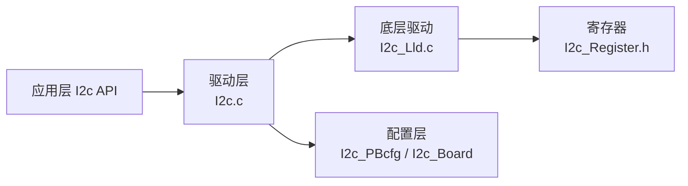

# I2C 使用指南

```mdx-code-block
import DocScope from '@site/src/components/DocScope';
```

## 概述

本文介绍 MCU 侧 I2C 驱动的使用，包括硬件支持、软件架构、配置说明与使用示例。

- **定位**：帮助用户在 MCU 上通过 I2C 总线与外围设备通信。
- **适用读者**：需要开发 I2C 主/从通信的深度定制开发者。
- **前置条件**：了解 MCU 基本框架，参见 [MCU 快速入门指南](01_basic_information.md)；PORT 驱动需先完成 IO 初始化。
- **与其他模块关系**：I2C 使用的 SDA/SCL 引脚由 PORT 驱动配置功能复用。

<DocScope products="RDK S100">
S100 SIP MCU 域集成 4 个 I2C 控制器（I2C6~I2C9）。MCU 侧 I2C 驱动管理 MCU 域的 4 个控制器，提供标准的 I2C 总线通信：I2C 总线控制器通过串行数据线（SDA）和串行时钟（SCL）线在连接到总线的器件间传递信息，每个器件都有一个唯一的地址。I2C 子系统的主要功能是实现单片机与外围设备之间的串行通信，可以驱动 mipi 子卡、pmic 芯片和其他常用的外围设备。

| 配置项 | 默认值 |
|---|---|
| I2C 控制器数量 | 4 个 |
| 控制器编号 | I2C6~I2C9 |
| 默认速率模式 | Fast Mode Plus |
</DocScope>
<DocScope products="RDK S600">
S600 模组 MCU 域集成 3 个 I2C 控制器（I2C11、I2C13、I2C14，非连续编号）。MCU 侧 I2C 驱动管理 MCU 域的 3 个控制器，提供标准的 I2C 总线通信：I2C 总线控制器通过串行数据线（SDA）和串行时钟（SCL）线在连接到总线的器件间传递信息，每个器件都有一个唯一的地址。I2C 子系统的主要功能是实现单片机与外围设备之间的串行通信，可以驱动 mipi 子卡、pmic 芯片和其他常用的外围设备。

| 配置项 | 默认值 |
|---|---|
| I2C 控制器数量 | 3 个 |
| 控制器编号 | I2C11、I2C13、I2C14 |
| 默认速率模式 | Fast Mode / Fast Mode Plus |
</DocScope>

## 硬件支持

I2C 控制器支持以下功能：
- 三种速率模式选择（目前驱动不支持 HIGH SPEED 模式）
  - **Standard Mode**：0~100 Kb/s
  - **Fast Mode & Fast Mode Plus**：
    - Fast Mode：0~400 Kb/s
    - Fast Mode Plus：0~1000 Kb/s
  - **High-Speed Mode**：0~3.4 Mb/s
- 支持主从模式配置
- 支持 7 位和 10 位寻址模式

## 软件架构

I2C 驱动采用分层设计：应用层通过 I2c API 调用驱动，驱动再调用底层 LLD 直接操作硬件寄存器，配置由 PBCfg 与板级配置提供。



## 代码路径

- `McalCdd/Common/Register/inc/I2c_Register.h`：寄存器相关内容
- `McalCdd/I2c/src/I2c.c`：驱动代码
- `McalCdd/I2c/src/I2c_Lld.c`：底层驱动代码
- `McalCdd/I2c/inc/I2c.h`：驱动头文件
- `McalCdd/I2c/inc/I2c_Lld.h`：底层驱动头文件
- `Config/McalCdd/gen_s100_sip_B_mcu1/I2c/src/I2c_PBcfg.c`：PB 配置文件
- `Config/McalCdd/gen_s100_sip_B_mcu1/I2c/inc/I2c_PBcfg.h`：PB 配置头文件
- `Config/McalCdd/gen_s100_sip_B_mcu1/I2c/inc/I2c_Board.h`：I2C 板级配置文件
- `samples/I2c/src/I2c_Cmd.c`：I2c sample

## 开发与使用方法

### 初始化和调度

通用 I/O 引脚的初始化不在 I2c 驱动程序的范围内，应由 PORT 驱动先完成 IO 初始化(Port_Init(NULL);)，然后使用 I2c 驱动。 I2c 驱动初始化函数为 I2c_Init(NULL)。

### 使用示例

<DocScope products="RDK S100">
S100 为 MCU 侧实现了一套类似 i2c-tools 开源工具的命令，来支持用户调试使用。
</DocScope>
<DocScope products="RDK S600">
S600 为 MCU 侧实现了一套类似 i2c-tools 开源工具的命令，来支持用户调试使用。
</DocScope>

<DocScope products="RDK S100">
S100的 MCU 域 I2C 支持范围 I2C6~I2C9。
</DocScope>
<DocScope products="RDK S600">
S600的 MCU 域支持 I2C11、I2C13、I2C14（非连续编号）。
</DocScope>


代码路径
```sh
samples/I2c/src/I2c_Cmd.c
```

目前支持 i2cdetect, i2cget, i2cset。
- i2cdetect — 用来列举 I2C bus 及该 bus 上的所有设备
- i2cget — 读取 I2C 设备某个 register 的值
- i2cset — 写入 I2C 设备某个 register 的值

<DocScope products="RDK S100">
测试示例如下：
```sh
D-Robotics:/$ i2cdetect 7
     0  1  2  3  4  5  6  7  8  9  a  b  c  d  e  f
00:    -- -- -- -- -- -- -- -- -- -- -- -- -- -- --
10: -- -- 12 -- -- -- -- -- -- -- -- -- -- -- -- --
20: -- -- -- -- -- -- -- -- -- -- -- -- -- -- -- --
30: -- -- -- -- -- -- -- -- -- -- -- -- -- -- -- --
40: -- -- -- -- -- -- -- -- -- -- -- -- -- -- -- --
50: -- -- -- -- -- -- -- -- -- -- -- -- -- -- -- --
60: -- -- -- -- -- -- -- -- -- -- -- -- -- -- -- --
70: -- -- -- -- -- -- -- --
```
</DocScope>
<DocScope products="RDK S600">
```c
D-Robotics:/$ i2cdetect 13
     0  1  2  3  4  5  6  7  8  9  a  b  c  d  e  f
00:    -- -- -- -- -- -- -- -- -- -- -- -- -- -- --
10: -- -- -- -- -- -- -- -- 18 -- -- -- -- -- -- --
20: -- -- -- -- -- -- -- -- -- -- -- -- -- -- -- --
30: -- -- -- -- -- -- -- -- -- -- -- -- -- -- -- --
40: -- -- -- -- -- -- -- -- -- -- -- -- -- -- -- --
50: -- -- -- -- -- -- -- -- -- -- -- -- -- -- -- --
60: -- -- -- -- -- -- -- -- -- -- -- -- -- -- -- --
70: -- -- -- -- -- -- -- --
```
</DocScope>


### 应用程序接口

#### I2c_Init

**【函数原型】**

```c
void I2c_Init(const I2c_InitConfigType *Config);
```

**【功能描述】**

初始化 I2C 驱动。根据 `Config` 指向的配置结构体初始化 I2C 通道。传入 `NULL` 时使用 `I2c_PBcfg.c` 中的默认配置。应用层调用其它 I2C API 前必须先调用本函数。通用 IO 引脚初始化不在 I2C 驱动范围内，需先由 PORT 驱动完成 `Port_Init(NULL)`。

**【参数】**

| 参数 | 类型 | 必选 | 默认 | 说明 |
|---|---|---|---|---|
| Config | `const I2c_InitConfigType *` | 否 | NULL | 指向 I2C 配置结构体的指针；传 NULL 使用默认配置 |

**【返回值】**

无。

#### I2c_DeInit

**【函数原型】**

```c
void I2c_DeInit(void);
```

**【功能描述】**

反初始化 I2C 驱动，将所有 I2C 通道恢复到复位状态。

**【参数】**

无。

**【返回值】**

无。

#### I2c_SyncDataTrans

**【函数原型】**

```c
Std_ReturnType I2c_SyncDataTrans(uint8 I2cChannel, const I2c_RequestType *RequestPtr);
```

**【功能描述】**

同步发送或接收一条 I2C 消息。函数阻塞直到传输完成才返回。

**【参数】**

| 参数 | 类型 | 必选 | 默认 | 说明 |
|---|---|---|---|---|
| I2cChannel | `uint8` | 是 | — | I2C 通道号 |
| RequestPtr | `const I2c_RequestType *` | 是 | — | 指向 I2C 传输请求结构体的指针 |

**【返回值】**

- `E_OK`：命令已接受
- `E_NOT_OK`：命令未接受

#### I2c_SyncMultiDataTrans

**【函数原型】**

```c
Std_ReturnType I2c_SyncMultiDataTrans(uint8 I2cChannel, const I2c_RequestType *RequestPtr, uint8 I2cRequestCnt);
```

**【功能描述】**

同步发送或接收多条 I2C 消息。函数阻塞直到所有消息传输完成才返回，适用于需要连续执行多个 I2C 事务的场景。

**【参数】**

| 参数 | 类型 | 必选 | 默认 | 说明 |
|---|---|---|---|---|
| I2cChannel | `uint8` | 是 | — | I2C 通道号 |
| RequestPtr | `const I2c_RequestType *` | 是 | — | 指向 I2C 传输请求数组的指针 |
| I2cRequestCnt | `uint8` | 是 | — | 待传输的 I2C 请求个数 |

**【返回值】**

- `E_OK`：命令已接受
- `E_NOT_OK`：命令未接受

#### I2c_AsyncDataTrans

**【函数原型】**

```c
Std_ReturnType I2c_AsyncDataTrans(uint8 I2cChannel, const I2c_RequestType *RequestPtr);
```

**【功能描述】**

异步发送或接收一条 I2C 消息。函数立即返回，传输完成后通过异步回调通知应用层。需先通过 `I2c_AsyncModeSet` 设置异步模式，并通过 `I2c_AsyncCallbackSet` 注册回调。

**【参数】**

| 参数 | 类型 | 必选 | 默认 | 说明 |
|---|---|---|---|---|
| I2cChannel | `uint8` | 是 | — | I2C 通道号 |
| RequestPtr | `const I2c_RequestType *` | 是 | — | 指向 I2C 传输请求结构体的指针 |

**【返回值】**

- `E_OK`：命令已接受
- `E_NOT_OK`：命令未接受

#### I2c_StatusGet

**【函数原型】**

```c
I2c_StatusType I2c_StatusGet(uint8 I2cChannel);
```

**【功能描述】**

获取指定 I2C 通道的当前状态。

**【参数】**

| 参数 | 类型 | 必选 | 默认 | 说明 |
|---|---|---|---|---|
| I2cChannel | `uint8` | 是 | — | I2C 通道号 |

**【返回值】**

返回 `I2c_StatusType` 枚举值，表示该通道的当前状态（如 `I2C_IDLE` 等）。

#### I2c_GetVersionInfo

**【函数原型】**

```c
void I2c_GetVersionInfo(Std_VersionInfoType *versioninfo);
```

**【功能描述】**

获取 I2C 驱动模块的版本信息。

**【参数】**

| 参数 | 类型 | 必选 | 默认 | 说明 |
|---|---|---|---|---|
| versioninfo | `Std_VersionInfoType *` | 是 | — | 输出参数，指向存储版本信息的变量 |

**【返回值】**

无（版本信息通过 `versioninfo` 输出参数返回）。

#### I2c_AsyncModeSet

**【函数原型】**

```c
void I2c_AsyncModeSet(uint8 I2cChannel, uint8 I2cAsyncMode);
```

**【功能描述】**

设置指定 I2C 通道的异步传输模式。

**【参数】**

| 参数 | 类型 | 必选 | 默认 | 说明 |
|---|---|---|---|---|
| I2cChannel | `uint8` | 是 | — | I2C 通道号 |
| I2cAsyncMode | `uint8` | 是 | — | 异步模式值 |

**【返回值】**

无。

#### I2c_AsyncCallbackSet

**【函数原型】**

```c
void I2c_AsyncCallbackSet(uint8 I2cChannel, I2c_CallbackType I2cCallback);
```

**【功能描述】**

注册指定 I2C 通道的异步传输完成回调函数。异步传输完成时驱动会调用该回调。

**【参数】**

| 参数 | 类型 | 必选 | 默认 | 说明 |
|---|---|---|---|---|
| I2cChannel | `uint8` | 是 | — | I2C 通道号 |
| I2cCallback | `I2c_CallbackType` | 是 | — | 回调函数指针，原型为 `void (*)(uint8 I2cChannel, I2c_StatusType I2cStatus)` |

**【返回值】**

无。

## 调试

- **挂载检测**：使用 `i2cdetect <bus>` 列举指定 I2C 总线上已挂载的设备地址。
- **读写验证**：使用 `i2cget` / `i2cset` 读取或写入设备寄存器，核对返回值与预期一致。
- **配置核对**：核对速率模式、主从模式、寻址模式是否与目标设备一致。

## 常见问题

<!-- TODO(Sx): 待收集 -->

## 相关文档

- [MCU 快速入门指南](01_basic_information.md)
- [MCU Port 配置](12_mcu_port/development_manual.md)
- [I2C 驱动调试指南](/Advanced_development/driver_development/driver_i2c_dev)
- [40pin I2C 示例](/Demos/peripheral/01_40pin/s100/i2c)
