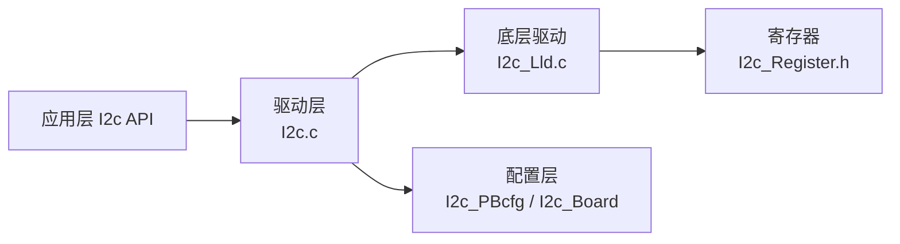

# I2C 使用指南

```mdx-code-block
import DocScope from '@site/src/components/DocScope';
```

<DocScope products="RDK S100">
S100 MCU 芯片提供了标准的 I2C 总线，I2C 总线控制器通过串行数据线（SDA）和串行时钟（SCL）线在连接到总线的器件间传递信息。每个器件都有一个唯一的地址。I2C 子系统的主要功能是实现单片机与外围设备之间的串行通信。它可以驱动 mipi 子卡、pmic 芯片和其他常用的外围设备。

| 配置项 | 默认值 |
|---|---|
| I2C 控制器数量 | 4 个 |
| 控制器编号 | I2C6~I2C9 |
| 默认速率模式 | Fast Mode Plus |
</DocScope>
<DocScope products="RDK S600">
S600 MCU 芯片提供了标准的 I2C 总线，I2C 总线控制器通过串行数据线（SDA）和串行时钟（SCL）线在连接到总线的器件间传递信息。每个器件都有一个唯一的地址。I2C 子系统的主要功能是实现单片机与外围设备之间的串行通信。它可以驱动 mipi 子卡、pmic 芯片和其他常用的外围设备。

| 配置项 | 默认值 |
|---|---|
| I2C 控制器数量 | 5 个 |
| 控制器编号 | I2C10~I2C14 |
</DocScope>

## I2C 控制器

I2C 控制器支持以下功能：
- 三种速率模式选择（目前驱动不支持 HIGH SPEED 模式）
  - **Standard Mode**：0~100 Kb/s
  - **Fast Mode & Fast Mode Plus**：
    - Fast Mode：0~400 Kb/s
    - Fast Mode Plus：0~1000 Kb/s
  - **High-Speed Mode**：0~3.4 Mb/s
- 支持主从模式配置
- 支持 7 位和 10 位寻址模式

S100 MCU 芯片总共提供4个 I2C 控制器(I2C6~9)，默认速率为 Fast Mode Plus。

## 软件架构

I2C 驱动采用分层设计：应用层通过 I2c API 调用驱动，驱动再调用底层 LLD 直接操作硬件寄存器，配置由 PBCfg 与板级配置提供。



## 代码路径

- `McalCdd/Common/Register/inc/I2c_Register.h`：寄存器相关内容
- `McalCdd/I2c/src/I2c.c`：驱动代码
- `McalCdd/I2c/src/I2c_Lld.c`：底层驱动代码
- `McalCdd/I2c/inc/I2c.h`：驱动头文件
- `McalCdd/I2c/inc/I2c_Lld.h`：底层驱动头文件
- `Config/McalCdd/gen_s100_sip_B_mcu1/I2c/src/I2c_PBcfg.c`：PB 配置文件
- `Config/McalCdd/gen_s100_sip_B_mcu1/I2c/inc/I2c_PBcfg.h`：PB 配置头文件
- `Config/McalCdd/gen_s100_sip_B_mcu1/I2c/inc/I2c_Board.h`：I2C 板级配置文件
- `samples/I2c/src/I2c_Cmd.c`：I2c sample

### 初始化和调度

通用 I/O 引脚的初始化不在 I2c 驱动程序的范围内，应由 PORT 驱动先完成 IO 初始化(Port_Init(NULL);)，然后使用 I2c 驱动。 I2c 驱动初始化函数为 I2c_Init(NULL)。

## I2C 使用

<DocScope products="RDK S100">
S100 为 MCU 侧实现了一套类似 i2c-tools 开源工具的命令，来支持用户调试使用。
</DocScope>
<DocScope products="RDK S600">
S600 为 MCU 侧实现了一套类似 i2c-tools 开源工具的命令，来支持用户调试使用。
</DocScope>

<DocScope products="RDK S100">
S100的 MCU 域 I2C 支持范围 I2C6~I2C9。
</DocScope>
<DocScope products="RDK S600">
S600的 MCU 域支持 I2C10~I2C14。
</DocScope>


代码路径
```sh
samples/I2c/src/I2c_Cmd.c
```

目前支持 i2cdetect, i2cget, i2cset。
- i2cdetect — 用来列举 I2C bus 及该 bus 上的所有设备
- i2cget — 读取 I2C 设备某个 register 的值
- i2cset — 写入 I2C 设备某个 register 的值

<DocScope products="RDK S100">
测试示例如下：
```sh
D-Robotics:/$ i2cdetect 7
     0  1  2  3  4  5  6  7  8  9  a  b  c  d  e  f
00:    -- -- -- -- -- -- -- -- -- -- -- -- -- -- --
10: -- -- 12 -- -- -- -- -- -- -- -- -- -- -- -- --
20: -- -- -- -- -- -- -- -- -- -- -- -- -- -- -- --
30: -- -- -- -- -- -- -- -- -- -- -- -- -- -- -- --
40: -- -- -- -- -- -- -- -- -- -- -- -- -- -- -- --
50: -- -- -- -- -- -- -- -- -- -- -- -- -- -- -- --
60: -- -- -- -- -- -- -- -- -- -- -- -- -- -- -- --
70: -- -- -- -- -- -- -- --
```
</DocScope>
<DocScope products="RDK S600">
```c
D-Robotics:/$ i2cdetect 13
     0  1  2  3  4  5  6  7  8  9  a  b  c  d  e  f
00:    -- -- -- -- -- -- -- -- -- -- -- -- -- -- --
10: -- -- -- -- -- -- -- -- 18 -- -- -- -- -- -- --
20: -- -- -- -- -- -- -- -- -- -- -- -- -- -- -- --
30: -- -- -- -- -- -- -- -- -- -- -- -- -- -- -- --
40: -- -- -- -- -- -- -- -- -- -- -- -- -- -- -- --
50: -- -- -- -- -- -- -- -- -- -- -- -- -- -- -- --
60: -- -- -- -- -- -- -- -- -- -- -- -- -- -- -- --
70: -- -- -- -- -- -- -- --
```
</DocScope>


## 应用程序接口

### void I2c_Init ( const I2c_ConfigType * Config )

```shell
Description：Subsystem driver initialization function.

Sync/Async：Synchronous
Parameters(in)
    Config： Pointer to configuration structure
Parameters(inout)
    None
Parameters(out)
    None
Return value: None
```

### void I2c_DeInit ( void )

```shell
Description：De-initialize of i2c system to reset values.

Sync/Async：Synchronous
Parameters(in)
    None
Parameters(inout)
    None
Parameters(out)
    None
Return value: None
```

### Std_ReturnType I2c_SyncDataTrans ( uint8 Channel, const I2c_RequestType* RequestPtr )

```shell
Description：Sends or receives an I2C message blocking.

Sync/Async：Synchronous
Parameters(in)
    Channel: I2C Channel.
    RequestPtr: I2C transmit request type
Parameters(inout)
    None
Parameters(out)
    None
Return value:
    E_OK: command has been accepted
    E_NOT_OK: command has not been accepted
```

### Std_ReturnType I2c_SyncMultiDataTrans ( uint8 Channel, const I2c_RequestType* RequestPtr uint8 I2cRequestCnt)

```shell
Description：Sends or receives an I2C message blocking.

Sync/Async：Synchronous
Parameters(in)
    Channel: I2C Channel.
    RequestPtr: I2C transmit request type
    I2cRequestCnt: I2C transmit num
Parameters(inout)
    None
Parameters(out)
    None
Return value:
    E_OK: command has been accepted
    E_NOT_OK: command has not been accepted
```

### Std_ReturnType I2c_AsyncDataTrans ( uint8 Channel, const I2c_RequestType* RequestPtr )

```shell
Description：This function performs Sends or receives an I2C message non-blocking

Sync/Async：Asynchronous
Parameters(in)
    Channel: I2C Channel.
    RequestPtr: I2C transmit request type
Parameters(inout)
    None
Parameters(out)
    None
Return value:
    E_OK: command has been accepted
    E_NOT_OK: command has not been accepted
```

### I2c_StatusType I2c_StatusGet ( uint8 Channel )

```shell
Description：Gets the status of an I2C channel.

Sync/Async：Synchronous
Parameters(in)
    Channel: I2C Channel.
Parameters(inout)
    None
Parameters(out)
    None
Return value: status of an I2C channel
```

### void I2c_GetVersionInfo ( Std_VersionInfoType* VersionInfo )

```shell
Description：This function Gets the version information of this module

Sync/Async：Synchronous
Parameters(in)
    VersionInfo: version information of this module
Parameters(inout)
    None
Parameters(out)
    None
Return value: None
```

## 调试

- **挂载检测**：使用 `i2cdetect <bus>` 列举指定 I2C 总线上已挂载的设备地址。
- **读写验证**：使用 `i2cget` / `i2cset` 读取或写入设备寄存器，核对返回值与预期一致。
- **配置核对**：核对速率模式、主从模式、寻址模式是否与目标设备一致。

## 常见问题

<!-- TODO(Sx): 待收集 -->

## 相关文档

- [扩展引脚应用](/Demos/peripheral/40pin)
- [I2C 调试指南](/Advanced_development/driver_development/driver_i2c_dev)
