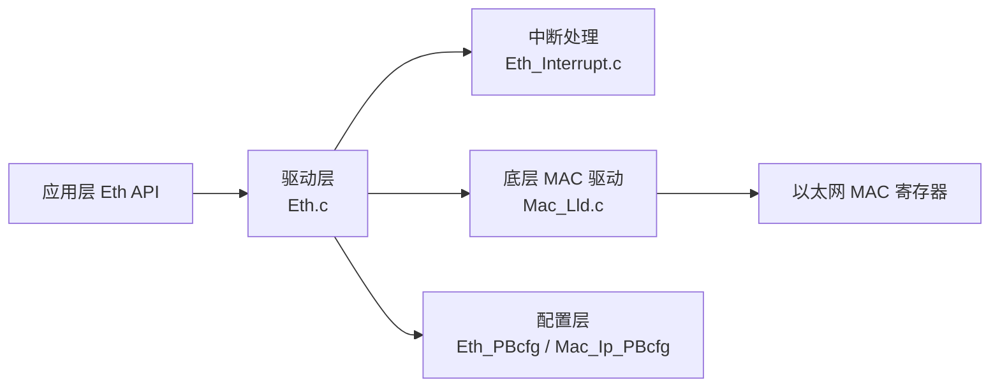

# Eth 使用指南

```mdx-code-block
import DocScope from '@site/src/components/DocScope';
```

## 概述

本文介绍 MCU 侧 Eth（Ethernet，以太网）驱动的使用，包括硬件特性、代码路径、收发示例与应用程序接口。

- **定位**：帮助用户在 MCU 上开发以太网数据收发功能。
- **适用读者**：需要开发 MCU 以太网通信的深度定制开发者。
- **前置条件**：了解 MCU 基本框架，参见 [MCU 快速入门指南](01_basic_information.md)。
- **与其他模块关系**：Eth 依赖 MAC 驱动完成报文收发，MCU 与外接 PHY 之间通过 RGMII 连接；PIN 功能需先由 Port 模块配置，参见 [Port 使用指南](12_mcu_port/01_user_manual.md)。

## 硬件支持

<DocScope products="RDK S100">

- 支持全双工流控操作（包括 IEEE 802.3x Pause packets and Priority flow control）
- 支持网络统计功能（RMON 或 MIB Counters）
- 支持 IEEE 1588-2002/1588-2008 标准定义的以太网报文时间戳
- 支持输出 PPS 秒脉冲信号
- 支持可编程以太网帧长度，最大支持 16KB

</DocScope>
<DocScope products="RDK S600">

- 支持 IEEE 1588（PTP）报文时间戳，含 AVB/TSN
- 支持 PPS 同步信号输入与输出（`PPS_IN0`、`PPS_IN1`、`PPS_IN2`、`PPS_OUT`）
- 支持 RGMII/RMII 模式

</DocScope>

- 单个接收帧的长度（包括 14 字节的以太网帧头和 4 字节的 FCS）必须小于或等于 RX buffer 的配置长度
- 不支持传输超过所使用控制器可用缓冲区大小的数据，较长的数据必须使用 Internet 协议（IP）和传输控制协议（TCP）传输

默认配置如下：

<DocScope products="RDK S100">

- 最大速率：1000Mbps
- 收发队列（FIFO）数量：各 2 个，硬件最多支持各 6 个
- 模块时钟：300MHz
- PTP 时钟周期：20ns
- 默认数据传输模式：轮询

</DocScope>
<DocScope products="RDK S600">

- 最大速率：1000Mbps
- 收发队列（FIFO）数量：各 1 个，硬件最多支持各 8 个
- 模块时钟：300MHz
- PTP 时钟周期：20ns
- 默认数据传输模式：轮询

</DocScope>

:::info 说明
两产品的 VLAN 优先级映射表 `aVlanPcp2FifoIdx` 默认全为 0，即 8 个 VLAN 优先级全部映射到队列 0，**默认不做优先级分流**。如需按优先级分流，需同时调整 `ETH_TX_FIFO_NUM` / `ETH_RX_FIFO_NUM` 宏与 `Eth_PBcfg.c` 中的 `u8FifoTotalNum`、`aVlanPcp2FifoIdx`。
:::

## 软件架构

Eth 驱动采用分层设计：应用层通过 Eth API 调用驱动，驱动经底层 MAC 驱动或中断处理完成收发，配置由 PBCfg 提供。



## 代码路径

```bash
McalCdd/Ethernet/inc              # 头文件
McalCdd/Ethernet/src/Eth.c        # 提供对外 API 接口
McalCdd/Ethernet/src/Eth_Interrupt.c  # 中断处理回调函数处理接口
McalCdd/Ethernet/src/Mac_Lld.c    # 封装寄存器控制接口，供 API 接口调用
```

板级配置：

<DocScope products="RDK S100">
```bash
Config/McalCdd/gen_s100_sip_B_mcu1/Ethernet/src/Eth_PBcfg.c
    # Eth 预编译配置，用于提供给对外接口 API 初始化属性调用
Config/McalCdd/gen_s100_sip_B_mcu1/Ethernet/src/Mac_Ip_PBcfg.c
    # MAC 驱动预编译配置，对 Eth_PBcfg.c 构成静态配置依赖
```
</DocScope>
<DocScope products="RDK S600">
```bash
Config/McalCdd/gen_s600_md_mcu1/Ethernet/src/Eth_PBcfg.c
    # Eth 预编译配置，用于提供给对外接口 API 初始化属性调用
Config/McalCdd/gen_s600_md_mcu1/Ethernet/src/Mac_Ip_PBcfg.c
    # MAC 驱动预编译配置，对 Eth_PBcfg.c 构成静态配置依赖
```
</DocScope>

Sample 代码：

```bash
samples/Eth/Eth_Test/Eth_test.c   # Eth 功能测试示例程序
```

## 应用 sample

以 `samples/Eth/Eth_Test/Eth_test.c` 发送 arp 报文为例说明：

### 数据发送

Eth_test.c 测试程序外发构造的 arp 报文，PC 通过 Wireshark 抓包检查数据能否正常收到。其中，IP 地址默认且不支持动态修改。

```text
0xd4, 0xfd, 0x9b, 0xae, 0x48, 0xf5, //Sender MAC address: xx:xx:xx:xx:xx:xx  //MCU
0xC0, 0xA8, 0x01, 0x32,             //Sender IP address: 192.168.1.50
0x00, 0x00, 0x00, 0x00, 0x00, 0x00, //Target MAC address: 00:00:00:00:00:00  //PC
0xC0, 0xA8, 0x01, 0xf,             //Target IP address: 192.168.1.15
```

调用伪代码：

```text
Eth_ProvideTxBuffer //分配buffer
Eth_Transmit //数据发送
Eth_TxConfirmation //释放buffer
```

系统启动默认只完成 eth 初始化，数据发送步骤如下：

```bash
# 使能EthTest_Mainfunc周期性调用
setvar Eth_Test 1

# eth up
setvar eth_contrMode 1
setvar eth_testCase 3

# 发送arp报文
setvar eth_testCase 14
```

### 数据接收

在 EthIf_RxIndication 里把接收的报文通过串口打印出来。参考如下：

```c
if(eth_getIngressTsFlag)
{
    eth_getIngressTsFlag = FALSE;
    Eth_GetIngressTimeStamp(CtrlIdx,DataPtr,&Eth_TimeQual,&Eth_TimeStamp);
    if(Eth_TimeStamp.secondsHi!=0 || Eth_TimeStamp.nanoseconds!=0)
    {
        eth_checkIngressTsFlg=TRUE;
    }
}

if (count % 100 == 0) {
    LogSync("Eth packet is received, FrameType: %x, IsBroadcast: %s\r\n", FrameType, (IsBroadcast==TRUE)?"TRUE":"FALSE");
    LogSync("DstMac: %x-%x-%x-%x-%x-%x\r\n", *(DataPtr-14),*(DataPtr-13),*(DataPtr-12),*(DataPtr-11),*(DataPtr-10),*(DataPtr-9));
    LogSync("SrcMac: %x-%x-%x-%x-%x-%x\r\n", PhysAddrPtr[0],PhysAddrPtr[1],PhysAddrPtr[2],PhysAddrPtr[3],PhysAddrPtr[4],PhysAddrPtr[5]);
}
count++;
if(FrameType==0x800)
{
    LogSync("IP header checksum:%x,%x\r\n",DataPtr[10],DataPtr[11]);
    if(DataPtr[9]==0x11)//UDP
    {
        LogSync("UDP checksum:%x,%x\r\n",DataPtr[26],DataPtr[27]);
        eth_checkCksFlg=TRUE;
    }
    else if(DataPtr[9]==0x6)//tcp
    {
        LogSync("TCP checksum:%x,%x\r\n",DataPtr[36],DataPtr[37]);
        eth_checkCksFlg=TRUE;
    }
}
```

## 应用程序接口

### Eth_Init

**【函数原型】**

`void Eth_Init(const Eth_ConfigType *CfgPtr)`

**【功能描述】**

初始化以太网驱动。

**【参数】**

| 参数 | 类型 | 必选 | 默认 | 说明 |
|---|---|---|---|---|
| CfgPtr | const Eth_ConfigType * | 是 | 无 | 指向实现相关的配置结构体 |

**【返回值】**

无

### Eth_SetControllerMode

**【函数原型】**

`Std_ReturnType Eth_SetControllerMode(uint8 CtrlIdx, Eth_ModeType CtrlMode)`

**【功能描述】**

使能或关闭指定控制器。

**【参数】**

| 参数 | 类型 | 必选 | 默认 | 说明 |
|---|---|---|---|---|
| CtrlIdx | uint8 | 是 | 无 | 控制器索引 |
| CtrlMode | Eth_ModeType | 是 | 无 | `ETH_MODE_DOWN` 关闭控制器；`ETH_MODE_ACTIVE` 使能控制器 |

**【返回值】**

| 返回值 | 说明 |
|---|---|
| E_OK | 成功 |
| E_NOT_OK | 控制器模式切换失败 |

### Eth_GetControllerMode

**【函数原型】**

`Std_ReturnType Eth_GetControllerMode(uint8 CtrlIdx, Eth_ModeType *CtrlModePtr)`

**【功能描述】**

获取指定控制器的使能状态。

**【参数】**

| 参数 | 类型 | 必选 | 默认 | 说明 |
|---|---|---|---|---|
| CtrlIdx | uint8 | 是 | 无 | 控制器索引 |
| CtrlModePtr | Eth_ModeType * | 是 | 无 | 输出当前模式，取值同 `Eth_SetControllerMode` 的 `CtrlMode` |

**【返回值】**

| 返回值 | 说明 |
|---|---|
| E_OK | 成功 |
| E_NOT_OK | 控制器模式获取失败 |

### Eth_GetPhysAddr

**【函数原型】**

`void Eth_GetPhysAddr(uint8 CtrlIdx, uint8 *PhysAddrPtr)`

**【功能描述】**

获取指定控制器使用的物理源地址（MAC 地址）。

**【参数】**

| 参数 | 类型 | 必选 | 默认 | 说明 |
|---|---|---|---|---|
| CtrlIdx | uint8 | 是 | 无 | 控制器索引 |
| PhysAddrPtr | uint8 * | 是 | 无 | 输出物理源地址（MAC 地址），网络字节序 |

**【返回值】**

无

### Eth_SetPhysAddr

**【函数原型】**

`void Eth_SetPhysAddr(uint8 CtrlIdx, const uint8 *PhysAddrPtr)`

**【功能描述】**

设置指定控制器使用的物理源地址（MAC 地址）。

**【参数】**

| 参数 | 类型 | 必选 | 默认 | 说明 |
|---|---|---|---|---|
| CtrlIdx | uint8 | 是 | 无 | 控制器索引 |
| PhysAddrPtr | const uint8 * | 是 | 无 | 物理源地址（MAC 地址），网络字节序 |

**【返回值】**

无

### Eth_GetCurrentTime

**【函数原型】**

`Std_ReturnType Eth_GetCurrentTime(uint8 CtrlIdx, Eth_TimeStampQualType *TimeQualPtr, Eth_TimeStampType *TimeStampPtr)`

**【功能描述】**

从硬件寄存器读取当前时间。若硬件精度低于 `Eth_TimeStampType` 的精度，剩余位补 0。

:::info 注意
`Eth_GetCurrentTime` 可能在独占区内被调用。
:::

**【参数】**

| 参数 | 类型 | 必选 | 默认 | 说明 |
|---|---|---|---|---|
| CtrlIdx | uint8 | 是 | 无 | 控制器索引 |
| TimeQualPtr | Eth_TimeStampQualType * | 是 | 无 | 输出硬件时间戳质量（如基于当前漂移） |
| TimeStampPtr | Eth_TimeStampType * | 是 | 无 | 输出当前时间戳 |

**【返回值】**

| 返回值 | 说明 |
|---|---|
| E_OK | 成功 |
| E_NOT_OK | 获取失败 |

### Eth_ProvideTxBuffer

**【函数原型】**

`BufReq_ReturnType Eth_ProvideTxBuffer(uint8 CtrlIdx, uint8 Priority, Eth_BufIdxType *BufIdxPtr, uint8 **BufPtr, uint16 *LenBytePtr)`

**【功能描述】**

申请与指定优先级对应的 FIFO 的发送缓冲区。`Priority` 经 `aVlanPcp2FifoIdx` 映射为 FIFO 索引。

**【参数】**

| 参数 | 类型 | 必选 | 默认 | 说明 |
|---|---|---|---|---|
| CtrlIdx | uint8 | 是 | 无 | 控制器索引 |
| Priority | uint8 | 是 | 无 | 帧优先级，用于选择发送缓冲区 FIFO |
| BufIdxPtr | Eth_BufIdxType * | 是 | 无 | 输出申请到的缓冲区索引，供后续请求使用 |
| BufPtr | uint8 ** | 是 | 无 | 输出申请到的缓冲区指针 |
| LenBytePtr | uint16 * | 是 | 无 | 入参为期望长度，出参为实际授予长度（字节） |

**【返回值】**

| 返回值 | 说明 |
|---|---|
| BUFREQ_OK | 成功 |
| BUFREQ_E_NOT_OK | 检测到开发错误 |
| BUFREQ_E_BUSY | 所有缓冲区均被占用 |
| BUFREQ_E_OVFL | 请求的缓冲区过大 |

### Eth_Transmit

**【函数原型】**

`Std_ReturnType Eth_Transmit(uint8 CtrlIdx, Eth_BufIdxType BufIdx, Eth_FrameType FrameType, boolean TxConfirmation, uint16 LenByte, const uint8 *PhysAddrPtr)`

**【功能描述】**

触发已填充的发送缓冲区进行发送。

**【参数】**

| 参数 | 类型 | 必选 | 默认 | 说明 |
|---|---|---|---|---|
| CtrlIdx | uint8 | 是 | 无 | 控制器索引 |
| BufIdx | Eth_BufIdxType | 是 | 无 | 缓冲区资源索引 |
| FrameType | Eth_FrameType | 是 | 无 | 以太网帧类型 |
| TxConfirmation | boolean | 是 | 无 | 是否使能发送确认 |
| LenByte | uint16 | 是 | 无 | 数据长度（字节） |
| PhysAddrPtr | const uint8 * | 是 | 无 | 物理目标地址（MAC 地址），网络字节序 |

**【返回值】**

| 返回值 | 说明 |
|---|---|
| E_OK | 成功 |
| E_NOT_OK | 发送失败 |

### Eth_Receive

**【函数原型】**

`void Eth_Receive(uint8 CtrlIdx, uint8 FifoIdx, Eth_RxStatusType *RxStatusPtr)`

**【功能描述】**

从指定 FIFO 接收一帧。

**【参数】**

| 参数 | 类型 | 必选 | 默认 | 说明 |
|---|---|---|---|---|
| CtrlIdx | uint8 | 是 | 无 | 控制器索引 |
| FifoIdx | uint8 | 是 | 无 | 指定的 FIFO 索引 |
| RxStatusPtr | Eth_RxStatusType * | 是 | 无 | 输出是否收到帧以及该 FIFO 是否还有更多帧 |

**【返回值】**

无

### Eth_TxConfirmation

**【函数原型】**

`void Eth_TxConfirmation(uint8 CtrlIdx)`

**【功能描述】**

触发帧发送确认，用于释放已发送的发送缓冲区。轮询模式下必须在 `Eth_Transmit` 之后调用，否则缓冲区不会释放。

**【参数】**

| 参数 | 类型 | 必选 | 默认 | 说明 |
|---|---|---|---|---|
| CtrlIdx | uint8 | 是 | 无 | 控制器索引 |

**【返回值】**

无

### Eth_EnableSnapshot

**【函数原型】**

`Std_ReturnType Eth_EnableSnapshot(uint8 CtrlIdx, MAC_PPS_SOURCE PpsSource)`

**【功能描述】**

设置快照（snapshot）源。

**【参数】**

| 参数 | 类型 | 必选 | 默认 | 说明 |
|---|---|---|---|---|
| CtrlIdx | uint8 | 是 | 无 | 控制器索引 |
| PpsSource | MAC_PPS_SOURCE | 是 | 无 | PPS 源索引 |

**【返回值】**

| 返回值 | 说明 |
|---|---|
| E_OK | 成功 |
| E_NOT_OK | 失败 |

### Eth_GetSnapshotTime

**【函数原型】**

`Std_ReturnType Eth_GetSnapshotTime(uint8 CtrlIdx, Eth_TimeStampType *TimeStampPtr)`

**【功能描述】**

获取 PHC（PTP Hardware Clock）的快照时间。

**【参数】**

| 参数 | 类型 | 必选 | 默认 | 说明 |
|---|---|---|---|---|
| CtrlIdx | uint8 | 是 | 无 | 控制器索引 |
| TimeStampPtr | Eth_TimeStampType * | 是 | 无 | 输出 PHC 快照时间 |

**【返回值】**

| 返回值 | 说明 |
|---|---|
| E_OK | 成功 |
| E_NOT_OK | 失败 |

## 调试

- **收发自测**：使用 `setvar Eth_Test 1` 使能周期性调用，`setvar eth_contrMode 1` 使能 eth，再通过 `setvar eth_testCase 14` 发送 arp 报文，用 PC 抓包核对。
- **配置核对**：核对 `Eth_Init` 前 phy 已通过 reset pin 拉高解复位。
- **buffer 核对**：轮询模式发送后调用 `Eth_TxConfirmation` 释放 buffer，避免 buffer 泄漏。

## 常见问题

### `Eth_Init` 初始化失败

**现象**：调用 `Eth_Init` 返回失败，以太网无法工作。

**原因**：初始化前 phy 未解复位。

**解决**：在 Eth 初始化之前，先通过 phy reset pin 拉高实现解复位，再调用 `Eth_Init`。

### 轮询模式发送后 buffer 未释放

**现象**：发送若干帧后 `Eth_ProvideTxBuffer` 返回 `BUFREQ_E_BUSY`。

**原因**：轮询模式下发送数据后，未调用 `Eth_TxConfirmation` 释放 buffer。

**解决**：申请 buffer 经 `Eth_Transmit` 发送后，调用 `Eth_TxConfirmation` 释放 buffer。

## 相关文档

- [网络配置](../../02_System_configuration/01_network_config.md)
- [以太网驱动开发指南](../04_driver_development/16_driver_ethernet/01_ethernet.md)
- [Port 使用指南](12_mcu_port/01_user_manual.md)
