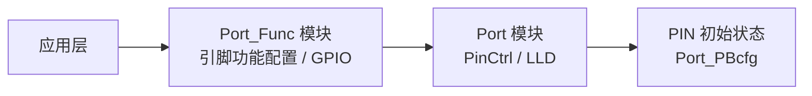

# Port 使用指南

```mdx-code-block
import DocScope from '@site/src/components/DocScope';
```

## 概述

Port 子系统是 MCU 上对 PIN 的功能和属性进行配置的子系统。

- **定位**：利用 Port_Func 模块对 PIN 的功能进行初始化配置，或操作 GPIO。
- **适用读者**：需要配置 MCU PIN 复用或操作 GPIO 的深度定制开发者。
- **前置条件**：了解 MCU 基本框架，参见 [MCU 快速入门指南](../01_basic_information.md)。
- **与其他模块关系**：UART、SPI、I2C、PWM、CAN 等外设使用前须先通过 Port 配置 PIN 功能。

Port 子系统对外提供 Port_Func 模块（用户接口）与底层 Port 模块（LLD/PinCtrl）。默认外设 PIN 配置记录在 `McalCdd/Port/inc/Port_Func.h` 的 `PinFunctions` 枚举中。

## 软件架构



## 代码路径

```bash
# Driver source code:
McalCdd/Port/inc/Port.h                      # Port 模块对外接口
McalCdd/Port/inc/Port_Func.h                 # Port_Func 模块接口与默认外设 PIN 配置（PinFunctions 枚举）
McalCdd/Port/inc/Port_Lld.h                  # 底层硬件操作函数声明
McalCdd/Port/inc/Port_Private.h              # 私有结构、宏和函数声明
McalCdd/Port/src/Port.c                      # Port 模块实现
McalCdd/Port/src/Port_Func.c                 # Port_Func 模块实现
McalCdd/Port/src/Port_Lld.c                  # 底层硬件操作实现，直接配置寄存器
McalCdd/Port/src/Port_Private.c              # 私有函数实现
McalCdd/Common/Register/inc/Port_Register.h  # 寄存器地址与位域定义
Platform/Schm/SchM_Port.h                    # 访问权限与资源保护

# Board configuration source code (gen_xxxx 见下方说明):
Config/McalCdd/gen_xxxx/Port/inc/Port_Cfg.h
Config/McalCdd/gen_xxxx/Port/inc/Port_FuncCfg.h
Config/McalCdd/gen_xxxx/Port/inc/Port_PBcfg.h
Config/McalCdd/gen_xxxx/Port/src/Port_FuncCfg.c
Config/McalCdd/gen_xxxx/Port/src/Port_PBcfg.c
```

<DocScope products="RDK S100">
上述 `gen_xxxx` 为 `gen_s100_sip_B_mcu1`（MCU1 侧）或 `gen_s100_sip_B`（MCU0 侧）。
</DocScope>
<DocScope products="RDK S600">
上述 `gen_xxxx` 为 `gen_s600_md_mcu1`（MCU1 侧）或 `gen_s600_md`（MCU0 侧）。
</DocScope>

Sample 代码：

```bash
samples/Spi/src/Spi_sample.c     # SPI sample，其中 Spi_common.c 调用 Port_SetFunctionPins 配置 PIN 功能
samples/Gpio/src/Gpio_sample.c   # GPIO 操作 sample，调用 Port_GpioDirectionOutput 等接口
```

## Port_Func 模块 PIN 号对应的 PIN 名称列表{#pin_list}
下表中各列含义如下：
    - PIN 序号：**Port 子模块中使用的 PIN 序号**，即 `Port_SetGpioByIndex` 等接口的 `PinIdx` 入参；
    - PIN Name：PIN 的命名；
    - GPIO 编号：GPIO 在所在控制器中的通道号，用于确定该 GPIO 对应的寄存器位；

:::info 注意
- PIN 序号是 **Port 子模块的全局编号**，即 `Port_SetGpioByIndex` 等接口的 `PinIdx` 入参。它按 MCU 域在前、AON 域在后连续排布：MCU 域占前 `S100_PORT_MCU_PIN_NUM` 个，AON 域的序号 = 域内编号 + `S100_PORT_MCU_PIN_NUM`。
- **GPIO 编号与 PIN 序号不是一套编号**。GPIO 编号只对实际可用的 GPIO 连续编号，会跳过不能用作 GPIO 的引脚，因此从某个位置起会与 PIN 序号错开。Port 层由 `Port_Lld_GpioPinMap` 完成两者换算。调用接口时传入的始终是 **PIN 序号**。
- 表中 `Reserved` 行表示该 PIN 序号上没有可用的 GPIO（`N/A`）。
:::

<DocScope products="RDK S100">
| PIN 序号 | PIN Name      | GPIO 编号       |
|-------|---------------|--------------|
| 0     | FUSA_ERR0     | GPIO_MCU[0]  |
| 1     | FUSA_ERR1     | GPIO_MCU[1]  |
| 2     | PPS_INOUT     | GPIO_MCU[2]  |
| 3     | LIN1_TXD      | GPIO_MCU[3]  |
| 4     | LIN2_TXD      | GPIO_MCU[4]  |
| 5     | CAN0_TX       | GPIO_MCU[5]  |
| 6     | CAN1_TX       | GPIO_MCU[6]  |
| 7     | CAN2_TX       | GPIO_MCU[7]  |
| 8     | CAN3_TX       | GPIO_MCU[8]  |
| 9     | CAN4_TX       | GPIO_MCU[9]  |
| 10    | CAN5_TX       | GPIO_MCU[10] |
| 11    | CAN6_TX       | GPIO_MCU[11] |
| 12    | CAN7_TX       | GPIO_MCU[12] |
| 13    | CAN8_TX       | GPIO_MCU[13] |
| 14    | CAN9_TX       | GPIO_MCU[14] |
| 15    | SPI2_CSN1     | GPIO_MCU[15] |
| 16    | SPI2_CSN0     | GPIO_MCU[16] |
| 17    | SPI2_MOSI     | GPIO_MCU[17] |
| 18    | SPI2_MISO     | GPIO_MCU[18] |
| 19    | SPI2_SCLK     | GPIO_MCU[19] |
| 20    | SPI3_CSN0     | GPIO_MCU[20] |
| 21    | SPI3_CSN1     | GPIO_MCU[21] |
| 22    | SPI3_MOSI     | GPIO_MCU[22] |
| 23    | SPI3_MISO     | GPIO_MCU[23] |
| 24    | SPI3_SCLK     | GPIO_MCU[24] |
| 25    | SPI4_CSN0     | GPIO_MCU[25] |
| 26    | SPI4_CSN1     | GPIO_MCU[26] |
| 27    | SPI4_MOSI     | GPIO_MCU[27] |
| 28    | SPI4_MISO     | GPIO_MCU[28] |
| 29    | SPI4_SCLK     | GPIO_MCU[29] |
| 30    | SPI5_CSN0     | GPIO_MCU[30] |
| 31    | SPI5_CSN1     | GPIO_MCU[31] |
| 32    | SPI5_MOSI     | GPIO_MCU[32] |
| 33    | SPI5_MISO     | GPIO_MCU[33] |
| 34    | SPI5_SCLK     | GPIO_MCU[34] |
| 35    | SPI6_CSN0     | GPIO_MCU[35] |
| 36    | SPI6_CSN1     | GPIO_MCU[36] |
| 37    | SPI6_MOSI     | GPIO_MCU[37] |
| 38    | SPI6_MISO     | GPIO_MCU[38] |
| 39    | SPI6_SCLK     | GPIO_MCU[39] |
| 40    | XSPI_MOSI_IO0 | GPIO_MCU[40] |
| 41    | XSPI_MISO_IO1 | GPIO_MCU[41] |
| 42    | XSPI_WP_IO2   | GPIO_MCU[42] |
| 43    | XSPI_HOLD_IO3 | GPIO_MCU[43] |
| 44    | XSPI_OCT_IO4  | GPIO_MCU[44] |
| 45    | XSPI_OCT_IO5  | GPIO_MCU[45] |
| 46    | XSPI_OCT_IO6  | GPIO_MCU[46] |
| 47    | XSPI_OCT_IO7  | GPIO_MCU[47] |
| 48    | XSPI_SCLK     | GPIO_MCU[48] |
| 49    | XSPI_SCLK_INV | GPIO_MCU[49] |
| 50    | XSPI_DQS      | GPIO_MCU[50] |
| 51    | EMAC_TX_CLK   | GPIO_MCU[51] |
| 52    | EMAC_TX_EN    | GPIO_MCU[52] |
| 53    | EMAC_TX_D3    | GPIO_MCU[53] |
| 54    | EMAC_TX_D2    | GPIO_MCU[54] |
| 55    | EMAC_TX_D1    | GPIO_MCU[55] |
| 56    | EMAC_TX_D0    | GPIO_MCU[56] |
| 57    | EMAC_RX_CLK   | GPIO_MCU[57] |
| 58    | EMAC_RX_DV    | GPIO_MCU[58] |
| 59    | EMAC_RX_D3    | GPIO_MCU[59] |
| 60    | EMAC_RX_D2    | GPIO_MCU[60] |
| 61    | EMAC_RX_D1    | GPIO_MCU[61] |
| 62    | EMAC_RX_D0    | GPIO_MCU[62] |
| 63    | XSPI_CSN      | GPIO_MCU[63] |
| 64    | XSPI_RST_N    | GPIO_MCU[64] |
| 65    | XSPI_ECC_FAIL | GPIO_MCU[65] |
| 66    | XSPI_HYP_INT  | GPIO_MCU[66] |
| 67    | BIFSPI_CSN    | GPIO_MCU[67] |
| 68    | BIFSPI_SCLK   | GPIO_MCU[68] |
| 69    | BIFSPI_MOSI   | GPIO_MCU[69] |
| 70    | BIFSPI_MISO   | GPIO_MCU[70] |
| 71    | PMIC_ERR0     | GPIO_MCU[71] |
| 72    | JTG_TCK       | GPIO_MCU[72] |
| 73    | JTG_TRSTN     | GPIO_MCU[73] |
| 74    | JTG_TMS       | GPIO_MCU[74] |
| 75    | JTG_TDI       | GPIO_MCU[75] |
| 76    | JTG_TDO       | GPIO_MCU[76] |
| 77    | EMAC_MDC      | GPIO_MCU[77] |
| 78    | EMAC_MDIO     | GPIO_MCU[78] |
| 79    | Reserved      | N/A          |
| 80    | I2C6_SCL      | GPIO_MCU[79] |
| 81    | I2C6_SDA      | GPIO_MCU[80] |
| 82    | I2C7_SCL      | GPIO_MCU[81] |
| 83    | I2C7_SDA      | GPIO_MCU[82] |
| 84    | I2C8_SCL      | GPIO_MCU[83] |
| 85    | I2C8_SDA      | GPIO_MCU[84] |
| 86    | PWM0_IO       | GPIO_MCU[85] |
| 87    | PWM1_IO       | GPIO_MCU[86] |
| 88    | CAN0_RX       | GPIO_AON[0]  |
| 89    | CAN1_RX       | GPIO_AON[1]  |
| 90    | CAN2_RX       | GPIO_AON[2]  |
| 91    | CAN3_RX       | GPIO_AON[3]  |
| 92    | CAN4_RX       | GPIO_AON[4]  |
| 93    | CAN5_RX       | GPIO_AON[5]  |
| 94    | CAN6_RX       | GPIO_AON[6]  |
| 95    | CAN7_RX       | GPIO_AON[7]  |
| 96    | CAN8_RX       | GPIO_AON[8]  |
| 97    | CAN9_RX       | GPIO_AON[9]  |
| 98    | LIN1_RXD      | GPIO_AON[10] |
| 99    | LIN2_RXD      | GPIO_AON[11] |
| 100   | Reserved      | N/A          |
| 101   | Reserved      | N/A          |
| 102   | Reserved      | N/A          |
| 103   | Reserved      | N/A          |
| 104   | Reserved      | N/A          |
| 105   | WAKEUP_IO     | GPIO_AON[12] |

</DocScope>
<DocScope products="RDK S600">
| PIN 序号 | PIN Name               | GPIO 编号       |
|-------|------------------------|--------------|
| 0     | PPS_IN0                | GPIO_MCU[0]  |
| 1     | PPS_INOUT              | GPIO_MCU[1]  |
| 2     | PPS_IN1                | GPIO_MCU[2]  |
| 3     | LIN0_TXD               | GPIO_MCU[3]  |
| 4     | CAN1_TX                | GPIO_MCU[4]  |
| 5     | CAN2_TX                | GPIO_MCU[5]  |
| 6     | CAN3_TX                | GPIO_MCU[6]  |
| 7     | CAN4_TX                | GPIO_MCU[7]  |
| 8     | CAN5_TX                | GPIO_MCU[8]  |
| 9     | CAN6_TX                | GPIO_MCU[9]  |
| 10    | CAN7_TX                | GPIO_MCU[10] |
| 11    | CAN0_TX                | GPIO_MCU[11] |
| 12    | LIN1_TXD               | GPIO_MCU[12] |
| 13    | LIN2_TXD               | GPIO_MCU[13] |
| 14    | LIN3_TXD               | GPIO_MCU[14] |
| 15    | CAN10_TX               | GPIO_MCU[15] |
| 16    | CAN11_TX               | GPIO_MCU[16] |
| 17    | CAN12_TX               | GPIO_MCU[17] |
| 18    | CAN13_TX               | GPIO_MCU[18] |
| 19    | CAN14_TX               | GPIO_MCU[19] |
| 20    | CAN15_TX               | GPIO_MCU[20] |
| 21    | SPI13_MISO             | GPIO_MCU[21] |
| 22    | SPI13_SCLK             | GPIO_MCU[22] |
| 23    | LIN6_TXD               | GPIO_MCU[23] |
| 24    | LIN6_RXD               | GPIO_MCU[24] |
| 25    | LIN7_TXD               | GPIO_MCU[25] |
| 26    | LIN7_RXD               | GPIO_MCU[26] |
| 27    | CAN8_TX                | GPIO_MCU[27] |
| 28    | CAN9_TX                | GPIO_MCU[28] |
| 29    | SPI6_CSN0              | GPIO_MCU[29] |
| 30    | SPI6_MOSI              | GPIO_MCU[30] |
| 31    | SPI6_MISO              | GPIO_MCU[31] |
| 32    | SPI6_SCLK              | GPIO_MCU[32] |
| 33    | LIN4_TXD               | GPIO_MCU[33] |
| 34    | LIN4_RXD               | GPIO_MCU[34] |
| 35    | LIN5_TXD               | GPIO_MCU[35] |
| 36    | LIN5_RXD               | GPIO_MCU[36] |
| 37    | SPI13_CSN1             | GPIO_MCU[37] |
| 38    | SPI13_CSN0             | GPIO_MCU[38] |
| 39    | SPI13_MOSI             | GPIO_MCU[39] |
| 40    | PWM6_IO                | GPIO_MCU[40] |
| 41    | SPI4_CSN0              | GPIO_MCU[41] |
| 42    | SPI4_CSN1              | GPIO_MCU[42] |
| 43    | SPI4_MOSI              | GPIO_MCU[43] |
| 44    | SPI4_MISO              | GPIO_MCU[44] |
| 45    | SPI4_SCLK              | GPIO_MCU[45] |
| 46    | HSM_UART_RXD           | GPIO_MCU[46] |
| 47    | HSM_UART_TXD           | GPIO_MCU[47] |
| 48    | PWM0_IO                | GPIO_MCU[48] |
| 49    | PWM1_IO                | GPIO_MCU[49] |
| 50    | PWM2_IO                | GPIO_MCU[50] |
| 51    | PWM3_IO                | GPIO_MCU[51] |
| 52    | PWM4_IO                | GPIO_MCU[52] |
| 53    | PWM5_IO                | GPIO_MCU[53] |
| 54    | BIFSPI_CSN             | GPIO_MCU[54] |
| 55    | BIFSPI_SCLK            | GPIO_MCU[55] |
| 56    | BIFSPI_MOSI            | GPIO_MCU[56] |
| 57    | BIFSPI_MISO            | GPIO_MCU[57] |
| 58    | PMIC_ERR0              | GPIO_MCU[58] |
| 59    | PMIC_ERR1              | GPIO_MCU[59] |
| 60    | PMIC_ERR2              | GPIO_MCU[60] |
| 61    | PMIC_ERR3              | GPIO_MCU[61] |
| 62    | PMIC_ERR4              | GPIO_MCU[62] |
| 63    | PMIC_ERR5              | GPIO_MCU[63] |
| 64    | PMIC_ERR6              | GPIO_MCU[64] |
| 65    | I2C10_SCL              | GPIO_MCU[65] |
| 66    | I2C10_SDA              | GPIO_MCU[66] |
| 67    | I2C11_SCL              | GPIO_MCU[67] |
| 68    | I2C11_SDA              | GPIO_MCU[68] |
| 69    | I2C12_SCL              | GPIO_MCU[69] |
| 70    | I2C12_SDA              | GPIO_MCU[70] |
| 71    | I2C13_SCL              | GPIO_MCU[71] |
| 72    | I2C13_SDA              | GPIO_MCU[72] |
| 73    | I2C14_SCL              | GPIO_MCU[73] |
| 74    | I2C14_SDA              | GPIO_MCU[74] |
| 75    | XSPI_CSN               | GPIO_MCU[75] |
| 76    | XSPI_RST_N             | GPIO_MCU[76] |
| 77    | XSPI_ECC_FAIL          | GPIO_MCU[77] |
| 78    | DDR_PWROK              | GPIO_MCU[78] |
| 79    | EMAC_MDC               | GPIO_MCU[79] |
| 80    | EMAC_MDIO              | GPIO_MCU[80] |
| 81    | Reserved               | N/A          |
| 82    | EMAC_TX_CLK            | GPIO_MCU[81] |
| 83    | EMAC_TX_EN             | GPIO_MCU[82] |
| 84    | EMAC_TX_D3             | GPIO_MCU[83] |
| 85    | EMAC_TX_D2             | GPIO_MCU[84] |
| 86    | EMAC_TX_D1             | GPIO_MCU[85] |
| 87    | EMAC_TX_D0             | GPIO_MCU[86] |
| 88    | EMAC_RX_CLK            | GPIO_MCU[87] |
| 89    | EMAC_RX_DV             | GPIO_MCU[88] |
| 90    | EMAC_RX_D3             | GPIO_MCU[89] |
| 91    | EMAC_RX_D2             | GPIO_MCU[90] |
| 92    | EMAC_RX_D1             | GPIO_MCU[91] |
| 93    | EMAC_RX_D0             | GPIO_MCU[92] |
| 94    | XSPI_SCLK              | GPIO_MCU[93] |
| 95    | XSPI_SCLK_INV          | GPIO_MCU[94] |
| 96    | XSPI_DQS               | GPIO_MCU[95] |
| 97    | XSPI_MOSI_IO0          | GPIO_MCU[96] |
| 98    | XSPI_MISO_IO1          | GPIO_MCU[97] |
| 99    | XSPI_WP_IO2            | GPIO_MCU[98] |
| 100   | XSPI_HOLD_IO3          | GPIO_MCU[99] |
| 101   | XSPI_OCT_IO4           | GPIO_MCU[100] |
| 102   | XSPI_OCT_IO5           | GPIO_MCU[101] |
| 103   | XSPI_OCT_IO6           | GPIO_MCU[102] |
| 104   | XSPI_OCT_IO7           | GPIO_MCU[103] |
| 105   | WAKEUP_IO0             | GPIO_AON[0]  |
| 106   | WAKEUP_IO1             | GPIO_AON[1]  |
| 107   | WAKEUP_IO2             | GPIO_AON[2]  |
| 108   | WAKEUP_IO3             | GPIO_AON[3]  |
| 109   | WAKEUP_IO4             | GPIO_AON[4]  |
| 110   | CAN8_RX                | GPIO_AON[5]  |
| 111   | CAN9_RX                | GPIO_AON[6]  |
| 112   | CAN10_RX               | GPIO_AON[7]  |
| 113   | CAN11_RX               | GPIO_AON[8]  |
| 114   | CAN12_RX               | GPIO_AON[9]  |
| 115   | CAN13_RX               | GPIO_AON[10] |
| 116   | CAN14_RX               | GPIO_AON[11] |
| 117   | CAN15_RX               | GPIO_AON[12] |
| 118   | SPI8_CSN0              | GPIO_AON[13] |
| 119   | SPI8_SCLK              | GPIO_AON[14] |
| 120   | SPI8_MOSI              | GPIO_AON[15] |
| 121   | SPI8_MISO              | GPIO_AON[16] |
| 122   | LIN0_RXD               | GPIO_AON[17] |
| 123   | LIN1_RXD               | GPIO_AON[18] |
| 124   | LIN2_RXD               | GPIO_AON[19] |
| 125   | LIN3_RXD               | GPIO_AON[20] |
| 126   | Reserved               | N/A          |
| 127   | Reserved               | N/A          |
| 128   | Reserved               | N/A          |
| 129   | Reserved               | N/A          |
| 130   | CAN0_RX                | GPIO_AON[21] |
| 131   | CAN1_RX                | GPIO_AON[22] |
| 132   | CAN2_RX                | GPIO_AON[23] |
| 133   | CAN3_RX                | GPIO_AON[24] |
| 134   | Reserved               | N/A          |
| 135   | Reserved               | N/A          |
| 136   | Reserved               | N/A          |
| 137   | Reserved               | N/A          |
| 138   | Reserved               | N/A          |
| 139   | Reserved               | N/A          |
| 140   | Reserved               | N/A          |
| 141   | CAN4_RX                | GPIO_AON[25] |
| 142   | CAN5_RX                | GPIO_AON[26] |
| 143   | CAN6_RX                | GPIO_AON[27] |
| 144   | CAN7_RX                | GPIO_AON[28] |
| 145   | Reserved               | N/A          |
| 146   | Reserved               | N/A          |
</DocScope>


## Port_Func 模块
Port_Func 模块用于针对功能模块对该功能模块下属所有 PIN 进行初始化配置/操作 GPIO。

### 配置 PIN 功能
#### 代码示例
使用示例可以参考 `samples/Spi/src/Spi_common.c` 的 `spi_gpio_pinmux()`，基本使用逻辑为：
```c
...
#include <Port_Func.h>

...

	/* Configure Pin for SPI5 */
	Port_SetFunctionPins(PORT_FUNC_SPI5);

...
```

#### 默认外设配置
默认外设 PIN 配置记录在：`McalCdd/Port/inc/Port_Func.h`文件内，通过一个由 enum 类型定义记录：
<DocScope products="RDK S100">
```c
...

typedef enum PinFunctions {
    PORT_FUNC_UART4,
    PORT_FUNC_UART5,
    PORT_FUNC_UART6,
    PORT_FUNC_SPI2,
    PORT_FUNC_SPI3,
    PORT_FUNC_SPI4,
    PORT_FUNC_SPI5,
    PORT_FUNC_SPI6,
    PORT_FUNC_SPI7,
    PORT_FUNC_CAN0,
    PORT_FUNC_CAN1,
    PORT_FUNC_CAN2,
    PORT_FUNC_CAN3,
    PORT_FUNC_CAN4,
    PORT_FUNC_CAN5,
    PORT_FUNC_CAN6,
    PORT_FUNC_CAN7,
    PORT_FUNC_CAN8,
    PORT_FUNC_CAN9,
    PORT_FUNC_I2C6,
    PORT_FUNC_I2C7,
    PORT_FUNC_I2C8,
    PORT_FUNC_I2C9,
    PORT_FUNC_PWM0,
    PORT_FUNC_PWM1,
    PORT_FUNC_PWM2,
    PORT_FUNC_PWM3,
    PORT_FUNC_PWM4,
    PORT_FUNC_PWM5,
    PORT_FUNC_PWM6,
    PORT_FUNC_PWM7,
    PORT_FUNC_PWM8,
    PORT_FUNC_PWM9,
    PORT_FUNC_PWM10,
    PORT_FUNC_PWM11,
    PORT_FUNC_PPS_IN0,
    PORT_FUNC_PPS_IN1,
    PORT_FUNC_PPS_IN2,
    PORT_FUNC_PPS_OUT,
    PORT_FUNC_EMAC,
    /* lin1 */
    PORT_FUNC_LIN1,
    PORT_FUNC_MAX,
} PinFunc_e;

...

```

</DocScope>
<DocScope products="RDK S600">
```c
typedef enum PinFunctions {
    /* uart8 - uart11*/
    PORT_FUNC_UART8,
    PORT_FUNC_UART9,
    PORT_FUNC_UART10,
    PORT_FUNC_UART11,
    /* spi4 - spi13*/
    PORT_FUNC_SPI4,
    PORT_FUNC_SPI5,
    PORT_FUNC_SPI6,
    PORT_FUNC_SPI7,
    PORT_FUNC_SPI8,
    PORT_FUNC_SPI9,
    PORT_FUNC_SPI10,
    PORT_FUNC_SPI11,
    PORT_FUNC_SPI12,
    PORT_FUNC_SPI13,
    /* can0 - can15*/
    PORT_FUNC_CAN0,
    ...
    PORT_FUNC_CAN15,
    /* i2c10 - i2c14*/
    PORT_FUNC_I2C10,
    PORT_FUNC_I2C11,
    PORT_FUNC_I2C12,
    PORT_FUNC_I2C13,
    PORT_FUNC_I2C14,
    /* pwm0 - pwm31*/
    PORT_FUNC_PWM0,
    ...
    PORT_FUNC_PWM31,
    /* PPS_IN0 - PPS_OUT */
    PORT_FUNC_PPS_IN0,
    PORT_FUNC_PPS_IN1,
    PORT_FUNC_PPS_IN2,
    PORT_FUNC_PPS_OUT,
    PORT_FUNC_EMAC,
    /* lin2 - lin3 */
    PORT_FUNC_LIN2,
    PORT_FUNC_LIN3,
    PORT_FUNC_MAX,
} PinFunc_e;
```

</DocScope>
### Port_Func 操作 GPIO 使用示例
Port_Func 提供的 GPIO 接口，使用的 PinIdx 为[Port_Func 模块 PIN 号对应的 PIN 名称列表](#pin_list)

#### 代码示例
使用示例可以参考`samples/Gpio/src/Gpio_sample.c`，基本使用逻辑为：
```c
    /* 配置"PinIdx" PIN为GPIO功能 */
    RetVal = Port_SetGpioByIndex(PinIdx);

    /* 配置"PinIdx" PIN方向为 OUTPUT 并配置输出电平为Level */
    RetVal = Port_GpioDirectionOutput(PinIdx, Level);

    /* 配置"PinIdx" PIN方向为 INPUT */
    RetVal = Port_GpioDirectionInput(PinIdx);

    /* 读取"PinIdx" PIN的值，电平通过出参 PinLvl 返回 */
    RetVal = Port_GpioGetValue(PinIdx, &PinLvl);

...

```

:::info 注意

    - `Port_GpioGetValue` 函数返回的值，在外部 PIN 脚悬空时，会受到 PinCtrl 的配置影响，从而读出来的值可能有变化；
    - Port_Func 模块提供的 GPIO 接口会对具体操作的 GPIO 进行检查，部分 PIN 不允许操作。具体请参考 `McalCdd/Port/src/Port_Func.c` 文件内的 `Gpio_Blacklist` 数组：
        <DocScope products="RDK S100">
        ```c
        const uint8_t Gpio_Blacklist[] = {
            0,  /* S100 Power related pins */
            5,  /* S100 debug uart tx */
            38, /* S100 Power related pins */
            15, /* S100 Power related pins */
            68, /* S100 Power related pins */
            69, /* S100 Power related pins */
            71, /* S100 Power related pins */
            80, /* S100 Power related pins */
            81, /* S100 Power related pins */
            82, /* S100 Power related pins */
            83, /* S100 Power related pins */
            AON_PIN_NUM(0),  /* S100 debug uart rx */
            AON_PIN_NUM(12), /* S100 Power related pins */
        };
        ```

        </DocScope>
        <DocScope products="RDK S600">

        ```c
        const uint8_t Gpio_Blacklist[] = {
            29, 16, 30, 31, 32,      /* V0P1 limit: SPI6 group */
            11, 16, 18, 34, 36,      /* debug/power related */
            67, 68,                  /* power related */
            46, 47,                  /* hsm uart rx/tx */
            54, 55, 56, 58, 59, 60, 61, 62, 63, 64, 65, 66,
            75, 76, 77, 78, 81,
            94, 95, 96, 97, 98, 99, 100, 101, 102, 103, 104,
            AON_PIN_NUM(0), AON_PIN_NUM(1), AON_PIN_NUM(2),
            AON_PIN_NUM(3), AON_PIN_NUM(4),
            AON_PIN_NUM(21), AON_PIN_NUM(22), AON_PIN_NUM(29),
            AON_PIN_NUM(35), AON_PIN_NUM(40), AON_PIN_NUM(41),
            AON_PIN_NUM(8),  /* sleep key pin */
            AON_PIN_NUM(25), /* debug uart rx */
        };
        ```

        </DocScope>
:::

## 调试

- **PIN 功能核对**：配置 PIN 功能后，运行对应外设的测试命令验证该外设是否正常工作。
- **GPIO 操作验证**：参考 Port_Func 操作 GPIO 的示例，核对 GPIO 电平状态是否符合预期。
- **配置核对**：核对 `Port_Func.h` 的 `PinFunctions` 枚举与 PIN 名称列表是否一致。

## 常见问题

### `Port_GpioGetValue` 读取的值不稳定

**原因**：外部 PIN 脚悬空时，读取值会受 PinCtrl 配置影响，可能出现变化。

**解决**：为 PIN 提供确定的外部电平（上拉/下拉或外部驱动），再读取值。

### GPIO 操作返回失败

**原因**：Port_Func 模块会对操作的 GPIO 进行检查。电源、调试串口等关键 PIN 不允许操作，记录在 `McalCdd/Port/src/Port_Func.c` 文件的 `Gpio_Blacklist` 数组中。

**解决**：核对 `Gpio_Blacklist` 数组，更换为未列入黑名单的 PIN。

<!-- TODO(Sx): 待板端复核，补充实测问题素材 -->

## 相关文档

- [Port 开发指南](02_development_manual.md)
- [MCU 快速入门指南](../01_basic_information.md)
- [ICU 使用指南](../14_mcu_ICU.md)
- [MCU Port 扩展板](../../../01_Quick_start/01_hardware_introduction/03_expansion_board/02_mcu/01_rdk_mcu_port_expansion_board.md)