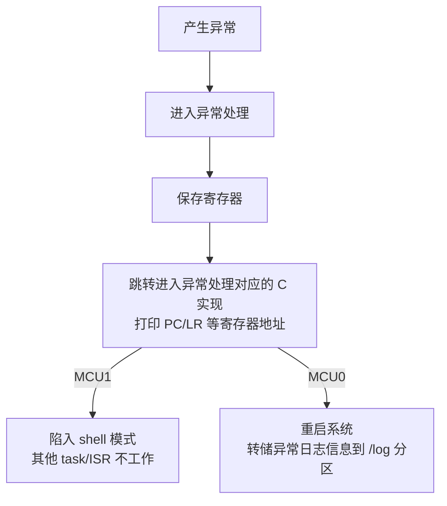

# MCU ramdump 功能

:::warning
目前 MCU0/MCU1 的异常现场（crash dump）共享一块内存。MCU0/MCU1**同时**出现异常的情况下，MCU ramdump 功能保存的信息不可用。
:::

## 概述

本文介绍 MCU ramdump 功能，包括异常现场的保存机制、获取方式，以及通过 `addr2line` 结合 elf 定位异常代码的方法。

- **定位**：说明 MCU0/MCU1 异常现场（crash dump）的保存机制与共享内存约定、通过 Acore sysfs 节点和 MCU shell（`crashdump`、`dumpmem`）获取现场的方法、MCU1 异常后的恢复方式，以及异常打印字段的含义与 `addr2line` 定位方法。
- **适用读者**：需要定位 MCU0/MCU1 固件异常（data abort / undefined / prefetch 等）的研发与测试工程师，以及需要定制异常现场处理的深度定制开发者。
- **前置条件**：已完成 MCU 固件的编译与加载，参见 [MCU 快速入门指南](01_basic_information.md) 与 [MCU 系统说明](02_MCU_build_system.md)；可登录 Acore（SSH 或调试串口）并进入 MCU shell；解析现场需要带符号的 MCU elf 与 `addr2line`（binutils）。
- **与其他模块关系**：异常现场由 MCU 侧在异常入口保存，Acore 侧经 `source/hobot-drivers/mcu_ramdump` 驱动提供 sysfs 节点读取；MCU0 panic 触发的转储由 [Log 使用指南](../03_system_software/03_log_introduction.md) 中的 `hobot-log` 归档到 `/log`；MCU1 的异常恢复依赖 Acore 的 remoteproc；MCU1 的开发与编译参见 [MCU1 开发指南](03_FreeRTOS_development.md) 与 [MCU 系统说明](02_MCU_build_system.md)。

## 实现原理

MCU ramdump 由现场保存、MCU 侧读取和 Acore 侧读取三部分组成，对应的源码位置如下：

| 环节 | 源码位置 | 说明 |
|------|----------|------|
| 现场保存 | `mcu/Target/Target_<SOC>/Target-hobot-lite-freertos{,-mcu1}/target/OsAssembly/gcc/startup.s` 的 `Os_SaveCrashDump0` | 异常入口，保存 R0-R12、SP/LR、PC、CPSR/SPSR、各模式（USR/FIQ/IRQ/ABT/UND）的 SP/LR/SPSR、IFSR/AIFSR/DFSR/ADFSR/IFAR/DFAR，以及 0x200 字节用户栈和 0x80 字节异常栈 |
| MCU 侧读取 | `mcu/Service/CrashDebug/src/hb_CrashDump.c` | `Exception_Shell()` 打印异常类型并决定后续动作；`crashdump_proc()` 提供 shell 查看命令 |
| Acore 侧读取 | `source/hobot-drivers/mcu_ramdump/mcu_ramdump.c` | 平台驱动 `drobotic,mcu-crash`，提供 sysfs 节点 `crash`；`CONFIG_MCU_RAMDUMP` 默认开启（`source/hobot-drivers/configs/drobot_s600_defconfig`） |

## 异常处理流程

当 MCU 进入异常时候，MCU 会将现场信息保留在一个全局变量中，该全局变量可以被 Acore 读取，也可以通过 MCU shell 读取。

如果是 MCU0 出现异常，系统将会重启，系统重启流程中会判断重启原因。如果判断重启原因是 `mpanic`，系统会确保保存 MCU 异常现场信息的全局变量对应的内存空间不清 0，我们可以在系统重启后读取到 ramdump 的数据，并基于此来分析异常发生的原因。

异常处理流程如下所示：



MCU0 和 MCU1 的异常处理流程基本类似，区别只在于 MCU0 在处理异常后会重启系统。

现场信息中记录的异常类型编号及其名称如下（来自 `hb_CrashDump.c` 的 `ExceptionName[]`）：

| 编号 | 名称 |
|------|------|
| 0 | `Reset` |
| 1 | `UnexpectedException0` |
| 2 | `Os_SVChandler0` |
| 3 | `UnexpectedMemory` |
| 4 | `UnexpectedMemory` |
| 5 | `Os_Trap0` |

## 异常后重启 MCU1

MCU1 出现异常后会陷入 shell，这时可以通过 Acore remoteproc 控制机制停止以及重新启动 MCU1。命令参考如下：

```shell
  # 停止运行
  echo stop > /sys/class/remoteproc/remoteproc_mcu1/state
  # 启动
  echo start > /sys/class/remoteproc/remoteproc_mcu1/state
```

## 获取 MCU 异常信息

- 可以在 Acore 通过 sysfs 节点读取 MCU1 异常时记录的现场信息。对应的 sys 节点信息如下：

  ```shell
    cat /sys/devices/platform/soc/soc:mcu_crash/crash
  ```

- 也可以在 MCU shell 中查看现场信息，常用命令如下：

  | 命令 | 说明 |
  |------|------|
  | `crashdump` | 打印 crash dump 内存地址、`R14`/`R14_USR`、异常前后的 `R0`，以及 `IFSR`/`AIFSR`/`DFSR`/`ADFSR`/`IFAR`/`DFAR` |
  | `dumpmem <addr> <width> <len>` | 以十六进制打印指定内存：`<addr>` 为起始地址，`<width>` 为访问宽度（仅支持 `1`、`2`、`4` 字节），`<len>` 为打印的元素个数，输出为每行 16 字节 |

  示例：

  ```shell
    # 打印现场信息（含 crash dump 内存地址）
    crashdump

    # 从现场起始地址开始，按 4 字节宽度打印 64 个元素
    dumpmem [addr] 4 64
  ```

- MCU0 发生异常，系统重启后检查重启原因是 `mpanic`，会将现场信息转储到 `/log` 分区，便于我们跟踪历史日志分析问题。log 日志转储目录命名格式如 `SuperSoC_Mdump-<count>-<time>`。 \
  其中，`<count>` 代表系统第几次重启。`<time>` 代表时间，时间格式为 `年_月_日_时_分_秒`，例如：`SuperSoC_Mdump-0010-2025_08_13_20_25_11`

- 确认本次重启原因可执行：

  ```shell
    cat /sys/kernel/debug/reboot_reason/reboot_reason
  ```

  输出的第三个字段即为重启原因（如 `poweroff`、`kreboot`、`mpanic`），为 `mpanic` 时说明本次是 MCU0 panic 触发的转储。

- MCU 在发生 data abort/undefined/prefetch 异常时，可以将现场信息 dump 出来，便于我们分析问题。

## 异常打印分析

以发生 data abort 为例记录的异常信息进行说明：


这些数据的含义如下：

- 箭头 1 表示出现数据访问异常时的访问地址，如上图可以看到异常的时候，是尝试访问 0x1 地址的数据

- 箭头 2 是异常状态的数据，一般可不关注

- 箭头 3 表示发生的异常类型

- 箭头 4 表示产生异常的指令所在位置。通过该地址信息我们结合 elf 解析，可以定位到发生异常时的具体代码位置。示例如下：

  ```shell
    addr2line -e S100_MCU_DEBUG.elf 0xcab3fa1
  ```
  如果系统没有安装 addr2line，可以通过以下命令安装：

  ```shell
    sudo apt update
    sudo apt install binutils -y
  ```

  :::info
  MCU0 为闭源实现，源码包不提供 MCU0 的业务代码与带符号 elf，`addr2line` 可能无法解析 MCU0 的地址；MCU1 源码开放，可使用自行编译出的带符号 elf 解析。
  :::

- 箭头 5 表示产生异常时，CPU cpsr 寄存器的值

- 箭头 6 表示发生异常时记录 crash dump 的地址信息。可以通过 MCU shell 输入 `dumpmem [addr] 4 64` 来读取 crash 现场保存的寄存器和栈信息，或者在 [Acore 通过 sysfs](#获取-mcu-异常信息) 获取 crash 现场的寄存器和栈信息

## 常见问题

### 执行 `addr2line` 命令提示找不到该命令

**原因**：系统未安装包含 `addr2line` 的 binutils 工具包。

**解决**：安装 binutils 后重试。

```shell
sudo apt update
sudo apt install binutils -y
```

### MCU1 异常后陷入 shell，不再继续运行

**原因**：MCU1 出现异常后不会自动复位（与 MCU0 异常后系统会自动重启不同），而是陷入 shell。

**解决**：通过 Acore 的 remoteproc 控制机制将 MCU1 停止后重新启动。

```shell
# 停止运行
echo stop > /sys/class/remoteproc/remoteproc_mcu1/state
# 启动
echo start > /sys/class/remoteproc/remoteproc_mcu1/state
```

## 相关文档

- [MCU1 开发指南](/Advanced_development/mcu_development/FreeRTOS_development)
- [Linux 调试功能介绍](/Advanced_development/system_software/kernel_debug)
