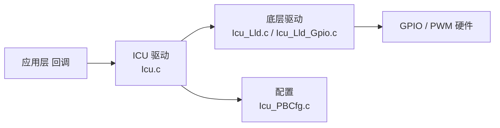

# ICU 使用指南

```mdx-code-block
import DocScope from '@site/src/components/DocScope';
```

## 概述

ICU（Input Capture Unit，输入捕获单元）对系统内具有输入捕获属性的硬件进行软件抽象并统一管理，硬件层 IP 涉及 PWM 和 GPIO 两个，本文重点介绍 GPIO 中断的配置和实现。

- **定位**：帮助用户在 MCU 上配置并使用 GPIO 中断。
- **适用读者**：需要在 MCU 上开发 GPIO 中断功能的深度定制开发者。
- **前置条件**：了解 MCU 基本框架，参见 [MCU 快速入门指南](01_basic_information.md)。
- **与其他模块关系**：使用 GPIO 中断前，须先由 Port 模块将目标引脚配置为 GPIO 功能，参见 [Port 使用指南](12_mcu_port/01_user_manual.md)。

## 硬件支持

<DocScope products="RDK S100">
- GPIO IO 组：4 组，分别为 GPIO0、GPIO1、GPIO2、GPIO_AON
- MCU 域引脚数：88
- AON 域引脚数：18
</DocScope>
<DocScope products="RDK S600">
- GPIO IO 组：5 组，分别为 GPIO0、GPIO1、GPIO2、GPIO3、GPIO_AON
- MCU 域引脚数：105
- AON 域引脚数：42
</DocScope>

所有 Pin 支持的中断触发模式包括：上升沿、下降沿、双边沿以及高/低电平触发。

### 中断资源

<DocScope products="RDK S100">
| ISR Function | IRQ | IRQ Define           | Description |
| :----------- | :-- | :------------------- | :---------- |
| Gpio0_ExtIsr | 68  | MCUSYS_GPIO0_INTR    | Gpio Mode   |
| Gpio1_ExtIsr | 69  | MCUSYS_GPIO1_INTR    | Gpio Mode   |
| Gpio2_ExtIsr | 70  | MCUSYS_GPIO2_INTR    | Gpio Mode   |
| Gpio3_ExtIsr | 361 | AON_WAKEUP_GPIO_INTR | Gpio Mode   |
</DocScope>
<DocScope products="RDK S600">
| ISR Function | IRQ | IRQ Define        | Description |
| :----------- | :-- | :---------------- | :---------- |
| Gpio0_ExtIsr | 89  | MCUSYS_GPIO0_INTR | Gpio Mode   |
| Gpio1_ExtIsr | 90  | MCUSYS_GPIO1_INTR | Gpio Mode   |
| Gpio2_ExtIsr | 91  | MCUSYS_GPIO2_INTR | Gpio Mode   |
| Gpio3_ExtIsr | 92  | MCUSYS_GPIO3_INTR | Gpio Mode   |
| Gpio4_ExtIsr | 371 | AON_GPIO_INTR     | Gpio Mode   |
</DocScope>

## 软件架构

ICU 驱动采用分层设计：应用层通过回调接收中断，ICU 驱动经底层 LLD 访问 GPIO/PWM 硬件，回调由 `GpioChannelNotification` 注册。



## 代码路径

```bash
McalCdd/Icu/src/Icu.c              # ICU 驱动实现
McalCdd/Icu/src/Icu_Lld.c          # 底层驱动实现
McalCdd/Icu/src/Icu_Lld_Gpio.c     # GPIO 中断注册与使能
McalCdd/Icu/inc/Icu.h              # ICU 上层接口
McalCdd/Icu/inc/Icu_Lld.h          # LLD 接口
McalCdd/Icu/inc/Icu_Types.h        # 类型定义
McalCdd/Icu/inc/Icu_Lld_Gpio.h     # GPIO LLD 接口
samples/Interrupt/src/gpio_Interrupt_test.c  # GPIO 中断 sample
```

板级配置：

<DocScope products="RDK S100">
```bash
Config/McalCdd/gen_s100_sip_B_mcu1/Icu/src/Icu_PBCfg.c   # ICU 配置
Config/McalCdd/gen_s100_sip_B_mcu1/Port/src/Port_PBcfg.c # 引脚功能配置
```
</DocScope>
<DocScope products="RDK S600">
```bash
Config/McalCdd/gen_s600_md_mcu1/Icu/src/Icu_PBCfg.c   # ICU 配置
Config/McalCdd/gen_s600_md_mcu1/Port/src/Port_PBcfg.c # 引脚功能配置
```
</DocScope>

## GPIO 中断配置

### 将目标引脚配置为 GPIO 功能

MCU 上的每个 Pin 支持至少一个功能，因此在使用 GPIO 中断之前需要通过 Port 子系统配置 Pin 的功能和属性，也就是重定义过程。

<DocScope products="RDK S100">
以 `GPIO_MCU[20]` 和 `GPIO_MCU[21]` 为例，这两个 Pin 的功能如下：

| FUNC0     | IO TYPE0 | FUNC1      | IO TYPE1 | FUNC2   | IO TYPE2 | FUNC3        | IO TYPE3 |
| :-------- | :------- | :--------- | :------- | :------ | :------- | :----------- | :------- |
| SPI3_CSN0 | O        | DEBUG_OUT5 | O        | TRC_CTL | O        | GPIO_MCU[20] | IO       |
| SPI3_CSN1 | IO       | PPS_IN0    | I        | TRC_CLK | O        | GPIO_MCU[21] | IO       |
</DocScope>
<DocScope products="RDK S600">
以 `GPIO_MCU[52]` 和 `GPIO_MCU[53]` 为例，这两个 Pin 的功能如下：

| FUNC0   | IO TYPE0 | FUNC1      | IO TYPE1 | FUNC2     | IO TYPE2 | FUNC3        | IO TYPE3 |
| :------ | :------- | :--------- | :------- | :-------- | :------- | :----------- | :------- |
| PWM4_IO | IO       | SPI11_MISO | I        | USS_PWM17 | IO       | GPIO_MCU[52] | IO       |
| PWM5_IO | IO       | SPI11_SCLK | O        | USS_PWM18 | IO       | GPIO_MCU[53] | IO       |
</DocScope>

需要将两个 Pin 配置为 FUNC3，即 GPIO 模式。Port 的介绍和使用参见 [Port 使用指南](12_mcu_port/01_user_manual.md) 与 [Port 开发指南](12_mcu_port/02_development_manual.md)。

<DocScope products="RDK S100">
```c
static const Port_Lld_PinConfigType Port_McuPinConfigs[PORT_MCU_MAX_NUM]=
{
    ...
    /* Pin Id,  Pin name,      IsUsed,        ModeChang,    SchmittTriger,  InputEnable,     IsUsedGpio,     DirChang,   PinMode,    Config Type,        Pull Type,   Drive Strength,       GpioDir,           GpioData*/
    {(uint8)20, "SPI3_CSN0", (boolean)TRUE, {(boolean)TRUE, (boolean)FALSE, (boolean)TRUE, (boolean)TRUE, (boolean)FALSE, GPIO, PORT_PIN_CONFIG_TYPE0, PORT_PULL_UP, PORT_DRIVE_DEFAULT, PORT_PIN_DIR_IN, PORT_PIN_LEVEL_LOW}},
    /* Pin Id,  Pin name,      IsUsed,        ModeChang,    SchmittTriger,  InputEnable,     IsUsedGpio,     DirChang,   PinMode,    Config Type,        Pull Type,   Drive Strength,       GpioDir,           GpioData*/
    {(uint8)21, "PWR_SHDN_N", (boolean)TRUE, {(boolean)TRUE, (boolean)FALSE, (boolean)TRUE, (boolean)TRUE, (boolean)FALSE, GPIO, PORT_PIN_CONFIG_TYPE0, PORT_PULL_UP, PORT_DRIVE_DEFAULT, PORT_PIN_DIR_IN, PORT_PIN_LEVEL_LOW}},
    ...
}
```
</DocScope>
<DocScope products="RDK S600">
```c
static const Port_Lld_PinConfigType Port_McuPinConfigs[PORT_MCU_MAX_NUM]=
{
    ...
    /* Pin Id,  Pin name,      IsUsed,        ModeChang,    SchmittTriger,  InputEnable,     IsUsedGpio,     DirChang,   PinMode,    Config Type,     Pull Type,   Drive Strength,       GpioDir,           GpioData*/
    {(uint8)52, "PWM4_IO", (boolean)TRUE, {(boolean)TRUE, (boolean)FALSE, (boolean)TRUE, (boolean)TRUE, (boolean)TRUE, GPIO, PORT_PIN_CONFIG_TYPE0, PORT_PULL_DOWN, PORT_DRIVE_DEFAULT, PORT_PIN_DIR_IN, PORT_PIN_LEVEL_LOW}},
    /* Pin Id,  Pin name,      IsUsed,        ModeChang,    SchmittTriger,  InputEnable,     IsUsedGpio,     DirChang,   PinMode,    Config Type,     Pull Type,   Drive Strength,       GpioDir,           GpioData*/
    {(uint8)53, "PWM5_IO", (boolean)TRUE, {(boolean)TRUE, (boolean)FALSE, (boolean)TRUE, (boolean)TRUE, (boolean)TRUE, GPIO, PORT_PIN_CONFIG_TYPE0, PORT_PULL_DOWN, PORT_DRIVE_DEFAULT, PORT_PIN_DIR_IN, PORT_PIN_LEVEL_LOW}},
    ...
}
```

:::info 说明
以上为目标状态。板级配置中这两个 Pin 默认工作于 PWM 功能（`PWM4_IO_FUNC0` / `PWM5_IO_FUNC0`，方向为输出）。使用 GPIO 中断前，须将 `PinMode` 改为 `GPIO`、并按需调整 `GpioDir` 与上下拉，如上方示例所示。
:::
</DocScope>

### ICU 配置

GPIO 中断功能由 ICU 统一管理，引脚的详细属性（如中断类型、回调函数等）均需通过 ICU 配置，涉及的源文件：

```text
McalCdd/Icu/src/Icu_Lld_Gpio.c
McalCdd/Icu/src/Icu_Lld.c
McalCdd/Icu/src/Icu.c
McalCdd/Icu/inc/Icu_Lld_Gpio.h
McalCdd/Icu/inc/Icu_Lld.h
McalCdd/Icu/inc/Icu_Types.h
McalCdd/Icu/inc/Icu.h
```

通过修改 `Icu_ConfigType`、`Icu_Lld_IpConfigType`、`Gpio_Icu_IpConfigType`、`Icu_Lld_ChannelConfigType`、`Icu_ChannelConfigType`、`Gpio_Icu_ChannelConfigType` 等结构体实现。其中 `Gpio_Icu_ChannelConfigType` 是关键结构，负责定义中断回调函数、触发类型及中断屏蔽位等。

:::info 说明
以下示例取自本产品的板级配置 `Icu_PBCfg.c`。
<DocScope products="RDK S600">
与 RDK S100 相比，`instanceNo` 取值为 `1`，回调函数名前缀为 `Icu_Gpio_Channel_1_*`。
</DocScope>
:::

#### Icu_ConfigType

```c
#define ICU_CONF_IPS_PB 1
#define ICU_CONF_CHS_PB 2

/** @brief Array of configured Icu channels */
const Icu_ConfigType Icu_Config = {
    /** @brief Number of configured Icu ips */
    .nNumInstances = ICU_CONF_IPS_PB,
    /** @brief Number of configured Icu channels */
    .NumChannels = ICU_CONF_CHS_PB,
    /** @brief Number of configured Icu channels */
    .Icu_ChannelConfigPtr = Icu_ChConfig_PB,
    /** @brief Pointer to array of Icu channels */
    .Icu_LldConfigPtr = Icu_Lld_IpConfig_PB,
};
```

| Parameter            | Description                               |
| :------------------- | :---------------------------------------- |
| nNumInstances        | GPIO 控制器实例数                         |
| NumChannels          | 通道数（或引脚数）                        |
| Icu_ChannelConfigPtr | 指向 `Icu_ChannelConfigType` 结构体的指针 |
| Icu_LldConfigPtr     | 指向 `Icu_Lld_IpConfigType` 结构体的指针  |

#### Icu_Lld_IpConfigType

```c
#define ICU_CONF_IPS_PB 1

/** @brief Array of high level Icu channel Config Type*/
static Icu_Lld_IpConfigType Icu_Lld_IpConfig_PB[ICU_CONF_IPS_PB] = {
    /** @brief gpio module 0 */
    {
        /**< id of gpio icu module in the Icu configuration */
        .instanceNo = 0,
        /**< The IP type used. */
        .InstanceMode = ICU_GPIO_MODULE,
        /**< gpio IP configure type. */
        .GpioConfig = &Icu_Gpio_IpConfig_PB[0],
    },
};
```

| Parameter    | Description                                  |
| :----------- | :------------------------------------------- |
| instanceNo   | 控制器实例（如 0 表示 GPIO0）                |
| InstanceMode | GPIO 或者 PWM 模式                           |
| GpioConfig   | 指向 `Icu_Lld_ChannelConfigType` 结构体的指针 |

#### Gpio_Icu_IpConfigType

```c
#define ICU_GPIO_CONF_MODS_PB 1

/** @brief Array of gpio Icu ip Config Type channels */
static Gpio_Icu_IpConfigType Icu_Gpio_IpConfig_PB[ICU_GPIO_CONF_MODS_PB] = {
    /** @brief gpio module 1 */
    {
        /**< Number of gpio channels in the Icu configuration */
        .NumChannels = 2,
        /**< The Instance index used for the configuration of channel */
        .instanceNo = 0,
        /**< id of gpio icu module in the Icu configuration */
        .ChannelsConfig = Icu_Gpio_ChannelConfig_PB[0],
    },
};
```

| Parameter      | Description                                   |
| :------------- | :-------------------------------------------- |
| NumChannels    | 通道数                                        |
| instanceNo     | 控制器实例（如 0 表示 GPIO0）                 |
| ChannelsConfig | 指向 `Gpio_Icu_ChannelConfigType` 结构体的指针 |

#### Icu_ChannelConfigType

```c
#define ICU_CONF_CHS_PB 2

/** @brief Array of high level Icu channel Config Type*/
static Icu_ChannelConfigType Icu_ChConfig_PB[ICU_CONF_CHS_PB] = {
    /** @brief icu CH 0 */
    {
        /** Assigned ICU channel id*/
        .ChannelId = 0,
        /** @brief Pointer to the lld gpio channel pointer configuration, gpio 4 channel 0 */
        .Icu_LldChannelConfigPtr = &Icu_Lld_Gpio_ChannelConfig_PB[0][0],
    },
    /** @brief icu CH 1 */
    {
        /** Assigned ICU channel id*/
        .ChannelId = 1,
        /** @brief Pointer to the lld gpio channel pointer configuration, gpio 4 channel 1 */
        .Icu_LldChannelConfigPtr = &Icu_Lld_Gpio_ChannelConfig_PB[0][1],
    },
};
```

| Parameter               | Description                                 |
| :---------------------- | :------------------------------------------ |
| ChannelId               | 通道标识符                                  |
| Icu_LldChannelConfigPtr | 指向 `Icu_Lld_ChannelConfigType` 结构的指针 |

#### Icu_Lld_ChannelConfigType

```c
#define ICU_GPIO_CONF_MODS_PB 1

/** @brief Array of Gpio Channel ConfigType channels*/
static Icu_Lld_ChannelConfigType Icu_Lld_Gpio_ChannelConfig_PB[ICU_GPIO_CONF_MODS_PB][32] = {
    /** @brief gpio module 0 */
    {
        /** @brief gpio mod 0 channel 20 */
        {
            .ChannelMode = ICU_GPIO_MODULE,
            .instanceNo = 0,
            .gpioHwChannelConfig = &Icu_Gpio_ChannelConfig_PB[0][0],
        },
        /** @brief gpio mod 0 channel 21 */
        {
            .ChannelMode = ICU_GPIO_MODULE,
            .instanceNo = 0,
            .gpioHwChannelConfig = &Icu_Gpio_ChannelConfig_PB[0][1],
        },
    },
};
```

| Parameter           | Description                                   |
| :------------------ | :-------------------------------------------- |
| ChannelMode         | GPIO 或者 PWM 模式                            |
| instanceNo          | 控制器实例（如 0 表示 GPIO0）                 |
| gpioHwChannelConfig | 指向 `Gpio_Icu_ChannelConfigType` 结构体的指针 |

#### Gpio_Icu_ChannelConfigType

<DocScope products="RDK S100">
```c
#define ICU_GPIO_CONF_MODS_PB 1

extern void Icu_Gpio_Channel_0_20_ISR(void);
extern void Icu_Gpio_Channel_0_21_ISR(void);

/** @brief Array of Gpio Channel ConfigType channels*/
static Gpio_Icu_ChannelConfigType Icu_Gpio_ChannelConfig_PB[ICU_GPIO_CONF_MODS_PB][32] = {
    /** @brief gpio module 0 */
    {
        /** @brief gpio mod 0 channel 20 */
        {
            /**< Assigned GPIO channel id*/
            .PinId = 20,
            /**< Assigned GPIO ip id*/
            .instanceNo = 1,
            /**< GPIO Default Start Edge */
            .DefaultStartEdge = GPIO_ICU_FALLING_EDGE,
            /**< Notification Enable.*/
            .NotificationEnable = TRUE,
            /**< The notification functions shall have no parameters and no return value.*/
            .GpioChannelNotification = Icu_Gpio_Channel_0_20_ISR,
            /**< The logic channel for which Callback is set. */
            .callbackParam = 20,
            /**< Interrupt Enable or Disable . */
            .IntEnable = TRUE,
            /**< Interrupt Mask or Umask . */
            .IntMask = FALSE,
        },
        /** @brief gpio mod 0 channel 21 */
        {
            /**< Assigned GPIO channel id*/
            .PinId = 21,
            /**< Assigned GPIO ip id*/
            .instanceNo = 0,
            /**< GPIO Default Start Edge */
            .DefaultStartEdge = GPIO_ICU_FALLING_EDGE,
            /**< Notification Enable.*/
            .NotificationEnable = TRUE,
            /**< The notification functions shall have no parameters and no return value.*/
            .GpioChannelNotification = Icu_Gpio_Channel_0_21_ISR,
            /**< The logic channel for which Callback is set. */
            .callbackParam = 21,
            /**< Interrupt Enable or Disable . */
            .IntEnable = TRUE,
            /**< Interrupt Mask or Umask . */
            .IntMask = FALSE,
        },
    },
};
```
</DocScope>
<DocScope products="RDK S600">
```c
#define ICU_GPIO_CONF_MODS_PB 1

extern void Icu_Gpio_Channel_1_20_ISR(void);
extern void Icu_Gpio_Channel_1_21_ISR(void);

/** @brief Array of Gpio Channel ConfigType channels*/
static Gpio_Icu_ChannelConfigType Icu_Gpio_ChannelConfig_PB[ICU_GPIO_CONF_MODS_PB][32] = {
    /** @brief gpio module 1 */
    {
        /** @brief gpio mod 1 channel 20 */
        {
            /**< Assigned GPIO channel id*/
            .PinId = 20,
            /**< Assigned GPIO ip id*/
            .instanceNo = 1,
            /**< GPIO Default Start Edge */
            .DefaultStartEdge = GPIO_ICU_BOTH_EDGES,
            /**< Notification Enable.*/
            .NotificationEnable = TRUE,
            /**< The notification functions shall have no parameters and no return value.*/
            .GpioChannelNotification = Icu_Gpio_Channel_1_20_ISR,
            /**< The logic channel for which Callback is set. */
            .callbackParam = 0,
            /**< Interrupt Enable or Disable . */
            .IntEnable = TRUE,
            /**< Interrupt Mask or Umask . */
            .IntMask = FALSE,
        },
        /** @brief gpio mod 1 channel 21 */
        {
            /**< Assigned GPIO channel id*/
            .PinId = 21,
            /**< Assigned GPIO ip id*/
            .instanceNo = 1,
            /**< GPIO Default Start Edge */
            .DefaultStartEdge = GPIO_ICU_BOTH_EDGES,
            /**< Notification Enable.*/
            .NotificationEnable = TRUE,
            /**< The notification functions shall have no parameters and no return value.*/
            .GpioChannelNotification = Icu_Gpio_Channel_1_21_ISR,
            /**< The logic channel for which Callback is set. */
            .callbackParam = 0,
            /**< Interrupt Enable or Disable . */
            .IntEnable = TRUE,
            /**< Interrupt Mask or Umask . */
            .IntMask = FALSE,
        },
    },
};
```
</DocScope>

| Parameter               | Description                                                                                        |
| :---------------------- | :------------------------------------------------------------------------------------------------- |
| PinId                   | 引脚号（或通道号）                                                                                 |
| instanceNo              | 控制器实例。该字段不参与驱动逻辑，详见下方说明                                                     |
| DefaultStartEdge        | 中断触发方式: <br />1. 下降沿 <br />2. 上升沿 <br />3. 上升沿或者下降沿 <br />4. 高电平 <br />5. 低电平 |
| NotificationEnable      | 是否启用回调                                                                                       |
| GpioChannelNotification | 回调函数指针（无传参，无返回值）                                                                   |
| IntEnable               | 是否使能中断：`TRUE` 使能中断，`FALSE` 禁止中断                                                    |
| IntMask                 | 是否屏蔽中断：`TRUE` 屏蔽中断，`FALSE` 不屏蔽中断                                                  |

:::info 说明
`Gpio_Icu_ChannelConfigType.instanceNo` 不参与驱动逻辑。驱动实际使用的控制器实例来自上一层的 `Gpio_Icu_IpConfigType.instanceNo`，由 `Icu_Lld.c` 作为 `Instance` 参数传入 `Gpio_Icu_Init`。配置本结构体时，各通道的该字段填值不影响中断路由。
:::

`IntEnable` 与 `IntMask` 均用于中断开关控制，两者区别在于：

- `IntEnable`：为 `FALSE` 时，从根本上禁止中断产生，中断状态寄存器不会置位。
- `IntMask`：为 `TRUE` 时，仅阻止中断信号上报至 CPU，但中断事件仍会触发并在状态寄存器中置位。

配置建议：

- 启用中断时：`IntEnable = TRUE` 且 `IntMask = FALSE`。
- 禁用中断时：`IntEnable = FALSE` 且 `IntMask = TRUE`。

回调函数是中断触发后的最终入口，完整流程为：中断函数 → ICU 中断处理函数 → 回调函数。`NotificationEnable` 用于控制是否执行回调函数，将其设为 `FALSE` 会跳过回调，但不影响中断的发生与标志位的产生。若要完整启用中断及回调，必须确保 `NotificationEnable = TRUE`、`IntEnable = TRUE`、`IntMask = FALSE` 且 `GpioChannelNotification` 指向具体的回调函数。建议回调函数名应体现其所属 Instance 与 Channel。

<DocScope products="RDK S100">
回调函数在 `samples/Interrupt/src/gpio_Interrupt_test.c` 中定义：

```c
/** GPIO_MCU[20] interrupt callback function */
void Icu_Gpio_Channel_0_20_ISR(void)
{
    TEST_INFO("Enter Icu_Gpio_Channel_0_20_ISR!!!\r\n");
    /** Add user code here */
}

/** GPIO_MCU[21] interrupt callback function */
void Icu_Gpio_Channel_0_21_ISR(void)
{
    TEST_INFO("Enter Icu_Gpio_Channel_0_21_ISR!!!\r\n");
    /** Add user code here */
}
```
</DocScope>
<DocScope products="RDK S600">
回调函数在 `samples/Interrupt/src/gpio_Interrupt_test.c` 中定义：

```c
/** GPIO_MCU[52] interrupt callback function */
void Icu_Gpio_Channel_1_20_ISR(void)
{
    TEST_INFO("Enter Icu_Gpio_Channel_1_20_ISR!!!\r\n");
    /** Add user code here */
}

/** GPIO_MCU[53] interrupt callback function */
void Icu_Gpio_Channel_1_21_ISR(void)
{
    TEST_INFO("Enter Icu_Gpio_Channel_1_21_ISR!!!\r\n");
    /** Add user code here */
}
```
</DocScope>

> 用户仅需在回调函数中实现业务逻辑，无需手动清除中断标志位，此操作由 ICU 驱动自动完成。

### 中断注册

中断的注册、优先级配置及使能过程定义在 `McalCdd/Icu/src/Icu_Lld_Gpio.c`，该文件按 `SOC_TYPE` 区分产品差异：

```c
void Icu_Gpio_Interrupt_Init(uint8 Instance, uint8 priority)
{
    uint8 cmd = Instance;

    switch (cmd) {
    case 0:
        INT_SYS_InstallHandler(MCUSYS_GPIO0_INTR, Gpio0_ExtIsr, 0);
        INT_SYS_SetPriority(MCUSYS_GPIO0_INTR, priority);
        INT_SYS_EnableIRQ(MCUSYS_GPIO0_INTR);
        break;
    case 1:
        INT_SYS_InstallHandler(MCUSYS_GPIO1_INTR, Gpio1_ExtIsr, 0);
        INT_SYS_SetPriority(MCUSYS_GPIO1_INTR, priority);
        INT_SYS_EnableIRQ(MCUSYS_GPIO1_INTR);
        break;
    case 2:
        INT_SYS_InstallHandler(MCUSYS_GPIO2_INTR, Gpio2_ExtIsr, 0);
        INT_SYS_SetPriority(MCUSYS_GPIO2_INTR, priority);
        INT_SYS_EnableIRQ(MCUSYS_GPIO2_INTR);
        break;
#if ((SOC_TYPE == SOC_TYPE_S100) || (SOC_TYPE == SOC_TYPE_S100P))
    case 3:
        INT_SYS_InstallHandler(AON_WAKEUP_GPIO_INTR, Gpio3_ExtIsr, 0);
        INT_SYS_SetPriority(AON_WAKEUP_GPIO_INTR, priority);
        INT_SYS_EnableIRQ(AON_WAKEUP_GPIO_INTR);
        break;
#endif
#if ((SOC_TYPE == SOC_TYPE_S600) || (SOC_TYPE == SOC_TYPE_S300))
    case 3:
        INT_SYS_InstallHandler(MCUSYS_GPIO3_INTR, Gpio3_ExtIsr, 0);
        INT_SYS_SetPriority(MCUSYS_GPIO3_INTR, priority);
        INT_SYS_EnableIRQ(MCUSYS_GPIO3_INTR);
        break;
    case 4:
        INT_SYS_InstallHandler(AON_GPIO_INTR, Gpio4_ExtIsr, 0);
        INT_SYS_SetPriority(AON_WAKEUP_GPIO_INTR, priority);
        INT_SYS_EnableIRQ(AON_WAKEUP_GPIO_INTR);
        break;
#endif
    default:
        break;
    }
}
```

```c
void Icu_Gpio_Interrupt_DeInit(uint8 Instance)
{
    uint8 cmd = Instance;

    switch (cmd) {
    case 0:
        INT_SYS_DisableIRQ(MCUSYS_GPIO0_INTR);
        break;
    case 1:
        INT_SYS_DisableIRQ(MCUSYS_GPIO1_INTR);
        break;
    case 2:
        INT_SYS_DisableIRQ(MCUSYS_GPIO2_INTR);
        break;
#if ((SOC_TYPE == SOC_TYPE_S100) || (SOC_TYPE == SOC_TYPE_S100P))
    case 3:
        INT_SYS_DisableIRQ(AON_WAKEUP_GPIO_INTR);
        break;
#endif
#if ((SOC_TYPE == SOC_TYPE_S600) || (SOC_TYPE == SOC_TYPE_S300))
    case 3:
        INT_SYS_DisableIRQ(MCUSYS_GPIO3_INTR);
        break;
    case 4:
        INT_SYS_DisableIRQ(AON_WAKEUP_GPIO_INTR);
        break;
#endif
    default:
        break;
    }
}
```

用户只需调用 `Icu_Gpio_Interrupt_Init` 和 `Icu_Gpio_Interrupt_DeInit` 使能和禁止中断，用法参考 `samples/Interrupt/src/gpio_Interrupt_test.c`。

<DocScope products="RDK S100">
```c
/** init interrupt */
Icu_Gpio_Interrupt_Init(0, 30);

/** deinit interrupt */
Icu_Gpio_Interrupt_DeInit(0);
```
</DocScope>
<DocScope products="RDK S600">
```c
/** init interrupt */
Icu_Gpio_Interrupt_Init(1, 30);

/** deinit interrupt */
Icu_Gpio_Interrupt_DeInit(1);
```
</DocScope>

## GPIO 中断 sample

在 MCU1 串口端初始化 GPIO 中断：

```bash
D-Robotics:/$ gpio_interrupt on
[0975.377836 0]INFO: Start gpio_interrupt test...
```

用杜邦线一头接下图的两个 GPIO 引脚，另一头接地。

<DocScope products="RDK S100">


此时串口打印如下则表示 GPIO 中断触发成功：

```bash
# GPIO_MCU[20] 回调函数 0-instanceNo，20-PinId
[0667.710363 0]INFO: Enter Icu_Gpio_Channel_0_20_ISR!!!

# GPIO_MCU[21] 回调函数 0-instanceNo，21-PinId
[0593.171002 0]INFO: Enter Icu_Gpio_Channel_0_21_ISR!!!
```
</DocScope>
<DocScope products="RDK S600">


此时串口打印如下则表示 GPIO 中断触发成功：

```bash
# GPIO_MCU[52] 回调函数 1-instanceNo，20-PinId
[0667.710363 0]INFO: Enter Icu_Gpio_Channel_1_20_ISR!!!

# GPIO_MCU[53] 回调函数 1-instanceNo，21-PinId
[0593.171002 0]INFO: Enter Icu_Gpio_Channel_1_21_ISR!!!
```
</DocScope>

通过下面方式关闭 GPIO 中断：

```bash
D-Robotics:/$ gpio_interrupt off
[0673.558143 0]INFO: Stop gpio_interrupt test
```

## 应用程序接口

本节的 `Channel` 参数为 ICU 逻辑通道号，取自 `Icu_ChannelConfigType` 的 `ChannelId`；中断注册用到的 `Icu_Gpio_Interrupt_Init` / `Icu_Gpio_Interrupt_DeInit` 见 [中断注册](#中断注册)。

### Icu_Init

**【函数原型】**

`void Icu_Init(const Icu_ConfigType *ConfigPtr)`

**【功能描述】**

初始化 ICU 驱动，按配置结构体装载控制器实例与通道，是调用其余 ICU 接口的前提。

**【参数】**

| 参数 | 类型 | 必选 | 默认 | 说明 |
|---|---|---|---|---|
| ConfigPtr | const Icu_ConfigType * | 是 | 无 | 指向 ICU 配置结构体 |

**【返回值】**

无

### Icu_DeInit

**【函数原型】**

`void Icu_DeInit(void)`

**【功能描述】**

反初始化 ICU 模块，释放已装载的配置。

**【参数】**

无

**【返回值】**

无

### Icu_SetActivationCondition

**【函数原型】**

`void Icu_SetActivationCondition(Icu_ChannelType Channel, Icu_ActivationType Activation)`

**【功能描述】**

设置指定通道的中断触发边沿。用于运行期动态改变触发方式，替代配置结构体中的 `DefaultStartEdge`。

**【参数】**

| 参数 | 类型 | 必选 | 默认 | 说明 |
|---|---|---|---|---|
| Channel | Icu_ChannelType | 是 | 无 | ICU 逻辑通道号 |
| Activation | Icu_ActivationType | 是 | 无 | 触发方式，取值见下方说明 |

`Activation` 取值（`Icu_Types.h`）：

| 取值 | 说明 |
|---|---|
| `ICU_RISING_EDGE` | 上升沿触发 |
| `ICU_FALLING_EDGE` | 下降沿触发 |
| `ICU_BOTH_EDGES` | 双边沿触发 |
| `ICU_BOTH_EDGES_HIGH` | 高电平脉冲（先上升沿后下降沿） |
| `ICU_BOTH_EDGES_LOW` | 低电平脉冲（先下降沿后上升沿） |

**【返回值】**

无

### Icu_EnableNotification

**【函数原型】**

`void Icu_EnableNotification(Icu_ChannelType Channel)`

**【功能描述】**

使能指定通道的通知（回调）功能。对应配置结构体中的 `NotificationEnable`，用于运行期恢复回调。

**【参数】**

| 参数 | 类型 | 必选 | 默认 | 说明 |
|---|---|---|---|---|
| Channel | Icu_ChannelType | 是 | 无 | ICU 逻辑通道号 |

**【返回值】**

无

### Icu_DisableNotification

**【函数原型】**

`void Icu_DisableNotification(Icu_ChannelType Channel)`

**【功能描述】**

关闭指定通道的通知（回调）功能。关闭后中断仍可产生并置位标志，但不执行回调。

**【参数】**

| 参数 | 类型 | 必选 | 默认 | 说明 |
|---|---|---|---|---|
| Channel | Icu_ChannelType | 是 | 无 | ICU 逻辑通道号 |

**【返回值】**

无

### Icu_EnableEdgeDetection

**【函数原型】**

`void Icu_EnableEdgeDetection(Icu_ChannelType Channel)`

**【功能描述】**

使能指定通道的边沿检测。

**【参数】**

| 参数 | 类型 | 必选 | 默认 | 说明 |
|---|---|---|---|---|
| Channel | Icu_ChannelType | 是 | 无 | ICU 逻辑通道号 |

**【返回值】**

无

### Icu_DisableEdgeDetection

**【函数原型】**

`void Icu_DisableEdgeDetection(Icu_ChannelType Channel)`

**【功能描述】**

禁止指定通道的边沿检测。

**【参数】**

| 参数 | 类型 | 必选 | 默认 | 说明 |
|---|---|---|---|---|
| Channel | Icu_ChannelType | 是 | 无 | ICU 逻辑通道号 |

**【返回值】**

无

### Icu_EnableEdgeCount

**【函数原型】**

`void Icu_EnableEdgeCount(Icu_ChannelType Channel)`

**【功能描述】**

使能指定通道的边沿计数。

**【参数】**

| 参数 | 类型 | 必选 | 默认 | 说明 |
|---|---|---|---|---|
| Channel | Icu_ChannelType | 是 | 无 | ICU 逻辑通道号 |

**【返回值】**

无

### Icu_DisableEdgeCount

**【函数原型】**

`void Icu_DisableEdgeCount(Icu_ChannelType Channel)`

**【功能描述】**

禁止指定通道的边沿计数。

**【参数】**

| 参数 | 类型 | 必选 | 默认 | 说明 |
|---|---|---|---|---|
| Channel | Icu_ChannelType | 是 | 无 | ICU 逻辑通道号 |

**【返回值】**

无

### Icu_ResetEdgeCount

**【函数原型】**

`void Icu_ResetEdgeCount(Icu_ChannelType Channel)`

**【功能描述】**

将指定通道已计数的边沿值清零。

**【参数】**

| 参数 | 类型 | 必选 | 默认 | 说明 |
|---|---|---|---|---|
| Channel | Icu_ChannelType | 是 | 无 | ICU 逻辑通道号 |

**【返回值】**

无

## 调试

- **中断自测**：触发 GPIO 中断，核对回调日志（形如 `INFO: Enter Icu_Gpio_Channel_x_xx_ISR!!!`）是否打印。
- **配置核对**：完整启用中断及回调需 `NotificationEnable = TRUE`、`IntEnable = TRUE`、`IntMask = FALSE` 且 `GpioChannelNotification` 指向回调函数。
- **中断号核对**：核对目标引脚绑定的中断号及入口函数，中断号见 [中断资源](#中断资源)。

## 常见问题

### GPIO 中断不产生回调

**现象**：触发 GPIO 电平变化后，串口未打印回调函数中的日志。

**原因**：中断与回调的使能配置不全，`NotificationEnable`、`IntEnable`、`IntMask` 或 `GpioChannelNotification` 未按要求配置。

**解决**：确保 `NotificationEnable = TRUE`、`IntEnable = TRUE`、`IntMask = FALSE` 且 `GpioChannelNotification` 指向具体回调函数。

<!-- TODO(Sx): 待收集（补充第 2 条） -->

## 相关文档

- [MCU 快速入门指南](01_basic_information.md)
- [MCU1 开发指南](03_FreeRTOS_development.md)
- [Port 使用指南](12_mcu_port/01_user_manual.md)
- [Port 开发指南](12_mcu_port/02_development_manual.md)
