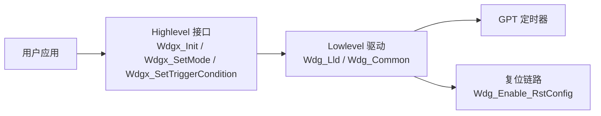

# MCU 看门狗

```mdx-code-block
import DocScope from '@site/src/components/DocScope';
```

## 概述

本文介绍 WDG（Watchdog，看门狗）驱动的功能、配置参数与应用程序接口。

- **定位**：帮助用户在 MCU 上使用看门狗实现超时复位与喂狗。
- **适用读者**：需要在 MCU 上集成看门狗功能的深度定制开发者。
- **前置条件**：了解 MCU 基本框架，参见 [MCU 快速入门指南](01_basic_information.md)。
- **与其他模块关系**：WDG 依赖 GPT 定时器提供喂狗周期，超时后经复位链路触发系统复位。

:::info 适用范围
本文介绍的是 **MCU 域**看门狗（`MCUSYS_WWDTx`），由 MCU 固件中的 WDG 驱动管理。

Acore 域另有独立的看门狗（设备树 `compatible = "snps,hb_wdt"`，Linux 驱动 `hb_wdt.c`），与本文的 `Wdgx` 是两套彼此独立的硬件与驱动，不在本文范围内。两者的数量与寄存器基址不同，请勿混用。
:::

文档中提及的 `Wdgx`，`x` 为实例索引。

<DocScope products="RDK S100">
硬件支持 3 个看门狗实例，有效范围为 0、1、2。
</DocScope>
<DocScope products="RDK S600">
硬件支持 5 个看门狗实例，有效范围为 0、1、2、3、4。
</DocScope>

各产品实际启用的实例数以 SDK 板级配置为准，见 [硬件支持](#硬件支持)。

## 硬件支持

<DocScope products="RDK S100">
- 硬件看门狗数量：3（`WWDT0` ~ `WWDT2`）
- 每实例含 Int 与 Rst 两类中断：中断向量 71~76
- SDK 当前配置：3 个实例（`Wdg0` ~ `Wdg2`）
- Acore 域独立看门狗：6 个（设备树 `watchdog0` ~ `watchdog5`）
</DocScope>
<DocScope products="RDK S600">
- 硬件看门狗数量：5（`WWDT0` ~ `WWDT4`）
- 每实例含 Int 与 Rst 两类中断：中断向量 93~102
- SDK 当前配置：3 个实例（`Wdg0` ~ `Wdg2`）
- Acore 域独立看门狗：2 个（设备树 `watchdog0` ~ `watchdog1`）
</DocScope>

## 软件架构

WDG 驱动采用分层设计，用户通过 Highlevel Wdgx API 调用底层驱动，底层驱动经 GPT 定时器提供喂狗周期，并通过复位链路完成超时复位。



## 代码路径

Lowlevel 接口（底层驱动实现与内部公共接口，一般用户无需直接关注）：

```bash
McalCdd/Wdg/inc/Wdg_Lld.h     # 底层驱动接口
McalCdd/Wdg/src/Wdg_Lld.c     # 底层驱动实现
McalCdd/Wdg/inc/Wdg_Prv.h     # 私有类型与接口
McalCdd/Wdg/src/Wdg_Common.c  # 公共实现
```

Highlevel 接口（用户调用的 API，每个实例一份独立文件）：

<DocScope products="RDK S100">
```bash
McalCdd/Wdg/src/Wdg0.c  McalCdd/Wdg/inc/Wdg0.h
McalCdd/Wdg/src/Wdg1.c  McalCdd/Wdg/inc/Wdg1.h
McalCdd/Wdg/src/Wdg2.c  McalCdd/Wdg/inc/Wdg2.h
```
</DocScope>
<DocScope products="RDK S600">
```bash
McalCdd/Wdg/src/Wdg0.c  McalCdd/Wdg/inc/Wdg0.h
McalCdd/Wdg/src/Wdg1.c  McalCdd/Wdg/inc/Wdg1.h
McalCdd/Wdg/src/Wdg2.c  McalCdd/Wdg/inc/Wdg2.h
McalCdd/Wdg/src/Wdg3.c  McalCdd/Wdg/inc/Wdg3.h   # 源文件已提供，SDK 默认未启用
McalCdd/Wdg/src/Wdg4.c  McalCdd/Wdg/inc/Wdg4.h   # 源文件已提供，SDK 默认未启用
```

:::warning 警告
`Wdg3` / `Wdg4` 的源文件与接口已随 SDK 提供，但板级配置中 `WDG_NUM = 3`，`Wdg_Config[]` 与 `Wdg_CoreIdConfig[]` 均只装载 3 个实例（索引 0~2）。在未扩展配置的情况下直接调用 `Wdg3_Init()` / `Wdg4_Init()` 会越界访问上述数组，属未定义行为。如需启用，须同时扩展 `WDG_NUM`、`Wdg_Config[]` 与 `Wdg_CoreIdConfig[]`。
:::
</DocScope>

## 类型定义

### 导入类型

| Module | Header File | Imported Type |
|---|---|---|
| Std_Types | Std_Types.h | Std_ReturnType |
| Std_Types | Std_Types.h | Std_VersionInfoType |
| Rte_Type | Rte_Type.h | Dem_EventIdType |
| Rte_Type | Rte_Type.h | Dem_EventStatusType |
| WdgIf | WdgIf_Types.h | WdgIf_ModeType |

### Wdg_ApiIdType

| Name | Wdg_ApiIdType |
|---|---|
| Type | Enumeration |
| Element | `0x00` `WDG_INIT_API_ID`：Api Id of Wdg_Init |
| | `0x01` `WDG_SETMODE_API_ID`：Api Id of Wdg_SetMode |
| | `0x02` `WDG_SETTRIGGERCONDITION_API_ID`：Api Id of Wdg_SetTriggerCondition |
| | `0x03` `WDG_GETVERSION_API_ID`：Api Id of Wdg_GetVersionInfo |
| Description | WDG ApiId Enumeration |
| Available via | Wdg_Prv.h |

### Wdg_ErrIdType

| Name | Wdg_ErrIdType |
|---|---|
| Type | Enumeration |
| Element | `0x10` `WDG_E_DRIVER_STATE`：Error ID of wrong driver state |
| | `0x11` `WDG_E_PARAM_MODE`：Error ID of wrong mode |
| | `0x12` `WDG_E_PARAM_CONFIG`：Error ID of wrong config |
| | `0x13` `WDG_E_PARAM_TIMEOUT`：Error ID of wrong timeout |
| | `0x14` `WDG_E_PARAM_POINTER`：Error ID of wrong pointer |
| | `0x15` `WDG_E_INIT_FAILED`：Error ID of init failed |
| | `0x16` `WDG_E_PARAM_CORE`：Error ID of wrong core |
| Description | WDG ErrId Enumeration |
| Available via | Wdg_Prv.h |

### Wdg_StateType

| Name | Wdg_StateType |
|---|---|
| Type | Enumeration |
| Element | `0x01` `WDG_UNINIT`：The wdg's state is uninitialized |
| | `0x02` `WDG_IDLE`：The wdg's state is idle |
| | `0x03` `WDG_BUSY`：The wdg's state is busy |
| Description | WDG State Enumeration |
| Available via | Wdg_Prv.h |

### Wdg_ModeType

| Name | Wdg_ModeType |
|---|---|
| Type | Structure |
| Element | `uint32 Wdg_GptPeriod`：Timeout period of GPT used by WDG |
| | `const Wdg_Lld_ConfigType *Wdg_Lld_ConfigPtr`：Pointer to WDG Low-Level Driver Config |
| Description | WDG Mode Structure |
| Available via | Wdg_Prv.h |

### Wdg_ConfigType

| Name | Wdg_ConfigType |
|---|---|
| Type | Structure |
| Element | `const Wdg_Lld_InstanceType Wdg_InstanceId`：WDG's instance id |
| | `const WdgIf_ModeType Wdg_DefaultModeSetting`：WDG's default mode setting |
| | `const Wdg_ModeType *const Wdg_ModeSettings[3]`：WDG specific mode settings |
| | `const Gpt_ChannelType Wdg_GptChannel`：Channel of GPT used by WDG（仅当 `WDG_FLUSH_BYSELF == STD_OFF` 时存在） |
| | `const uint32 Wdg_GptFreq`：Frequency of GPT used by WDG（仅当 `WDG_FLUSH_BYSELF == STD_OFF` 时存在） |
| Description | WDG Configuration Structure |
| Available via | Wdg_Prv.h |

:::info 说明
板级配置中 `WDG_FLUSH_BYSELF = STD_ON`（见 `Wdg_Cfg_Defines.h`），因此 `Wdg_GptChannel` 与 `Wdg_GptFreq` 两个字段**不参与编译**。
:::

## 应用程序接口

以下接口以实例 0 为例，其余实例的同名接口（`Wdg1_*` ~ `Wdg4_*`）签名与语义一致。

### Wdg0_Init

**【函数原型】**

`void Wdg0_Init(const Wdg_ConfigType *ConfigPtr)`

**【功能描述】**

初始化看门狗实例 0，按配置结构体装载模式与 GPT 超时周期。调用前需由 `Wdg_Enable_RstConfig()` 完成复位链路使能。

**【参数】**

| 参数 | 类型 | 必选 | 默认 | 说明 |
|---|---|---|---|---|
| ConfigPtr | const Wdg_ConfigType * | 是 | 无 | 指向看门狗配置结构体 |

**【返回值】**

无

### Wdg0_SetMode

**【函数原型】**

`Std_ReturnType Wdg0_SetMode(WdgIf_ModeType Mode)`

**【功能描述】**

切换看门狗实例 0 的工作模式。

**【参数】**

| 参数 | 类型 | 必选 | 默认 | 说明 |
|---|---|---|---|---|
| Mode | WdgIf_ModeType | 是 | 无 | 目标模式，取值见下方说明 |

`Mode` 取值：

| 取值 | 说明 |
|---|---|
| `WDGIF_OFF_MODE` | 关闭看门狗 |
| `WDGIF_SLOW_MODE` | 慢速模式 |
| `WDGIF_FAST_MODE` | 快速模式 |

**【返回值】**

| 返回值 | 说明 |
|---|---|
| E_OK | 模式设置成功 |
| E_NOT_OK | 模式设置失败 |

### Wdg0_SetTriggerCondition

**【函数原型】**

`void Wdg0_SetTriggerCondition(uint16 Timeout)`

**【功能描述】**

设置触发计数器（喂狗）的超时值。需周期性调用以维持看门狗不超时。

**【参数】**

| 参数 | 类型 | 必选 | 默认 | 说明 |
|---|---|---|---|---|
| Timeout | uint16 | 是 | 无 | 触发计数器超时值（毫秒） |

**【返回值】**

无

### Wdg0_GetVersionInfo

**【函数原型】**

`void Wdg0_GetVersionInfo(Std_VersionInfoType *VersionInfo)`

**【功能描述】**

获取看门狗模块的版本信息。

**【参数】**

| 参数 | 类型 | 必选 | 默认 | 说明 |
|---|---|---|---|---|
| VersionInfo | Std_VersionInfoType * | 是 | 无 | 输出版本信息 |

**【返回值】**

无

## 中断资源

各实例对应两组硬件中断向量，收发对（Int）与复位对（Rst）。

<DocScope products="RDK S100">
| 实例 | Int 中断向量 | Rst 中断向量 |
|---|---|---|
| `WWDT0` | 72（`MCUSYS_WWDT0_INTR`） | 71（`MCUSYS_WWDT0_SYS_RST_INTR`） |
| `WWDT1` | 74（`MCUSYS_WWDT1_INTR`） | 73（`MCUSYS_WWDT1_SYS_RST_INTR`） |
| `WWDT2` | 76（`MCUSYS_WWDT2_INTR`） | 75（`MCUSYS_WWDT2_SYS_RST_INTR`） |
</DocScope>
<DocScope products="RDK S600">
| 实例 | Int 中断向量 | Rst 中断向量 |
|---|---|---|
| `WWDT0` | 94（`MCUSYS_WWDT0_INTR`） | 93（`MCUSYS_WWDT0_SYS_RST_INTR`） |
| `WWDT1` | 96（`MCUSYS_WWDT1_INTR`） | 95（`MCUSYS_WWDT1_SYS_RST_INTR`） |
| `WWDT2` | 98（`MCUSYS_WWDT2_INTR`） | 97（`MCUSYS_WWDT2_SYS_RST_INTR`） |
| `WWDT3` | 100（`MCUSYS_WWDT3_INTR`） | 99（`MCUSYS_WWDT3_SYS_RST_INTR`） |
| `WWDT4` | 102（`MCUSYS_WWDT4_INTR`） | 101（`MCUSYS_WWDT4_SYS_RST_INTR`） |
</DocScope>

:::warning 警告
上述为硬件中断向量。板级配置中 `WDG_ISR0_USED` ~ `WDG_ISR4_USED` 均为 `STD_OFF`，即看门狗中断处理函数**未绑定**，对应向量在启动文件中为弱符号，指向默认 ISR。如需使用中断方式，须在板级配置中开启对应的 `WDG_ISRx_USED` 并实现处理函数。
:::

## 临界区

使用 `SchM_Enter_Wdg_ExclusiveZone_XX` 和 `SchM_Exit_Wdg_ExclusiveZone_XX` 定义进入和退出临界区的操作。WDG 驱动需要用户结合实际应用部署情况来处理临界区，相关调用已在驱动中完成。

| 保护对象 | 临界区 |
|---|---|
| `Wdg_LastMode` | `SchM_Enter_Wdg_ExclusiveZone_00` / `SchM_Exit_Wdg_ExclusiveZone_00` |
| `Wdg_CurrMode` | `SchM_Enter_Wdg_ExclusiveZone_01` / `SchM_Exit_Wdg_ExclusiveZone_01` |
| `Wdg_State` | `SchM_Enter_Wdg_ExclusiveZone_02` / `SchM_Exit_Wdg_ExclusiveZone_02` |
| `Wdg_GptPeriod` | `SchM_Enter_Wdg_ExclusiveZone_03` / `SchM_Exit_Wdg_ExclusiveZone_03` |
| `Wdg_Timeout` | `SchM_Enter_Wdg_ExclusiveZone_04` / `SchM_Exit_Wdg_ExclusiveZone_04` |
| `Wdg_PausePtr` | `SchM_Enter_Wdg_ExclusiveZone_05` / `SchM_Exit_Wdg_ExclusiveZone_05` |
| `Wdg_Lld_Rst` | `SchM_Enter_Wdg_ExclusiveZone_06` / `SchM_Exit_Wdg_ExclusiveZone_06` |

## Acore 看门狗超时处理流程

### 复位配置使能

在 Target 的 `main.c` 中调用 `Wdg_Enable_RstConfig()`（实现见 `Wdg_Common.c`，声明见 `Wdg_Prv.h`），完成看门狗侧与 MCU 复位/通知链路相关的底层使能。

| Name | Description |
|---|---|
| `Wdg_Enable_RstConfig` | 复位配置使能 |

### MCU 侧处理流程

Acore 侧看门狗超时触发中断送到 MCU0 侧，由 MCU0 侧在延时后发起复位，以便 Acore 打印栈等信息。

流程为：中断置标志 → 专用任务里延时 → 触发长复位，执行长复位的责任在 OS 任务。

| Name | Location | Description |
|---|---|---|
| 故障采集配置 | `McalCdd/Boot/src/Boot.c`：`AcoreBootWwdtFlush()` | 引导阶段经 `L2fchm_ReConfigPort(ACORE_WWDT_FCHMID, ACORE_WWDT0_ERRCODE, TRUE, 8U)` 将 Acore WWDT 配到 FCHM 采集，并写超时值、喂狗、使能 WWDT |
| 中断（入口） | `Target/.../HorizonISR.c`：`ISR(Wdt_CfIntIsr)` | 置 `g_need_reset = 1`（`g_need_reset` 在 `McalCdd/Wdg/src/Wdg_Common.c`），调用 `Os_Disable_Wdt_CfIntIsr()`；与 IntRouter、`ConfigInterrupts.h` 绑定 |
| OS 任务（延时 + 长复位） | `Target/.../HorizonTask.c`：`TASK(OsTask_SysCore_WDG_RST)` | `g_need_reset` 为真时：打印日志 → `vTaskDelay(MS_TO_TICK(5000))`（约 5s）→ `Rfchm_TriggerSocLongReset()` 执行 SoC 长复位 |

## 调试

- **超时配置核对**：调用 `Wdg0_SetTriggerCondition(Timeout)` 后，核对超时值与目标一致；超时周期由 `Wdg_GptPeriod` 与 GPT 通道频率共同决定。
- **中断核对**：核对看门狗中断向量与处理函数的绑定状态，向量号见 [中断资源](#中断资源)。注意 SDK 默认未开启看门狗中断。
- **复位流程验证**：触发 Acore 看门狗超时，核对 MCU 是否按「中断置标志 → OS 任务延时约 5s → 长复位」执行。

## 常见问题

<!-- TODO(Sx): 待收集 -->

## 相关文档

- [看门狗驱动开发指南](../04_driver_development/18_driver_watchdog.md)
- [MCU 快速入门指南](01_basic_information.md)
