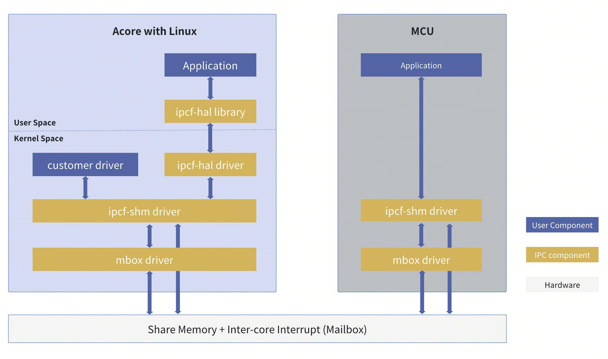
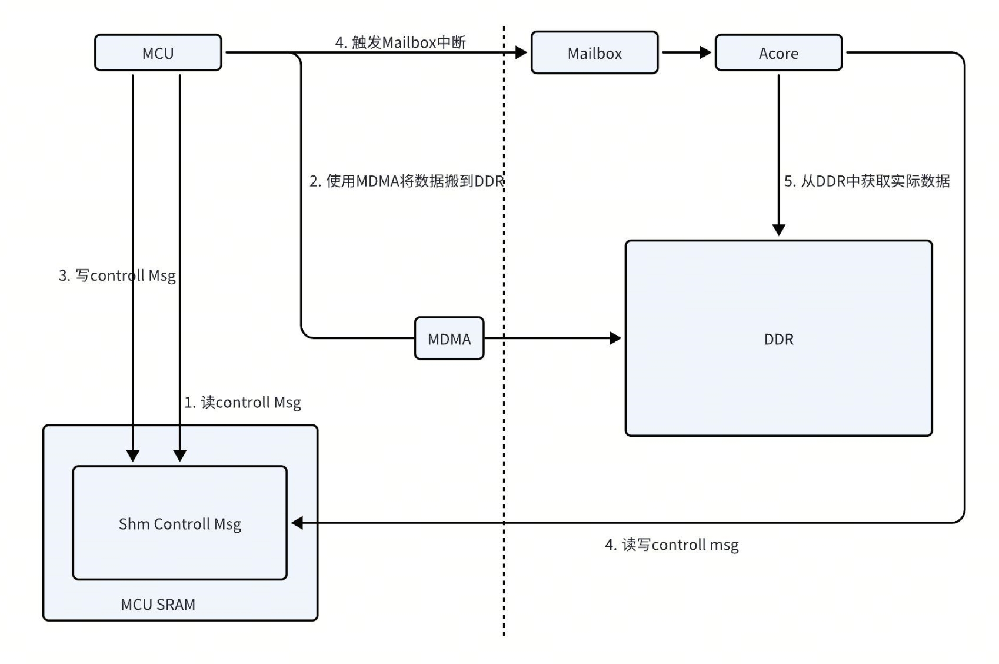
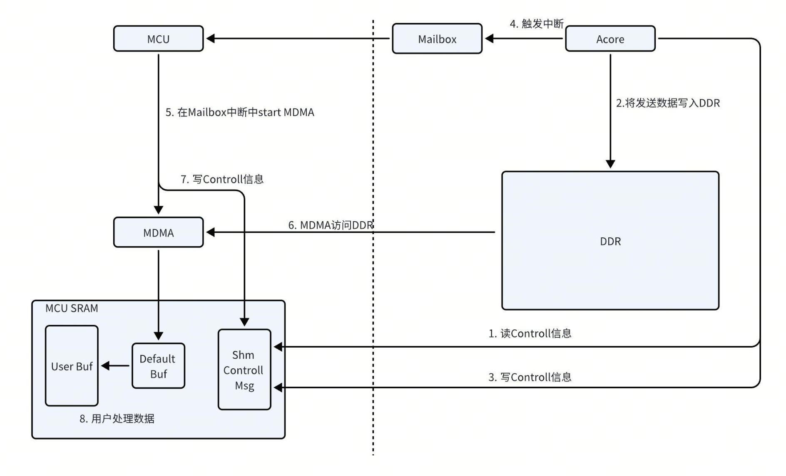
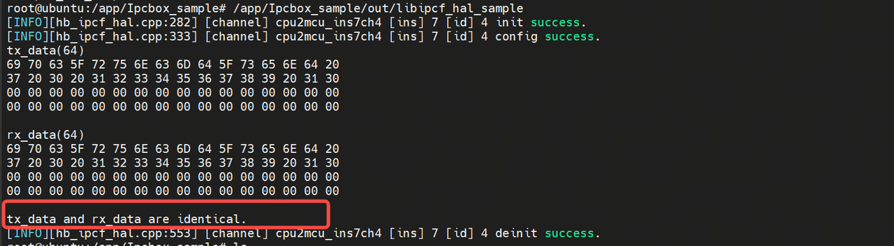

# IPC使用指南

IPC（Inter-Process Communication）模块是用于多核之间的通信，支持同构核和异构核之间的通信，软件上基于buffer-ring进行共享内存的管理，硬件上基于MailBox实现核间中断。IPCF具有多路通道，大数据传输，适用多种平台的特点。

- S100基于Mailbox模块设计了IPC子系统，实现了MCU与Acore、HSM之间的数据传输。
- MCU IPC配置需要和对端IPC配置保持一致，包括Instance控制段与data段地址，Channel的数量与ID，Buffer数量，Buffer大小等等，两端配置不一致会导致IPC通信失败。

## IPCF软硬件组件框图

Acore与MCU之间的核间通信，Acore侧主要使用IPCFHAL，MCU侧使用IPCF，其中IPCFHAL是基于IPCF封装了一层接口，用于用户态与内核态的数据传递。其中由于Acore侧有多套IPC接口，MCU侧只有一套IPC接口，因此IPCF在MCU侧文档统一描述为IPC。



### Acore与MCU传输流程

#### MCU发送数据到Acore


#### Acore发送数据到MCU


## IPC 使用情况

// TODO 贴图


## 应用sample

### C++ 应用
此sample实现了对Uart5的透传，测试时需要将uart5的TX和RX短接。

1. 开机进入S100后，打开应用目录cd /app/Ipcbox_sample
2. 编译：make
3. 运行/app/Ipcbox_sample/out/libipcf_hal_sample
4. 出现tx_data and rx_data are identical.打印则测试通过



### python应用

S100提供python库文件使用IPC，其原理为通过pybind11调用C++接口，函数名与宏定义等两端保持一致。

1. 包的导入
```
import pyhbipchal as pyipc
import pyhbipchal_utils as ipc_utils
```

2. 源码路径

```bash
root@ubuntu:/app/pyhpipchal_sample# tree
.
├── ipcfhal_sample_config.json // 配置文件，用于初始化ipc
├── pyhbipchal_test.py // 使用pyhbipchal库编写基础python应用测试过用例
├── pyhbipchal_utils.py // pyhbipchal_utils对象源码，pyhbipchal进行二次封装,相较于pyhbipchal更符合pyhton的编程习惯
└── pyhbipchal_utils_test.py // pyhbipchal_utils测试用例
```

3. 示例

测试python库的效果与C++提供的接口是否一致
```bash
root@ubuntu:/app/pyhpipchal_sample# python pyhbipchal_test.py
Library version: 1.0.0
====================test error code==================

IPCF_HAL_E_OK (0): General OK

IPCF_HAL_E_NOK (-1): General Not OK

IPCF_HAL_E_CONFIG_FAIL (-2): Config fail

IPCF_HAL_E_WRONG_CONFIGURATION (-3): Wrong configuration

IPCF_HAL_E_NULL_POINTER (-4): A null pointer was passed as an argument

IPCF_HAL_E_PARAM_INVALID (-5): A parameter was invalid

IPCF_HAL_E_LENGTH_TOO_SMALL (-6): Length too small

IPCF_HAL_E_INIT_FAILED (-7): Initialization failed

IPCF_HAL_E_UNINIT (-8): Called before initialization

IPCF_HAL_E_BUFFER_OVERFLOW (-9): Source address or destination address Buffer overflow

IPCF_HAL_E_ALLOC_FAIL (-10): Source alloc fail

IPCF_HAL_E_TIMEOUT (-11): Expired the time out

IPCF_HAL_E_REINIT (-12): Re initilize

IPCF_HAL_E_BUSY (-13): Busy

IPCF_HAL_E_CHANNEL_INVALID (-14): Channel is invalid

=====================test OK=======================

[INFO][hb_ipcf_hal.cpp:282] [channel] cpu2mcu_ins7ch4 [ins] 7 [id] 4 init success.
[INFO][hb_ipcf_hal.cpp:333] [channel] cpu2mcu_ins7ch4 [ins] 7 [id] 4 config success.
tx_data(64)
69 70 63 5F 72 75 6E 63 6D 64 5F 73 65 6E 64 20
37 20 30 20 31 32 33 34 35 36 37 38 39 20 31 30
00 00 00 00 00 00 00 00 00 00 00 00 00 00 00 00
00 00 00 00 00 00 00 00 00 00 00 00 00 00 00 00

rx_data(64)
69 70 63 5F 72 75 6E 63 6D 64 5F 73 65 6E 64 20
37 20 30 20 31 32 33 34 35 36 37 38 39 20 31 30
00 00 00 00 00 00 00 00 00 00 00 00 00 00 00 00
00 00 00 00 00 00 00 00 00 00 00 00 00 00 00 00

tx_data and rx_data are identical.
[INFO][hb_ipcf_hal.cpp:553] [channel] cpu2mcu_ins7ch4 [ins] 7 [id] 4 deinit success.
root@ubuntu:/app/pyhpipchal_sample#

```

测试pyhbipchal_utils包的IPC通信功能是否正常。

```bash
root@ubuntu:/app/pyhpipchal_sample# python pyhbipchal_utils_test.py
[INFO][hb_ipcf_hal.cpp:282] [channel] cpu2mcu_ins7ch4 [ins] 7 [id] 4 init success.
[INFO][hb_ipcf_hal.cpp:333] [channel] cpu2mcu_ins7ch4 [ins] 7 [id] 4 config success.
Tx: b'ipc_runcmd_send 7 0 123456789 10' | Rx: b'ipc_runcmd_send 7 0 123456789 10'
[INFO][hb_ipcf_hal.cpp:553] [channel] cpu2mcu_ins7ch4 [ins] 7 [id] 4 deinit success.
```


### 应用程序接口

此部分为MCU侧的IPC接口。

#### void Ipc_MDMA_Init(Ipc_InstanceConfigType* pConfigPtr, uint32 InstanceId)

```shell
Description：Ipc MDMA Init.

Sync/Async: Synchronous
Parameters(in)
    pConfigPtr：the pointer to the device configuration parameter
    InstanceId：InstanceId id
Parameters(inout)
    None
Parameters(out)
    None
Return value：None
```


#### void Ipc_MDMA_DeInit(uint32 InstanceId)

```shell
Description：Subsystem driver deinitialization function.

Sync/Async: Synchronous
Parameters(in)
    InstanceId：InstanceId id
Parameters(inout)
    None
Parameters(out)
    None
Return value：None
```

#### void Ipc_GetVersionInfo(Std_VersionInfoType * versioninfo)

```shell
Description：get driver version.

Sync/Async: Synchronous
Parameters(in)
    None
Parameters(inout)
    versioninfo: the pointer to Version Info
Parameters(out)
    None
Return value：None
```


#### Std_ReturnType Ipc_MDMA_CheckRemoteCoreReady(uint32 InstanceId)

```shell
Description：check whether remote core is ready.

Sync/Async: Synchronous
Parameters(in)
    InstanceId：InstanceId id
Parameters(inout)
    None
Parameters(out)
    None
Return value：Std_ReturnType
    E_OK: remote core is ready
    IPC_E_PARAM_ERROR: param illegal
    IPC_E_DRIVER_NOT_INIT: Driver is not init
    IPC_E_INSTANCE_NOT_READY_ERROR : remote core is Not ready
    IPC_E_CHANNEL_NOT_OPEN: Instance is not open
```

#### void Std_ReturnType Ipc_MDMA_SendMsg(uint32 InstanceId, uint32 ChanId, uint32 Size, uint8* Buf, uint32 Timeout)

```shell
Description：send message.

Sync/Async: Synchronous
Parameters(in)
    InstanceId: Instance id
    ChanId: channel id
    Size: the size of buf to be sent
    Buf: the pointer to the memory that contains the buf to be sent
    Timeout: timeout(us)
Parameters(inout)
    None
Parameters(out)
    None
Return value：Std_ReturnType
    E_OK: success
    IPC_E_PARAM_ERROR: param is illegal
    IPC_E_DRIVER_NOT_INIT: Driver is not init
    IPC_E_CHANNEL_NOT_OPEN: Instance is not open
    IPC_E_TIMEOUT_ERROR: send timeout
    IPC_E_NO_MEMORY_ERROR: no memory to send buf
    PC_E_CHECKRESERROR: check resource error
```

:::tip
dma硬件要求传输地址16字节对齐，buffer应该如下定义，首地址和size16字节对齐: static uint8 __attribute__((aligned(16))) Ipc_Send_Buf[8192];
:::

#### Std_ReturnType Ipc_MDMA_PollMsg(uint32 InstanceId)

```shell
Description：poll message If the Instance does not receive data using interrupts.

Sync/Async: Synchronous
Parameters(in)
    InstanceId: Instance id
Parameters(inout)
    None
Parameters(out)
    None
Return value：Std_ReturnType
    E_OK: success
    IPC_E_PARAM_ERROR: param is illegal
    IPC_E_DRIVER_NOT_INIT: Driver is not init
    IPC_E_CHANNEL_NOT_OPEN: Instance is not open
    IPC_E_NO_DATA_TO_RECEIVE_ER ROR: No data to be recvived
```

#### Std_ReturnType Ipc_MDMA_OpenInstance(uint32 InstanceId)

```shell
Description：Open a Instance pointed to by ID.

Sync/Async: Synchronous
Parameters(in)
    InstanceId: Instance id
Parameters(inout)
    None
Parameters(out)
    None
Return value：Std_ReturnType
    E_OK: success
    IPC_E_DRIVER_NOT_INIT: Driver is not init
    IPC_E_CHANNEL_NOT_CLOSE: Instance has been opened
    IPC_E_PARAM_ERROR param is illegal
```

### Std_ReturnType Ipc_MDMA_CloseInstance(uint32 InstanceId)

```shell
Description：close a Instance pointed to by ID.

Sync/Async: Synchronous
Parameters(in)
    InstanceId: Instance id
Parameters(inout)
    None
Parameters(out)
    None
Return value：Std_ReturnType
    E_OK: success
    IPC_E_DRIVER_NOT_INIT: Driver is not init
    IPC_E_CHANNEL_NOT_CLOSE: Instance has been opened
    IPC_E_PARAM_ERROR param is illegal
```


### Std_ReturnType Ipc_MDMA_TryGetHwResource(uint32 InstanceId, uint32 ChanId, uint32 BufSize)

```shell
Description：try get Hardware resource.

Sync/Async: Synchronous
Parameters(in)
    InstanceId ChanId BufSize: Instance id Chanel Id buf size
Parameters(inout)
    None
Parameters(out)
    None
Return value：Std_ReturnType
    E_OK: success
    IPC_E_DRIVER_NOT_INIT: Driver is not init
    IPC_E_DEVICE_BUSY: Instance is busy.
    IPC_E_MDMA_BUSY: Send MDMA is busy.
    IPC_E_NO_BUF_ERROR: no buffer
    IPC_E_CHANNEL_NOT_OPEN: Instance has been closed
```

