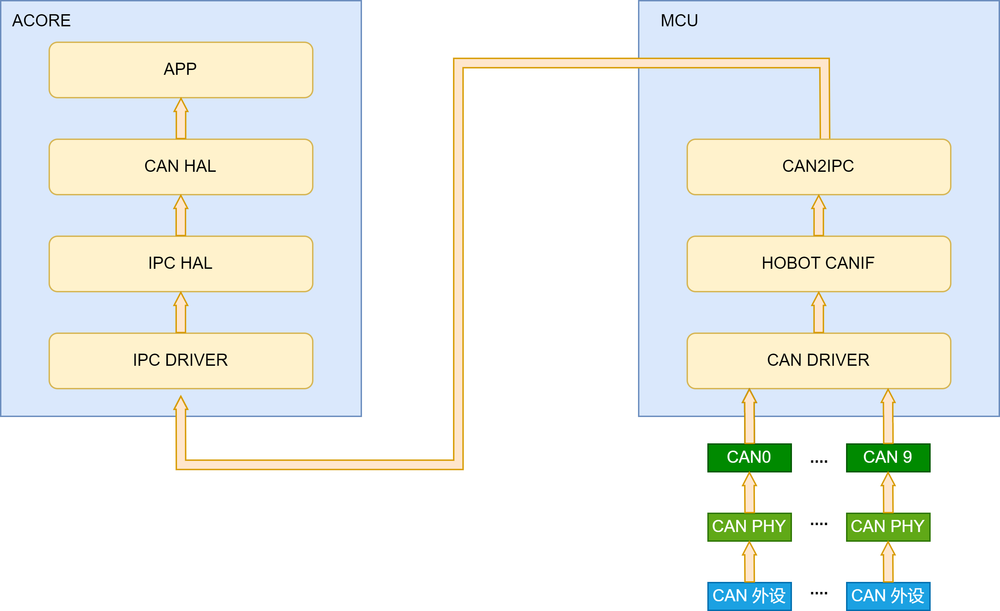

# CAN使用指南

## 基本概述

- 最大可使用CAN controller数量：10。
- CAN最高传输速率：8M。(受限于transceiver的波特率限制，目前实验室只测试验证到5M波特率。)
- 个controller的Ram内划分的Block个数：
    - CAN0~CAN3：4 Block (可变payload);
    - CAN4~CAN9：4 Block (可变payload)+ 4 Block(固定payload)。
- 一个controller支持的最大Mailbox个数为128。
- 一个controller支持一路RxFIFO，FIFO深度为：
    - CAN0~CAN3：8 * 64 bytes;
    - CAN4~CAN9：32 * 64 bytes。
- 不支持 TTController，即不支持TTCAN（一种基于CAN总线的高层协议）。
- CAN支持多核使用，可将不同的CAN控制器绑定在不同的核心上，但不支持多个核心同时使用同一个CAN控制器。


## 软件架构

S100芯片的Can控制器位于MCU域，负责Can数据收发。由于感知等应用位于Acore，因此部分Can数据需要通过IPC核间通信机制转发到Acore。架构保证传输可靠性，转发机制实现数据正确性检测、丢包检测和传输超时检测等机制。此外，还需要规避MCU侧高频转发小数据块导致CPU占用率过高，造成MCU实时性降低等性能问题。

S100 Can转发方案的核心流程如下：
- 首先通过MCU侧CAN2IPC模块将CAN通道映射到对应IPC通道，然后通过Acore侧CANHAL模块将IPC通道反映射为虚拟Can设备通道。最后用户通过CANHAL提供的API接口获取虚拟Can设备中的数据。其中，CAN2IPC模块为MCU侧服务，CANHAL模块为Acore侧提供给应用程序的动态库。
- CAN2IPC模块周期性采集MCU侧CAN数据，按照指定传输协议进行打包，然后通过IPC核间通信转发到Acore。Ipc instance 0中的channel0~channel7默认分配给Can转发使用。
- CANHAL模块获取来自MCU侧的IPC数据，按照指定的传输协议解析数据，并支持业务软件通过API获取原始Can帧。




数据流如上图所示：
- 外设数据通过CAN的PHY和控制器器件被MCU域CAN驱动接收后，CAN驱动将数据上报并缓存在hobot CANIF模块。
- CAN2IPC Service周期性从CANIF模块取出CAN帧，按照可靠传输协议进行打包，然后通过IPC核间通信机制转发给Acore。
- CANHAL模块获取来自MCU侧的IPC数据，按照指定的传输协议解析数据，Acore 应用程序通过CANHAL Lib库提供的API获取Can帧。

方案特性说明：
- 支持数据透传正确性校验。
- 支持数据透传丢包检测。
- 支持传输超时检测。MCU侧CAN2IPC转发数据时将数据包打上MCU侧的时间戳，Acore CANHAL接收到数据后会读取Acore的时间戳，如果传输超时会报警。注意，需要提前启动时间同步完成MCU RTC时间和Acore 网卡phc0的时间同步。
- 支持多个CAN通道并行传输。MCU侧多个CAN控制器的数据可同时被转发给Acore，Acore应用程序通过CANHAL从不同通道号读出CAN数据。
- 由于CANHAL底层通过ipc核间通信进行传输，而ipc目前不支持多个进程或者线程读写同一个通道，因此CANHAL也不支持该特性。

## 波特率配置

:::tip
持续更新中....
:::


## 应用sample

MCU侧CAN2IPC源码目录：mcu/Service/HouseKeeping/can_ipc/hb_CAN2IPC.c

- 源码中hb_CAN2IPC_MainFunction函数被OS周期性调用，其内部通过调用hb_CAN2IPC_Proc 函数将指定的CAN控制器数据通过IPC转发到Acore。
- hb_CAN2IPC_Proc 函数中三个传入参数分别为：CAN控制器、ipc instance、ipc 指定instance下的虚拟chennel。

S100 默认将Can5~Can9 转发给ACORE，示例如下
```C
void hb_CAN2IPC_MainFunction(void) {
hb_CAN2IPC_Proc(CANTRANS_INS0CH5_CONTROLLER, IpcConf_IpcInstance_IpcInstance_0, IpcConf_IpcInstance_0_IpcChannel_4);
//CAN4 for chassis,map to ipc channel 4 and 5，for Acore vechileio and pnc
hb_CAN2IPC_Proc(CANTRANS_INS0CH6_CONTROLLER, IpcConf_IpcInstance_IpcInstance_0, IpcConf_IpcInstance_0_IpcChannel_6);
//CAN6 for radar, map to ipc channel 6
hb_CAN2IPC_Proc(CANTRANS_INS0CH7_CONTROLLER, IpcConf_IpcInstance_IpcInstance_0, IpcConf_IpcInstance_0_IpcChannel_7);
//CAN7 for radar, map to ipc channel 7
hb_CAN2IPC_Proc(CANTRANS_INS0CH8_CONTROLLER, IpcConf_IpcInstance_IpcInstance_0, IpcConf_IpcInstance_0_IpcChannel_2);
//CAN8 for radar, map to ipc channel 2
hb_CAN2IPC_Proc(CANTRANS_INS0CH9_CONTROLLER, IpcConf_IpcInstance_IpcInstance_0, IpcConf_IpcInstance_0_IpcChannel_3);
//CAN9 for radar, map to ipc channel 3
}
```

Acore canhal使用可参考sample源码目录：source/hobot-io-samples/debian/app/Can，可以在S100的/app/Can目录下直接make编译使用。

以多路透传为例，目录结构如下：
```bash
$ tree /app/Can/can_multi_ch
.
├── Makefile
├── config
│   ├── channels.json
│   ├── ipcf_channel.json
│   └── nodes.json
├── main.c
└── readme.md

```
json文件配置主要包括3个json配置文件：node.json、ipcf_channel.json、channels.json。目前为了支持多进程，各个进程都会去当前路径下的config目录下寻找这3个配置文件。

node.json负责创建虚拟Can设备节点给CANHAL API访问。关键配置选项包括：
- channel_id字段指定该虚拟Can设备从ipc配置文件ipcf_channel.json中哪一个节点获取数据。
- target字段表示该虚拟Can设备节点的名称，CANHAL API通过该名称访问指定的节点。
- enable字段表示该节点是否使能。

```json
{
  "nodes" : [
    {
      "id" : 0,
      "enable" : true,
      "mode_comment" : "value_table: R, W, RW",
      "mode" : "RW",
      "target" : "can5rx_ins0ch4",
      "clk_source" : "/dev/hrtc0",
      "io_channel" : {
        "device_type_comment" : "value_table: can, eth, ipcf, spi",
        "device_type" : "ipcf",
        "channel_id" : 0
      },
      "raw_protocol" : "built_1.0"
    },
    .....
    {
      "id" : 5,
      "enable" : true,
      "mode_comment" : "value_table: R, W, RW",
      "mode" : "RW",
      "target" : "canglotx_ins0ch5",
      "clk_source" : "/dev/hrtc0",
      "io_channel" : {
        "device_type_comment" : "value_table: can, eth, ipcf, spi",
        "device_type" : "ipcf",
        "channel_id" : 5
      },
      "raw_protocol" : "built_1.0"
    }
  ]
}
```
ipcf_channel.json将node.json中用到的ipc节点映射到具体的instance和channel。
```json
{
  "enable" : true,
  "libipcf_path" : "/usr/hobot/lib/libhbipcfhal.so.1",
  "channels" : [
    {
      "id" : 0,
      "channel" : {
        "name" : "can5rx_ins0ch4",
        "instance": 0,
        "channel": 4,
        "fifo_size": 64000,
        "fifo_type": 0,
        "pkg_size_max": 4096,
        "dev_path":"/dev/ipcdrv",
        "dev_name":"ipcdrv",
        "recv_timeout" : 4000
      }
    },
    ......
    {
      "id" : 5,
      "channel" : {
        "name" : "canglotx_ins0ch5",
        "instance": 0,
        "channel": 5,
        "fifo_size": 64000,
        "fifo_type": 0,
        "pkg_size_max": 4096,
        "dev_path":"/dev/ipcdrv",
        "dev_name":"ipcdrv",
        "recv_timeout" : 4000
      }
    }
  ]
}
```
channels.json指定ipc配置文件，用户一般不需要更改。
```json
{
  "io_channels" : {
   "ipcf" : "./config/ipcf_channel.json"
 }
}
```
Acore应用程序通过CANHAL获取MCU侧Can帧的流程伪代码如下：

```c
void send_frame_data(void *arg)
{
    for (int count = 1000; count > 0; count--) {
        canSendMsgFrame(test_params->target, &frame[0], &pack);
    }
}

void *recv_frame_data(void *arg)
{
    while (!exit_flag) {
        canRecvMsgFrame(target, frame, &pack); // non blocking
    }
}

int main(int argc, char *argv[])
{
	ret = canInit();
    pthread_create(&send_thread, NULL, send_frame_data, &tx_params);
    pthread_create(&rx_threads[i], NULL, recv_frame_data, &rx_params[i])

    pthread_join(send_thread, NULL);
    pthread_join(rx_threads[i], NULL);
	canDeInit();
}
```

- 首先执行canInit()完成初始化,然后创建发送线程和接收线程
- 发送线程调用canSendMsgFrame()发送数据包，接收线程调用canRecvMsgFrame()接收数据包，其中target参数为json文件中配置好的通道。
- pack信息包含这一包数据的信息，包括can帧数量、mcu侧的时间戳以及acore侧的monotic时间戳等信息。
- canhal会从这一包ipc数据中解析出can帧，用户通过frame指针读取出所有can帧。
- 最后执行canDeInit()释放资源。


### 应用程序接口

#### void Can_Init(const Can_ConfigType* Config)

```shell
Description：This function initializes the module.

Sync/Async: Synchronous
Parameters(in)
    Config: Pointer to driver configuration.
Parameters(inout)
    None
Parameters(out)
    None
Return value：None
```

#### void Can_GetVersionInfo(Std_VersionInfoType* versioninfo)

```shell
Description：Returns the version information of this module.

Sync/Async: Synchronous
Parameters(in)
    None
Parameters(inout)
    None
Parameters(out)
    versioninfo: Pointer to where to store the version information of this module.
Return value：None
```

#### void Can_DeInit(void)

```shell
Description：This function de-initializes the module.

Sync/Async: Synchronous
Parameters(in)
    None
Parameters(inout)
    None
Parameters(out)
    None
Return value：None
```

#### Std_ReturnType Can_SetControllerMode(uint8 Controller, Can_ControllerStateType Transition)

```shell
Description：This function performs software triggered state transitions of the CAN controller State machine.

Sync/Async: Synchronous
Parameters(in)
    Controller: CAN controller for which the status shall be changed.
    Transition: Transition value to request new CAN controller state.
Parameters(inout)
    None
Parameters(out)
    None
Return value：Std_ReturnType
	E_OK: request accepted.
    E_NOT_OK: request not accepted, a development error occurred.
```

#### void Can_DisableControllerInterrupts(uint8 Controller)

```shell
Description：This function disables all interrupts for this CAN controller.

Sync/Async: Synchronous
Parameters(in)
    Controller: CAN controller for which interrupts shall be disabled.
Parameters(inout)
    None
Parameters(out)
    None
Return value：None
```

#### void Can_EnableControllerInterrupts(uint8 Controller)

```shell
Description：This function enables all allowed interrupts.

Sync/Async: Synchronous
Parameters(in)
    Controller: CAN controller for which interrupts shall be re-enabled.
Parameters(inout)
    None
Parameters(out)
    None
Return value：None
```

#### Std_ReturnType Can_GetControllerErrorState(uint8 ControllerId, Can_ErrorStateType* ErrorStatePtr)

```shell
Description：This service obtains the error state of the CAN controller.

Sync/Async: Synchronous
Parameters(in)
    ControllerId: Abstracted CanIf ControllerId which is assigned to a CAN controller, which is requested for ErrorState.
Parameters(inout)
    None
Parameters(out)
    ErrorStatePtr:Pointer to a memory location, where the error state of the CAN controller will be stored.
Return value：Std_ReturnType
	E_OK: Error state request has been accepted.
    E_NOT_OK: Error state request has not been accepted.
```

#### Std_ReturnType Can_GetControllerMode(uint8 Controller, Can_ControllerStateType* ControllerModePtr)

```shell
Description：This service reports about the current status of the requested CAN controller.

Sync/Async: Synchronous
Parameters(in)
    Controller: CAN controller for which the status shall be requested.
Parameters(inout)
    None
Parameters(out)
    ControllerModePtr: Pointer to a memory location, where the current mode of the CAN controller will be stored.
Return value：Std_ReturnType
    E_OK: Controller mode request has been accepted.
    E_NOT_OK: Controller mode request has not been accepted.
```

#### Std_ReturnType Can_GetControllerRxErrorCounter(uint8 ControllerId, uint8* RxErrorCounterPtr)

```shell
Description：Returns the Rx error counter for a CAN controller.
             This value might not be available for all CAN controllers, in which case E_NOT_OK would be
             returned.Please note that the value of the counter might not be correct at the moment the
             API returns it, because the Rx counter is handled as ynchronously in hardware.Applications
             should not trust this value for any assumption about the current bus state.

Sync/Async: Synchronous
Parameters(in)
    ControllerId: CAN controller, whose current Rx error counter shall be acquired.
Parameters(inout)
    None
Parameters(out)
    RxErrorCounterPtr: Pointer to a memory location, where the current Rx error counter of the
                       CAN controller will be stored.
Return value：Std_ReturnType
    E_OK: Rx error counter available.
    E_NOT_OK: Wrong ControllerId, or Rx error counter not available.
```

#### Std_ReturnType Can_GetControllerTxErrorCounter(uint8 ControllerId, uint8* TxErrorCounterPtr)

```shell
Description：Returns the Tx error counter for a CAN controller. This value might not be available
             for all CAN controllers, in which case E_NOT_OK would be returned.Please note that the
             value of the counter might not be correct at the moment the API returns it, because the
             Tx counter is handled as ynchronously in hardware.Applications should not trust this
             value for any assumption about the current bus state.

Sync/Async: Synchronous
Parameters(in)
    ControllerId: CAN controller, whose current Rx error counter shall be acquired.
Parameters(inout)
    None
Parameters(out)
    TxErrorCounterPtr:Pointer to a memory location, where the current Tx error counter
                      of the CAN controller will be stored.
Return value：Std_ReturnType
    E_OK: Rx error counter available.
    E_NOT_OK: Wrong ControllerId, or Rx error counter not available.
```

#### Std_ReturnTypeCan_Write(Can_HwHandleType Hth, const Can_PduType* PduInfo)

```shell
Description：This function is called by CanIf to pass a CAN message to CanDrv for tran smission.

Sync/Async: Synchronous
Parameters(in)
    Hth:information which HW-transmit handle shall be used for transmit.Implicitly this is
        also the information about the controller to use because the Hth numbers are unique
        inside one hardware unit.
Parameters(inout)
    None
Parameters(out)
    None
Return value：Std_ReturnType
    E_OK: Write command has been accepted.
    E_NOT_OK: development error occurred.
    CAN_BUSY: No TX hardware buffer available or pre-emptive call of Can_Write that can’t be
              implemented re-entrant (see Can_ReturnType).
```

#### void Can_MainFunction_Write(Void)

```shell
Description：This function performs the polling of TX confirmation when CAN_TX_PROCESSING
             is set to POLLING.

Sync/Async: Synchronous
Parameters(in)
    None
Parameters(inout)
    None
Parameters(out)
    None
Return value: None
```

#### void Can_MainFunction_Read(Void)

```shell
Description：Returns the value of the specified CAN channel.This function performs the
             polling of RX indications when CAN_RX_PROCESSING is set to POLLING.

Sync/Async: Synchronous
Parameters(in)
    None
Parameters(inout)
    None
Parameters(out)
    None
Return value：None
```

#### void Can_MainFunction_BusOff(Void)

```shell
Description：This function performs the polling of bus-off events that are configured statically
             as ‘to be polled’.

Sync/Async: Synchronous
Parameters(in)
    None
Parameters(inout)
    None
Parameters(out)
    None
Return value：None
```

#### void Can_MainFunction_Mode(Void)

```shell
Description：This function performs the polling of CAN controller mode transitions.

Sync/Async: Synchronous
Parameters(in)
    None
Parameters(inout)
    None
Parameters(out)
    None
Return value：None
```
