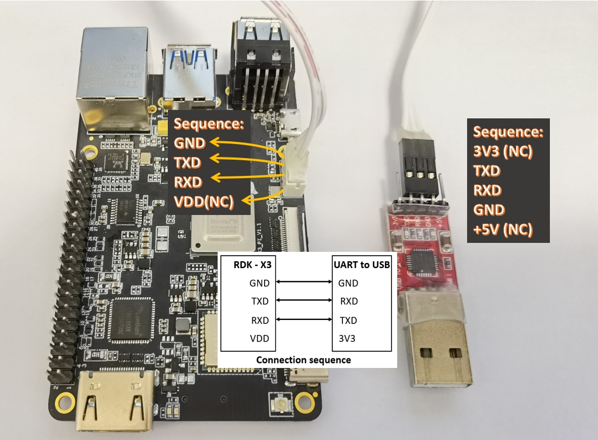
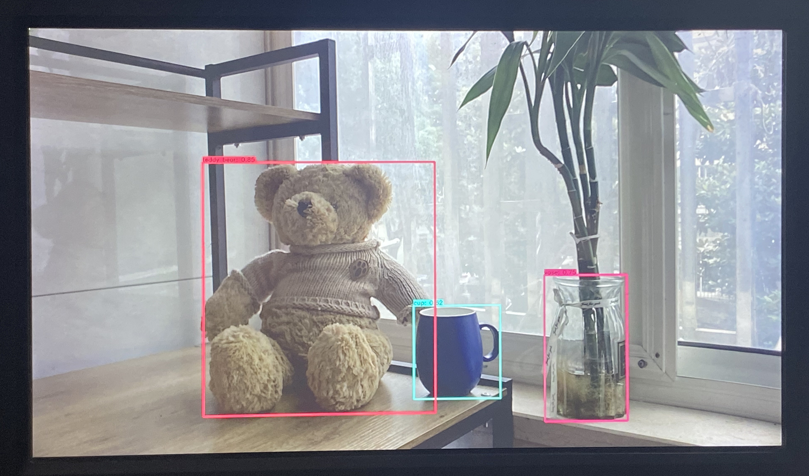

# 8.1 硬件和系统

认证配件及购买链接请参考[认证配件清单](https://developer.d-robotics.cc/rdk_doc/Advanced_development/hardware_development/rdk_x3/accessory)

详细请参考[D-Robotics RDK套件用户手册的常见问题](https://developer.d-robotics.cc/rdk_doc/FAQ)

## 什么是D-Robotics RDK套件？

D-Robotics Developer Kits，简称[D-Robotics RDK套件](https://developer.d-robotics.cc/rdk_doc/)，是基于D-Robotics 智能芯片打造的机器人开发者套件。

## 如何查看系统版本号

系统安装完成后，登录系统并使用命令`apt list --installed | grep hobot`查看系统核心功能包版本，使用`cat /etc/version`命令查看系统大版本号。

2.x版本（以2.0.0版本为例说明）系统信息如下：

```shell
root@ubuntu:~# apt list --installed | grep hobot

WARNING: apt does not have a stable CLI interface. Use with caution in scripts.

hobot-boot/unknown,now 2.0.0-20230530181103 arm64 [installed]
hobot-bpu-drivers/unknown,now 2.0.0-20230530181103 arm64 [installed]
hobot-camera/unknown,now 2.0.0-20230530181103 arm64 [installed]
hobot-configs/unknown,now 2.0.0-20230530181103 arm64 [installed]
hobot-display/unknown,now 2.0.0-20230530181103 arm64 [installed]
hobot-dnn/unknown,now 2.0.0-20230530181103 arm64 [installed]
hobot-dtb/unknown,now 2.0.0-20230530181103 arm64 [installed]
hobot-io-samples/unknown,now 2.0.0-20230530181103 arm64 [installed]
hobot-io/unknown,now 2.0.0-20230530181103 arm64 [installed]
hobot-kernel-headers/unknown,now 2.0.0-20230530181103 arm64 [installed]
hobot-models-basic/unknown,now 1.0.1 arm64 [installed]
hobot-multimedia-dev/unknown,now 2.0.0-20230530181103 arm64 [installed]
hobot-multimedia-samples/unknown,now 2.0.0-20230530181103 arm64 [installed]
hobot-multimedia/unknown,now 2.0.0-20230530181103 arm64 [installed]
hobot-sp-samples/unknown,now 2.0.0-20230530181103 arm64 [installed]
hobot-spdev/unknown,now 2.0.0-20230530181103 arm64 [installed]
hobot-utils/unknown,now 2.0.0-20230530181103 arm64 [installed]
hobot-wifi/unknown,now 2.0.0-20230530181103 arm64 [installed]
root@ubuntu:~#
root@ubuntu:~# cat /etc/version
2.0.0
root@ubuntu:~#

```

## 系统版本和RDK平台硬件对应关系

系统版本说明：

- 4.x版本系统：基于RDK Linux开源代码包制作，支持RDK S100、RDK S100P等全系列硬件。

## 摄像头插拔注意事项

**严禁在开发板未断电的情况下插拔摄像头，否则非常容易烧坏摄像头模组**。

## 串口线如何连接?

串口线一端（白色）接到RDK X3，由于接口有凹槽正反面通常不会接反，另外一端接到串口转接板，此处需要重点关注，连接图如下：



## RDK S100供电有什么要求？

RDK S100通过电源接口供电，至少搭配**19V 直流 2A**的电源适配器为开发板供电。

## IMX219 MIPI摄像头如何连接?

IMX219 MIPI摄像头模组通过24pin异面FPC排线跟sensor子板连接，sensor 子板再和开发板连接 **注意排线两端黑面向上插入连接器**。IMX219摄像头连接示意图如下：


正常连接后接通电源，执行命令：

```bash
cd /app/pydev_demo/03_mipi_camera_sample
sudo python3 mipi_camera.py
```

算法渲染结果的HDMI输出如下图，示例图像中检测到了`teddy bear`、`cup`和`vase`。



```text
输入命令：i2cdetect -y -r 2
IMX219：
     0  1  2  3  4  5  6  7  8  9  a  b  c  d  e  f
00:                         -- -- -- -- -- -- -- -- 
10: 10 -- -- -- -- -- -- -- -- -- -- -- -- -- -- -- 
20: -- -- -- -- -- -- -- -- -- -- -- -- -- -- -- -- 
30: -- -- -- -- -- -- -- -- -- -- -- -- -- -- -- -- 
40: -- -- -- -- -- -- -- -- -- -- -- -- -- -- -- -- 
50: -- -- -- -- -- -- -- -- -- -- -- -- -- -- -- -- 
60: -- -- -- -- -- -- -- -- -- -- -- -- -- -- -- -- 
70: -- -- -- -- -- -- -- -- 
```

## 如何查看RDK S100的CPU、BPU等运行状态?

```bash
sudo hrut_somstatus
```

## 如何设置自启动?

通过在sudo vim /etc/rc.local文件末尾添加命令，可实现开机自启动功能，例如：

```bash
#!/bin/bash -e
#
# rc.local
#re
# This script is executed at the end of each multiuser runlevel.
# Make sure that the script will "exit 0" on success or any other
# value on error.
#
# In order to enable or disable this script just change the execution
# bits.
#
# By default this script does nothing.

#!/bin/sh

chmod a=rx,u+ws /usr/bin/sudo
chown sunrise:sunrise /home/sunrise

which "hrut_count" >/dev/null 2>&1
if [ $? -eq 0 ]; then
        hrut_count 0
fi

# Insert what you need
```

## 开发板上电后无显示


## 开发板默认账户

<font color='Blue'>【问题】</font>

- 开发板默认支持的账户类型

<font color='Green'>【解答】</font>

- 开发板默认支持两种账户，具体如下：
  - 默认账户：用户名`sunrise`  密码`sunrise`
  - root账户：用户名`root`  密码`root`

## NTFS文件系统挂载
<font color='Blue'>【问题】</font>

- NTFS文件系统挂载后，如何支持读写模式

<font color='Green'>【解答】</font>

- 安装ntfs-3g功能包后，再挂载NTFS文件系统即可支持写模式。安装命令如下：
    ```bash
    sudo apt -y install ntfs-3g
    ```

## vscode工具支持
<font color='Blue'>【问题】</font>

- 开发板是否支持`vscode`开发工具

<font color='Green'>【解答】</font>

- 开发板不支持`vscode`本地安装，用户可在PC端通过`ssh-remote`插件方式远程链接开发板

## adb调试功能
<font color='Blue'>【问题】</font>

- 开发板如何启动adb调试功能

<font color='Green'>【解答】</font>

- Ubuntu系统中默认启动了`adbd`服务，用户只需在电脑安装adb工具后即可使用，方法可参考[bootloader镜像更新](https://developer.d-robotics.cc/forumDetail/88859074455714818)。

## apt update更新失败

<font color='Blue'>【问题】</font>

- Ubuntu系统中运行`apt update`命令，提示以下错误：
    ```bash
    Reading package lists... Done
    E: Could not get lock /var/lib/apt/lists/lock. It is held by process 4299 (apt-get)
    N: Be aware that removing the lock file is not a solution and may break your system.
    E: Unable to lock directory /var/lib/apt/lists/
    ```

<font color='Green'>【解答】</font>

- Ubuntu系统自动运行的更新程序，跟用户`apt update`操作发生冲突。可以杀死系统自动运行的更新进程后重试，例如`kill 4299`。

## 开发板文件传输方式

<font color='Blue'>【问题】</font>

- 开发板和电脑之间的文件传输的方式有哪些

<font color='Green'>【解答】</font>

- 可以通过网络、USB等方式进行传输。其中，网络可使用ftp工具、scp命令等方式，USB可使用u盘、adb等方式。以scp命令为例，文件传输的方式如下：

    - 拷贝`local_file`单个文件到开发板：

    ```bash
    scp local_file sunrise@192.168.1.10:/userdata/
    ```

    - 拷贝`local_folder`整个目录到开发板：

    ```bash
    scp -r local_folder sunrise@192.168.1.10:/userdata/
    ```

## 开发板未插入HDMI显示器启动时显示异常问题

<font color='Blue'>【问题】</font>

- 开发板启动时若未连接HDMI显示器，可能会导致显示系统异常。
- 此时若再插入HDMI显示器，会出现屏幕分辨率降低、画面渲染卡顿等问题。

<font color='Green'>【解答】</font>

- 该问题的根本原因在于：
    - 开发板默认使用Wayland作为gdm的显示后端，而Wayland后端在启动时需要检测到有效的输出设备。
    - 若启动时没有插入HDMI显示器，Wayland检测不到有效输出，会迫使gdm退回到Xorg后端运行。
    - 当前GPU驱动不支持X11（Xorg）的硬件加速，使用Xorg后端时仅能通过软件渲染模式运行，因此性能较差，导致画面卡顿、分辨率降低。

- 建议的做法：
    - 最佳方案：在启动开发板前，先插入HDMI显示器，再进行启动。
    - 若实际使用过程中，确实需要先启动再插入显示器，可按以下步骤恢复正常显示：
        1. 插入HDMI显示器。
        2. 通过SSH或串口终端连接开发板。
        3. 执行以下命令，重启显示服务，使系统重新使用Wayland后端：

        ```bash
        systemctl restart gdm
        ```
