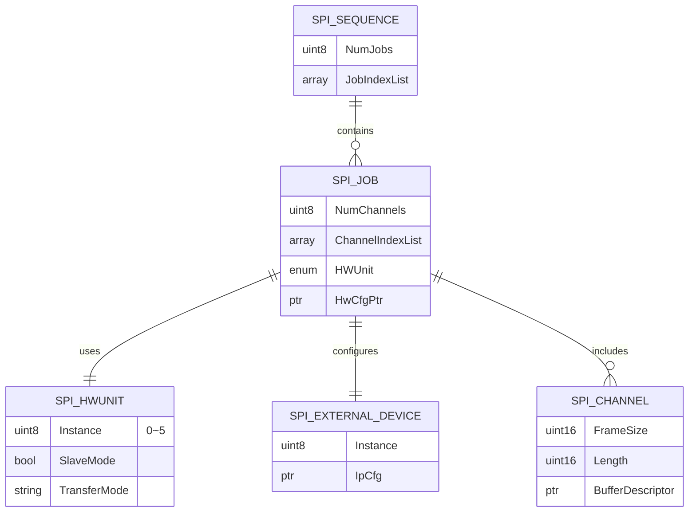

# 7.5.7 SPI User Guide

```mdx-code-block
import Tabs from '@theme/Tabs';
import TabItem from '@theme/TabItem';
import DocScope from '@site/src/components/DocScope';
```

## Hardware Support

* If SPI uses DMA transfer, the following restrictions must be ensured:

  * The transfer length must be aligned to 8 bytes; otherwise, data out-of-bound issues may occur;
  * The transmit and receive buffer addresses must be aligned to 64 bytes;
  * The maximum data size for a single Channel transfer cannot exceed 4096 bytes;
* Supports SPI operating as a Slave;
* When MCU-side SPI operates as Slave and the rate is greater than 9M, only DMA mode can be used;
* When the MCU operates as an SPI slave device, its communication clock is provided by the master device. Therefore, the slave must respond immediately to every data transfer request from the master. If interrupt handling mode is used, the SPI interrupt service routine execution time must be sufficiently short. If interrupts are blocked for too long and the data register is not processed in time, the receive buffer will overflow. Therefore, DMA transfer mode is strongly recommended to automatically complete data movement through hardware, ensuring communication real-time performance and reliability.
* When MCU-side SPI operates in 8-bit mode, the following restrictions apply:

  * Maximum speed for 1 SPI parallel TX/RX: 50M;
  * Maximum speed for 2 SPI parallel TX/RX: 33.3M;
  * Maximum speed for 3 SPI parallel TX/RX: 25M;
  * Maximum speed for 4 SPI parallel TX/RX: 20M;
  * Maximum speed for 5 SPI parallel TX/RX: 15.6M;
  * Maximum speed for 6 SPI parallel TX/RX: 12.5M;
* The SPI peripheral supports MSB only;
* SPI `SpiCsPolarity` and `spitimeclk2c` configuration are not supported. `SpiCsPolarity` defaults to active low.
* After `SpiCsToggleEnable` is enabled, the CS pin will be pulled high after one SPI frame transmission completes. Only TRAILING mode is supported; LEADING mode is not supported.
* Compared with non-DMA mode, SPI DMA mode consumes lower CPU load.
* When SPI transmits data in non-DMA mode, if the system load is high, delayed SPI interrupt response may prevent timely writes into the SPI FIFO, causing the CS pin to briefly go high. In this case, DMA mode is recommended.
* If the use case involves multiple Sequences using the same SPI IP for asynchronous transmission, and there is no transmission completion order dependency between Sequences, Sequence transmission queuing may occur. In this case, interrupt-disable critical section protection must be implemented in the `SchM_Spi.c` file.

## Code Paths

* `McalCdd/Spi/inc/Spi.h`: SPI driver header file
* `McalCdd/Spi/inc/Spi_Lld.h`: SPI low-level driver header file
* `McalCdd/Spi/src/Spi.c`: SPI driver source file
* `McalCdd/Spi/src/Spi_Lld.c`: SPI low-level driver source file
* `McalCdd/Common/Register/inc/Spi_Register.h`: SPI register definition file
* `Platform/Schm/SchM_Spi.h`: SPI module scheduler management header file
* `Config/McalCdd/gen_xxx/Spi/inc/Spi_Board.h`: SPI board-level configuration header file
* `Config/McalCdd/gen_xxx/Spi/inc/Spi_Cfg.h`: SPI configuration header file
* `Config/McalCdd/gen_xxx/Spi/inc/Spi_PBcfg.h`: SPI PB configuration header file
* `Config/McalCdd/gen_xxx/Spi/src/Spi_board.c`: SPI board-level configuration source file
* `Config/McalCdd/gen_xxx/Spi/src/Spi_PBcfg.c`: SPI PB configuration source file
* `samples/Spi/SPI_sample/Spi_sample.c`: SPI sample code
* `samples/Spi/SPI_sample/Spi_common.c`: SPI sample code

## Application Sample

### Software Operation Flow

The general software operation flow is as follows:

1. Initialization

   * Modify configuration structures such as `ChannelCfgArrayPtr`, `JobCfgArrayPtr`, `SeqCfgArrayPtr`, `HwCfgPtr`, and `PhyCfgPtr` to configure the corresponding SPI instance with the required baud rate and transfer mode. Refer to the SPI configuration description [SPI Configuration Description](./06_mcu_spi.md#spi_config)
   * Call `Spi_Init(&Spi_Config)` or `Spi_Init(NULL)`. When NULL is passed, the default configuration in `Spi_PBcfg.c` is used.
   * The driver traverses the configuration information to initialize internal data structures (such as `Spi_ChannelState`, `Spi_JobState`, `Spi_HwQueueArray`, etc.) and physical SPI hardware units (configure registers according to `Spi_PhyCfgType` and `Spi_IpCfg`)

2. Set transfer mode:

   * The application selects interrupt mode or polling mode through `Spi_SetAsyncMode()`.

3. Data preparation:

   * The application places the data to be transmitted into the buffer associated with the channel through `Spi_WriteIB()` or `Spi_SetupEB()`.

4. Transfer request:

   * The application calls `Spi_AsyncTransmit(sequence)` or `Spi_SyncTransmit(sequence)` to start sequence transmission.

5. Driver processing:

   * The driver locates the corresponding `Spi_SeqCfg` based on the `sequence ID`
   * Obtains the job list according to `Spi_SeqCfg.JobIndexList`.
   * For each job in the sequence:
   * Determine the physical SPI hardware unit to use according to `Spi_JobCfg.HWUnit`.
   * Obtain the external device communication parameters corresponding to the job according to `Spi_JobCfg.HwCfgPtr`.
   * Obtain the channel list according to `Spi_JobCfg.ChannelIndexList`.
   * Traverse the channel list and obtain transmit data from the buffer pointed to by `Spi_ChannelCfg.BufferDescriptor`.
   * Configure the physical SPI hardware unit.
   * Start hardware transfer.

6. Transfer completion:

   * For asynchronous transfer, after the hardware transfer is completed (detected by interrupt or polling), the driver calls the corresponding notification function
   * For synchronous transfer, the function waits until the transfer is completed.

7. Status query:

   * The application can query the transfer status through functions such as `Spi_GetJobResult()` and `Spi_GetSequenceResult()`.

<DocScope products="RDK S100">

### Single Chip Select Usage Example

The `spi_test` command is used to test SPI (Serial Peripheral Interface) functionality. This command supports initialization and parameter configuration, displaying current parameters, and executing SPI data transfer tests.

**Command Syntax**

```bash
spi_test <operation> [bus_id] [sync_mode] [trans_mode]
```

**Parameter Description**

* operation: Specifies the operation to execute.

  * 0: Initialization and parameter configuration.
  * 1: Display currently configured parameters.
  * 2: Execute SPI test (asynchronous or synchronous).
* bus_id (required only when operation is 0): Specifies the SPI bus to use.

  * Value range: 2 to 6, corresponding to SPI2 to SPI6.
* sync_mode (required only when operation is 0): Specifies the SPI communication synchronization mode.

  * 0: Asynchronous mode (async)
  * 1: Synchronous mode (sync)
* trans_mode (required only when operation is 0): Specifies the underlying mechanism for SPI data transfer.

  * 0: Polling mode (polling)
  * 1: Interrupt mode (interrupt)

Using SPI3 as an example, short MISO and MOSI of SPI3 together and run the following command to configure transfer parameters:

```shell
D-Robotics:/$ spi_test 0 3 0 0
[055.578172 0]Init&&Parameter setting
[055.578428 0]Show Spi parameter
[055.578792 0]spi_bus = 3
[055.579085 0]sync_mode = async
[055.579443 0]trans_mode = polling
```

Run the following command to test:

```shell
D-Robotics:/$ spi_test 2
[059.643996 0]Sequence: 1, transfer_length = 128 spi_framesize = 16
...
[059.702104 0]=====SPI ASYNC TEST SUCCESS=====
```

### Dual Chip Select Usage Example

The `SpiTest_Mul_cs` command is used to test SPI (Serial Peripheral Interface) functionality.

Usage and parameter description are as follows:

```shell
########################## support test case: ##########################
usag: SpiTest_Mul_cs Case_num Sequences Cs DataWidth DataLen Loop_times
[1]: SpiTest_Mul_cs 1 1 0 8 1 1 -- get versioninfo
[2]: SpiTest_Mul_cs 2 5 0 8 10 1 -- InterruptMode Sync Transfer
[3]: SpiTest_Mul_cs 3 5 0 8 10 1 -- PollingMode Sync Transfer
[4]: SpiTest_Mul_cs 4 5 0 8 10 1 -- InterruptMode Async Transfer
[5]: SpiTest_Mul_cs 5 5 0 8 10 1 -- PollingMode Async Transfer
other: SpiTest 110  -- help
```

* Parameter description:

  * Case_num (argv[1]): Specifies the operation to execute. Five modes are supported. For interrupt asynchronous transfer, set `Case_num` to 4.
  * Sequences (argv[2]): Specifies which SPI to use. For example, use SPI4 by setting `Sequences` to 4.
  * Cs (argv[3]): Specifies which CS to use. For example, use CS0 by setting `Cs` to 0.
  * DataWidth (argv[4]): Specifies the transfer data width. For example, for 8-bit width, set `DataWidth` to 8.
  * Datalen (argv[5]): Specifies the amount of transferred data. For example, to transfer 10 groups of data, set `Datalen` to 10.
  * Loop_times (argv[6]): Specifies how many times to test. For example, to test 5 times, set `Loop_times` to 5.
* Example:

  * SPI4, async interrupt transfer, CS1, 8-bit data width, 10 groups of data, test once:
    `SpiTest_Mul_cs 4 4 1 8 10 1`

Short MISO and MOSI of SPI4 together and run the following command:

```shell
Robotics:/$ SpiTest_Mul_cs 4 4 1 8 10 1
[get_spi_status 98] [INFO]: SPI status: SPI_IDLE
...
[SpiTest_Mul_cs 479] [INFO]: #####################################################################
```

</DocScope>

<DocScope products="RDK S600">

### Single Chip Select Usage Example

The `spi_test` command is used to test SPI (Serial Peripheral Interface) functionality. This command supports initialization and parameter configuration, displaying current parameters, and executing SPI data transfer tests.

**Command Syntax**

**Operation 0: Configure parameters for group 1**

```bash
spi_test 0 <spi_bus> <sync_mode> <trans_mode> <ch_cfg> <cs_seq0> <cs_seq1> <cs_seq2> <cs_seq3>
```

* bus_id: SPI bus ID (optional, default is 4)
* sync_mode: 0=asynchronous(async) 1=synchronous(sync)
* trans_mode: 0=polling(polling) 1=interrupt(interrupt)
* ch_cfg: SPI channel configuration
* cs_seq0: SPI sequence ID used by cs0, 255=invalid
* cs_seq1: SPI sequence ID used by cs1, 255=invalid
* cs_seq2: SPI sequence ID used by cs2, 255=invalid
* cs_seq3: SPI sequence ID used by cs3, 255=invalid

Configure the basic SPI parameters. After configuration is completed, the parameters are saved in group 1.

```shell
D-Robotics:/$ spi_test 0 13 0 1 10 2 3 255 255
[046.803972 0]Init&&Parameter setting
[046.804397 0]Test parameters configured successfully:
...
```

**Operation 1: Display parameter information**

Display all current test parameter configurations. The first group stores the custom configuration from operation 0.

```bash
spi_test 1
```

```shell
D-Robotics:/$ spi_test 1
[06649.837117 0]Test Parameter at index 0:
...
```

**Operation 2: Execute SPI test**

```shell
spi_test 2 [bus_id] [cs_id]
```

* bus_id: SPI bus ID (optional, default is 4). The `bus_id` here must exist in the parameter configuration group (displayed through `spi_test 1`); otherwise, the test will fail.
* cs_id: Chip select ID, range 0~3 (optional, default is 0. Currently only cs0 testing is supported; cs1~3 require code modification before testing)

```shell
D-Robotics:/$ spi_test 2 4 0
[0323.134926 0]Using SPI Bus ID: 4, CS ID: 0
...
[0323.151786 0]=====SPI SYNC TEST SUCCESS=====
```

### Dual Chip Select Usage Example (BMI088 Test)

The BMI088 sensor is mounted on the S600 MCU daughterboard. The sensor communicates with the MCU through the SPI13 bus, where cs0 is connected to the accelerometer (acc) and cs1 is connected to the gyroscope (gyr).

Usage and parameter description are as follows:

1. Initialize the BMI088 sensor

```shell
D-Robotics:/$ Bmi088_ShellInit
[Bmi088_Init] ACC+GYR initialized.
```

2. BMI088 sensor self-test

```shell
D-Robotics:/$ Bmi088_SelfTestGyr
[Bmi088_SelfTestGyr] SELF_TEST=0x12 (rdy=1 fail=0)
[Bmi088_SelfTestGyr] PASS

D-Robotics:/$ Bmi088_SelfTestAcc
...
[Bmi088_SelfTestAcc] PASS
```

3. Read acc data multiple times

```shell
D-Robotics:/$ Bmi088_TestAcc 50
[Bmi088_TestAcc] acc_id(raw)=0x1E
...
```

4. Read gyr data multiple times

```shell
D-Robotics:/$ Bmi088_TestGyr 50
[Bmi088_TestGyr] gyr_id(raw)=0x0F
...
```

</DocScope>

### Configuration File Description {#spi_config}

The configuration file `Spi_PBcfg.c` stores SPI driver configurations. Among them, `Spi_ConfigType` is the top-level container that organizes all configuration information (channels, jobs, sequences, hardware units, etc.) together into a complete configuration set used to initialize the SPI driver.

```c
/**
 * @struct Spi_ConfigType
 * @NO{S01E17C01}
 * @brief This is the top level structure containing all the
 *         needed parameters for the SPI Handler Driver.
 */
typedef struct
{
    uint32 SpiCoreUse;                                  /**< CoreID used*/
    const Spi_ChannelCfgArray *ChannelCfgArrayPtr;      /**< Pointer to Array of channels defined in the configuration.*/
    const Spi_JobCfgArray *JobCfgArrayPtr;              /**< Pointer to Array of jobs defined in the configuration.*/
    const Spi_SeqCfgArray *SeqCfgArrayPtr;              /**< Pointer to Array of sequences defined in the configuration.*/
    const Spi_HwCfgArray *HwCfgPtr;                     /**< External device unit attributes.*/
    const Spi_PhyCfgArray *PhyCfgPtr;                   /**< Pointer to Array of device instances.*/
    Spi_ChannelType SpiMaxChannel;                      /**< Number of channels defined in the configuration.*/
    Spi_JobType SpiMaxJob;                              /**< Number of jobs defined in the configuration.*/
    Spi_SequenceType SpiMaxSequence;                    /**< Number of sequences defined in the configuration.*/
    Spi_HwNumType SpiMaxHwNum;                          /**< Number of Spi HW defined in the configuration.*/
#if (SPI_DISABLE_DEM_REPORT_ERROR_STATUS == STD_OFF)
    const Mcal_DemErrorType SpiErrorHwCfg;        /**< SPI Driver DEM Error: SPI_E_HARDWARE_ERROR.*/
#endif
} Spi_ConfigType;
```

**Member Description**

1. **SpiCoreUse**: Specifies which CPU core can use this SPI configuration. For single-core systems, keep the default configuration.
2. **ChannelCfgArrayPtr**: Points to an array containing all `Spi_ChannelCfg` configurations. This array defines the properties of all available SPI channels in the system, such as buffer type (IB/EB), frame size, default value, and buffer pointers.
3. **JobCfgArrayPtr**: Points to an array containing all `Spi_JobCfg` configurations. This array defines the properties of all available SPI jobs in the system, such as included channel lists, notification functions, priority, and associated physical units (`HWUnit`).
4. **SeqCfgArrayPtr**: Points to an array containing all `Spi_SeqCfg` configurations. This array defines the properties of all available SPI sequences in the system, such as included job lists, notification functions, and interruptibility.
5. **HwCfgPtr**: Points to an array containing all `Spi_HwCfg` configurations. This array defines the hardware properties of all external devices, mainly communication-related parameters (such as baud rate, clock polarity, and chip select).
6. **PhyCfgPtr**: Points to an array containing all `Spi_PhyCfgType` configurations. This array defines the basic operating modes and characteristics of all physical SPI hardware units (Physical SPI Unit, PhyUnit), such as master/slave mode, DMA usage, and transfer mode.
7. **SpiMaxChannel**: Total number of channels defined in the configuration. Used for internal driver array allocation and boundary checking.
8. **SpiMaxJob**: Total number of jobs defined in the configuration. Used for internal driver array allocation and boundary checking.
9. **SpiMaxSequence**: Total number of sequences defined in the configuration. Used for internal driver array allocation and boundary checking.
10. **SpiMaxHwNum**: Number of physical SPI hardware units (PhyUnit) involved in the configuration. Used for internal driver array allocation and boundary checking.
11. **SpiErrorHwCfg**: Used to configure SPI hardware error reporting parameters.

**Association Relationship Between Members**

Applications usually initiate transmission by calling `Spi_AsyncTransmit()` or `Spi_SyncTransmit()` and passing a sequence ID. Therefore, Sequence is the entry point directly interacted with by users. Its simplified entity relationship with channels, jobs, hardware configuration, and physical unit configuration is as follows:



Both `SPI_HWUNIT` and `SPI_EXTERNAL_DEVICE` need to be associated with a hardware instance (Instance), which determines which SPI interface is used for communication. Since the RDKS100 platform provides a total of 8 SPI controllers, including 2 in the MAIN domain (SPI0 and SPI1) and 6 in the MCU domain (SPI2 to SPI7), SPI numbering in the MCU domain actually starts from SPI2. The <font color='green'>**green**</font> portions in the table below show the mapping relationship between SPI sequence configuration (`Spi SeqCfg`) and corresponding hardware resources (`Spi BusId`, `HWUnit`, `Instance`).

<DocScope products="RDK S100">

| **SPI SeqCfg** | <font color='green'>**Spi BusId**</font> | <font color='green'>**HWUnit**</font> | <font color='green'>**Instance**</font> | **Spi Baudrate** | **Spi Cs** | **Frame size** |
| :------------- | :--------------------------------------- | :------------------------------------ | :-------------------------------------- | :--------------- | :--------- | :------------- |
| SpiSequence_0  | <font color='green'>SPI2</font>          | <font color='green'>CSIB0</font>      | <font color='green'>0</font>            | 2000000          | CS0        | 16 bit         |
| SpiSequence_1  | <font color='green'>SPI3</font>          | <font color='green'>CSIB1</font>      | <font color='green'>1</font>            | 2000000          | CS0        | 16 bit         |
| ...            |                                          |                                       |                                         |                  |            |                |

</DocScope>

<DocScope products="RDK S600">

| **SPI SeqCfg** | <font color='green'>**Spi BusId**</font> | <font color='green'>**HWUnit**</font> | <font color='green'>**Instance**</font> | **Spi Baudrate** | **Spi Cs** | **Frame size** |
| :------------- | :--------------------------------------- | :------------------------------------ | :-------------------------------------- | :--------------- | :--------- | :------------- |
| SpiSequence_0  | <font color='green'>SPI6</font>          | <font color='green'>CSIB2</font>      | <font color='green'>2</font>            | 2000000          | CS0        | 16 bit         |
| SpiSequence_1  | <font color='green'>SPI6</font>          | <font color='green'>CSIB2</font>      | <font color='green'>2</font>            | 2000000          | CS1        | 16 bit         |
| ...            |                                          |                                       |                                         |                  |            |                |

</DocScope>

### Application Programming Interface

#### void Spi_Init(const Spi_ConfigType* ConfigPtr)

```shell
Description：Service for SPI initialization.

Parameters(in)
    ConfigPtr: Pointer to configuration set
Parameters(inout)
    None
Parameters(out)
    None
Return value：None
```

#### Std_ReturnType Spi_WriteIB(Spi_ChannelType Channel, const Spi_DataBufferType* DataBufferPtr)

```shell
Description：Service for SPI de-initialization.

Parameters(in)
    Channel: Channel ID.
    DataBufferPtr: Source data buffer pointer
Parameters(inout)
    None
Parameters(out)
    None
Return value：Std_ReturnType
    E_OK: Spi write IB buffer success.
    E_NOT_OK: Spi write IB buffer failed.
```

#### Std_ReturnType Spi_AsyncTransmit(Spi_SequenceType Sequence)

```shell
Description：Service to transmit data on the SPI bus.

Sync/Async:Asynchronous
Parameters(in)
    Sequence: Sequence ID.
Parameters(inout)
    None
Parameters(out)
    None
Return value：Std_ReturnType
    E_OK: set success
    E_NOT_OK: set failed
```

#### Std_ReturnType Spi_ReadIB(Spi_ChannelType Channel, Spi_DataBufferType* DataBufferPtr)

```shell
Description：Service for reading synchronously one or more data from an IB SPI
             Handler/Driver Channel specified by parameter.

Sync/Async:Synchronous
Parameters(in)
    Channel: Channel ID.
Parameters(inout)
    None
Parameters(out)
    DataBufferPtr: Pointer to destination data buffer in RAM
Return value：Std_ReturnType
    E_OK: set success
    E_NOT_OK: set failed
```

#### Std_ReturnType Spi_SetupEB(Spi_ChannelType Channel, const Spi_DataBufferType* SrcDataBufferPtr, Spi_DataBufferType* DesDataBufferPtr, Spi_NumberOfDataType Length)

```shell
Description：Service to setup the buffers and the length of data for the EB SPI
             Handler/Driver Channel specified.

Sync/Async:Synchronous
Parameters(in)
    Channel: Channel ID.
    SrcDataBufferPtr: Pointer to the memory location that will hold the transmitted data
    Length: Length (number of data elements) of the data to be transmitted
Parameters(inout)
    None
Parameters(out)
    DesDataBufferPtr: Pointer to the memory location that will hold the received data
Return value：Std_ReturnType
    E_OK: Spi Setup EB buffer success.
    E_NOT_OK: Spi Setup EB buffer failed.
```

#### Spi_StatusType Spi_GetStatus(const Spi_ConfigType* ConfigPtr)

```shell
Description：Service returns the SPI Handler/Driver software module status.

Sync/Async:Synchronous
Parameters(in)
    None
Parameters(inout)
    None
Parameters(out)
    None
Return value：Spi_StatusType
    Spi_StatusType
```

#### Spi_JobResultType Spi_GetJobResult(Spi_JobType Job)

```shell
Description：This service returns the last transmission result of the specified Job.

Sync/Async:Synchronous
Parameters(in)
    Job: Job ID. An invalid job ID will return an undefined result.
Parameters(inout)
    None
Parameters(out)
    None
Return value：Spi_JobResultType
    Spi_JobResultType
```

#### Spi_SeqResultType Spi_GetSequenceResult(Spi_SequenceType Sequence)

```shell
Description：This service returns the last transmission result of the specified Sequence.

Sync/Async:Synchronous
Parameters(in)
    Sequence: Sequence ID. An invalid sequence ID will return an undefined result.
Parameters(inout)
    None
Parameters(out)
    None
Return value：Spi_JobResultType
    Spi_JobResultType
```

#### void Spi_GetVersionInfo(Std_VersionInfoType* versioninfo)

```shell
Description：This service returns the version information of this module.

Sync/Async:Synchronous
Parameters(in)
    None
Parameters(inout)
    None
Parameters(out)
    versioninfo: Pointer to where to store the version information of this module.
Return value：None
```

#### Std_ReturnType Spi_SyncTransmit(Spi_SequenceType Sequence)

```shell
Description：Service to transmit data on the SPI bus.

Sync/Async:Synchronous
Parameters(in)
    Sequence: Sequence ID.
Parameters(inout)
    None
Parameters(out)
    None
Return value：Std_ReturnType
    E_OK: Transmission command has been accepted
    E_NOT_OK: Transmission command has not been accepted
```

#### Spi_StatusType Spi_GetHWUnitStatus(Spi_HWUnitType HWUnit)

```shell
Description：This service returns the status of the specified SPI Hardware
             microcontroller peripheral.

Sync/Async:Synchronous
Parameters(in)
    HWUnit: SPI Hardware microcontroller peripheral (unit) ID.
Parameters(inout)
    None
Parameters(out)
    None
Return value：Spi_StatusType
    Spi_StatusType
```

#### void Spi_Cancel(Spi_SequenceType Sequence)

```shell
Description：Service cancels the specified on-going sequence transmission.

Sync/Async:Synchronous
Parameters(in)
    None
Parameters(inout)
    None
Parameters(out)
    None
Return value：None
```

#### Std_ReturnType Spi_SetAsyncMode(Spi_AsyncModeType Mode)

```shell
Description：Service to set the asynchronous mechanism mode for SPI
             busses handled asynchronously.

Sync/Async:Synchronous
Parameters(in)
    Mode: New mode required.
Parameters(inout)
    None
Parameters(out)
    None
Return value：Std_ReturnType:
    E_OK: Setting command has been accepted
    E_NOT_OK: Setting command has not been accepted
```

#### void Spi_MainFunction_Handling(void)

```shell
Description：This function polls the SPI interrupts linked to HW Units
             allocated to the transmission of SPI sequences to enable the evolution
             of the transmission state machine.

Sync/Async:Synchronous
Parameters(in)
    None
Parameters(inout)
    None
Parameters(out)
    None
Return value：None
```

