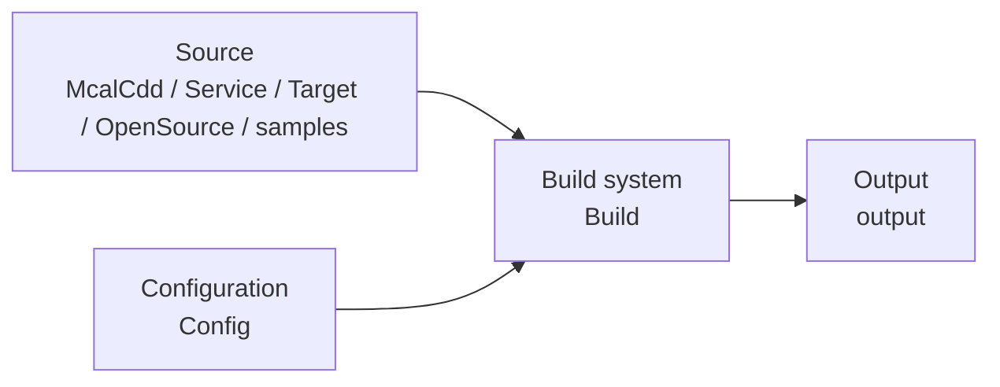

# Introduction to MCU Code Package Structure

## Overview

This document describes the directory structure of the MCU code package (community/enterprise edition) and helps users understand the purpose of each subdirectory.

- **Positioning**: Describes the directory layout of the MCU code package and the purpose of each subdirectory.
- **Target audience**: Advanced customization developers who need to understand or use the MCU SDK.
- **Prerequisites**: Understand the basic MCU framework; see [MCU Quick Start Guide](./01_basic_information.md).
- **Relationship with other modules**: The code package is the code carrier for [MCU System Description](./02_MCU_build_system.md) and [MCU1 Development Guide](./03_FreeRTOS_development.md).

The main subdirectories of the MCU code package and their purposes are as follows:

| Directory | Purpose |
|---|---|
| Build | Build system, containing compilation/link scripts and toolchain |
| Config | McalCdd module configuration for each board |
| McalCdd | Driver code for each module (enterprise edition) |
| OpenSource | FreeRTOS open source code |
| samples | Usage examples (Can, IPC, Eth, etc.) |
| Target | System base code (startup, tasks, interrupts) |
| Service | Middleware services (power management, OTA, Log/Shell, etc., enterprise edition) |
| Platform | Platform configuration (enterprise edition, replaceable) |

## Software Architecture



:::info
MCU0 firmware compilation/McalCdd/Service/Platform and other codes are proprietary to the enterprise edition. If needed, please contact [D-Robotics](mailto:developer@d-robotics.cc) for support.
:::

:::tip Commercial Support
The commercial edition provides more complete functional support, deeper hardware capability exposure, and exclusive customized content. To ensure compliance and secure delivery, access to the commercial edition will be granted through the following process.

Commercial Edition Acquisition Process:
1. Fill out the questionnaire: Provide your organization information, usage scenarios, and other basic details
2. Sign a Non-Disclosure Agreement (NDA): We will contact you based on the submitted information, and the NDA will be signed after confirmation from both parties
3. Content Release: After signing the agreement, we will provide you with the commercial edition materials through private channels
  
If you wish to obtain the commercial edition content, please click the link below to fill out the questionnaire. We will contact you within 3 to 5 working days:
[Fill in the questionnaire](https://horizonrobotics.feishu.cn/share/base/form/shrcnpBby71Y8LlixYF2N3ENbre)
:::

## MCU Community Edition

```text
MCU
├── Build                # Build system, contains compilation/link scripts
├── Config               # McalCdd module configurations for various boards
├── Include              # Mainly header files from driver and Service folders
├── Library              # Mainly static library files for drivers and Service
├── log                  # Compilation logs
├── OpenSource           # FreeRTOS open source code repository
├── output               # Directory for compilation/link generated files
├── samples              # Contains usage examples, including Can, IPC, Eth drivers, etc.
└── Target               # System base code, such as startup, task definitions, interrupts, etc.
```


## MCU Enterprise Edition
```text
MCU
├── Build                # Build system, contains compilation/link scripts
|   ├── FreeRtos         # For compiling MCU0 firmware
|   ├── FreeRtos_mcu1    # For compiling MCU1 firmware
|   ├── ToolChain        # gcc toolchain
|   └── Tools            # Common tools used during compilation
├── Common               # Contains common files and definitions required by all MCAL modules
├── Config               # McalCdd module configurations for various boards
├── log                  # Compilation logs
├── McalCdd              # Various module driver codes
├── OpenSource           # FreeRTOS open source code repository
├── output               # Directory for compilation/link generated files
├── Platform             # Platform configuration related, such as basic data definitions, Memmap configurations for each module; this part can be replaced by customers
|   ├── Compiler         # Platform configuration and compiler-related definitions
|   ├── Memmap           # Memmap configuration for modules
|   └── Schm             # May involve exclusive area definitions in module drivers, may require customer selection and filling
├── samples              # Contains usage examples, including Can, IPC, Eth drivers, etc.
├── Service              # Contains D-Robotics proprietary middleware service code, such as power management, OTA management, Log/Shell, etc.
└── Target               # System base code, such as startup, task definitions, interrupts, etc.
```

## Development Usage

1. **Environment setup**: Prepare the host compilation environment according to the [MCU Quick Start Guide](./01_basic_information.md).
2. **Compilation**: Compile the MCU1 firmware according to the [MCU System Description](./02_MCU_build_system.md).
3. **Run**: Load the compilation output to the MCU and run it; see the [MCU1 Development Guide](./03_FreeRTOS_development.md) for details.

## Debugging

<!-- TODO(Sx): pending board verification -->

## FAQ

<!-- TODO(Sx): pending board verification -->

## Related Documentation

- [MCU Quick Start Guide](./01_basic_information.md)
- [MCU1 Development Guide](./03_FreeRTOS_development.md)